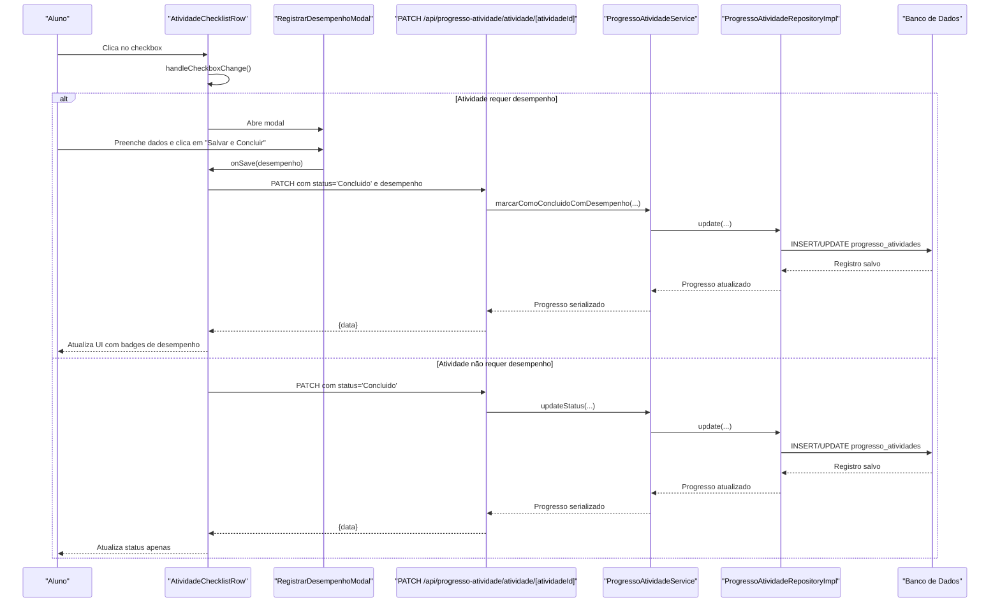
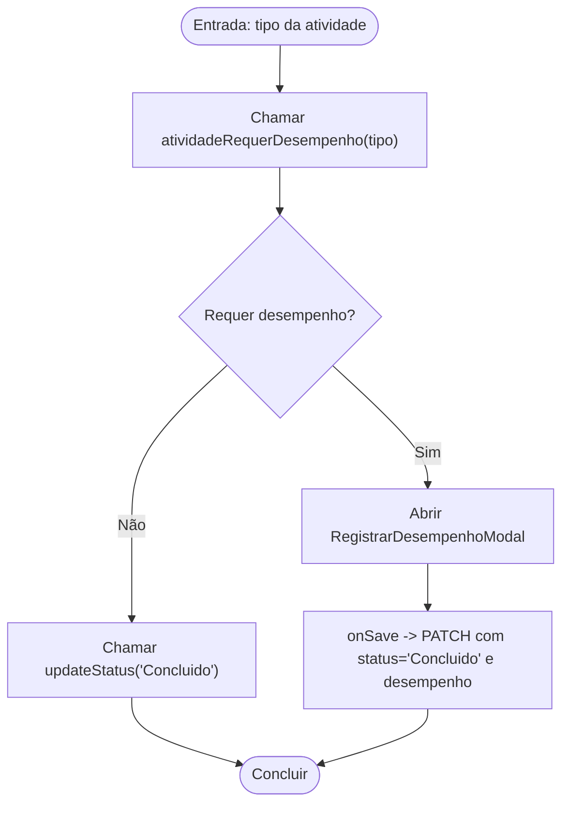

# Check Qualificado (Lista Mista)

<cite>
**Arquivos Referenciados Neste Documento**
- [PLANO_CHECK_QUALIFICADO.md](file://docs/PLANO_CHECK_QUALIFICADO.md)
- [CORRECAO_CONCEITUARIO_CHECK_QUALIFICADO.md](file://docs/CORRECAO_CONCEITUARIO_CHECK_QUALIFICADO.md)
- [atividade-checklist-row.tsx](file://components/atividade-checklist-row.tsx)
- [registrar-desempenho-modal.tsx](file://components/registrar-desempenho-modal.tsx)
- [route.ts](file://app/api/progresso-atividade/atividade/[atividadeId]/route.ts)
- [route.ts](file://app/api/progresso-atividade/route.ts)
- [atividade.types.ts](file://backend/services/atividade/atividade.types.ts)
- [atividade.service.ts](file://backend/services/atividade/atividade.service.ts)
- [progresso-atividade.service.ts](file://backend/services/progresso-atividade/progresso-atividade.service.ts)
- [progresso-atividade.repository.ts](file://backend/services/progresso-atividade/progresso-atividade.repository.ts)
- [progresso-atividade.types.ts](file://backend/services/progresso-atividade/progresso-atividade.types.ts)
</cite>

## Sumário
- Este documento explica o funcionamento do “Check Qualificado” no sistema de marcação de progresso, com foco em atividades do tipo “Lista Mista”. Ele detalha o fluxo completo de interação do aluno, desde o clique no checkbox até o salvamento no backend e a atualização da UI com badges de desempenho. Também apresenta as validações de entrada, o comportamento do backend e como o frontend reflete o desempenho com cores e ícones.

## Introdução
- O “Check Qualificado” é um tipo de conclusão que exige o registro de desempenho com acertos e total de questões, além de dificuldade percebida. Ele é aplicável a atividades como “Lista Mista”, “Nível 1/2/3/4”, simulados e Flashcards, entre outras. Em contraste, “Check Simples” (ex: “Conceituario” e “Revisao”) permite conclusão direta sem modal.

## Arquitetura do Fluxo (Check Qualificado)
- O fluxo envolve três camadas principais:
  - Frontend: componente de checklist e modal de desempenho.
  - API: rota de atualização de progresso com validações.
  - Backend: service/repository que persiste os dados no banco.

**Diagrama fontes**
- [atividade-checklist-row.tsx](file://components/atividade-checklist-row.tsx#L77-L94)
- [registrar-desempenho-modal.tsx](file://components/registrar-desempenho-modal.tsx#L96-L118)
- [route.ts](file://app/api/progresso-atividade/atividade/[atividadeId]/route.ts#L52-L118)
- [progresso-atividade.service.ts](file://backend/services/progresso-atividade/progresso-atividade.service.ts#L84-L129)
- [progresso-atividade.repository.ts](file://backend/services/progresso-atividade/progresso-atividade.repository.ts#L125-L162)

**Seção fontes**
- [PLANO_CHECK_QUALIFICADO.md](file://docs/PLANO_CHECK_QUALIFICADO.md#L1-L120)
- [atividade-checklist-row.tsx](file://components/atividade-checklist-row.tsx#L77-L94)
- [registrar-desempenho-modal.tsx](file://components/registrar-desempenho-modal.tsx#L96-L118)
- [route.ts](file://app/api/progresso-atividade/atividade/[atividadeId]/route.ts#L52-L118)

## Componentes-Chave

### AtividadeChecklistRow
- Responsabilidades:
  - Detectar se a atividade requer desempenho com base no tipo.
  - Ao marcar o checkbox:
    - Se não requer desempenho: chama o handler de status simples.
    - Se requer desempenho: abre o modal.
  - Exibe badges com acertos/totais, dificuldade e anotações quando aplicável.

**Seção fontes**
- [atividade-checklist-row.tsx](file://components/atividade-checklist-row.tsx#L1-L322)
- [atividade.types.ts](file://backend/services/atividade/atividade.types.ts#L69-L74)

### RegistrarDesempenhoModal
- Responsabilidades:
  - Coleta: questões totais, questões acertadas, dificuldade percebida e anotações.
  - Validações:
    - Total ≥ 1.
    - Acertos ≥ 0 e acertos ≤ total.
    - Dificuldade obrigatória.
  - Dispara o callback onSave com os dados validados.

**Seção fontes**
- [registrar-desempenho-modal.tsx](file://components/registrar-desempenho-modal.tsx#L1-L279)

### API de Progresso (PATCH)
- Responsabilidades:
  - Atualiza o status da atividade.
  - Se status = Concluido e o tipo requer desempenho:
    - Valida presença de desempenho.
    - Chama o service com dados completos.
  - Caso contrário, atualiza status normalmente.

**Seção fontes**
- [route.ts](file://app/api/progresso-atividade/atividade/[atividadeId]/route.ts#L52-L118)

### Service e Repository
- Service:
  - Valida regras de negócio (total ≥ 1, acertos ≥ 0, acertos ≤ total, dificuldade obrigatória).
  - Encontra ou cria progresso e atualiza com dados de desempenho.
- Repository:
  - Persiste os dados no banco (INSERT/UPDATE).

**Seção fontes**
- [progresso-atividade.service.ts](file://backend/services/progresso-atividade/progresso-atividade.service.ts#L84-L129)
- [progresso-atividade.repository.ts](file://backend/services/progresso-atividade/progresso-atividade.repository.ts#L125-L162)

## Regras de Validação e Tipos

### Validações no Modal
- Questões totais:
  - Obrigatório.
  - Número inteiro ≥ 1.
- Questões acertadas:
  - Obrigatório.
  - Número inteiro ≥ 0 e ≤ questões totais.
- Dificuldade percebida:
  - Obrigatória e deve pertencer ao enum de dificuldade.
- Anotações pessoais:
  - Opcional.

**Seção fontes**
- [registrar-desempenho-modal.tsx](file://components/registrar-desempenho-modal.tsx#L66-L94)
- [registrar-desempenho-modal.tsx](file://components/registrar-desempenho-modal.tsx#L148-L201)
- [progresso-atividade.types.ts](file://backend/services/progresso-atividade/progresso-atividade.types.ts#L1-L23)

### Validações no Backend
- Total ≥ 1.
- Acertos ≥ 0 e acertos ≤ total.
- Dificuldade obrigatória.
- Se o tipo de atividade requer desempenho e ele não foi fornecido, a API retorna erro.

**Seção fontes**
- [progresso-atividade.service.ts](file://backend/services/progresso-atividade/progresso-atividade.service.ts#L94-L109)
- [route.ts](file://app/api/progresso-atividade/atividade/[atividadeId]/route.ts#L71-L109)

### Tipos de Atividade e Check Qualificado
- Check Simples (sem modal):
  - “Conceituario”, “Revisao”.
- Check Qualificado (com modal):
  - “Nivel_1”, “Nivel_2”, “Nivel_3”, “Nivel_4”, “Lista_Mista”, “Simulado_Diagnostico”, “Simulado_Cumulativo”, “Simulado_Global”, “Flashcards”.

**Seção fontes**
- [atividade.types.ts](file://backend/services/atividade/atividade.types.ts#L1-L27)
- [atividade.types.ts](file://backend/services/atividade/atividade.types.ts#L69-L74)
- [CORRECAO_CONCEITUARIO_CHECK_QUALIFICADO.md](file://docs/CORRECAO_CONCEITUARIO_CHECK_QUALIFICADO.md#L1-L57)

## Fluxo de Interpretação de Tipo e Decisão

**Diagrama fontes**
- [atividade.types.ts](file://backend/services/atividade/atividade.types.ts#L69-L74)
- [atividade-checklist-row.tsx](file://components/atividade-checklist-row.tsx#L77-L94)
- [route.ts](file://app/api/progresso-atividade/atividade/[atividadeId]/route.ts#L52-L118)

## Exemplo de Requisição Válida

- Método: PATCH
- URL: /api/progresso-atividade/atividade/[atividadeId]
- Body:
  - status: "Concluido"
  - desempenho:
    - questoesTotais: número inteiro ≥ 1
    - questoesAcertos: número inteiro ≥ 0 e ≤ questoesTotais
    - dificuldadePercebida: um dos valores do enum
    - anotacoesPessoais: opcional

**Seção fontes**
- [route.ts](file://app/api/progresso-atividade/atividade/[atividadeId]/route.ts#L52-L118)
- [registrar-desempenho-modal.tsx](file://components/registrar-desempenho-modal.tsx#L96-L118)

## Tratamento de Erros

- Frontend:
  - Validações em tempo real no modal e exibe mensagens de erro.
  - Em caso de falha no onSave, o erro é capturado e exibido no modal.
- Backend:
  - Validações de dados e tipo de atividade.
  - Retorna respostas com status 400/404/500 conforme o erro.
  - A API de listagem de progresso também possui tratamento de erros.

**Seção fontes**
- [registrar-desempenho-modal.tsx](file://components/registrar-desempenho-modal.tsx#L140-L146)
- [route.ts](file://app/api/progresso-atividade/atividade/[atividadeId]/route.ts#L22-L45)
- [route.ts](file://app/api/progresso-atividade/route.ts#L20-L43)

## Exibição de Desempenho na UI

- Badges exibidos após conclusão com desempenho:
  - Acertos: X/Y
  - Dificuldade com cor contextual
  - Ícone de anotações (com tooltip) quando presente
- Cores de dificuldade:
  - Muito Fácil, Fácil, Médio, Difícil, Muito Difícil

**Seção fontes**
- [atividade-checklist-row.tsx](file://components/atividade-checklist-row.tsx#L192-L222)
- [atividade-checklist-row.tsx](file://components/atividade-checklist-row.tsx#L32-L47)

## Conclusão
- O “Check Qualificado” garante que atividades como “Lista Mista” tenham registros completos de desempenho, melhorando o acompanhamento e a análise do progresso. O fluxo é seguro, com validações rigorosas tanto no frontend quanto no backend, e a UI reflete claramente o desempenho do aluno com badges coloridos e informações úteis.