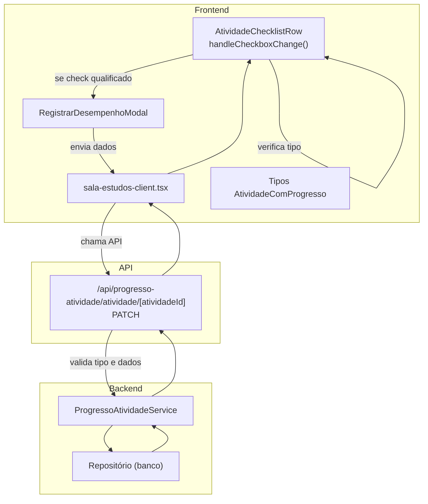
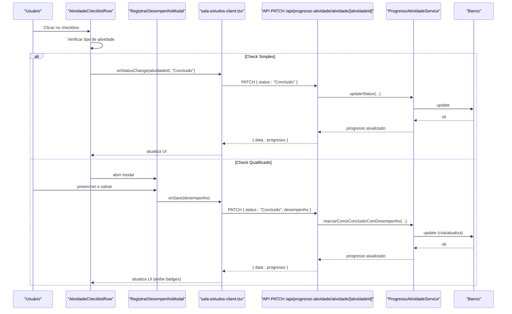

# Marcação de Progresso em Atividades

<cite>
**Arquivo referenciados neste documento**
- [atividade-checklist-row.tsx](file://components/atividade-checklist-row.tsx)
- [registrar-desempenho-modal.tsx](file://components/registrar-desempenho-modal.tsx)
- [sala-estudos-client.tsx](file://app/(dashboard)/aluno/sala-de-estudos/sala-estudos-client.tsx)
- [types.ts](file://app/(dashboard)/aluno/sala-de-estudos/types.ts)
- [route.ts](file://app/api/progresso-atividade/atividade/[atividadeId]/route.ts)
- [atividade.types.ts](file://backend/services/atividade/atividade.types.ts)
- [progresso-atividade.service.ts](file://backend/services/progresso-atividade/progresso-atividade.service.ts)
- [PLANO_CHECK_QUALIFICADO.md](file://docs/PLANO_CHECK_QUALIFICADO.md)
- [RELATORIO_TESTES_COMPLETOS.md](file://docs/RELATORIO_TESTES_COMPLETOS.md)
- [IMPLEMENTACAO_FRONTEND_CHECK_QUALIFICADO.md](file://docs/IMPLEMENTACAO_FRONTEND_CHECK_QUALIFICADO.md)
- [IMPLEMENTACAO_BACKEND_CHECK_QUALIFICADO.md](file://docs/IMPLEMENTACAO_BACKEND_CHECK_QUALIFICADO.md)
</cite>

## Sumário
- Introdução
- Estrutura do projeto
- Componentes-chave
- Arquitetura do fluxo de marcação de progresso
- Detalhamento técnico
- Validações e regras de negócio
- Exemplos de requisição
- Atualização da interface (badges)
- Testes e validação
- Considerações de desempenho
- Guia de solução de problemas
- Conclusão

## Introdução
Este documento explica o fluxo de marcação de progresso em atividades, com foco na diferença entre Check Simples (Conceituario/Revisao) e Check Qualificado (Lista_Mista e demais tipos). Ele descreve como o componente AtividadeChecklistRow.handleCheckboxChange() decide se abre o RegistrarDesempenhoModal, como são validados os dados (total ≥ 1, acertos ≤ total), como é feita a chamada à API /api/progresso-atividade, como o serviço processa e salva no banco, e como a UI é atualizada com badges. Também apresenta exemplos de requisição e aponta os testes que validam o fluxo completo.

## Estrutura do projeto
O fluxo envolve componentes do frontend e rotas/backend:

- Frontend:
  - AtividadeChecklistRow: exibe a atividade, lida com o checkbox e decide o tipo de check.
  - RegistrarDesempenhoModal: coleta dados de desempenho e os envia ao backend.
  - sala-estudos-client.tsx: carrega dados, chama a API e atualiza o estado local.
  - Tipos: AtividadeComProgresso inclui campos de desempenho.

- Backend:
  - API PATCH /api/progresso-atividade/atividade/[atividadeId]: recebe status e, quando necessário, dados de desempenho.
  - Service Layer: validações e persistência.
  - Repositório: operações no banco.

**Diagrama fontes**
- [atividade-checklist-row.tsx](file://components/atividade-checklist-row.tsx#L78-L119)
- [registrar-desempenho-modal.tsx](file://components/registrar-desempenho-modal.tsx#L96-L118)
- [sala-estudos-client.tsx](file://app/(dashboard)/aluno/sala-de-estudos/sala-estudos-client.tsx#L438-L601)
- [route.ts](file://app/api/progresso-atividade/atividade/[atividadeId]/route.ts#L52-L118)
- [progresso-atividade.service.ts](file://backend/services/progresso-atividade/progresso-atividade.service.ts#L84-L129)

**Seção fontes**
- [atividade-checklist-row.tsx](file://components/atividade-checklist-row.tsx#L78-L119)
- [registrar-desempenho-modal.tsx](file://components/registrar-desempenho-modal.tsx#L96-L118)
- [sala-estudos-client.tsx](file://app/(dashboard)/aluno/sala-de-estudos/sala-estudos-client.tsx#L438-L601)
- [route.ts](file://app/api/progresso-atividade/atividade/[atividadeId]/route.ts#L52-L118)
- [progresso-atividade.service.ts](file://backend/services/progresso-atividade/progresso-atividade.service.ts#L84-L129)

## Componentes-chave
- AtividadeChecklistRow.handleCheckboxChange():
  - Decide se abre o modal (check qualificado) ou salva diretamente (check simples).
  - Dispara callbacks para atualizar status e, quando necessário, com dados de desempenho.
- RegistrarDesempenhoModal:
  - Valida campos obrigatórios e regras de negócio.
  - Chama a função onSave passada pelo pai.
- sala-estudos-client.tsx:
  - Carrega atividades com progresso (incluindo campos de desempenho).
  - Fornece handlers onStatusChange e onStatusChangeWithDesempenho.
- Tipos AtividadeComProgresso:
  - Inclui questoesTotais, questoesAcertos, dificuldadePercebida, anotacoesPessoais.

**Seção fontes**
- [atividade-checklist-row.tsx](file://components/atividade-checklist-row.tsx#L78-L119)
- [registrar-desempenho-modal.tsx](file://components/registrar-desempenho-modal.tsx#L66-L118)
- [sala-estudos-client.tsx](file://app/(dashboard)/aluno/sala-de-estudos/sala-estudos-client.tsx#L438-L601)
- [types.ts](file://app/(dashboard)/aluno/sala-de-estudos/types.ts#L1-L33)

## Arquitetura do fluxo de marcação de progresso
O fluxo segue estas etapas:

1. O usuário clica no checkbox da atividade.
2. O componente detecta o tipo de atividade:
   - Se for Conceituario ou Revisao: check simples.
   - Caso contrário: check qualificado.
3. Para check simples: salva diretamente como Concluido.
4. Para check qualificado: abre o modal RegistrarDesempenhoModal.
5. O modal coleta e valida:
   - Questões Totais ≥ 1
   - Questões Acertadas ≥ 0 e ≤ Totais
   - Dificuldade Percebida obrigatória
6. Ao salvar, o frontend chama a API PATCH /api/progresso-atividade/atividade/[atividadeId] com:
   - status: "Concluido"
   - desempenho: { questoesTotais, questoesAcertos, dificuldadePercebida, anotacoesPessoais? }
7. A API:
   - Valida se o tipo requer desempenho.
   - Chama o service layer que aplica as mesmas regras de validação.
   - Persiste no banco e retorna os dados atualizados.
8. O frontend atualiza o estado local e a UI exibe badges com métricas.

**Diagrama fontes**
- [atividade-checklist-row.tsx](file://components/atividade-checklist-row.tsx#L78-L119)
- [registrar-desempenho-modal.tsx](file://components/registrar-desempenho-modal.tsx#L96-L118)
- [sala-estudos-client.tsx](file://app/(dashboard)/aluno/sala-de-estudos/sala-estudos-client.tsx#L438-L601)
- [route.ts](file://app/api/progresso-atividade/atividade/[atividadeId]/route.ts#L52-L118)
- [progresso-atividade.service.ts](file://backend/services/progresso-atividade/progresso-atividade.service.ts#L84-L129)

## Detalhamento técnico

### Diferença entre Check Simples e Check Qualificado
- Check Simples:
  - Tipos: Conceituario, Revisao.
  - Não exige modal; ao marcar, salva diretamente como Concluido.
- Check Qualificado:
  - Tipos: Nivel_1, Nivel_2, Nivel_3, Nivel_4, Lista_Mista, Simulado_Diagnostico, Simulado_Cumulativo, Simulado_Global, Flashcards.
  - Exige modal com dados de desempenho.

**Seção fontes**
- [PLANO_CHECK_QUALIFICADO.md](file://docs/PLANO_CHECK_QUALIFICADO.md#L16-L30)
- [IMPLEMENTACAO_FRONTEND_CHECK_QUALIFICADO.md](file://docs/IMPLEMENTACAO_FRONTEND_CHECK_QUALIFICADO.md#L203-L223)

### AtividadeChecklistRow.handleCheckboxChange()
- Detecta o tipo de atividade com atividadeRequerDesempenho().
- Se desmarcar: volta para Pendente (sem modal).
- Se marcar:
  - Se precisa de desempenho: abre modal RegistrarDesempenhoModal.
  - Caso contrário: chama onStatusChange('Concluido').
- Após salvar com desempenho, o callback onStatusChangeWithDesempenho é invocado com status Concluido e os dados.

**Seção fontes**
- [atividade-checklist-row.tsx](file://components/atividade-checklist-row.tsx#L60-L95)
- [atividade-checklist-row.tsx](file://components/atividade-checklist-row.tsx#L97-L119)
- [atividade.types.ts](file://backend/services/atividade/atividade.types.ts#L69-L76)

### RegistrarDesempenhoModal
- Validações:
  - Questões Totais: obrigatório, ≥ 1.
  - Questões Acertadas: obrigatório, ≥ 0 e ≤ Totais.
  - Dificuldade Percebida: obrigatória.
- Exibe taxa de acerto automaticamente.
- Desabilita o botão até o formulário ser válido.
- Chama onSave com os dados convertidos e sanitizados.

**Seção fontes**
- [registrar-desempenho-modal.tsx](file://components/registrar-desempenho-modal.tsx#L66-L118)
- [registrar-desempenho-modal.tsx](file://components/registrar-desempenho-modal.tsx#L120-L129)

### API /api/progresso-atividade
- Rota: PATCH /api/progresso-atividade/atividade/[atividadeId]
- Validações:
  - Se status = Concluido e body.desempenho existe:
    - Busca atividade e verifica se requer desempenho.
    - Valida campos obrigatórios.
    - Chama service marcarComoConcluidoComDesempenho.
  - Se status = Concluido e não há desempenho:
    - Busca atividade e verifica se requer desempenho; se sim, retorna erro 400.
  - Caso contrário: updateStatus normal (Iniciado/Pendente/Concluido).
- Serializa resposta com todos os campos de progresso.

**Seção fontes**
- [route.ts](file://app/api/progresso-atividade/atividade/[atividadeId]/route.ts#L52-L118)

### Service Layer
- marcarComoConcluidoComDesempenho:
  - Valida: total ≥ 1, acertos ≥ 0, acertos ≤ total, dificuldade obrigatória.
  - Busca ou cria progresso, define dataInicio/dataConclusao conforme status.
  - Atualiza campos de desempenho e retorna o registro atualizado.

**Seção fontes**
- [progresso-atividade.service.ts](file://backend/services/progresso-atividade/progresso-atividade.service.ts#L84-L129)

### Frontend: carregamento e atualização
- sala-estudos-client.tsx:
  - Carrega progresso com campos de desempenho (questoes_totais, questoes_acertos, dificuldade_percebida, anotacoes_pessoais).
  - Mapeia para AtividadeComProgresso e passa handlers para os componentes.
  - Atualiza o estado local após sucesso da API.

**Seção fontes**
- [sala-estudos-client.tsx](file://app/(dashboard)/aluno/sala-de-estudos/sala-estudos-client.tsx#L438-L601)
- [types.ts](file://app/(dashboard)/aluno/sala-de-estudos/types.ts#L1-L33)

## Validações e regras de negócio
- Regras de negócio:
  - Check Simples: Conceituario, Revisao.
  - Check Qualificado: demais tipos exigem desempenho.
- Validações de dados:
  - Questões Totais ≥ 1.
  - Questões Acertadas ≥ 0 e ≤ Questões Totais.
  - Dificuldade Percebida obrigatória.
  - Anotações Pessoais são opcionais.

**Seção fontes**
- [PLANO_CHECK_QUALIFICADO.md](file://docs/PLANO_CHECK_QUALIFICADO.md#L58-L66)
- [PLANO_CHECK_QUALIFICADO.md](file://docs/PLANO_CHECK_QUALIFICADO.md#L520-L550)
- [RELATORIO_TESTES_COMPLETOS.md](file://docs/RELATORIO_TESTES_COMPLETOS.md#L348-L383)
- [RELATORIO_TESTES_COMPLETOS.md](file://docs/RELATORIO_TESTES_COMPLETOS.md#L321-L346)

## Exemplos de requisição

### Check Qualificado (Lista_Mista)
- Método: PATCH
- URL: /api/progresso-atividade/atividade/{atividadeId}
- Body:
  - status: "Concluido"
  - desempenho:
    - questoesTotais: número inteiro ≥ 1
    - questoesAcertos: número inteiro ≥ 0 e ≤ questoesTotais
    - dificuldadePercebida: um dos valores válidos
    - anotacoesPessoais: string opcional

**Seção fontes**
- [IMPLEMENTACAO_FRONTEND_CHECK_QUALIFICADO.md](file://docs/IMPLEMENTACAO_FRONTEND_CHECK_QUALIFICADO.md#L232-L263)
- [IMPLEMENTACAO_BACKEND_CHECK_QUALIFICADO.md](file://docs/IMPLEMENTACAO_BACKEND_CHECK_QUALIFICADO.md#L185-L216)

### Check Simples (Conceituario/Revisao)
- Método: PATCH
- URL: /api/progresso-atividade/atividade/{atividadeId}
- Body:
  - status: "Concluido"
  - OBS: não incluir campo desempenho

**Seção fontes**
- [IMPLEMENTACAO_FRONTEND_CHECK_QUALIFICADO.md](file://docs/IMPLEMENTACAO_FRONTEND_CHECK_QUALIFICADO.md#L252-L263)
- [IMPLEMENTACAO_BACKEND_CHECK_QUALIFICADO.md](file://docs/IMPLEMENTACAO_BACKEND_CHECK_QUALIFICADO.md#L205-L216)

## Atualização da interface (badges)
- Após conclusão com check qualificado e dados de desempenho:
  - Badge com "Acertos: X/Y".
  - Badge com dificuldade (cor contextual).
  - Ícone de anotações com tooltip (se houver).
- O componente AtividadeChecklistRow exibe esses badges quando o status é Concluido e existirem dados de desempenho.

**Seção fontes**
- [PLANO_CHECK_QUALIFICADO.md](file://docs/PLANO_CHECK_QUALIFICADO.md#L67-L78)
- [atividade-checklist-row.tsx](file://components/atividade-checklist-row.tsx#L192-L222)

## Testes e validação
- Testes de fluxo:
  - Check Simples (Conceituario): fluxo correto.
  - Check Qualificado (Lista_Mista): abertura do modal, preenchimento e salvamento com badges.
- Testes de integração:
  - Frontend → API → Backend → Database.
- Testes de validações:
  - Backend: todas as regras implementadas.
  - Frontend: todas as validações implementadas.
- Status geral: todos os testes passaram.

**Seção fontes**
- [RELATORIO_TESTES_COMPLETOS.md](file://docs/RELATORIO_TESTES_COMPLETOS.md#L386-L446)
- [RELATORIO_TESTES_COMPLETOS.md](file://docs/RELATORIO_TESTES_COMPLETOS.md#L418-L446)
- [RELATORIO_TESTES_COMPLETOS.md](file://docs/RELATORIO_TESTES_COMPLETOS.md#L348-L383)

## Considerações de desempenho
- O frontend faz consultas paginadas (lotes de 100 IDs) para evitar URLs muito longos ao buscar progressos.
- As validações ocorrem tanto no frontend quanto no backend, evitando requisições desnecessárias e garantindo consistência.

**Seção fontes**
- [sala-estudos-client.tsx](file://app/(dashboard)/aluno/sala-de-estudos/sala-estudos-client.tsx#L441-L467)

## Guia de solução de problemas
- Erros de validação:
  - API responde 400 com mensagem específica quando falta desempenho para tipos que o exigem.
  - Service Layer lança erros com mensagens claras para casos inválidos.
- Erros gerais:
  - API retorna 500 com detalhes em desenvolvimento e mensagem genérica em produção.
- Componente AtividadeChecklistRow:
  - Exibe mensagens de erro e impede ações enquanto estiver em atualização.

**Seção fontes**
- [route.ts](file://app/api/progresso-atividade/atividade/[atividadeId]/route.ts#L22-L45)
- [progresso-atividade.service.ts](file://backend/services/progresso-atividade/progresso-atividade.service.ts#L94-L109)
- [atividade-checklist-row.tsx](file://components/atividade-checklist-row.tsx#L303-L307)

## Conclusão
O fluxo de marcação de progresso foi implementado com clareza e robustez:
- Check Simples e Check Qualificado são tratados de forma diferenciada.
- O modal coleta e valida dados antes de persistir.
- A API e o service layer aplicam as mesmas regras de negócio.
- A UI é atualizada com badges informativos.
- Os testes validam todo o fluxo de ponta a ponta.