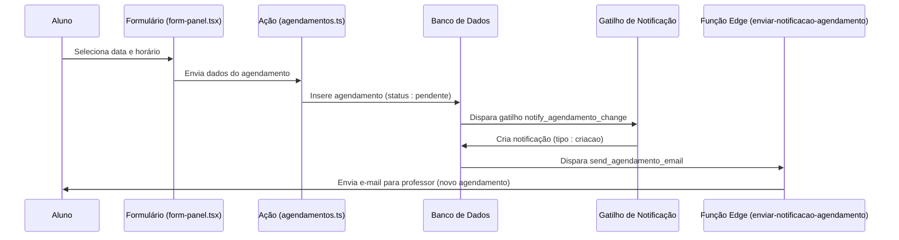
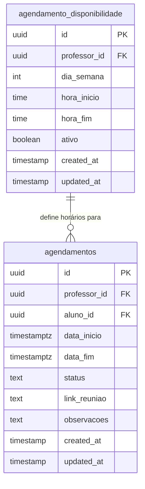
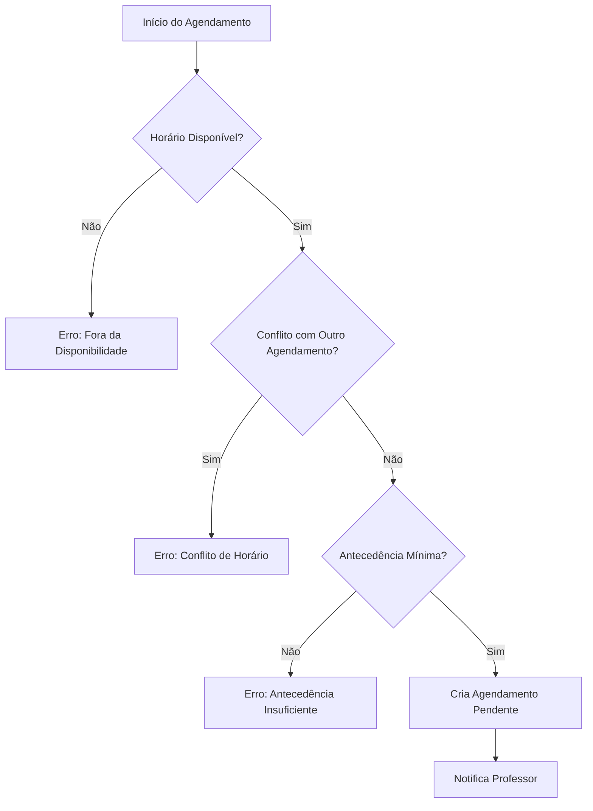
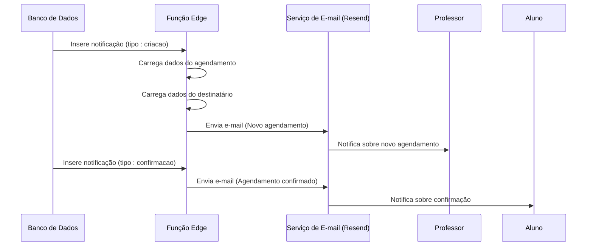
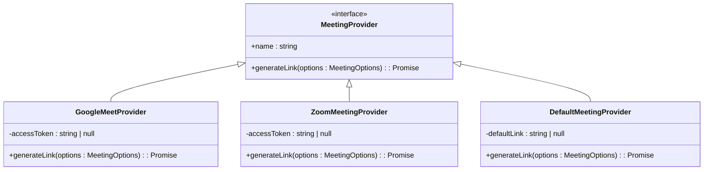

# Agendamentos

<cite>
**Arquivos Referenciados neste Documento**   
- [agendamentos.ts](file://app/actions/agendamentos.ts)
- [enviar-notificacao-agendamento/index.ts](file://supabase/functions/enviar-notificacao-agendamento/index.ts)
- [20251208_create_agendamentos.sql](file://supabase/migrations/20251208_create_agendamentos.sql)
- [20251210_agendamento_triggers.sql](file://supabase/migrations/20251210_agendamento_triggers.sql)
- [form-panel.tsx](file://components/agendamento/form-panel.tsx)
- [meus-agendamentos-list.tsx](file://components/agendamento/meus-agendamentos-list.tsx)
- [agendamento-actions.tsx](file://components/professor/agendamento-actions.tsx)
- [agendamento-validations.ts](file://lib/agendamento-validations.ts)
- [meeting-providers.ts](file://lib/meeting-providers.ts)
- [route.ts](file://app/api/agendamentos/[id]/ical/route.ts)
</cite>

## Sumário
1. [Introdução](#introdução)
2. [Fluxo Completo de Agendamento](#fluxo-completo-de-agendamento)
3. [Gestão de Disponibilidade](#gestão-de-disponibilidade)
4. [Regras de Negócio](#regras-de-negócio)
5. [Notificações e Comunicação](#notificações-e-comunicação)
6. [Geração de Links iCal e Integração com Calendários](#geração-de-links-ical-e-integração-com-calendários)
7. [Componentes de Interface](#componentes-de-interface)
8. [Personalização e Extensibilidade](#personalização-e-extensibilidade)

## Introdução

A funcionalidade de Agendamentos permite que alunos solicitem sessões de mentoria com professores, respeitando horários disponíveis, regras de negócio e políticas de segurança. O sistema cobre todo o ciclo de vida do agendamento: desde a seleção de horários disponíveis, criação do compromisso, confirmação pelo professor, até notificações e integração com calendários externos. A implementação utiliza uma arquitetura robusta com validações no frontend e backend, RLS (Row Level Security) no Supabase para controle de acesso, e funções Edge para automação de notificações.

## Fluxo Completo de Agendamento

O fluxo de agendamento inicia-se na interface do formulário (`form-panel.tsx`), onde o aluno seleciona um professor, data e horário disponíveis. Os dados são validados e enviados ao backend, onde são persistidos na tabela `agendamentos`. Após a criação, o sistema dispara notificações automáticas via função Edge `enviar-notificacao-agendamento`.



**Fontes do Diagrama**
- [form-panel.tsx](file://components/agendamento/form-panel.tsx)
- [agendamentos.ts](file://app/actions/agendamentos.ts)
- [20251210_agendamento_triggers.sql](file://supabase/migrations/20251210_agendamento_triggers.sql)
- [enviar-notificacao-agendamento/index.ts](file://supabase/functions/enviar-notificacao-agendamento/index.ts)

**Fontes da Seção**
- [form-panel.tsx](file://components/agendamento/form-panel.tsx)
- [agendamentos.ts](file://app/actions/agendamentos.ts)

## Gestão de Disponibilidade

A disponibilidade dos professores é gerida através da tabela `agendamento_disponibilidade`, que armazena os horários ativos por dia da semana. Os professores podem configurar seus horários disponíveis na interface `/professor/disponibilidade`. A validação de conflitos é realizada tanto no frontend quanto no backend, garantindo que não haja sobreposição de agendamentos.



**Fontes do Diagrama**
- [20251208_create_agendamentos.sql](file://supabase/migrations/20251208_create_agendamentos.sql)

**Fontes da Seção**
- [agendamentos.ts](file://app/actions/agendamentos.ts)
- [agendamento-validations.ts](file://lib/agendamento-validations.ts)

## Regras de Negócio

O sistema implementa várias regras de negócio críticas para garantir a integridade e usabilidade dos agendamentos:

- **Conflito de Horários**: Verificado através da função `checkConflicts` em `agendamento-validations.ts`, que compara o novo agendamento com os existentes.
- **Limites de Agendamento**: Validado pela função `validateAppointment`, que verifica disponibilidade, duração mínima/máxima e antecedência mínima.
- **RLS por Professor**: Políticas de segurança garantem que professores só vejam e editem seus próprios agendamentos, implementado via políticas RLS no Supabase.
- **Cancelamento**: Alunos podem cancelar agendamentos pendentes; professores podem cancelar confirmados, com aviso prévio mínimo de 2 horas.



**Fontes do Diagrama**
- [agendamento-validations.ts](file://lib/agendamento-validations.ts)

**Fontes da Seção**
- [agendamento-validations.ts](file://lib/agendamento-validations.ts)
- [20251208_create_agendamentos.sql](file://supabase/migrations/20251208_create_agendamentos.sql)

## Notificações e Comunicação

As notificações são automatizadas através de gatilhos de banco de dados e funções Edge. Quando um agendamento é criado, atualizado ou cancelado, um gatilho insere um registro em `agendamento_notificacoes`, que dispara a função `enviar-notificacao-agendamento` para enviar e-mails aos envolvidos.



**Fontes do Diagrama**
- [20251210_agendamento_triggers.sql](file://supabase/migrations/20251210_agendamento_triggers.sql)
- [enviar-notificacao-agendamento/index.ts](file://supabase/functions/enviar-notificacao-agendamento/index.ts)

**Fontes da Seção**
- [20251210_agendamento_triggers.sql](file://supabase/migrations/20251210_agendamento_triggers.sql)
- [enviar-notificacao-agendamento/index.ts](file://supabase/functions/enviar-notificacao-agendamento/index.ts)

## Geração de Links iCal e Integração com Calendários

A geração de links iCal é fornecida pela rota `/api/agendamentos/[id]/ical/route.ts`, que retorna um arquivo .ics com os detalhes do agendamento. Isso permite que os usuários adicionem o compromisso diretamente aos seus calendários (Google Calendar, Outlook, etc.).

```mermaid
flowchart LR
A[Usuário] --> B{Clica em "Adicionar ao Calendário"}
B --> C[Chama /api/agendamentos/[id]/ical]
C --> D[Servidor gera arquivo .ics]
D --> E[Download automático do arquivo]
E --> F[Usuário importa para calendário externo]
```

**Fontes da Seção**
- [meus-agendamentos-list.tsx](file://components/agendamento/meus-agendamentos-list.tsx)
- [route.ts](file://app/api/agendamentos/[id]/ical/route.ts)

## Componentes de Interface

### Componente Agendamentos-List

O componente `meus-agendamentos-list.tsx` exibe os agendamentos do aluno em abas de "Próximos" e "Histórico". Ele permite visualizar detalhes, cancelar agendamentos e baixar o arquivo iCal.

**Fontes da Seção**
- [meus-agendamentos-list.tsx](file://components/agendamento/meus-agendamentos-list.tsx)

### Ações do Professor

O componente `agendamento-actions.tsx` fornece botões para confirmar ou rejeitar agendamentos pendentes. Ao confirmar, o professor pode inserir um link de reunião (Google Meet, Zoom, etc.).

**Fontes da Seção**
- [agendamento-actions.tsx](file://components/professor/agendamento-actions.tsx)

## Personalização e Extensibilidade

### Templates de Notificação

Os templates de e-mail são definidos no objeto `emailTemplates` dentro de `enviar-notificacao-agendamento/index.ts`. Para personalizar, basta modificar os campos `subject` e `getBody` para cada tipo de notificação (`criacao`, `confirmacao`, `cancelamento`, etc.).

### Extensão com Novos Provedores de Calendário

A integração com provedores de calendário é modular através da classe `MeetingProvider` em `meeting-providers.ts`. Para adicionar um novo provedor (ex: Microsoft Teams), crie uma nova classe que implemente `MeetingProvider` e registre-a na função `getMeetingProvider`.



**Fontes do Diagrama**
- [meeting-providers.ts](file://lib/meeting-providers.ts)

**Fontes da Seção**
- [meeting-providers.ts](file://lib/meeting-providers.ts)
- [enviar-notificacao-agendamento/index.ts](file://supabase/functions/enviar-notificacao-agendamento/index.ts)