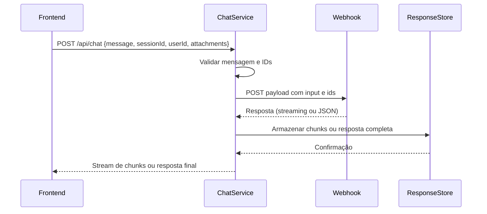
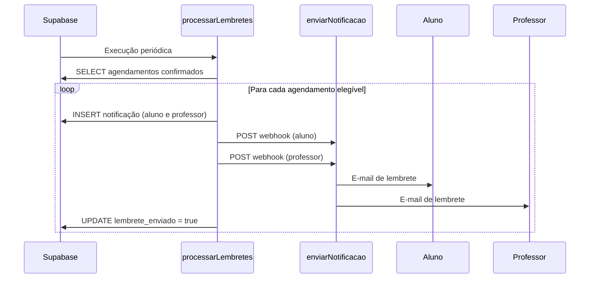

# Chat com IA

<cite>
**Arquivos Referenciados neste Documento**  
- [conversations-sidebar.tsx](file://components/conversations-sidebar.tsx)
- [conversation-item.tsx](file://components/conversation-item.tsx)
- [attachments.service.ts](file://backend/services/chat/attachments.service.ts)
- [response-store.ts](file://backend/services/cache/response-store.ts)
- [chat.service.ts](file://backend/services/chat/chat.service.ts)
- [conversation.service.ts](file://backend/services/conversation/conversation.service.ts)
- [conversation.types.ts](file://backend/services/conversation/conversation.types.ts)
- [chat.types.ts](file://backend/services/chat/chat.types.ts)
- [processar-lembretes/index.ts](file://supabase/functions/processar-lembretes/index.ts)
- [N8N_ATTACHMENT_ACCESS.md](file://docs/N8N_ATTACHMENT_ACCESS.md)
</cite>

## Sumário
1. [Introdução](#introdução)
2. [Arquitetura de Mensagens, Armazenamento e Processamento](#arquitetura-de-mensagens-armazenamento-e-processamento)
3. [Fluxo de Criação de Conversas (/api/conversations)](#fluxo-de-criação-de-conversas-apiconversations)
4. [Envio de Mensagens (/api/chat)](#envio-de-mensagens-apichat)
5. [Integração com N8N via processar-lembretes](#integração-com-n8n-via-processar-lembretes)
6. [Gerenciamento de Anexos com attachments.service.ts](#gerenciamento-de-anexos-com-attachmentsservicets)
7. [Cache de Respostas com response-store](#cache-de-respostas-com-response-store)
8. [Componentes de Interface: conversations-sidebar.tsx e conversation-item.tsx](#componentes-de-interface-conversations-sidebartsx-e-conversation-itemtsx)
9. [Segurança no Upload de Arquivos](#segurança-no-upload-de-arquivos)
10. [Tratamento de Erros e Desempenho em Conversas Longas](#tratamento-de-erros-e-desempenho-em-conversas-longas)
11. [Integração com Novos Modelos de IA](#integração-com-novos-modelos-de-ia)
12. [Extensão com Funcionalidades como Lembretes Automáticos](#extensão-com-funcionalidades-como-lembretes-automáticos)

## Introdução

O sistema de Chat com IA é uma funcionalidade central do ambiente de aprendizado, permitindo interações dinâmicas entre alunos e assistentes virtuais. Esta documentação detalha a arquitetura, fluxos de dados, componentes-chave e práticas recomendadas para manutenção, extensão e integração com outros serviços. O sistema é projetado para ser escalável, seguro e eficiente, com suporte a anexos, cache de respostas e integração com ferramentas externas como N8N.

## Arquitetura de Mensagens, Armazenamento e Processamento

O sistema de chat é baseado em uma arquitetura modular, com separação clara entre camadas de interface, serviço e armazenamento. As mensagens são processadas assincronamente, com suporte a streaming, e armazenadas em banco de dados relacional (Supabase). O histórico de conversas é mantido em formato JSONB, permitindo flexibilidade na estrutura dos dados.

```mermaid
graph TB
A[Frontend] --> B[/api/conversations]
A --> C[/api/chat]
B --> D[conversation.service.ts]
C --> E[chat.service.ts]
D --> F[Supabase - chat_conversations]
E --> G[Webhook Externo]
E --> H[attachments.service.ts]
H --> I[/tmp ou chat-uploads]
E --> J[response-store.ts]
J --> K[Upstash Redis ou Map em Memória]
```

**Fontes do Diagrama**  
- [conversation.service.ts](file://backend/services/conversation/conversation.service.ts)
- [chat.service.ts](file://backend/services/chat/chat.service.ts)
- [attachments.service.ts](file://backend/services/chat/attachments.service.ts)
- [response-store.ts](file://backend/services/cache/response-store.ts)

**Fontes da Seção**  
- [conversation.service.ts](file://backend/services/conversation/conversation.service.ts#L1-L274)
- [chat.service.ts](file://backend/services/chat/chat.service.ts#L1-L363)

## Fluxo de Criação de Conversas (/api/conversations)

O endpoint `/api/conversations` permite a criação, listagem e gerenciamento de conversas. Ao criar uma nova conversa, um `session_id` único é gerado e armazenado no banco de dados. A conversa é marcada como ativa por padrão. O frontend utiliza o componente `conversations-sidebar.tsx` para interagir com este endpoint, permitindo ao usuário criar, renomear, fixar e deletar conversas.

A criação de uma nova conversa envolve:
1. Geração de `session_id` único.
2. Inserção no banco de dados com `is_active = true`.
3. Retorno da conversa criada para o frontend.
4. Atualização da lista de conversas no sidebar.

**Fontes da Seção**  
- [conversations-sidebar.tsx](file://components/conversations-sidebar.tsx#L66-L93)
- [conversation.service.ts](file://backend/services/conversation/conversation.service.ts#L16-L40)

## Envio de Mensagens (/api/chat)

O envio de mensagens é processado pelo `chat.service.ts`, que valida a entrada, envia a mensagem para um webhook externo (via N8N) e retorna a resposta. O serviço suporta tanto respostas completas quanto streaming, com tratamento de diferentes formatos de resposta (JSON, texto, SSE).

O fluxo inclui:
1. Validação da mensagem (tamanho, conteúdo).
2. Validação de `sessionId` e `userId`.
3. Envio ao webhook com payload contendo mensagem e metadados de anexos.
4. Processamento da resposta (streaming ou completa).
5. Armazenamento temporário da resposta no `response-store`.



**Fontes do Diagrama**  
- [chat.service.ts](file://backend/services/chat/chat.service.ts#L8-L363)
- [response-store.ts](file://backend/services/cache/response-store.ts#L1-L233)

**Fontes da Seção**  
- [chat.service.ts](file://backend/services/chat/chat.service.ts#L8-L363)

## Integração com N8N via processar-lembretes

A função `processar-lembretes` no Supabase é acionada periodicamente para enviar lembretes de agendamentos confirmados. Ela verifica o horário do agendamento e o tempo de lembrete configurado pelo professor, enviando notificações por e-mail via função `enviar-notificacao-agendamento`.

O fluxo de integração com N8N ocorre quando o chat recebe anexos. Os metadados dos anexos são enviados ao N8N, que pode processar PDFs, extrair texto e gerar respostas. A URL do anexo inclui um token de acesso temporário, permitindo download seguro.



**Fontes do Diagrama**  
- [processar-lembretes/index.ts](file://supabase/functions/processar-lembretes/index.ts#L1-L194)

**Fontes da Seção**  
- [processar-lembretes/index.ts](file://supabase/functions/processar-lembretes/index.ts#L1-L194)
- [N8N_ATTACHMENT_ACCESS.md](file://docs/N8N_ATTACHMENT_ACCESS.md#L1-L198)

## Gerenciamento de Anexos com attachments.service.ts

O serviço `attachments.service.ts` gerencia o upload, armazenamento e limpeza de anexos. Os arquivos são armazenados temporariamente no diretório `/tmp` (em ambientes serverless) ou `tmp/chat-uploads`, com TTL de 10 minutos. O acesso é controlado por tokens únicos gerados para cada anexo.

Funcionalidades:
- Validação de MIME types permitidos (imagens, PDF).
- Limite de tamanho (5MB por arquivo, 15MB total).
- Geração de token de acesso temporário.
- Limpeza automática de arquivos expirados.
- Suporte a ambientes serverless (Vercel, Lambda).

O frontend envia os arquivos como `File[]`, que são processados em buffer e salvos com metadados em JSON. A URL de download inclui o token na query string, evitando necessidade de headers de autenticação.

**Fontes da Seção**  
- [attachments.service.ts](file://backend/services/chat/attachments.service.ts#L1-L239)
- [N8N_ATTACHMENT_ACCESS.md](file://docs/N8N_ATTACHMENT_ACCESS.md#L1-L198)

## Cache de Respostas com response-store

O `response-store.ts` implementa um armazenamento temporário de respostas do chat, essencial para suportar streaming em ambientes distribuídos. Ele utiliza Upstash Redis em produção, com fallback para `Map` em memória (apenas para desenvolvimento).

Características:
- TTL de 10 minutos para cada sessão.
- Suporte a chunks de resposta.
- Marcação de conclusão da resposta.
- Estatísticas de uso.
- Limpeza automática para fallback em memória.

O cache é usado para armazenar chunks de resposta do webhook, permitindo que o frontend os receba em tempo real. Em caso de falha no Redis, o sistema degrada para memória local, com alertas de que não funcionará em serverless.

**Fontes da Seção**  
- [response-store.ts](file://backend/services/cache/response-store.ts#L1-L233)

## Componentes de Interface: conversations-sidebar.tsx e conversation-item.tsx

Os componentes `conversations-sidebar.tsx` e `conversation-item.tsx` formam a interface de gerenciamento de conversas. O sidebar lista todas as conversas do usuário, permitindo criação, seleção e gerenciamento. Cada item de conversa exibe título, data de atualização e status de fixação, com menu de ações (renomear, deletar, fixar).

Funcionalidades do sidebar:
- Carregamento inicial de conversas via `/api/conversations`.
- Criação de nova conversa com título padrão.
- Atualização automática após operações.
- Suporte a conversas fixadas.

Funcionalidades do item:
- Formatação relativa da data de atualização.
- Ícone de fixação visível.
- Menu dropdown com ações contextuais.
- Feedback visual de seleção.

**Fontes da Seção**  
- [conversations-sidebar.tsx](file://components/conversations-sidebar.tsx#L1-L224)
- [conversation-item.tsx](file://components/conversation-item.tsx#L1-L143)

## Segurança no Upload de Arquivos

O sistema implementa múltiplas camadas de segurança para uploads:
- **Validação de MIME type**: Apenas tipos permitidos (PNG, JPEG, PDF, etc.).
- **Validação de tamanho**: Limites por arquivo e total.
- **Token de acesso temporário**: URLs com token expiram em 10 minutos.
- **Armazenamento isolado**: Diretórios separados por ID de anexo.
- **Limpeza automática**: Arquivos expirados são removidos periodicamente.
- **Sem headers de autenticação**: O token está na URL, simplificando integrações.

O token é gerado com `randomUUID()` e armazenado nos metadados, garantindo acesso exclusivo ao destinatário da URL.

**Fontes da Seção**  
- [attachments.service.ts](file://backend/services/chat/attachments.service.ts#L63-L79)
- [N8N_ATTACHMENT_ACCESS.md](file://docs/N8N_ATTACHMENT_ACCESS.md#L1-L198)

## Tratamento de Erros e Desempenho em Conversas Longas

O sistema inclui tratamento robusto de erros em todos os níveis:
- **Validação de entrada**: Erros claros para mensagens vazias, IDs ausentes.
- **Falhas de comunicação**: Tentativas de fallback para armazenamento em memória.
- **Erros de parsing**: Tratamento de respostas não JSON como texto.
- **Logs detalhados**: Informações de depuração em todos os serviços.

Para conversas longas:
- O histórico é armazenado no banco de dados (JSONB), não em memória.
- O `response-store` é usado apenas para respostas em andamento.
- O frontend carrega conversas sob demanda, evitando sobrecarga inicial.
- O streaming permite resposta progressiva, melhorando percepção de desempenho.

**Fontes da Seção**  
- [chat.service.ts](file://backend/services/chat/chat.service.ts#L95-L105)
- [conversation.service.ts](file://backend/services/conversation/conversation.service.ts#L33-L36)

## Integração com Novos Modelos de IA

Para integrar novos modelos de IA:
1. Atualize o `WEBHOOK_URL` no `chat.service.ts`.
2. Ajuste o payload no `dispatchToWebhook` conforme exigido pelo novo modelo.
3. Adapte o parsing da resposta em `sendMessage` e `sendMessageStream`.
4. Teste com diferentes formatos (SSE, JSON, texto).
5. Valide o suporte a streaming e chunks.

O sistema é agnóstico ao modelo, desde que o webhook aceite o payload padrão e retorne texto ou chunks.

**Fontes da Seção**  
- [chat.service.ts](file://backend/services/chat/chat.service.ts#L4-L363)

## Extensão com Funcionalidades como Lembretes Automáticos

A arquitetura permite fácil extensão com funcionalidades como lembretes automáticos. A função `processar-lembretes` pode ser adaptada para:
- Enviar lembretes de tarefas ou prazos.
- Notificar sobre novas mensagens não lidas.
- Agendar revisões de flashcards.
- Monitorar progresso de estudos.

A integração com N8N permite orquestrar fluxos complexos, como processar anexos, extrair conteúdo e gerar respostas automatizadas.

**Fontes da Seção**  
- [processar-lembretes/index.ts](file://supabase/functions/processar-lembretes/index.ts#L1-L194)
- [N8N_ATTACHMENT_ACCESS.md](file://docs/N8N_ATTACHMENT_ACCESS.md#L1-L198)