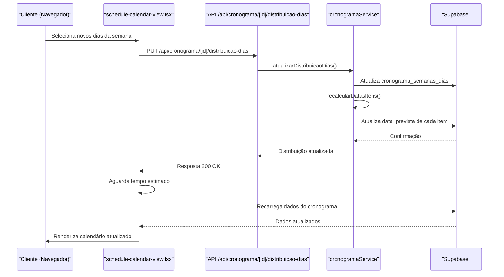
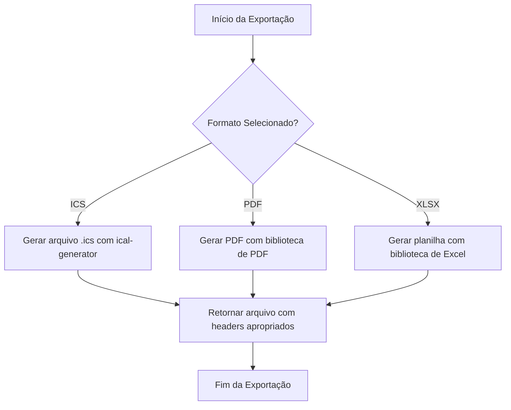

# Cronograma

<cite>
**Arquivos Referenciados neste Documento**   
- [app/api/cronograma/route.ts](file://app/api/cronograma/route.ts)
- [app/api/cronograma/[id]/export/ics/route.ts](file://app/api/cronograma/[id]/export/ics/route.ts)
- [app/api/cronograma/[id]/export/pdf/route.tsx](file://app/api/cronograma/[id]/export/pdf/route.tsx)
- [app/api/cronograma/[id]/export/xlsx/route.ts](file://app/api/cronograma/[id]/export/xlsx/route.ts)
- [app/api/cronograma/[id]/distribuicao-dias/route.ts](file://app/api/cronograma/[id]/distribuicao-dias/route.ts)
- [components/schedule-wizard.tsx](file://components/schedule-wizard.tsx)
- [components/schedule-calendar-view.tsx](file://components/schedule-calendar-view.tsx)
- [backend/services/cronograma/cronograma.service.ts](file://backend/services/cronograma/cronograma.service.ts)
- [lib/cronograma-export-utils.ts](file://lib/cronograma-export-utils.ts)
- [docs/FLUXO_GERACAO_CRONOGRAMA.md](file://docs/FLUXO_GERACAO_CRONOGRAMA.md)
- [docs/FLUXO_CALENDARIO.md](file://docs/FLUXO_CALENDARIO.md)
- [docs/PLANO_EXPORTACAO_ICS.md](file://docs/PLANO_EXPORTACAO_ICS.md)
</cite>

## Sumário
1. [Introdução](#introdução)
2. [Geração Automática de Cronograma](#geração-automática-de-cronograma)
3. [Visualização em Calendário](#visualização-em-calendário)
4. [Exportação de Cronograma](#exportação-de-cronograma)
5. [Algoritmo de Distribuição de Dias](#algoritmo-de-distribuição-de-dias)
6. [Cálculo de Tempo de Estudo](#cálculo-de-tempo-de-estudo)
7. [Integração com Cache](#integração-com-cache)
8. [Desempenho em Grandes Cronogramas](#desempenho-em-grandes-cronogramas)
9. [Tratamento de Erros](#tratamento-de-erros)
10. [Personalização de Templates de Exportação](#personalização-de-templates-de-exportação)
11. [Extensão com Novos Formatos](#extensão-com-novos-formatos)
12. [Conclusão](#conclusão)

## Introdução

A funcionalidade de Cronograma é um componente central do sistema, permitindo que alunos planejem e acompanhem seus estudos de forma estruturada. O fluxo completo envolve a geração automática de cronogramas baseados em disciplinas e módulos selecionados, a visualização em formato de calendário interativo e a exportação para diversos formatos (ICS, PDF, XLSX). Este documento detalha cada etapa do processo, desde a criação via função Supabase `gerar-cronograma` até a exibição no componente `schedule-calendar-view.tsx`, abrangendo também os endpoints de exportação, algoritmos de distribuição, integrações com cache e considerações de desempenho.

## Geração Automática de Cronograma

A geração de cronogramas é iniciada através do componente `schedule-wizard.tsx`, que coleta as preferências do usuário, como disciplinas, módulos, datas de início e fim, dias da semana e horas diárias de estudo. Após a seleção, o frontend envia uma requisição POST para o endpoint `/api/cronograma`, que é processado pelo serviço `cronogramaService.gerarCronograma` no backend.

O serviço realiza uma série de etapas: validação dos dados de entrada, verificação da existência do aluno no banco de dados, exclusão de cronogramas anteriores do mesmo aluno, busca de aulas com base nas disciplinas e módulos selecionados, cálculo de capacidade de estudo e distribuição das aulas nas semanas disponíveis. A distribuição leva em conta fatores como prioridade mínima das aulas, velocidade de reprodução e exclusão de aulas já concluídas.

**Fontes da seção**
- [components/schedule-wizard.tsx](file://components/schedule-wizard.tsx#L1-L2158)
- [app/api/cronograma/route.ts](file://app/api/cronograma/route.ts#L1-L115)
- [backend/services/cronograma/cronograma.service.ts](file://backend/services/cronograma/cronograma.service.ts#L1-L2412)
- [docs/FLUXO_GERACAO_CRONOGRAMA.md](file://docs/FLUXO_GERACAO_CRONOGRAMA.md#L1-L317)

## Visualização em Calendário

A visualização do cronograma em formato de calendário é gerenciada pelo componente `schedule-calendar-view.tsx`, que é renderizado na página `/aluno/cronograma/calendario`. O componente realiza várias chamadas ao banco de dados para buscar os dados necessários: o cronograma em si, os itens do cronograma com suas datas previstas, as aulas associadas e a distribuição de dias da semana.

O componente utiliza um algoritmo de cálculo de datas que prioriza o campo `data_prevista` armazenado no banco de dados. Caso esse campo não esteja disponível, ele calcula a data com base no número da semana e na ordem dentro da semana. Os dados são então agrupados por data e filtrados com base nos dias da semana selecionados pelo usuário.

A interface permite ao usuário alterar a distribuição de dias da semana, o que aciona uma chamada ao endpoint `/api/cronograma/[id]/distribuicao-dias` para atualizar a distribuição e recalcular as datas dos itens. O frontend aguarda um tempo estimado antes de recarregar os dados, garantindo que o backend tenha tempo para processar a atualização.

**Fontes do diagrama**
- [components/schedule-calendar-view.tsx](file://components/schedule-calendar-view.tsx#L1-L2412)
- [app/api/cronograma/[id]/distribuicao-dias/route.ts](file://app/api/cronograma/[id]/distribuicao-dias/route.ts#L1-L163)
- [backend/services/cronograma/cronograma.service.ts](file://backend/services/cronograma/cronograma.service.ts#L1655-L1994)

**Fontes da seção**
- [components/schedule-calendar-view.tsx](file://components/schedule-calendar-view.tsx#L1-L2412)
- [app/(dashboard)/aluno/cronograma/calendario/page.tsx](file://app/(dashboard)/aluno/cronograma/calendario/page.tsx#L1-L404)
- [docs/FLUXO_CALENDARIO.md](file://docs/FLUXO_CALENDARIO.md#L1-L404)

## Exportação de Cronograma

O sistema oferece três formatos de exportação para o cronograma: ICS (iCalendar), PDF e XLSX. Os endpoints de exportação estão localizados em `/api/cronograma/[id]/export/` e utilizam a função utilitária `fetchCronogramaCompleto` definida em `cronograma-export-utils.ts` para obter todos os dados necessários.

A função `fetchCronogramaCompleto` realiza uma série de consultas ao banco de dados para buscar o cronograma, seus itens, aulas, módulos, frentes e disciplinas, montando uma estrutura de dados completa que é usada por todos os endpoints de exportação. Isso garante consistência entre os diferentes formatos e evita duplicação de lógica.

Para a exportação em ICS, o sistema utiliza a biblioteca `ical-generator` para criar um arquivo no formato iCalendar, compatível com Google Agenda, Outlook e outros aplicativos de calendário. Cada item do cronograma é convertido em um evento com campos como UID, DTSTART, DTEND, SUMMARY e DESCRIPTION, contendo informações detalhadas sobre a aula, disciplina, frente e módulo.

**Fontes do diagrama**
- [app/api/cronograma/[id]/export/ics/route.ts](file://app/api/cronograma/[id]/export/ics/route.ts#L1-L200)
- [app/api/cronograma/[id]/export/pdf/route.tsx](file://app/api/cronograma/[id]/export/pdf/route.tsx#L1-L150)
- [app/api/cronograma/[id]/export/xlsx/route.ts](file://app/api/cronograma/[id]/export/xlsx/route.ts#L1-L120)
- [lib/cronograma-export-utils.ts](file://lib/cronograma-export-utils.ts#L1-L139)

**Fontes da seção**
- [app/api/cronograma/[id]/export/ics/route.ts](file://app/api/cronograma/[id]/export/ics/route.ts#L1-L200)
- [app/api/cronograma/[id]/export/pdf/route.tsx](file://app/api/cronograma/[id]/export/pdf/route.tsx#L1-L150)
- [app/api/cronograma/[id]/export/xlsx/route.ts](file://app/api/cronograma/[id]/export/xlsx/route.ts#L1-L120)
- [lib/cronograma-export-utils.ts](file://lib/cronograma-export-utils.ts#L1-L139)
- [docs/PLANO_EXPORTACAO_ICS.md](file://docs/PLANO_EXPORTACAO_ICS.md#L1-L441)

## Algoritmo de Distribuição de Dias

O algoritmo de distribuição de dias é responsável por calcular as datas previstas para cada item do cronograma com base na distribuição de dias da semana selecionada pelo usuário. Ele é acionado quando o usuário altera a distribuição de dias e clica em "Salvar e Atualizar Calendário".

O algoritmo segue uma abordagem de round-robin, distribuindo os itens sequencialmente entre os dias selecionados. Ele começa encontrando o primeiro dia útil após a data de início do cronograma e, em seguida, itera sobre os itens, atribuindo cada um ao próximo dia útil disponível. A lógica de cálculo de datas leva em consideração o dia da semana da data de início e os dias selecionados, avançando para a próxima semana quando necessário.

Uma limitação atual do algoritmo é que ele atualiza os itens do cronograma um por um, o que pode ser ineficiente para cronogramas com muitos itens. Além disso, não há transação para garantir a atomicidade da operação, o que pode levar a inconsistências se a operação falhar no meio.

**Fontes da seção**
- [backend/services/cronograma/cronograma.service.ts](file://backend/services/cronograma/cronograma.service.ts#L1744-L1994)
- [docs/FLUXO_CALENDARIO.md](file://docs/FLUXO_CALENDARIO.md#L220-L258)

## Cálculo de Tempo de Estudo

O cálculo de tempo de estudo é uma parte fundamental da geração de cronogramas, pois determina a viabilidade do plano com base no tempo disponível do aluno. O tempo total necessário é calculado somando o tempo de aula ajustado pela velocidade de reprodução e o tempo de estudo, que é um múltiplo do tempo de aula.

O tempo de aula ajustado é obtido dividindo o tempo estimado original pela velocidade de reprodução (por exemplo, assistir em 1.5x reduz o tempo real). O tempo de estudo é calculado multiplicando o tempo de aula ajustado por um fator (atualmente 1.5), representando o tempo necessário para anotações e exercícios.

A capacidade total de estudo é calculada com base nas horas diárias, dias da semana e período disponível, descontando períodos de férias. Se o tempo necessário exceder a capacidade disponível, o sistema retorna um erro informando que o tempo é insuficiente e sugerindo ajustes.

**Fontes da seção**
- [backend/services/cronograma/cronograma.service.ts](file://backend/services/cronograma/cronograma.service.ts#L174-L208)
- [docs/FLUXO_GERACAO_CRONOGRAMA.md](file://docs/FLUXO_GERACAO_CRONOGRAMA.md#L174-L208)

## Integração com Cache

O sistema utiliza um serviço de cache chamado `course-structure-cache.service` para armazenar em cache estruturas de cursos, disciplinas, frentes e módulos, melhorando o desempenho das operações frequentes. O cache é implementado usando o cliente de banco de dados Supabase e armazena os dados em uma estrutura de chave-valor.

O serviço de cache é utilizado principalmente durante a geração de cronogramas e a visualização em calendário, onde há necessidade de buscar grandes volumes de dados hierárquicos. Ao armazenar em cache essas estruturas, o sistema reduz significativamente o número de consultas ao banco de dados e melhora o tempo de resposta.

O cache é invalidado quando há alterações nas entidades relacionadas, garantindo que os dados apresentados aos usuários estejam sempre atualizados. A implementação do cache considera cenários de concorrência e utiliza mecanismos de bloqueio para evitar condições de corrida.

**Fontes da seção**
- [backend/services/cache/course-structure-cache.service.ts](file://backend/services/cache/course-structure-cache.service.ts#L1-L200)

## Desempenho em Grandes Cronogramas

O desempenho do sistema em grandes cronogramas é uma preocupação importante, especialmente durante a geração e exportação. Para cronogramas com muitos itens, a geração pode levar vários segundos devido à natureza sequencial das operações de atualização de datas.

Durante a exportação, o sistema pode enfrentar problemas de memória e tempo de resposta, especialmente para o formato PDF, que requer a geração de um documento grande. A solução atual envolve o uso de streaming para enviar o arquivo em partes, mas ainda há espaço para melhorias.

Recomenda-se o uso de processamento assíncrono para operações demoradas, como a geração de PDFs, permitindo que o usuário continue usando o sistema enquanto o arquivo é gerado em segundo plano. Além disso, a implementação de bulk updates para a atualização de datas dos itens do cronograma pode melhorar significativamente o desempenho.

**Fontes da seção**
- [backend/services/cronograma/cronograma.service.ts](file://backend/services/cronograma/cronograma.service.ts#L1744-L1994)
- [app/api/cronograma/[id]/export/pdf/route.tsx](file://app/api/cronograma/[id]/export/pdf/route.tsx#L1-L150)

## Tratamento de Erros

O sistema implementa um tratamento robusto de erros em todas as camadas, desde o frontend até o backend. No frontend, erros são capturados e exibidos ao usuário de forma amigável, com mensagens claras e ações sugeridas. No backend, erros são categorizados e tratados de acordo com seu tipo, retornando códigos de status HTTP apropriados.

Erros comuns incluem validação de dados de entrada, conflitos de integridade (como tentar criar um cronograma para outro usuário), tempo insuficiente para o conteúdo selecionado e problemas de conexão com o banco de dados. O sistema também implementa logging detalhado para facilitar a depuração, especialmente em ambiente de desenvolvimento.

Para operações críticas, como a atualização de datas do cronograma, o sistema deve implementar mecanismos de rollback ou transações para garantir a consistência dos dados em caso de falha.

**Fontes da seção**
- [app/api/cronograma/route.ts](file://app/api/cronograma/route.ts#L10-L50)
- [backend/services/cronograma/errors.ts](file://backend/services/cronograma/errors.ts#L1-L50)

## Personalização de Templates de Exportação

Atualmente, os templates de exportação são fixos e não permitem personalização pelo usuário. No entanto, o sistema foi projetado para facilitar a adição de templates personalizados no futuro. A lógica de geração de arquivos está separada da lógica de busca de dados, permitindo que novos templates sejam adicionados sem alterar a estrutura básica.

Para implementar templates personalizados, seria necessário adicionar uma interface no frontend para o usuário selecionar ou criar um template, armazenar os templates no banco de dados e modificar os endpoints de exportação para usar o template selecionado. Isso permitiria aos usuários personalizar a aparência e o conteúdo dos arquivos exportados, como a ordem das colunas em um XLSX ou o formato dos eventos em um ICS.

**Fontes da seção**
- [app/api/cronograma/[id]/export/](file://app/api/cronograma/[id]/export/#L1-L200)
- [lib/cronograma-export-utils.ts](file://lib/cronograma-export-utils.ts#L1-L139)

## Extensão com Novos Formatos

O sistema é extensível e permite a adição de novos formatos de exportação com relativa facilidade. A arquitetura modular, com a função `fetchCronogramaCompleto` fornecendo dados consistentes para todos os formatos, facilita a implementação de novos endpoints de exportação.

Para adicionar um novo formato, seria necessário criar um novo diretório no endpoint de exportação, implementar a lógica de geração do arquivo e adicionar um botão correspondente no frontend. A biblioteca `ical-generator` usada para o formato ICS é um exemplo de como bibliotecas externas podem ser integradas para suportar novos formatos.

Formatos potenciais para futuras extensões incluem JSON (para integração com outras aplicações), CSV (para análise de dados) e DOCX (para documentos editáveis). A adição de um formato de streaming, como WebCal, permitiria a sincronização contínua com calendários externos.

**Fontes da seção**
- [app/api/cronograma/[id]/export/](file://app/api/cronograma/[id]/export/#L1-L200)
- [docs/PLANO_EXPORTACAO_ICS.md](file://docs/PLANO_EXPORTACAO_ICS.md#L1-L441)

## Conclusão

A funcionalidade de Cronograma é um sistema robusto e bem estruturado que permite aos alunos planejar e acompanhar seus estudos de forma eficaz. O fluxo de geração, visualização e exportação é coerente e utiliza boas práticas de engenharia de software, como separação de preocupações, reutilização de código e tratamento de erros.

No entanto, há oportunidades de melhoria, especialmente em relação ao desempenho em grandes cronogramas e à consistência dos dados durante operações críticas. A implementação de bulk updates, transações e processamento assíncrono pode resolver muitos desses problemas. Além disso, a adição de personalização de templates e novos formatos de exportação pode aumentar significativamente o valor da funcionalidade para os usuários.

Com as melhorias sugeridas, o sistema de cronogramas pode se tornar ainda mais eficiente, confiável e flexível, atendendo melhor às necessidades dos alunos em diferentes contextos de uso.