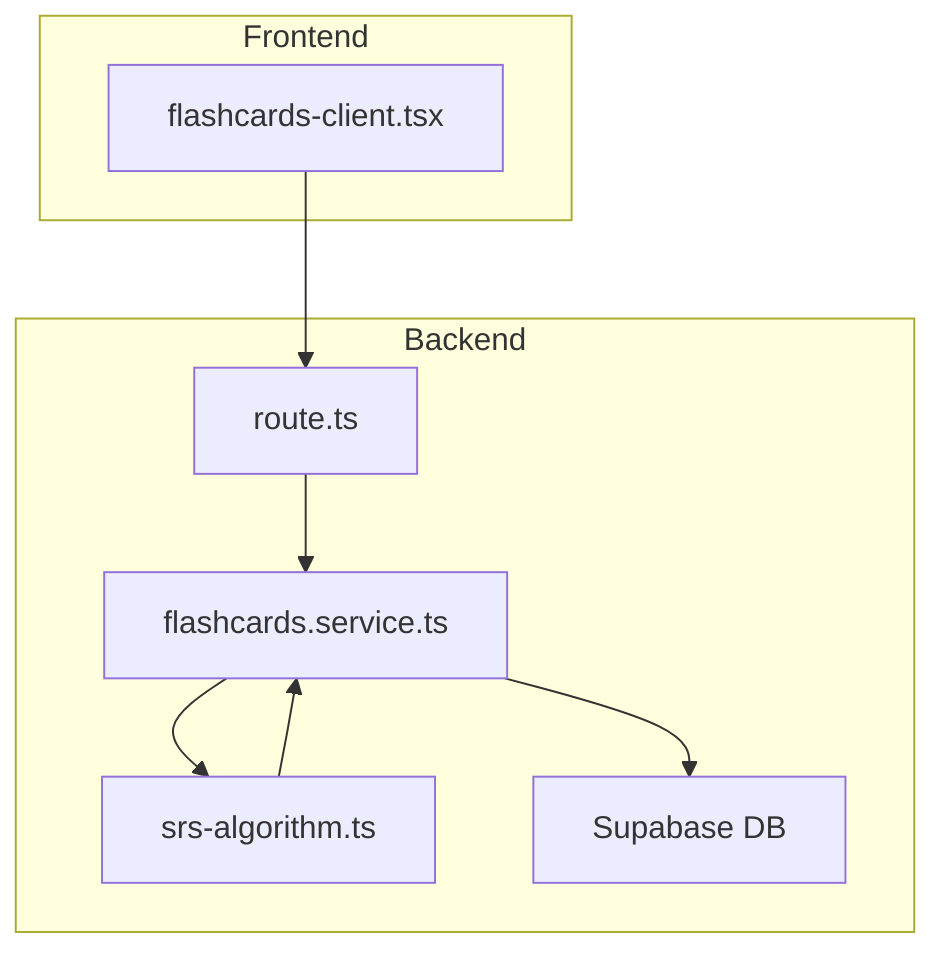
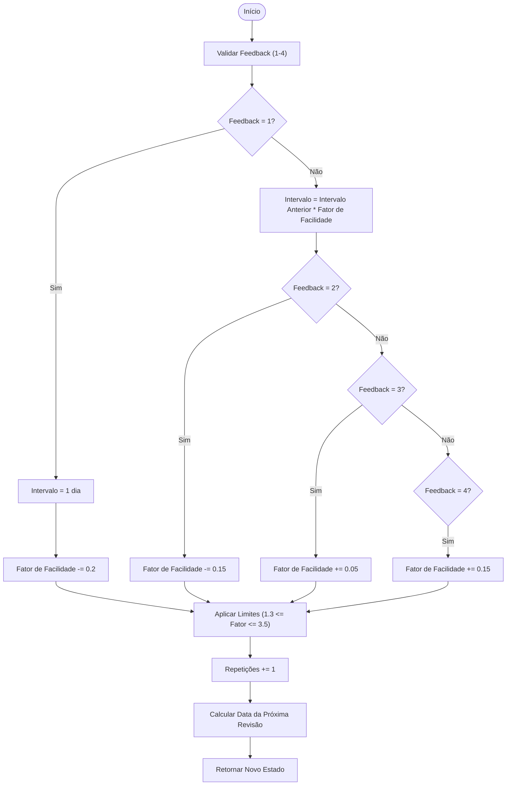
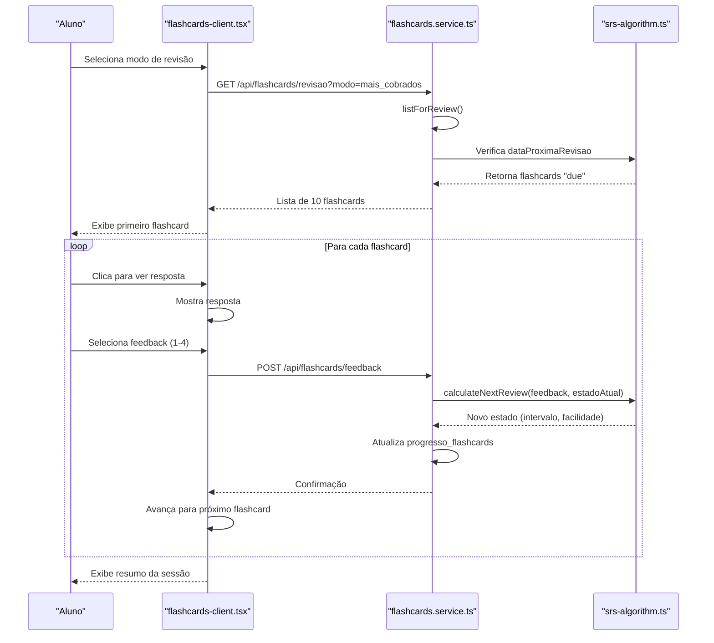

# Flashcards

<cite>
**Arquivos Referenciados neste Documento**   
- [flashcards-client.tsx](file://app/(dashboard)/aluno/flashcards/flashcards-client.tsx)
- [flashcards.service.ts](file://backend/services/flashcards/flashcards.service.ts)
- [srs-algorithm.ts](file://backend/services/flashcards/srs-algorithm.ts)
- [srs-algorithm.types.ts](file://backend/services/flashcards/srs-algorithm.types.ts)
- [route.ts](file://app/api/flashcards/revisao/route.ts)
- [user-profile-cache.service.ts](file://backend/services/cache/user-profile-cache.service.ts)
</cite>

## Sumário
1. [Introdução](#introdução)
2. [Arquitetura do Serviço Flashcards](#arquitetura-do-serviço-flashcards)
3. [Algoritmo SRS (Repetição Espaçada)](#algoritmo-srs-repetição-espaçada)
4. [Fluxo de Revisão por Importância](#fluxo-de-revisão-por-importância)
5. [Integração com o Endpoint /api/flashcards/revisao](#integração-com-o-endpoint-apiflashcardsrevisao)
6. [Importação de Flashcards e Persistência de Progresso](#importação-de-flashcards-e-persistência-de-progresso)
7. [Desempenho e Estratégias de Cache](#desempenho-e-estratégias-de-cache)
8. [Sincronização entre Dispositivos](#sincronização-entre-dispositivos)
9. [Personalização do Algoritmo SRS e Extensão com Novos Tipos de Conteúdo](#personalização-do-algoritmo-srs-e-extensão-com-novos-tipos-de-conteúdo)
10. [Conclusão](#conclusão)

## Introdução
O sistema de flashcards implementado na aplicação Área do Aluno é uma funcionalidade avançada projetada para otimizar o processo de aprendizagem por meio da repetição espaçada (SRS - Spaced Repetition System). Este documento detalha a arquitetura, os componentes principais e os fluxos de dados que compõem essa funcionalidade, com foco especial no algoritmo inteligente de revisão, na integração entre frontend e backend, e nas estratégias de desempenho e persistência. O sistema permite que alunos revisem conteúdos de forma eficiente, priorizando flashcards com base em sua importância e no desempenho individual do usuário.

## Arquitetura do Serviço Flashcards

O serviço `flashcards.service.ts` é o núcleo da funcionalidade, responsável por orquestrar todas as operações relacionadas aos flashcards. Ele atua como uma camada intermediária entre o frontend e o banco de dados, encapsulando a lógica de negócios e garantindo a integridade dos dados.

O serviço é estruturado em torno de várias operações principais:
- **Importação de Flashcards**: Permite a criação em massa de flashcards a partir de um conjunto de dados, validando a hierarquia de curso, disciplina, frente e módulo.
- **Listagem para Revisão**: O método `listForReview` é o coração do sistema SRS. Ele consulta o banco de dados para recuperar flashcards que estão prontos para revisão, com base no estado atual do progresso do aluno e no modo de revisão selecionado.
- **Registro de Feedback**: O método `sendFeedback` processa a avaliação do aluno sobre um flashcard e atualiza o estado do progresso com base no algoritmo SRS.
- **Operações CRUD**: Métodos para criar, ler, atualizar e deletar flashcards individualmente, usados principalmente pela interface de administração.

A arquitetura segue um padrão de serviço, com injeção de dependência para o cliente de banco de dados e o serviço de cache. O uso de tipos TypeScript (`FlashcardReviewItem`, `FlashcardImportRow`, `SRSState`) garante segurança de tipo e clareza na interface do serviço.

**Fontes do Diagrama**
- [flashcards-client.tsx](file://app/(dashboard)/aluno/flashcards/flashcards-client.tsx#L109-L155)
- [route.ts](file://app/api/flashcards/revisao/route.ts#L5-L30)
- [flashcards.service.ts](file://backend/services/flashcards/flashcards.service.ts#L114-L1579)

**Fontes da Seção**
- [flashcards.service.ts](file://backend/services/flashcards/flashcards.service.ts#L1-L1580)

## Algoritmo SRS (Repetição Espaçada)

O algoritmo de Repetição Espaçada (SRS) é implementado no arquivo `srs-algorithm.ts` e é baseado na metodologia SM-2 (SuperMemo 2), um dos algoritmos mais conhecidos e eficazes para aprendizagem com espaçamento.

O algoritmo funciona com base em três parâmetros principais armazenados no estado do progresso do aluno (`SRSState`):
- **`easeFactor` (Fator de Facilidade)**: Um valor numérico que representa o quão facilmente o aluno lembra do conteúdo. Um fator mais alto significa que o intervalo de revisão cresce mais rapidamente.
- **`interval` (Intervalo)**: O número de dias até a próxima revisão.
- **`repetitions` (Repetições)**: O número total de vezes que o flashcard foi revisado.

O cálculo da próxima revisão é feito pela função `calculateNextReview`, que recebe o feedback do aluno e o estado atual. O feedback é um valor de 1 a 4:
- **1 (Errei)**: O intervalo é resetado para 1 dia, e o fator de facilidade é reduzido.
- **2 (Acertei parcialmente)**: O intervalo é multiplicado pelo fator de facilidade, e o fator de facilidade é ligeiramente reduzido.
- **3 (Acertei com dificuldade)**: O intervalo é multiplicado pelo fator de facilidade, e o fator de facilidade é ligeiramente aumentado.
- **4 (Acertei com facilidade)**: O intervalo é multiplicado pelo fator de facilidade, e o fator de facilidade é aumentado mais significativamente.

A configuração padrão (`DEFAULT_SRS_CONFIG`) define os valores iniciais e os limites para o fator de facilidade, bem como os deltas aplicados com base no feedback. Essa configuração pode ser sobrescrita, permitindo personalização do algoritmo.

**Fontes do Diagrama**
- [srs-algorithm.ts](file://backend/services/flashcards/srs-algorithm.ts#L37-L97)
- [srs-algorithm.types.ts](file://backend/services/flashcards/srs-algorithm.types.ts#L6-L44)

**Fontes da Seção**
- [srs-algorithm.ts](file://backend/services/flashcards/srs-algorithm.ts#L1-L111)
- [srs-algorithm.types.ts](file://backend/services/flashcards/srs-algorithm.types.ts#L1-L51)

## Fluxo de Revisão por Importância

O componente `flashcards-client.tsx` implementa a interface de usuário para o sistema de revisão, oferecendo diferentes modos de estudo que priorizam flashcards com base em sua importância e no desempenho do aluno.

Os modos disponíveis são:
- **Mais Cobrados (Alta)**: Prioriza flashcards de módulos com importância "Alta", que são os conteúdos mais frequentemente cobrados em provas.
- **Revisão Geral (Mistura)**: Oferece uma revisão balanceada, combinando flashcards de módulos que o aluno já revisou e módulos com atividades concluídas.
- **Mais Errados (UTI dos Erros)**: Foca nos flashcards com os piores desempenhos, utilizando uma distribuição ponderada (5 de "Errei", 3 de "Acertei parcialmente", 2 de "Acertei com dificuldade").
- **Personalizado**: Permite ao aluno selecionar um curso, disciplina, frente e módulo específico para revisar.

O fluxo de revisão é gerenciado pelo estado do componente (`cards`, `idx`, `showAnswer`). Após responder a um flashcard, o aluno fornece um feedback, que é enviado ao backend. O sistema então avança para o próximo flashcard ou exibe um resumo da sessão após 10 cartões.

**Fontes do Diagrama**
- [flashcards-client.tsx](file://app/(dashboard)/aluno/flashcards/flashcards-client.tsx#L57-L720)
- [flashcards.service.ts](file://backend/services/flashcards/flashcards.service.ts#L361-L902)
- [srs-algorithm.ts](file://backend/services/flashcards/srs-algorithm.ts#L37-L97)

**Fontes da Seção**
- [flashcards-client.tsx](file://app/(dashboard)/aluno/flashcards/flashcards-client.tsx#L1-L720)

## Integração com o Endpoint /api/flashcards/revisao

O endpoint `/api/flashcards/revisao` é o ponto de integração entre o frontend e o backend para a funcionalidade de revisão. Implementado em `route.ts`, ele utiliza o middleware `requireUserAuth` para garantir que apenas usuários autenticados possam acessá-lo.

O fluxo do endpoint é simples:
1.  O cliente (frontend) faz uma requisição `GET` com parâmetros de consulta (`modo`, `cursoId`, `frenteId`, `moduloId`, `excludeIds`).
2.  O middleware valida a autenticação do usuário.
3.  O handler extrai os parâmetros e chama o método `listForReview` do `flashcardsService`.
4.  O serviço processa a lógica de negócios, consultando o banco de dados e aplicando as regras do SRS.
5.  O resultado é retornado ao cliente como um objeto JSON contendo a lista de flashcards.

O parâmetro `excludeIds` é crucial para a experiência do usuário, pois permite que o sistema evite mostrar flashcards que já foram revisados na mesma sessão, garantindo uma experiência de revisão contínua e sem repetições.

**Fontes da Seção**
- [route.ts](file://app/api/flashcards/revisao/route.ts#L1-L36)
- [flashcards.service.ts](file://backend/services/flashcards/flashcards.service.ts#L361-L902)

## Importação de Flashcards e Persistência de Progresso

A funcionalidade de importação de flashcards permite que professores criem grandes volumes de conteúdo de forma eficiente. O processo é iniciado no frontend e processado pelo endpoint `/api/flashcards/import`, que chama o método `importFlashcards` do serviço.

O serviço valida cada linha do arquivo de importação, mapeando nomes de disciplinas, frentes e módulos para seus respectivos IDs no banco de dados. Ele então insere os flashcards na tabela `flashcards`. A persistência do progresso do aluno é gerenciada automaticamente pelo método `sendFeedback`. Quando um aluno fornece feedback, o serviço insere ou atualiza um registro na tabela `progresso_flashcards`, que armazena o estado SRS (fator de facilidade, intervalo, última revisão, etc.) para cada combinação de aluno e flashcard. Isso garante que o progresso seja salvo e possa ser retomado em sessões futuras.

**Fontes da Seção**
- [flashcards.service.ts](file://backend/services/flashcards/flashcards.service.ts#L158-L336)
- [route.ts](file://app/api/flashcards/import/route.ts#L1-L44)

## Desempenho e Estratégias de Cache

Para garantir um desempenho ideal, especialmente com grandes volumes de flashcards, o sistema implementa estratégias de cache robustas. O serviço `user-profile-cache.service.ts` é um exemplo, onde os dados de perfil do usuário são armazenados em cache por 5 minutos para reduzir consultas ao banco de dados.

Embora o documento não mostre diretamente o cache para os flashcards, a arquitetura do serviço `flashcards.service.ts` está preparada para isso. O método `listAll` (usado pela interface de administração) demonstra um padrão de cache: ele gera uma chave de cache baseada nos filtros de busca e armazena o resultado por 15 minutos. Isso evita consultas pesadas ao banco de dados para listagens frequentes. Para a funcionalidade de revisão, o cache pode ser aplicado de forma semelhante, armazenando temporariamente os conjuntos de flashcards "due" para um usuário, reduzindo significativamente a carga no banco de dados durante picos de uso.

**Fontes da Seção**
- [user-profile-cache.service.ts](file://backend/services/cache/user-profile-cache.service.ts#L1-L84)
- [flashcards.service.ts](file://backend/services/flashcards/flashcards.service.ts#L977-L1263)

## Sincronização entre Dispositivos

A sincronização entre dispositivos é uma característica inerente à arquitetura da aplicação. Como todo o estado crítico (progresso do aluno, feedback, data da próxima revisão) é armazenado no banco de dados central (Supabase), qualquer dispositivo que o aluno use para acessar a aplicação irá recuperar o mesmo estado. Quando o aluno inicia uma sessão de revisão em um novo dispositivo, o endpoint `/api/flashcards/revisao` consulta o banco de dados e retorna os flashcards que estão prontos para revisão com base no progresso mais recente, garantindo uma experiência de aprendizagem contínua e consistente em todos os seus dispositivos.

**Fontes da Seção**
- [flashcards.service.ts](file://backend/services/flashcards/flashcards.service.ts#L361-L902)
- [route.ts](file://app/api/flashcards/revisao/route.ts#L1-L36)

## Personalização do Algoritmo SRS e Extensão com Novos Tipos de Conteúdo

O algoritmo SRS é altamente personalizável. A configuração padrão (`DEFAULT_SRS_CONFIG`) pode ser facilmente modificada para ajustar o comportamento do sistema. Por exemplo, os valores de `easeFactorDelta` podem ser alterados para tornar o algoritmo mais ou menos rigoroso com base no feedback do aluno. A função `calculateNextReview` aceita um parâmetro de configuração opcional, permitindo que diferentes perfis de usuário (por exemplo, "aprendiz rápido" vs. "aprendiz lento") utilizem configurações distintas.

Para estender o sistema com novos tipos de conteúdo (como flashcards com imagens ou áudio), a extensão seria feita principalmente no banco de dados e no frontend. O modelo de dados `Flashcard` poderia ser expandido para incluir campos como `imageUrl` ou `audioUrl`. O componente `flashcards-client.tsx` seria atualizado para renderizar esses novos tipos de conteúdo, enquanto o serviço de backend e o algoritmo SRS permaneceriam inalterados, pois a lógica de revisão é independente do tipo de conteúdo.

**Fontes da Seção**
- [srs-algorithm.ts](file://backend/services/flashcards/srs-algorithm.ts#L17-L49)
- [flashcards.service.ts](file://backend/services/flashcards/flashcards.service.ts#L42-L53)
- [flashcards-client.tsx](file://app/(dashboard)/aluno/flashcards/flashcards-client.tsx#L20-L24)

## Conclusão

O sistema de flashcards da Área do Aluno é uma implementação sofisticada e bem estruturada de um sistema de repetição espaçada. Ele combina uma arquitetura de serviço clara no backend com uma interface de usuário intuitiva no frontend, tudo orquestrado por um algoritmo SRS robusto baseado no SM-2. A funcionalidade de revisão por importância, a persistência confiável do progresso e as estratégias de cache demonstram um foco em eficiência e desempenho. A integração perfeita entre os componentes e a sincronização nativa entre dispositivos proporcionam uma experiência de aprendizagem poderosa e contínua para o aluno. A modularidade do código também permite fácil personalização e extensão, garantindo que o sistema possa evoluir para atender a novas necessidades educacionais.