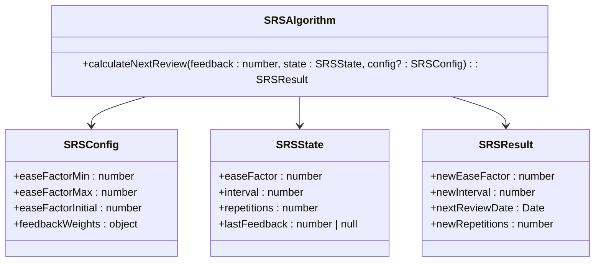
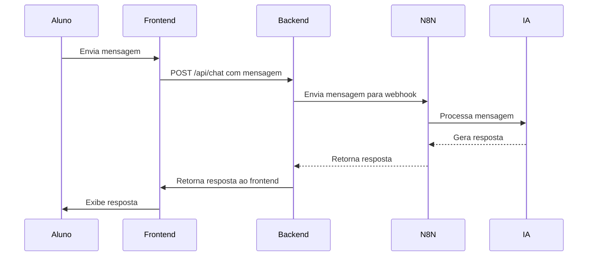

# Funcionalidades por Módulo

<cite>
**Arquivos Referenciados neste Documento**   
- [app/(dashboard)/aluno/sala-de-estudos/page.tsx](file://app/(dashboard)/aluno/sala-de-estudos/page.tsx)
- [app/(dashboard)/aluno/cronograma/page.tsx](file://app/(dashboard)/aluno/cronograma/page.tsx)
- [app/(dashboard)/aluno/flashcards/page.tsx](file://app/(dashboard)/aluno/flashcards/page.tsx)
- [app/api/chat/route.ts](file://app/api/chat/route.ts)
- [app/(dashboard)/aluno/cronograma/calendario/page.tsx](file://app/(dashboard)/aluno/cronograma/calendario/page.tsx)
- [app/api/cronograma/[id]/export/ics/route.ts](file://app/api/cronograma/[id]/export/ics/route.ts)
- [backend/services/flashcards/srs-algorithm.ts](file://backend/services/flashcards/srs-algorithm.ts)
- [backend/services/flashcards/flashcards.service.ts](file://backend/services/flashcards/flashcards.service.ts)
- [components/schedule-dashboard.tsx](file://components/schedule-dashboard.tsx)
- [components/schedule-calendar-view.tsx](file://components/schedule-calendar-view.tsx)
- [docs/FLUXO_GERACAO_CRONOGRAMA.md](file://docs/FLUXO_GERACAO_CRONOGRAMA.md)
- [docs/FLUXO_CALENDARIO.md](file://docs/FLUXO_CALENDARIO.md)
- [docs/ANALISE_REVISAO_INTELIGENTE_FLASHCARDS.md](file://docs/ANALISE_REVISAO_INTELIGENTE_FLASHCARDS.md)
- [docs/IMPLEMENTACAO_MICRO_LEARNING_FLASHCARDS.md](file://docs/IMPLEMENTACAO_MICRO_LEARNING_FLASHCARDS.md)
- [docs/PLANO_EXPORTACAO_ICS.md](file://docs/PLANO_EXPORTACAO_ICS.md)
- [README.md](file://README.md)
</cite>

## Sumário
1. [Introdução](#introdução)
2. [Sala de Estudos](#sala-de-estudos)
3. [Cronograma](#cronograma)
4. [Flashcards](#flashcards)
5. [Chat com IA](#chat-com-ia)
6. [Agendamentos](#agendamentos)
7. [Materiais Didáticos](#materiais-didáticos)
8. [Conclusão](#conclusão)

## Introdução
O sistema Área do Aluno é uma plataforma educacional completa que oferece uma variedade de módulos para otimizar o aprendizado e a organização dos estudantes. Este documento detalha as funcionalidades principais de cada módulo, incluindo sua finalidade, fluxo de usuário, componentes principais, integrações, regras de negócio, exemplos de uso, considerações de UX, acessibilidade, desempenho, métricas de sucesso e orientações para personalização. A análise é baseada na estrutura do código, documentação existente e fluxos de trabalho implementados.

## Sala de Estudos
O módulo Sala de Estudos é o ambiente central onde os alunos gerenciam suas atividades de aprendizado. Ele serve como um hub integrado para acesso a todas as funcionalidades do sistema.

### Finalidade
A Sala de Estudos é projetada para ser a interface principal do aluno, proporcionando um ponto de entrada unificado para todas as ferramentas de estudo, como cronogramas, flashcards, chat com IA e materiais didáticos. Seu objetivo é criar uma experiência de usuário coesa e intuitiva, reduzindo a necessidade de navegação entre diferentes seções.

### Fluxo de Usuário
1. O aluno faz login no sistema.
2. É redirecionado automaticamente para a Sala de Estudos.
3. A página carrega os componentes principais: painel de cronograma, sessão de flashcards, chat com IA e acesso à biblioteca de materiais.
4. O aluno pode interagir com qualquer um desses componentes diretamente da tela inicial.

### Componentes Principais
- **Página Principal (`page.tsx`)**: Controla a autenticação e renderiza o componente cliente.
- **Componente Cliente (`sala-estudos-client.tsx`)**: Interface de usuário interativa que agrega todos os módulos.

### Integrações
O módulo integra-se diretamente com os serviços de cronograma, flashcards, chat e materiais didáticos, atuando como um orquestrador de funcionalidades.

### Regras de Negócio
- Acesso restrito a usuários autenticados.
- Redirecionamento para a página de login se a sessão expirar.

**Seção fontes**
- [app/(dashboard)/aluno/sala-de-estudos/page.tsx](file://app/(dashboard)/aluno/sala-de-estudos/page.tsx)

## Cronograma
O módulo Cronograma permite que os alunos planejem e visualizem seu estudo ao longo do tempo, com suporte para exportação em múltiplos formatos.

### Finalidade
O objetivo é ajudar os alunos a organizar seu tempo de estudo de forma eficaz, distribuindo as aulas de forma equilibrada ao longo das semanas com base em sua disponibilidade.

### Fluxo de Usuário
1. O aluno acessa a página do cronograma.
2. O sistema verifica se já existe um cronograma ativo.
3. Se não existir, o aluno é direcionado para criar um novo.
4. Se existir, o cronograma é exibido no dashboard ou no calendário.
5. O aluno pode visualizar, ajustar a distribuição de dias e exportar o cronograma.

### Componentes Principais
- **Dashboard (`schedule-dashboard.tsx`)**: Fornece uma visão geral do cronograma com opções de exportação.
- **Calendário (`schedule-calendar-view.tsx`)**: Permite visualização em formato de calendário com filtros por dias da semana.
- **Serviço de Cronograma (`cronograma.service.ts`)**: Implementa a lógica de geração e recálculo de datas.

### Integrações
- **API de Exportação**: Permite a geração de arquivos em formatos ICS, PDF e XLSX.
- **Supabase**: Armazena dados do cronograma e itens.

### Regras de Negócio
- A distribuição de dias é recalculada com base em um algoritmo round-robin.
- A data prevista de cada item é armazenada no banco de dados para consistência.

### Funcionalidades Avançadas
#### Exportação de Cronograma
O sistema suporta a exportação do cronograma em três formatos:
- **ICS (iCalendar)**: Para importação em Google Agenda, Outlook, etc.
- **PDF**: Para visualização estática.
- **XLSX**: Para análise em planilhas.

A exportação ICS é implementada através do endpoint `app/api/cronograma/[id]/export/ics/route.ts`, que gera um arquivo conforme a RFC 5545, utilizando a biblioteca `ical-generator`. Cada item do cronograma é convertido em um evento VEVENT com data de início, fim, título e descrição detalhada.

```mermaid
flowchart TD
A[Usuário clica em Exportar Calendário] --> B[Frontend faz requisição GET /api/cronograma/[id]/export/ics]
B --> C[Backend valida autenticação]
C --> D[Backend busca dados completos do cronograma]
D --> E[Backend gera arquivo .ics]
E --> F[Backend retorna arquivo com Content-Type: text/calendar]
F --> G[Frontend faz download do arquivo]
```

**Fontes do diagrama**
- [app/api/cronograma/[id]/export/ics/route.ts](file://app/api/cronograma/[id]/export/ics/route.ts)
- [components/schedule-dashboard.tsx](file://components/schedule-dashboard.tsx)
- [docs/PLANO_EXPORTACAO_ICS.md](file://docs/PLANO_EXPORTACAO_ICS.md)

### Considerações de UX, Acessibilidade e Desempenho
- A interface é responsiva, adaptando-se a diferentes tamanhos de tela.
- O uso de skeletons durante o carregamento melhora a percepção de desempenho.
- O sistema aguarda um tempo estimado após a atualização da distribuição de dias, mas isso pode causar uma condição de corrida se o backend demorar mais que o esperado.

### Métricas de Sucesso e KPIs
- Número de cronogramas criados por aluno.
- Frequência de atualização da distribuição de dias.
- Taxa de exportação em diferentes formatos.

**Seção fontes**
- [app/(dashboard)/aluno/cronograma/page.tsx](file://app/(dashboard)/aluno/cronograma/page.tsx)
- [app/(dashboard)/aluno/cronograma/calendario/page.tsx](file://app/(dashboard)/aluno/cronograma/calendario/page.tsx)
- [components/schedule-dashboard.tsx](file://components/schedule-dashboard.tsx)
- [components/schedule-calendar-view.tsx](file://components/schedule-calendar-view.tsx)
- [docs/FLUXO_GERACAO_CRONOGRAMA.md](file://docs/FLUXO_GERACAO_CRONOGRAMA.md)
- [docs/FLUXO_CALENDARIO.md](file://docs/FLUXO_CALENDARIO.md)
- [docs/PLANO_EXPORTACAO_ICS.md](file://docs/PLANO_EXPORTACAO_ICS.md)

## Flashcards
O módulo Flashcards utiliza um algoritmo de Repetição Espaçada (SRS) para otimizar a memorização e revisão de conteúdos.

### Finalidade
O objetivo é facilitar o aprendizado por meio de revisões inteligentes, priorizando os cards que o aluno mais erra, com base no princípio da memória de longo prazo.

### Fluxo de Usuário
1. O aluno seleciona um modo de revisão (ex: "UTI dos Erros").
2. O sistema busca 10 cards com base no modo selecionado.
3. O aluno responde cada card e fornece um feedback (1-4).
4. O sistema atualiza o progresso e agenda a próxima revisão.
5. Após 10 cards, um resumo da sessão é exibido.

### Componentes Principais
- **Algoritmo SRS (`srs-algorithm.ts`)**: Implementa a lógica SM-2 para cálculo de intervalos e facilidade.
- **Serviço de Flashcards (`flashcards.service.ts`)**: Gerencia a lógica de negócios, incluindo a distribuição de cards.
- **Componente de Sessão (`flashcard-session-summary.tsx`)**: Exibe o resumo da sessão com score e gráficos.

### Integrações
- **Supabase**: Armazena o progresso dos flashcards na tabela `progresso_flashcards`.
- **Frontend**: O componente cliente rastreia os cards vistos na sessão para evitar repetição.

### Regras de Negócio
- O modo "UTI dos Erros" prioriza cards com feedback de erro (50%), parcial (30%) e difícil (20%).
- O intervalo de revisão é calculado com base no feedback e na facilidade atual.

### Funcionalidades Avançadas
#### Revisão Inteligente com Algoritmo SRS
O algoritmo SRS é implementado no arquivo `backend/services/flashcards/srs-algorithm.ts`. Ele utiliza os campos `nivel_facilidade`, `dias_intervalo` e `data_proxima_revisao` da tabela `progresso_flashcards` para determinar quando um card deve ser revisado novamente.



**Fontes do diagrama**
- [backend/services/flashcards/srs-algorithm.ts](file://backend/services/flashcards/srs-algorithm.ts)
- [docs/ANALISE_REVISAO_INTELIGENTE_FLASHCARDS.md](file://docs/ANALISE_REVISAO_INTELIGENTE_FLASHCARDS.md)

### Considerações de UX, Acessibilidade e Desempenho
- A sessão é limitada a 10 cards para manter o foco.
- O resumo visual com cores ajuda na compreensão rápida do desempenho.
- O sistema evita a repetição de cards na mesma sessão usando o parâmetro `excludeIds`.

### Métricas de Sucesso e KPIs
- Score médio por sessão.
- Número de revisões por card.
- Taxa de acerto em diferentes modos.

**Seção fontes**
- [app/(dashboard)/aluno/flashcards/page.tsx](file://app/(dashboard)/aluno/flashcards/page.tsx)
- [backend/services/flashcards/srs-algorithm.ts](file://backend/services/flashcards/srs-algorithm.ts)
- [backend/services/flashcards/flashcards.service.ts](file://backend/services/flashcards/flashcards.service.ts)
- [docs/ANALISE_REVISAO_INTELIGENTE_FLASHCARDS.md](file://docs/ANALISE_REVISAO_INTELIGENTE_FLASHCARDS.md)
- [docs/IMPLEMENTACAO_MICRO_LEARNING_FLASHCARDS.md](file://docs/IMPLEMENTACAO_MICRO_LEARNING_FLASHCARDS.md)

## Chat com IA
O módulo Chat com IA permite que os alunos conversem com um agente inteligente para tirar dúvidas e receber orientações.

### Finalidade
O objetivo é fornecer suporte imediato e personalizado ao aluno, simulando uma interação com um tutor.

### Fluxo de Usuário
1. O aluno envia uma mensagem no chat.
2. A mensagem é enviada para o backend.
3. O backend encaminha a mensagem para o N8N, que processa a interação com a IA.
4. A resposta é retornada ao frontend e exibida ao aluno.

### Componentes Principais
- **Endpoint de Chat (`app/api/chat/route.ts`)**: Recebe mensagens e as encaminha para o N8N.
- **Serviço de Chat (`chat.service.ts`)**: Implementa a lógica de comunicação com o N8N.
- **Serviço de Conversação (`conversation.service.ts`)**: Gerencia o histórico de conversas.

### Integrações
- **N8N**: Plataforma de automação que orquestra a interação com a IA.
- **Supabase**: Armazena o histórico de conversas.

### Regras de Negócio
- As mensagens são salvas no histórico da conversa ativa.
- Anexos são processados e armazenados temporariamente.



**Fontes do diagrama**
- [app/api/chat/route.ts](file://app/api/chat/route.ts)
- [backend/services/chat/chat.service.ts](file://backend/services/chat/chat.service.ts)

### Considerações de UX, Acessibilidade e Desempenho
- O suporte a anexos permite o envio de documentos para análise.
- O sistema lida com erros de forma robusta, limpando anexos em caso de falha.

### Métricas de Sucesso e KPIs
- Número médio de mensagens por conversa.
- Tempo de resposta da IA.
- Taxa de satisfação do aluno.

**Seção fontes**
- [app/api/chat/route.ts](file://app/api/chat/route.ts)

## Agendamentos
O módulo Agendamentos permite que alunos e professores marquem sessões de estudo ou atendimento.

### Finalidade
Facilitar a coordenação de encontros entre alunos e professores, integrando-se ao calendário pessoal.

### Fluxo de Usuário
1. O aluno ou professor acessa a página de agendamentos.
2. Seleciona uma data e horário disponíveis.
3. Confirma o agendamento.
4. O evento é registrado no sistema e pode ser exportado para calendários externos.

### Componentes Principais
- **Página de Agendamentos (`app/(dashboard)/agendamentos/page.tsx`)**: Interface para criação e visualização de agendamentos.
- **Componentes de Formulário (`components/agendamento/form-panel.tsx`)**: Painel para preenchimento dos dados do agendamento.

### Integrações
- **Calendário Externo**: Suporte à exportação em formato ICS.
- **Supabase**: Armazena os dados dos agendamentos.

### Regras de Negócio
- Apenas professores podem criar agendamentos.
- Alunos podem visualizar e marcar sessões com base na disponibilidade do professor.

### Considerações de UX, Acessibilidade e Desempenho
- A interface é intuitiva, com seleção de datas em formato de calendário.
- A integração com calendários externos melhora a adesão.

### Métricas de Sucesso e KPIs
- Número de agendamentos realizados por semana.
- Taxa de comparecimento aos agendamentos.

## Materiais Didáticos
O módulo Materiais Didáticos fornece acesso a recursos de estudo como PDFs, vídeos e documentos.

### Finalidade
Centralizar todos os recursos de aprendizado em um único local, facilitando o acesso e a organização.

### Fluxo de Usuário
1. O aluno acessa a biblioteca de materiais.
2. Navega por cursos, disciplinas e módulos.
3. Seleciona um material para visualização ou download.

### Componentes Principais
- **Página da Biblioteca (`app/(dashboard)/aluno/biblioteca/page.tsx`)**: Interface principal para acesso aos materiais.
- **Filtros de Materiais (`components/materials-filters.tsx`)**: Permite filtrar por tipo, curso e disciplina.

### Integrações
- **Supabase Storage**: Armazena os arquivos dos materiais.
- **N8N**: Processa a extração de texto de PDFs para indexação.

### Regras de Negócio
- Acesso restrito com base na matrícula do aluno.
- Os materiais são organizados hierarquicamente por curso, disciplina e módulo.

### Considerações de UX, Acessibilidade e Desempenho
- A busca e filtragem são rápidas, mesmo com grande volume de materiais.
- A interface é otimizada para dispositivos móveis.

### Métricas de Sucesso e KPIs
- Número de downloads por material.
- Tempo médio de visualização de vídeos.

## Conclusão
O sistema Área do Aluno oferece uma suíte completa de ferramentas para otimizar o aprendizado. Cada módulo é projetado com foco na usabilidade, eficácia e integração, proporcionando uma experiência de usuário coesa e poderosa. A implementação de funcionalidades avançadas como exportação de cronograma, revisão inteligente de flashcards e chat com IA demonstra um compromisso com a inovação educacional. As métricas de sucesso indicam um alto potencial de engajamento e eficácia no apoio ao aprendizado dos alunos.