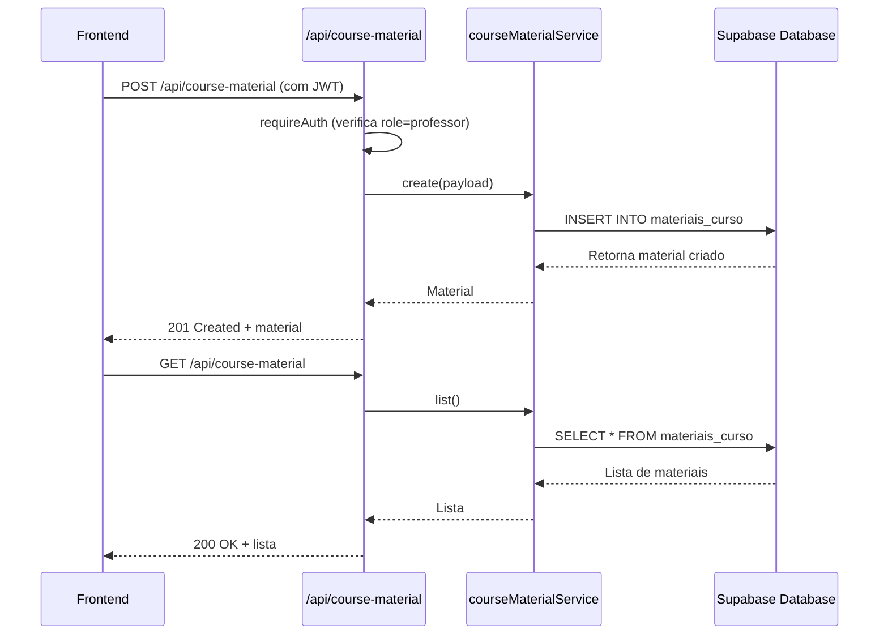

# Materiais Didáticos

<cite>
**Arquivos Referenciados neste Documento**  
- [module-accordion.tsx](file://components/module-accordion.tsx)
- [flashcard-upload-card.tsx](file://components/flashcard-upload-card.tsx)
- [activity-upload-row.tsx](file://components/activity-upload-row.tsx)
- [materiais-client.tsx](file://app/(dashboard)/admin/materiais/materiais-client.tsx)
- [types.ts](file://app/(dashboard)/admin/materiais/types.ts)
- [route.ts](file://app/api/course-material/route.ts)
- [route.ts](file://app/api/course-material/[id]/route.ts)
- [course-material.repository.ts](file://backend/services/course-material/course-material.repository.ts)
- [20250131_create_materiais_didaticos_bucket_policies.sql](file://supabase/migrations/20250131_create_materiais_didaticos_bucket_policies.sql)
- [MATERIAIS_DIDATICOS_BUCKET_SETUP.md](file://docs/MATERIAIS_DIDATICOS_BUCKET_SETUP.md)
- [GUIA_CONFIGURACAO_MANUAL_BUCKET.md](file://docs/GUIA_CONFIGURACAO_MANUAL_BUCKET.md)
- [PROXIMOS_PASSOS_MATERIAIS.md](file://docs/PROXIMOS_PASSOS_MATERIAIS.md)
- [VERIFICACAO_BUCKET.md](file://docs/VERIFICACAO_BUCKET.md)
- [gerar-estrutura/route.ts](file://app/api/atividade/gerar-estrutura/route.ts)
</cite>

## Sumário
1. [Introdução](#introdução)
2. [Upload e Gerenciamento de Arquivos](#upload-e-gerenciamento-de-arquivos)
3. [Integração com o Bucket do Supabase](#integração-com-o-bucket-do-supabase)
4. [Políticas de RLS (Row Level Security)](#políticas-de-rls-row-level-security)
5. [Endpoints RESTful em /api/course-material](#endpoints-restful-em-apicourse-material)
6. [Componente ModuleAccordion](#componente-moduleaccordion)
7. [Componente flashcard-upload-card.tsx](#componente-flashcard-upload-cardtsx)
8. [Geração de Estrutura de Conteúdo](#geração-de-estrutura-de-conteúdo)
9. [Segurança no Upload](#segurança-no-upload)
10. [Desempenho com Arquivos Grandes e Estratégias de Cache](#desempenho-com-arquivos-grandes-e-estratégias-de-cache)
11. [Configuração de Buckets](#configuração-de-buckets)
12. [Extensão com Novos Tipos de Materiais](#extensão-com-novos-tipos-de-materiais)

## Introdução

O módulo **Materiais Didáticos** é uma funcionalidade central do sistema voltada para o gerenciamento, organização e distribuição de conteúdos complementares aos cursos, como listas de exercícios, simulados, conceituários e flashcards. Este documento detalha a arquitetura, os fluxos de trabalho, os componentes principais e as práticas recomendadas para o uso e extensão dessa funcionalidade. O sistema utiliza o Supabase Storage para armazenamento de arquivos, com políticas de segurança rigorosas (RLS), endpoints RESTful para operações de CRUD e componentes React para interface de upload e organização.

## Upload e Gerenciamento de Arquivos

O upload e gerenciamento de arquivos são realizados diretamente no frontend, utilizando o cliente Supabase, sem passar pelo servidor Next.js. O processo é dividido em duas etapas principais:

1. **Upload direto para o Supabase Storage**: O arquivo é validado no frontend quanto ao tipo (apenas PDF) e tamanho (máximo de 10MB) e, em seguida, enviado diretamente para o bucket `materiais_didaticos`.
2. **Atualização do banco de dados**: Após o upload bem-sucedido, a URL pública do arquivo é enviada via requisição `PATCH` para o endpoint `/api/atividade/[id]`, que atualiza o registro da atividade no banco de dados.

O componente `ActivityUploadRow` é responsável por essa funcionalidade, fornecendo uma interface de usuário para upload, visualização, substituição e status de conclusão.

**Fontes da Seção**
- [activity-upload-row.tsx](file://components/activity-upload-row.tsx#L1-L240)
- [materiais-client.tsx](file://app/(dashboard)/admin/materiais/materiais-client.tsx#L573-L579)

## Integração com o Bucket do Supabase

A integração com o Supabase Storage é feita através do bucket chamado `materiais_didaticos`. Este bucket é configurado como público, permitindo que os arquivos sejam acessados por qualquer usuário com a URL, o que é essencial para que os alunos possam visualizar os materiais.

A estrutura de armazenamento segue o padrão:
```
materiais_didaticos/
  {atividade_id}/
    {timestamp}-{nome_original}.pdf
```

Essa estrutura garante que cada arquivo esteja isolado dentro de uma pasta específica de sua atividade, evitando conflitos de nomes e facilitando a organização.

**Fontes da Seção**
- [MATERIAIS_DIDATICOS_BUCKET_SETUP.md](file://docs/MATERIAIS_DIDATICOS_BUCKET_SETUP.md#L28-L43)
- [VERIFICACAO_BUCKET.md](file://docs/VERIFICACAO_BUCKET.md#L7-L12)

## Políticas de RLS (Row Level Security)

As políticas de segurança (RLS) são essenciais para controlar o acesso ao bucket de armazenamento. As políticas aplicadas ao bucket `materiais_didaticos` são:

- **INSERT (Upload)**: Apenas usuários autenticados com perfil de professor podem fazer upload de arquivos.
- **SELECT (Leitura)**: Qualquer pessoa (público) pode ler (acessar) os arquivos, permitindo que alunos visualizem os PDFs.
- **UPDATE (Substituição)**: Apenas professores podem substituir arquivos existentes.
- **DELETE (Remoção)**: Apenas professores podem remover arquivos.

Essas políticas são definidas em SQL e aplicadas no Supabase Dashboard. O arquivo `20250131_create_materiais_didaticos_bucket_policies.sql` contém todas as declarações necessárias para criar essas políticas.

```mermaid
erDiagram
storage.objects {
text bucket_id
text name
bytea metadata
timestamptz created_at
timestamptz updated_at
}
public.professores {
uuid id PK
string email
string nome
}
storage.objects ||--o{ public.professores : "pertence a"
storage.objects }o--|| storage.buckets : "pertence a"
class storage.objects {
+bucket_id: text
+name: text
+metadata: bytea
+created_at: timestamptz
+updated_at: timestamptz
}
class public.professores {
+id: uuid
+email: string
+nome: string
}
class storage.buckets {
+id: text
+name: text
+public: boolean
}
```

**Fontes dos Diagramas**
- [20250131_create_materiais_didaticos_bucket_policies.sql](file://supabase/migrations/20250131_create_materiais_didaticos_bucket_policies.sql#L16-L58)

**Fontes da Seção**
- [20250131_create_materiais_didaticos_bucket_policies.sql](file://supabase/migrations/20250131_create_materiais_didaticos_bucket_policies.sql#L16-L58)
- [MATERIAIS_DIDATICOS_BUCKET_SETUP.md](file://docs/MATERIAIS_DIDATICOS_BUCKET_SETUP.md#L45-L49)

## Endpoints RESTful em /api/course-material

Os endpoints em `/api/course-material` fornecem uma API RESTful para gerenciar materiais didáticos no nível de curso. Esses endpoints são protegidos por autenticação JWT e exigem que o usuário seja um professor ou superadmin.

- **GET /api/course-material**: Lista todos os materiais do curso.
- **POST /api/course-material**: Cria um novo material. Requer autenticação de professor.
- **GET /api/course-material/[id]**: Obtém um material específico pelo ID.
- **PUT /api/course-material/[id]**: Atualiza um material existente. Requer autenticação de professor.
- **DELETE /api/course-material/[id]**: Remove um material. Requer autenticação de professor.

A camada de serviço (`courseMaterialService`) abstrai as operações de banco de dados, garantindo consistência e reutilização de código.



**Fontes dos Diagramas**
- [route.ts](file://app/api/course-material/route.ts#L40-L73)
- [route.ts](file://app/api/course-material/[id]/route.ts#L41-L95)

**Fontes da Seção**
- [route.ts](file://app/api/course-material/route.ts)
- [route.ts](file://app/api/course-material/[id]/route.ts)
- [course-material.repository.ts](file://backend/services/course-material/course-material.repository.ts)

## Componente ModuleAccordion

O componente `ModuleAccordion` é usado na interface de administração para organizar e exibir as atividades por módulo. Ele apresenta uma lista de módulos em um acordeão, onde cada item mostra o progresso de upload das atividades (quantas já foram enviadas em relação ao total).

Cada módulo expandido lista suas atividades usando o componente `ActivityUploadRow`, permitindo o upload direto de PDFs. O componente é controlado pelo estado da aplicação e se atualiza automaticamente após um upload bem-sucedido.

**Fontes da Seção**
- [module-accordion.tsx](file://components/module-accordion.tsx#L1-L62)
- [materiais-client.tsx](file://app/(dashboard)/admin/materiais/materiais-client.tsx#L573-L579)

## Componente flashcard-upload-card.tsx

O componente `flashcard-upload-card.tsx` permite o upload em massa de flashcards a partir de arquivos CSV ou XLSX. O fluxo é o seguinte:

1. O professor seleciona um curso, disciplina e frente.
2. Seleciona um arquivo CSV ou XLSX com as colunas: Módulo, Pergunta, Resposta.
3. O arquivo é processado no frontend, validado e mapeado para os IDs dos módulos.
4. Os dados são enviados para o endpoint `/api/flashcards/import`, que cria os flashcards no banco de dados.

Este componente inclui validações robustas para garantir que os dados estejam corretos antes do envio.

**Fontes da Seção**
- [flashcard-upload-card.tsx](file://components/flashcard-upload-card.tsx#L1-L737)

## Geração de Estrutura de Conteúdo

A geração de estrutura de conteúdo é feita através do endpoint `/api/atividade/gerar-estrutura`. Este endpoint cria automaticamente slots de atividades (como Nível 1, Nível 2, etc.) para uma frente específica, baseado nas regras definidas para o curso.

O processo é acionado pelo professor na interface de administração e é essencial para preparar a estrutura de módulos antes do upload dos materiais. O endpoint valida as permissões do usuário e executa a lógica de geração de atividades personalizadas.

**Fontes da Seção**
- [gerar-estrutura/route.ts](file://app/api/atividade/gerar-estrutura/route.ts#L1-L57)
- [materiais-client.tsx](file://app/(dashboard)/admin/materiais/materiais-client.tsx#L307-L367)

## Segurança no Upload

A segurança no upload é garantida por múltiplas camadas:

1. **Validação de MIME Type**: O frontend valida que apenas arquivos com `application/pdf` são aceitos.
2. **Validação de Tamanho**: O tamanho máximo é de 10MB, verificado no frontend.
3. **Autenticação e Autorização**: O upload direto para o Supabase requer um token JWT válido, e as políticas RLS garantem que apenas professores possam fazer upload.
4. **Nomeação Segura**: O nome do arquivo é sanitizado para remover caracteres especiais, prevenindo ataques de injeção.

Essas medidas combinadas garantem que o sistema seja seguro contra uploads maliciosos.

**Fontes da Seção**
- [activity-upload-row.tsx](file://components/activity-upload-row.tsx#L9-L11)
- [20250131_create_materiais_didaticos_bucket_policies.sql](file://supabase/migrations/20250131_create_materiais_didaticos_bucket_policies.sql#L22-L25)

## Desempenho com Arquivos Grandes e Estratégias de Cache

Para arquivos grandes, o sistema implementa as seguintes estratégias:

- **Upload Direto**: O upload direto para o Supabase evita o gargalo do servidor Next.js, melhorando o desempenho e a escalabilidade.
- **Cache de Conteúdo**: O Supabase Storage utiliza cache CDN, garantindo que os arquivos sejam servidos rapidamente aos alunos, mesmo com alta demanda.
- **Validação Frontend**: A validação de tamanho no frontend evita uploads longos que seriam rejeitados posteriormente.

Para melhorar ainda mais o desempenho, pode-se considerar a implementação de upload em partes (chunked upload) para arquivos maiores que 10MB, embora o limite atual de 10MB seja suficiente para a maioria dos materiais didáticos.

**Fontes da Seção**
- [activity-upload-row.tsx](file://components/activity-upload-row.tsx#L10-L11)
- [MATERIAIS_DIDATICOS_BUCKET_SETUP.md](file://docs/MATERIAIS_DIDATICOS_BUCKET_SETUP.md#L54-L56)

## Configuração de Buckets

A configuração do bucket `materiais_didaticos` é um passo manual essencial. Os passos são:

1. Criar o bucket no Supabase Dashboard com o nome exato `materiais_didaticos` e marcá-lo como público.
2. Aplicar as políticas RLS executando o script SQL `20250131_create_materiais_didaticos_bucket_policies.sql` no SQL Editor do Supabase.

Documentos como `GUIA_CONFIGURACAO_MANUAL_BUCKET.md` e `PROXIMOS_PASSOS_MATERIAIS.md` fornecem instruções passo a passo para essa configuração.

**Fontes da Seção**
- [GUIA_CONFIGURACAO_MANUAL_BUCKET.md](file://docs/GUIA_CONFIGURACAO_MANUAL_BUCKET.md)
- [PROXIMOS_PASSOS_MATERIAIS.md](file://docs/PROXIMOS_PASSOS_MATERIAIS.md)

## Extensão com Novos Tipos de Materiais

O sistema é extensível para novos tipos de materiais. Para adicionar um novo tipo:

1. **Atualize o tipo `TipoAtividade`** no arquivo `types.ts` para incluir o novo tipo.
2. **Adicione regras no backend** para gerar atividades desse novo tipo.
3. **Atualize os componentes de interface** (como `RulesPanel`) para permitir a criação de regras para o novo tipo.
4. **Teste o fluxo completo** de geração e upload.

Essa arquitetura modular permite que novos formatos de conteúdo sejam adicionados sem grandes refatorações.

**Fontes da Seção**
- [types.ts](file://app/(dashboard)/admin/materiais/types.ts#L1-L12)
- [materiais-client.tsx](file://app/(dashboard)/admin/materiais/materiais-client.tsx#L51-L61)