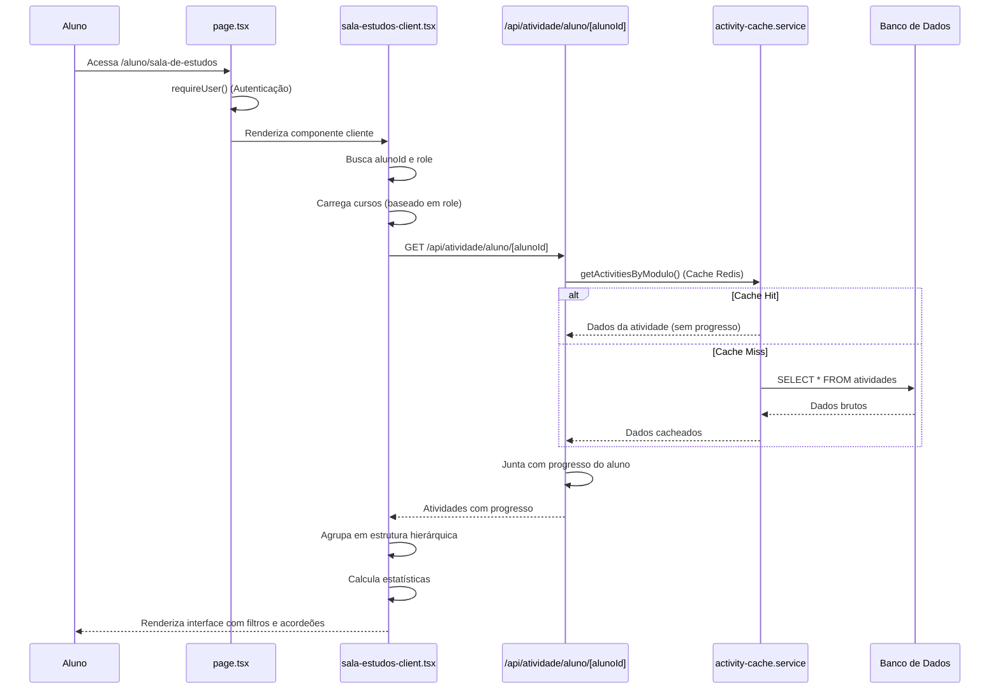
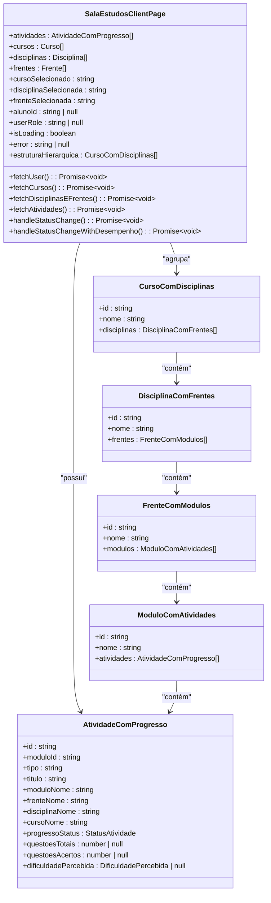
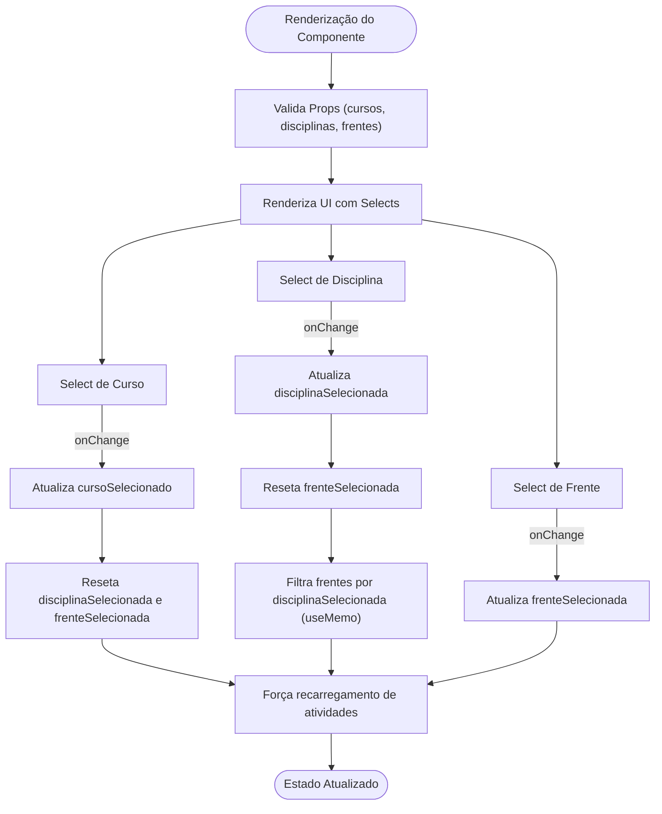
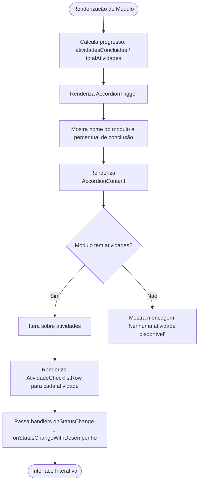
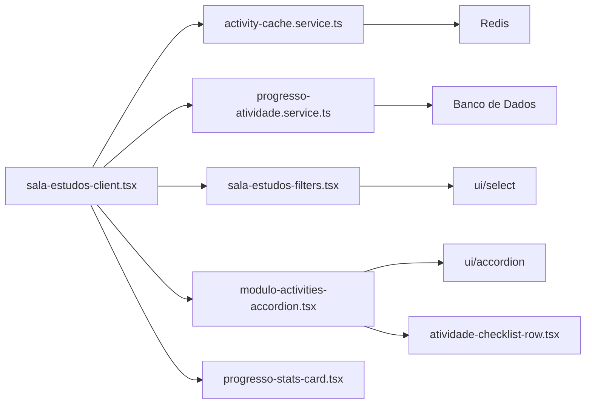

# Sala de Estudos

<cite>
**Arquivos Referenciados neste Documento**  
- [page.tsx](file://app/(dashboard)/aluno/sala-de-estudos/page.tsx)
- [sala-estudos-client.tsx](file://app/(dashboard)/aluno/sala-de-estudos/sala-estudos-client.tsx)
- [sala-estudos-filters.tsx](file://components/sala-estudos-filters.tsx)
- [module-accordion.tsx](file://components/module-accordion.tsx)
- [modulo-activities-accordion.tsx](file://components/modulo-activities-accordion.tsx)
- [activity-cache.service.ts](file://backend/services/cache/activity-cache.service.ts)
- [progresso-atividade.service.ts](file://backend/services/progresso-atividade/progresso-atividade.service.ts)
- [progresso-atividade.types.ts](file://backend/services/progresso-atividade/progresso-atividade.types.ts)
</cite>

## Sumário
1. [Introdução](#introdução)
2. [Estrutura do Projeto](#estrutura-do-projeto)
3. [Componentes Principais](#componentes-principais)
4. [Visão Geral da Arquitetura](#visão-geral-da-arquitetura)
5. [Análise Detalhada dos Componentes](#análise-detalhada-dos-componentes)
6. [Análise de Dependências](#análise-de-dependências)
7. [Considerações de Desempenho](#considerações-de-desempenho)
8. [Guia de Solução de Problemas](#guia-de-solução-de-problemas)
9. [Conclusão](#conclusão)

## Introdução
A funcionalidade **Sala de Estudos** é um componente central da aplicação voltado para o acompanhamento do progresso acadêmico dos alunos. Ela permite visualizar, organizar e interagir com atividades educacionais em uma estrutura hierárquica clara: **Curso > Disciplina > Frente > Módulo**. O sistema recupera dados via API, processa informações de progresso e exibe uma interface interativa com filtros dinâmicos, estatísticas de conclusão e mecanismos de cache para otimização de desempenho. Este documento detalha a arquitetura, o fluxo de dados, as regras de negócio e as melhores práticas para personalização e extensão da funcionalidade.

## Estrutura do Projeto
A funcionalidade Sala de Estudos está organizada em uma estrutura modular que separa claramente a lógica de apresentação, os componentes reutilizáveis e os serviços de backend. A navegação é baseada em rotas do Next.js, com autenticação obrigatória para acesso.

```mermaid
graph TB
subgraph "Frontend"
A[page.tsx] --> B[sala-estudos-client.tsx]
B --> C[sala-estudos-filters.tsx]
B --> D[modulo-activities-accordion.tsx]
D --> E[atividade-checklist-row.tsx]
B --> F[progresso-stats-card.tsx]
end
subgraph "Backend"
G[/api/atividade/aluno/[alunoId]\] --> H[atividade.service.ts]
H --> I[activity-cache.service.ts]
G --> J[progresso-atividade.service.ts]
end
A --> |Autenticação| K[requireUser]
B --> |Estado| L[React State]
C --> |Filtros| M[React.useMemo]
D --> |Progresso| N[handleStatusChange]
```

**Fontes do Diagrama**
- [page.tsx](file://app/(dashboard)/aluno/sala-de-estudos/page.tsx)
- [sala-estudos-client.tsx](file://app/(dashboard)/aluno/sala-de-estudos/sala-estudos-client.tsx)
- [sala-estudos-filters.tsx](file://components/sala-estudos-filters.tsx)
- [modulo-activities-accordion.tsx](file://components/modulo-activities-accordion.tsx)
- [activity-cache.service.ts](file://backend/services/cache/activity-cache.service.ts)
- [progresso-atividade.service.ts](file://backend/services/progresso-atividade/progresso-atividade.service.ts)

**Fontes da Seção**
- [page.tsx](file://app/(dashboard)/aluno/sala-de-estudos/page.tsx)
- [sala-estudos-client.tsx](file://app/(dashboard)/aluno/sala-de-estudos/sala-estudos-client.tsx)

## Componentes Principais
Os componentes principais da Sala de Estudos são responsáveis pela renderização da interface, gerenciamento de estado e interação com o usuário. Eles incluem o cliente principal, os filtros hierárquicos e os acordeões de módulos.

**Fontes da Seção**
- [sala-estudos-client.tsx](file://app/(dashboard)/aluno/sala-de-estudos/sala-estudos-client.tsx)
- [sala-estudos-filters.tsx](file://components/sala-estudos-filters.tsx)
- [modulo-activities-accordion.tsx](file://components/modulo-activities-accordion.tsx)

## Visão Geral da Arquitetura
A arquitetura da Sala de Estudos é baseada em um fluxo de dados unidirecional, onde o componente principal coordena a busca de dados, o processamento e a renderização. A autenticação é verificada no servidor, e os dados são carregados no cliente com base no `alunoId`.



**Fontes do Diagrama**
- [page.tsx](file://app/(dashboard)/aluno/sala-de-estudos/page.tsx#L4-L8)
- [sala-estudos-client.tsx](file://app/(dashboard)/aluno/sala-de-estudos/sala-estudos-client.tsx#L75-L707)
- [activity-cache.service.ts](file://backend/services/cache/activity-cache.service.ts#L43-L51)
- [progresso-atividade.service.ts](file://backend/services/progresso-atividade/progresso-atividade.service.ts)

## Análise Detalhada dos Componentes

### Análise do Componente Sala de Estudos
O componente principal `sala-estudos-client.tsx` é responsável por coordenar todo o fluxo de dados e interação. Ele gerencia o estado do usuário, carrega cursos, disciplinas e frentes, e busca todas as atividades associadas ao aluno.



**Fontes do Diagrama**
- [sala-estudos-client.tsx](file://app/(dashboard)/aluno/sala-de-estudos/sala-estudos-client.tsx#L57-L73)
- [sala-estudos-client.tsx](file://app/(dashboard)/aluno/sala-de-estudos/sala-estudos-client.tsx#L12-L17)

### Análise do Componente de Filtros
O componente `sala-estudos-filters.tsx` fornece uma interface para filtrar atividades por curso, disciplina e frente. Ele é controlado pelo componente principal e atualiza o estado de acordo com as seleções do usuário.



**Fontes do Diagrama**
- [sala-estudos-filters.tsx](file://components/sala-estudos-filters.tsx#L44-L139)
- [sala-estudos-client.tsx](file://app/(dashboard)/aluno/sala-de-estudos/sala-estudos-client.tsx#L1004-L1021)

### Análise do Componente ModuleAccordion
O componente `modulo-activities-accordion.tsx` exibe as atividades dentro de um módulo em um acordeão interativo. Ele mostra o progresso geral do módulo e permite que o aluno marque atividades como concluídas.



**Fontes do Diagrama**
- [modulo-activities-accordion.tsx](file://components/modulo-activities-accordion.tsx#L29-L77)
- [sala-estudos-client.tsx](file://app/(dashboard)/aluno/sala-de-estudos/sala-estudos-client.tsx#L1053-L1058)

**Fontes da Seção**
- [modulo-activities-accordion.tsx](file://components/modulo-activities-accordion.tsx#L1-L78)
- [sala-estudos-client.tsx](file://app/(dashboard)/aluno/sala-de-estudos/sala-estudos-client.tsx#L1053-L1058)

## Análise de Dependências
A funcionalidade Sala de Estudos depende de vários serviços de backend e componentes de UI para funcionar corretamente. As dependências principais incluem o serviço de cache de atividades e o serviço de progresso de atividades.



**Fontes do Diagrama**
- [sala-estudos-client.tsx](file://app/(dashboard)/aluno/sala-de-estudos/sala-estudos-client.tsx)
- [activity-cache.service.ts](file://backend/services/cache/activity-cache.service.ts)
- [progresso-atividade.service.ts](file://backend/services/progresso-atividade/progresso-atividade.service.ts)
- [sala-estudos-filters.tsx](file://components/sala-estudos-filters.tsx)
- [modulo-activities-accordion.tsx](file://components/modulo-activities-accordion.tsx)

**Fontes da Seção**
- [sala-estudos-client.tsx](file://app/(dashboard)/aluno/sala-de-estudos/sala-estudos-client.tsx)
- [activity-cache.service.ts](file://backend/services/cache/activity-cache.service.ts)
- [progresso-atividade.service.ts](file://backend/services/progresso-atividade/progresso-atividade.service.ts)

## Considerações de Desempenho
A funcionalidade foi projetada para lidar com grandes volumes de dados através de estratégias de cache e otimização de consultas. O cache de atividades, baseado em Redis, armazena a estrutura das atividades por módulo com um TTL de 30 minutos, reduzindo significativamente as consultas ao banco de dados.

**Regras de Negócio para Marcação de Progresso:**
- **Check Simples**: Para atividades do tipo `Conceituario` ou `Revisao`, o aluno pode marcar como concluído com um clique, atualizando apenas o status.
- **Check Qualificado**: Para atividades como `Nivel_1`, `Nivel_2`, `Lista_Mista`, `Simulado_Diagnostico` e `Flashcards`, o aluno deve fornecer informações de desempenho (questões totais, acertos, dificuldade percebida e anotações).

**Integração com Cache:**
- O serviço `activity-cache.service.ts` é utilizado para recuperar a estrutura das atividades sem o progresso do aluno.
- O cache é invalidado automaticamente quando atividades são criadas, atualizadas ou deletadas.
- O uso de `React.useMemo` para filtragem e agrupamento evita cálculos desnecessários na renderização.

**Sincronização de Estado:**
- O estado é mantido no componente cliente usando `React.useState` e `React.useEffect`.
- Após qualquer alteração de progresso via API, o estado local é atualizado imediatamente para garantir uma interface responsiva.
- Em caso de erro de sessão, o sistema exige reautenticação.

**Acessibilidade:**
- Os componentes utilizam elementos semânticos e atributos ARIA.
- Os acordeões são totalmente navegáveis via teclado.
- As mensagens de erro são claramente exibidas com ícones e cores contrastantes.

**Fontes da Seção**
- [activity-cache.service.ts](file://backend/services/cache/activity-cache.service.ts#L43-L51)
- [progresso-atividade.service.ts](file://backend/services/progresso-atividade/progresso-atividade.service.ts#L84-L129)
- [sala-estudos-client.tsx](file://app/(dashboard)/aluno/sala-de-estudos/sala-estudos-client.tsx#L818-L935)

## Guia de Solução de Problemas
Este guia aborda problemas comuns e suas soluções.

**Problema: Erro de Autenticação ao Carregar Atividades**
- **Causa**: Sessão expirada ou token inválido.
- **Solução**: Verifique se o usuário está autenticado. O componente `sala-estudos-client.tsx` chama `supabase.auth.getSession()` antes de cada requisição.

**Problema: Atividades Não Aparecem Após Filtro**
- **Causa**: O filtro pode estar removendo todas as atividades.
- **Solução**: Verifique se os dados de `cursos`, `disciplinas` e `frentes` estão sendo carregados corretamente. O estado `estruturaFiltrada` é recalculado com `React.useMemo`.

**Problema: Progresso Não é Salvo**
- **Causa**: Erro na API ou no backend.
- **Solução**: Verifique a resposta da API `/api/progresso-atividade/atividade/[atividadeId]`. O erro é capturado e exibido no componente.

**Fontes da Seção**
- [sala-estudos-client.tsx](file://app/(dashboard)/aluno/sala-de-estudos/sala-estudos-client.tsx#L79-L103)
- [sala-estudos-client.tsx](file://app/(dashboard)/aluno/sala-de-estudos/sala-estudos-client.tsx#L710-L726)
- [sala-estudos-client.tsx](file://app/(dashboard)/aluno/sala-de-estudos/sala-estudos-client.tsx#L818-L868)

## Conclusão
A funcionalidade Sala de Estudos é um sistema robusto e bem estruturado que oferece uma experiência de usuário rica e informativa. Sua arquitetura modular, combinada com o uso estratégico de cache e uma clara separação de preocupações, garante desempenho e manutenibilidade. A integração com o serviço de progresso permite um acompanhamento detalhado do desempenho do aluno, enquanto os filtros e a interface hierárquica facilitam a navegação. Para personalização, recomenda-se estender os componentes de filtro ou criar novas visualizações baseadas na estrutura de dados `estruturaHierarquica`.