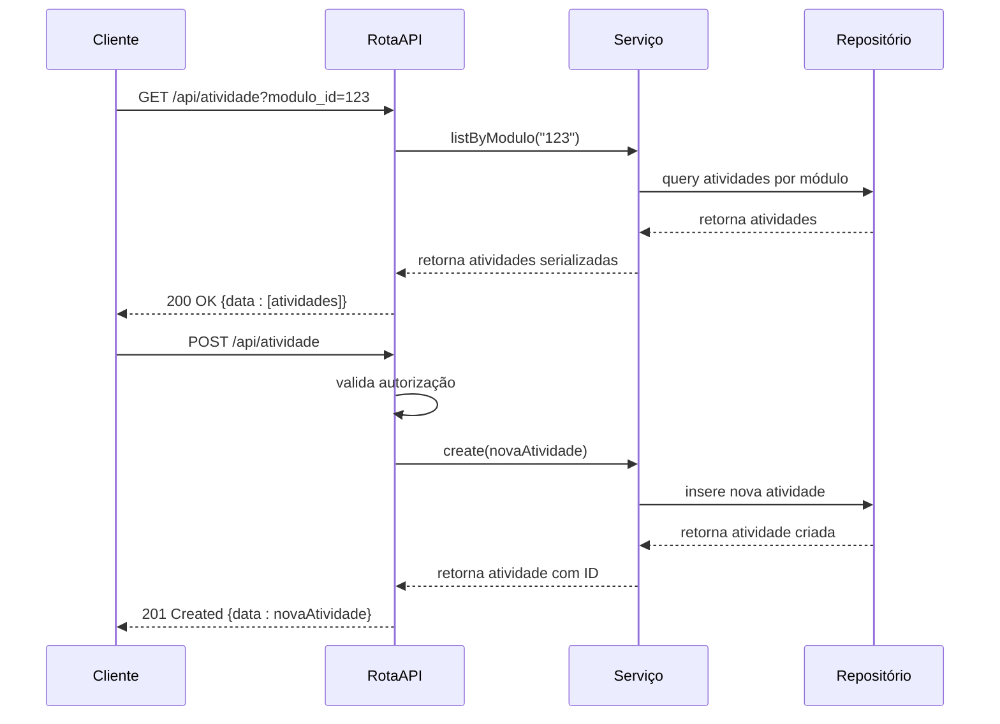
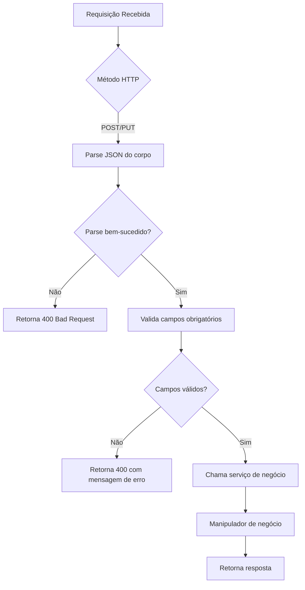
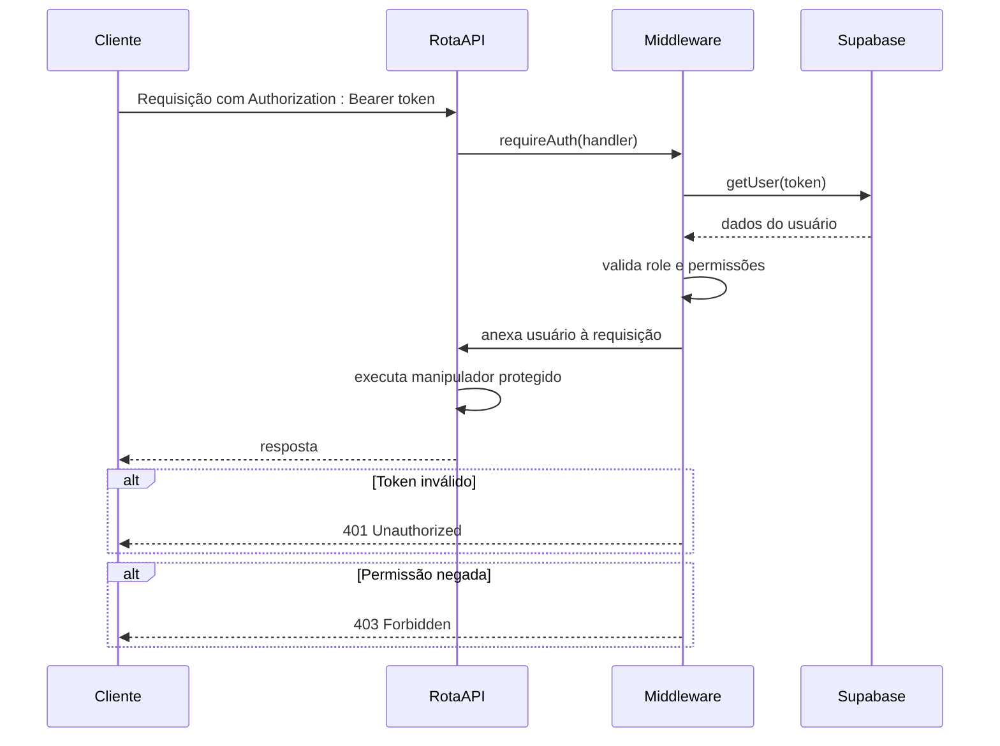
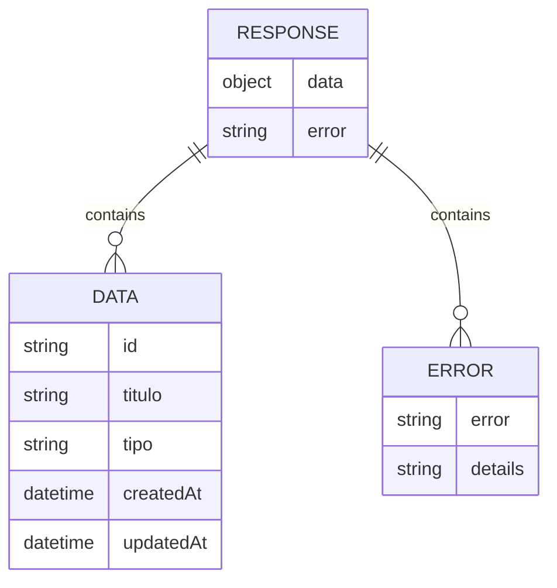
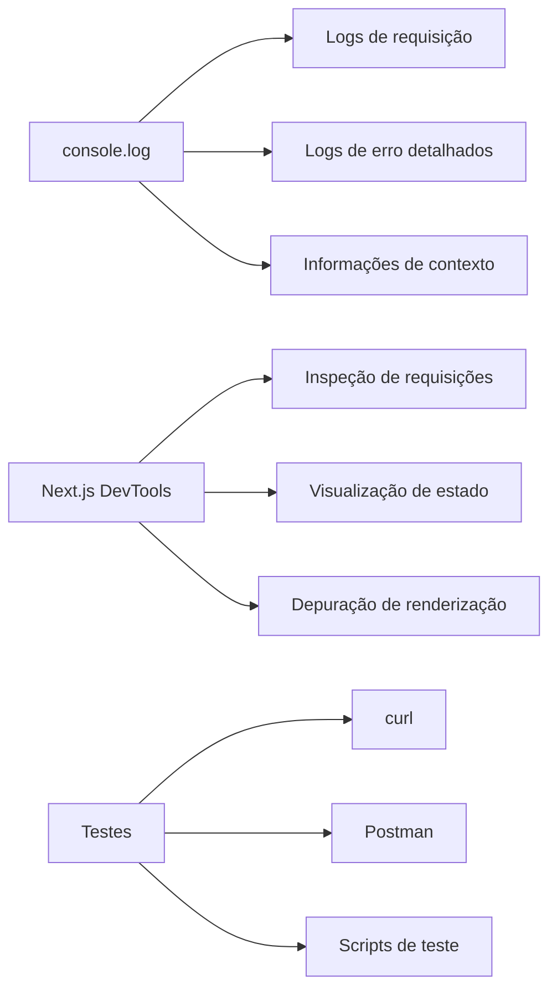

# Criação de Rotas API

<cite>
**Arquivos Referenciados neste Documento**   
- [route.ts](file://app/api/atividade/route.ts)
- [route.ts](file://app/api/atividade/[id]/route.ts)
- [middleware.ts](file://backend/auth/middleware.ts)
- [api-client.ts](file://lib/api-client.ts)
- [atividade.service.ts](file://backend/services/atividade/atividade.service.ts)
- [atividade.types.ts](file://backend/services/atividade/atividade.types.ts)
- [atividade.repository.ts](file://backend/services/atividade/atividade.repository.ts)
</cite>

## Sumário
1. [Introdução](#introdução)
2. [Estrutura de Rotas com App Router](#estrutura-de-rotas-com-app-router)
3. [Manipulação de Métodos HTTP](#manipulação-de-métodos-http)
4. [Validação de Entrada](#validação-de-entrada)
5. [Autenticação e Autorização](#autenticação-e-autorização)
6. [Padrão de Resposta e Serialização](#padrão-de-resposta-e-serialização)
7. [Tratamento de Erros](#tratamento-de-erros)
8. [Rotas Dinâmicas e Aninhadas](#rotas-dinâmicas-e-aninhadas)
9. [Depuração e Testes](#depuração-e-testes)
10. [Conclusão](#conclusão)

## Introdução

Este guia fornece instruções práticas para criar novas rotas API no diretório `app/api/` utilizando o App Router do Next.js. O sistema implementa uma arquitetura robusta com manipulação de requisições HTTP, validação de entrada, autenticação baseada em JWT e API keys, tratamento padronizado de erros e padrões consistentes de resposta. O guia abrange desde a estrutura básica de rotas até funcionalidades avançadas como rotas dinâmicas, middleware de autorização e estratégias de depuração.

**Section sources**
- [route.ts](file://app/api/atividade/route.ts)
- [route.ts](file://app/api/atividade/[id]/route.ts)

## Estrutura de Rotas com App Router

O App Router do Next.js permite criar rotas API através de arquivos `route.ts` em diretórios específicos. Cada arquivo `route.ts` exporta funções nomeadas correspondentes aos métodos HTTP suportados (GET, POST, PUT, DELETE). A estrutura de diretórios define automaticamente o caminho da rota.

```mermaid
graph TB
A[app/api/] --> B[atividade/]
A --> C[auth/]
A --> D[conversations/]
B --> E[route.ts]
B --> F[[id]/]
F --> G[route.ts]
C --> H[signin/]
H --> I[route.ts]
style A fill:#f9f,stroke:#333
style B fill:#bbf,stroke:#333
style C fill:#bbf,stroke:#333
style D fill:#bbf,stroke:#333
style E fill:#dfd,stroke:#333
style F fill:#f96,stroke:#333
style G fill:#dfd,stroke:#333
style H fill:#f96,stroke:#333
style I fill:#dfd,stroke:#333
```

**Diagram sources**
- [route.ts](file://app/api/atividade/route.ts)
- [route.ts](file://app/api/atividade/[id]/route.ts)

**Section sources**
- [route.ts](file://app/api/atividade/route.ts)
- [route.ts](file://app/api/atividade/[id]/route.ts)

## Manipulação de Métodos HTTP

As rotas API implementam manipuladores para diferentes métodos HTTP, exportando funções nomeadas correspondentes. Cada manipulador recebe um objeto `NextRequest` e opcionalmente um contexto com parâmetros de rota.

### Exemplo de Manipulação de Métodos



**Diagram sources**
- [route.ts](file://app/api/atividade/route.ts)
- [atividade.service.ts](file://backend/services/atividade/atividade.service.ts)

**Section sources**
- [route.ts](file://app/api/atividade/route.ts)
- [route.ts](file://app/api/atividade/[id]/route.ts)

## Validação de Entrada

A validação de entrada é implementada tanto com validações manuais quanto com integração de bibliotecas especializadas. O sistema utiliza classes de erro personalizadas para diferentes tipos de falhas de validação.

### Estratégias de Validação



**Diagram sources**
- [route.ts](file://app/api/atividade/route.ts)
- [atividade.service.ts](file://backend/services/atividade/atividade.service.ts)

**Section sources**
- [route.ts](file://app/api/atividade/route.ts)
- [atividade.types.ts](file://backend/services/atividade/atividade.types.ts)

## Autenticação e Autorização

O sistema implementa um sistema de autenticação robusto com suporte a JWT e API keys, utilizando middleware para proteger rotas e verificar permissões de usuário.

### Fluxo de Autenticação



**Diagram sources**
- [middleware.ts](file://backend/auth/middleware.ts)
- [route.ts](file://app/api/atividade/[id]/route.ts)

**Section sources**
- [middleware.ts](file://backend/auth/middleware.ts)
- [route.ts](file://app/api/atividade/[id]/route.ts)

## Padrão de Resposta e Serialização

O sistema utiliza um padrão consistente de resposta com serialização de dados para JSON, garantindo que todos os endpoints retornem uma estrutura uniforme.

### Estrutura de Resposta



**Diagram sources**
- [route.ts](file://app/api/atividade/route.ts)
- [api-client.ts](file://lib/api-client.ts)

**Section sources**
- [route.ts](file://app/api/atividade/route.ts)
- [api-client.ts](file://lib/api-client.ts)

## Tratamento de Erros

O tratamento de erros é padronizado com códigos HTTP apropriados e mensagens descritivas, facilitando a depuração e a experiência do desenvolvedor.

### Mapeamento de Erros

| Tipo de Erro | Código HTTP | Exemplo de Mensagem |
|--------------|-----------|-------------------|
| Validação | 400 | "modulo_id or frente_id query parameter is required" |
| Não Autorizado | 401 | "Unauthorized" |
| Proibido | 403 | "Forbidden" |
| Não Encontrado | 404 | "Atividade não encontrada" |
| Conflito | 409 | "Aluno com este CPF já existe" |
| Erro Interno | 500 | "Internal server error" |

**Section sources**
- [route.ts](file://app/api/atividade/route.ts)
- [atividade.service.ts](file://backend/services/atividade/atividade.service.ts)

## Rotas Dinâmicas e Aninhadas

O sistema suporta rotas dinâmicas com parâmetros entre colchetes (`[id]`) e rotas aninhadas para organizar endpoints relacionados.

### Exemplos de Rotas

```mermaid
graph TD
A[/api/atividade] --> B[GET: Listar atividades]
A --> C[POST: Criar atividade]
D[/api/atividade/[id]] --> E[GET: Obter atividade por ID]
D --> F[PUT: Atualizar atividade]
D --> G[DELETE: Remover atividade]
H[/api/atividade/aluno/[alunoId]] --> I[GET: Listar atividades do aluno]
J[/api/conversations/[id]] --> K[GET: Obter conversa]
J --> L[PUT: Atualizar conversa]
J --> M[DELETE: Remover conversa]
style A fill:#bbf,stroke:#333
style D fill:#f96,stroke:#333
style H fill:#f96,stroke:#333
style J fill:#f96,stroke:#333
```

**Diagram sources**
- [route.ts](file://app/api/atividade/[id]/route.ts)
- [route.ts](file://app/api/atividade/aluno/[alunoId]/route.ts)
- [route.ts](file://app/api/conversations/[id]/route.ts)

**Section sources**
- [route.ts](file://app/api/atividade/[id]/route.ts)
- [route.ts](file://app/api/atividade/aluno/[alunoId]/route.ts)

## Depuração e Testes

O sistema inclui práticas recomendadas para depuração e testes de rotas API, facilitando o desenvolvimento e a manutenção.

### Estratégias de Depuração



**Section sources**
- [route.ts](file://app/api/conversations/[id]/route.ts)
- [api-client.ts](file://lib/api-client.ts)

## Conclusão

A criação de rotas API no sistema segue padrões consistentes e bem definidos, utilizando o App Router do Next.js com arquivos `route.ts`. O sistema implementa autenticação robusta, validação de entrada, tratamento padronizado de erros e padrões consistentes de resposta. As rotas dinâmicas e aninhadas permitem uma organização lógica dos endpoints, enquanto as práticas de depuração e testes facilitam o desenvolvimento e manutenção. Para criar novas rotas, siga os padrões estabelecidos nos exemplos existentes, garantindo consistência e qualidade no código.

**Section sources**
- [route.ts](file://app/api/atividade/route.ts)
- [middleware.ts](file://backend/auth/middleware.ts)
- [api-client.ts](file://lib/api-client.ts)