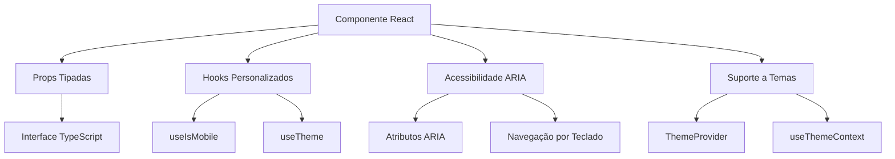
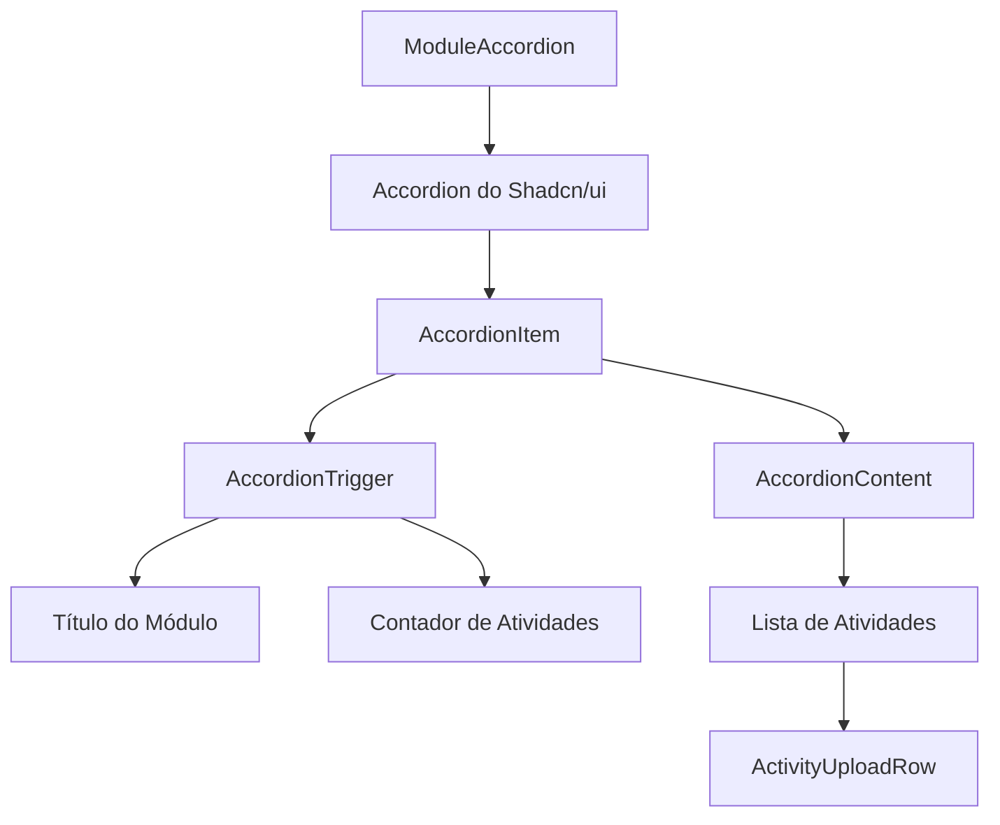

# Desenvolvimento de Componentes React

<cite>
**Arquivos Referenciados neste Documento**  
- [aluno-table.tsx](file://components/aluno-table.tsx)
- [module-accordion.tsx](file://components/module-accordion.tsx)
- [button.tsx](file://components/ui/button.tsx)
- [table.tsx](file://components/ui/table.tsx)
- [accordion.tsx](file://components/ui/accordion.tsx)
- [utils.ts](file://lib/utils.ts)
- [use-mobile.ts](file://hooks/use-mobile.ts)
- [theme-provider.tsx](file://components/providers/theme-provider.tsx)
</cite>

## Sumário
1. [Introdução](#introdução)
2. [Uso do Shadcn/ui como Base](#uso-do-shadcnui-como-base)
3. [Estrutura Recomendada para Componentes](#estrutura-recomendada-para-componentes)
4. [Exemplos de Componentes Funcionais](#exemplos-de-componentes-funcionais)
5. [Utilitários para Classes Condicionais](#utilitários-para-classes-condicionais)
6. [Responsividade com use-mobile.ts](#responsividade-com-use-mobilets)
7. [Diretrizes para Testes de Componentes](#diretrizes-para-testes-de-componentes)
8. [Boas Práticas de Performance](#boas-práticas-de-performance)
9. [Conclusão](#conclusão)

## Introdução
Este documento fornece diretrizes detalhadas para o desenvolvimento de novos componentes React no projeto Área do Aluno. O foco está em utilizar o Shadcn/ui como base, garantir acessibilidade, tipagem rigorosa, suporte a temas e responsividade. Também são abordadas práticas recomendadas para testes e otimização de performance.

## Uso do Shadcn/ui como Base
O projeto utiliza Shadcn/ui como biblioteca de componentes base, que oferece uma coleção de componentes acessíveis, estilizados com Tailwind CSS e facilmente personalizáveis. Os componentes do Shadcn/ui são importados diretamente do diretório `components/ui` e podem ser estendidos ou personalizados conforme necessário.

Os componentes principais utilizados incluem:
- **Botões** com variantes (default, destructive, outline, secondary, ghost, link)
- **Tabelas** com suporte a ordenação, filtragem e paginação
- **Acordiões** para conteúdo expansível
- **Formulários** com validação integrada
- **Diálogos** e **alertas** para interações modais

Esses componentes são projetados para serem acessíveis por padrão, com suporte a ARIA e navegação por teclado.

**Seção fontes**
- [button.tsx](file://components/ui/button.tsx)
- [table.tsx](file://components/ui/table.tsx)
- [accordion.tsx](file://components/ui/accordion.tsx)

## Estrutura Recomendada para Componentes
Ao criar novos componentes, siga a estrutura recomendada abaixo para garantir consistência, acessibilidade e manutenibilidade.

### Props Tipadas
Sempre utilize TypeScript para definir as props dos componentes. Crie interfaces ou tipos que descrevam claramente a estrutura esperada dos dados.

### Uso de Hooks
Utilize hooks personalizados do projeto, como `useIsMobile` para detectar dispositivos móveis e `useTheme` para acessar o tema atual. Isso garante consistência no comportamento do aplicativo.

### Acessibilidade (ARIA)
Todos os componentes devem ser acessíveis por padrão. Utilize atributos ARIA apropriados, rótulos descritivos e suporte a navegação por teclado. Os componentes do Shadcn/ui já incluem boa parte dessas funcionalidades.

### Suporte a Temas
O sistema de temas é implementado através do `ThemeProvider` e do hook `useTheme`. Os componentes devem respeitar o tema atual (claro/escuro) e adaptar sua aparência conforme necessário.



**Fontes do diagrama**
- [use-mobile.ts](file://hooks/use-mobile.ts)
- [theme-provider.tsx](file://components/providers/theme-provider.tsx)

**Seção fontes**
- [use-mobile.ts](file://hooks/use-mobile.ts)
- [theme-provider.tsx](file://components/providers/theme-provider.tsx)

## Exemplos de Componentes Funcionais

### Tabela de Alunos
O componente `AlunoTable` demonstra um exemplo completo de tabela funcional com:
- Ordenação e filtragem de colunas
- Paginação
- Formulários modais para criação e edição
- Diálogos de confirmação para exclusão
- Importação em massa via CSV/XLSX
- Validação de formulários com Zod

O componente utiliza `@tanstack/react-table` para gerenciar o estado da tabela e `react-hook-form` com `zodResolver` para validação de formulários.

### Acordeão de Módulos
O componente `ModuleAccordion` mostra como implementar um acordeão para exibir módulos educacionais com suas atividades. Ele utiliza o componente `Accordion` do Shadcn/ui e inclui:
- Contador de atividades completas
- Listagem de atividades com upload de arquivos
- Suporte a callbacks para notificar sucesso no upload



**Fontes do diagrama**
- [module-accordion.tsx](file://components/module-accordion.tsx)
- [accordion.tsx](file://components/ui/accordion.tsx)

**Seção fontes**
- [aluno-table.tsx](file://components/aluno-table.tsx)
- [module-accordion.tsx](file://components/module-accordion.tsx)

## Utilitários para Classes Condicionais
O utilitário `cn()` importado de `lib/utils.ts` é essencial para combinar classes condicionalmente. Ele combina `clsx` e `tailwind-merge` para garantir que classes do Tailwind CSS sejam mescladas corretamente, evitando conflitos.

```typescript
import { clsx, type ClassValue } from "clsx"
import { twMerge } from "tailwind-merge"

export function cn(...inputs: ClassValue[]) {
  return twMerge(clsx(inputs))
}
```

Utilize `cn()` sempre que precisar combinar classes dinamicamente, especialmente quando algumas classes são condicionais.

**Seção fontes**
- [utils.ts](file://lib/utils.ts)

## Responsividade com use-mobile.ts
O hook `useIsMobile` detecta dispositivos móveis com base no breakpoint definido (640px). Ele utiliza `window.matchMedia` para monitorar mudanças no tamanho da tela.

```typescript
const MOBILE_BREAKPOINT = 640

export function useIsMobile() {
  const [isMobile, setIsMobile] = React.useState<boolean | undefined>(undefined)

  React.useEffect(() => {
    const mql = window.matchMedia(`(max-width: ${MOBILE_BREAKPOINT - 1}px)`)
    const onChange = () => {
      setIsMobile(window.innerWidth < MOBILE_BREAKPOINT)
    }
    mql.addEventListener("change", onChange)
    setIsMobile(window.innerWidth < MOBILE_BREAKPOINT)
    return () => mql.removeEventListener("change", onChange)
  }, [])

  return !!isMobile
}
```

Utilize este hook para adaptar o layout e comportamento dos componentes em dispositivos móveis.

**Seção fontes**
- [use-mobile.ts](file://hooks/use-mobile.ts)

## Diretrizes para Testes de Componentes
Para garantir a qualidade dos componentes, siga estas diretrizes de teste com React Testing Library:

1. **Teste a renderização básica**: Verifique se o componente renderiza corretamente com props padrão
2. **Teste interações**: Simule cliques, digitação e outras interações do usuário
3. **Teste acessibilidade**: Use `@testing-library/jest-dom` para verificar atributos ARIA
4. **Teste estados**: Verifique diferentes estados do componente (carregamento, erro, sucesso)
5. **Teste responsividade**: Simule diferentes tamanhos de tela quando aplicável

Utilize mocks para chamadas de API e dependências externas para testes isolados.

## Boas Práticas de Performance

### Memoização
Utilize `React.memo` para componentes que renderizam frequentemente com as mesmas props, evitando re-renderizações desnecessárias.

### Lazy Loading
Carregue componentes pesados ou que não são imediatamente necessários com `React.lazy` e `Suspense`.

### Evitação de Re-renderizações
- Utilize callbacks memorizados com `useCallback`
- Utilize valores memorizados com `useMemo`
- Evite criar objetos ou funções novos em cada renderização
- Separe componentes para limitar o escopo das atualizações

Estas práticas garantem que o aplicativo permaneça responsivo mesmo com grandes volumes de dados.

## Conclusão
O desenvolvimento de componentes no projeto Área do Aluno deve seguir padrões consistentes de tipagem, acessibilidade, responsividade e performance. Ao utilizar o Shadcn/ui como base e seguir as diretrizes apresentadas, os desenvolvedores podem criar componentes de alta qualidade que se integram perfeitamente ao sistema existente.