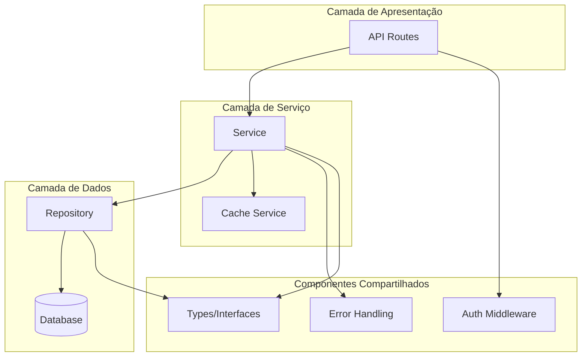
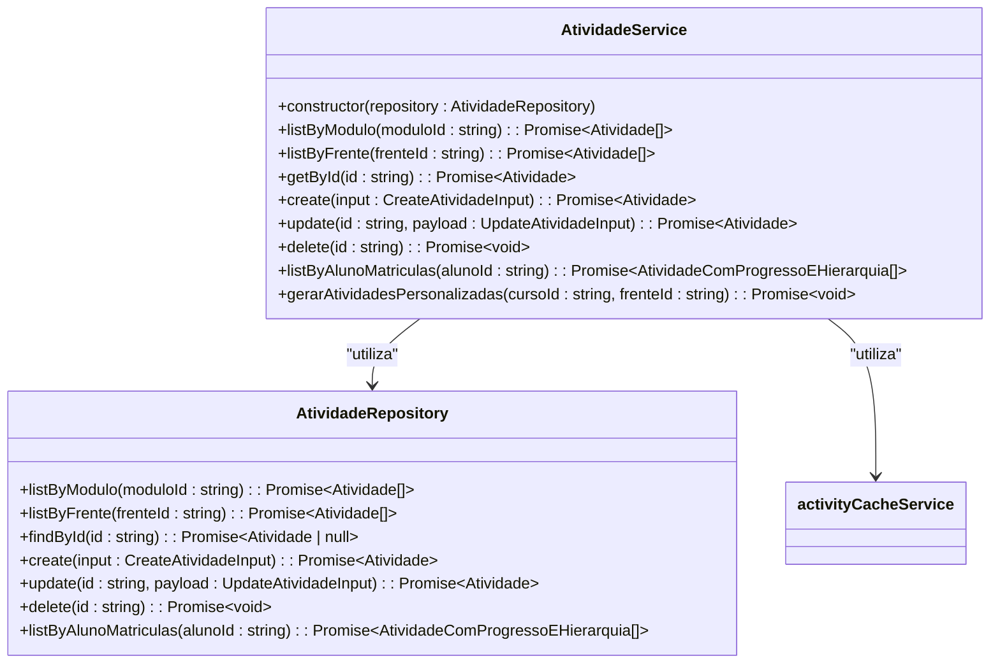

# Desenvolvimento de Serviços Backend

<cite>
**Arquivos Referenciados neste Documento**  
- [atividade.service.ts](file://backend/services/atividade/atividade.service.ts)
- [atividade.repository.ts](file://backend/services/atividade/atividade.repository.ts)
- [atividade.types.ts](file://backend/services/atividade/atividade.types.ts)
- [errors.ts](file://backend/services/atividade/errors.ts)
- [index.ts](file://backend/services/atividade/index.ts)
- [activity-cache.service.ts](file://backend/services/cache/activity-cache.service.ts)
- [middleware.ts](file://backend/auth/middleware.ts)
- [route.ts](file://app/api/atividade/route.ts)
- [route.ts](file://app/api/atividade/[id]/route.ts)
- [route.ts](file://app/api/atividade/aluno/[alunoId]/route.ts)
- [route.ts](file://app/api/atividade/gerar-estrutura/route.ts)
- [cache.service.ts](file://backend/services/cache/cache.service.ts)
- [types.ts](file://backend/auth/types.ts)
</cite>

## Sumário
1. [Introdução](#introdução)
2. [Estrutura Modular de Serviços Backend](#estrutura-modular-de-serviços-backend)
3. [Criação de Tipos (Interface de Domínio)](#criação-de-tipos-interface-de-domínio)
4. [Implementação do Serviço (Lógica de Negócio)](#implementação-do-serviço-lógica-de-negócio)
5. [Repositório (Acesso ao Banco de Dados)](#repositório-acesso-ao-banco-de-dados)
6. [Tratamento de Erros](#tratamento-de-erros)
7. [Registro do Serviço no index.ts](#registro-do-serviço-no-indexts)
8. [Middleware de Autenticação e Autorização](#middleware-de-autenticação-e-autorização)
9. [Integração com Cache Distribuído (Redis)](#integração-com-cache-distribuído-redis)
10. [Testes Unitários e de Integração](#testes-unitários-e-de-integração)
11. [Boas Práticas](#boas-práticas)

## Introdução

Este documento fornece um guia detalhado para a criação e estruturação de novos serviços backend no projeto Área do Aluno. O sistema adota uma arquitetura modular que separa claramente as responsabilidades entre tipos, serviços, repositórios e tratamento de erros. O documento utiliza o serviço de 'atividade' como exemplo prático para ilustrar os padrões e boas práticas implementados no projeto. Também aborda aspectos cruciais como autenticação, autorização por papéis, integração com cache distribuído e testes.

## Estrutura Modular de Serviços Backend

A arquitetura do projeto Área do Aluno é baseada em uma estrutura modular que promove a separação de preocupações e a reutilização de código. Cada serviço backend é organizado em um diretório específico dentro de `backend/services/`, contendo arquivos especializados que implementam diferentes camadas da aplicação. Esta abordagem facilita a manutenção, testes e escalabilidade do sistema.



**Fontes do Diagrama**  
- [atividade.service.ts](file://backend/services/atividade/atividade.service.ts#L1-L274)
- [atividade.repository.ts](file://backend/services/atividade/atividade.repository.ts#L1-L199)
- [route.ts](file://app/api/atividade/route.ts#L1-L83)

## Criação de Tipos (Interface de Domínio)

Os tipos definem a interface de domínio do sistema e são implementados no arquivo `atividade.types.ts`. Eles representam as entidades do negócio e garantem consistência nos dados entre diferentes camadas da aplicação.

### Tipos Principais

O arquivo define vários tipos que representam as entidades do domínio:

- **TipoAtividade**: Enumera os diferentes tipos de atividades disponíveis no sistema
- **Atividade**: Interface principal que representa uma atividade com seus atributos básicos
- **CreateAtividadeInput** e **UpdateAtividadeInput**: Interfaces para validação de entrada nas operações de criação e atualização
- **AtividadeComProgressoEHierarquia**: Interface expandida que inclui informações de progresso e hierarquia (curso, disciplina, frente, módulo)

### Funções de Ajuda

O arquivo também inclui funções utilitárias como `atividadeRequerDesempenho`, que determina se um tipo de atividade exige um check qualificado (avaliação de desempenho) com base em seu tipo.

**Fontes da Seção**  
- [atividade.types.ts](file://backend/services/atividade/atividade.types.ts#L1-L76)

## Implementação do Serviço (Lógica de Negócio)

O serviço `AtividadeService` implementa a lógica de negócio principal do domínio de atividades. Ele coordena as operações entre o repositório, o cache e outros serviços, aplicando as regras de negócio e garantindo a integridade dos dados.

### Principais Funcionalidades

O serviço implementa várias operações essenciais:

- **Listagem de atividades**: Métodos para listar atividades por módulo ou frente
- **CRUD completo**: Criação, leitura, atualização e exclusão de atividades
- **Geração de atividades personalizadas**: Lógica complexa para gerar atividades baseadas em regras de curso
- **Validação de entrada**: Verificação de dados antes da persistência
- **Gerenciamento de cache**: Invalidação de cache após operações de escrita

### Padrão de Projeto

O serviço utiliza o padrão de injeção de dependências, recebendo o repositório no construtor. Isso promove testabilidade e desacoplamento entre as camadas.



**Fontes do Diagrama**  
- [atividade.service.ts](file://backend/services/atividade/atividade.service.ts#L18-L274)
- [atividade.repository.ts](file://backend/services/atividade/atividade.repository.ts#L10-L18)

**Fontes da Seção**  
- [atividade.service.ts](file://backend/services/atividade/atividade.service.ts#L1-L274)

## Repositório (Acesso ao Banco de Dados)

O repositório `AtividadeRepositoryImpl` é responsável pelo acesso direto ao banco de dados, implementando operações CRUD utilizando o cliente Supabase. Ele atua como uma camada de abstração entre o serviço e o banco de dados.

### Principais Características

- **Interface definida**: O repositório implementa uma interface clara com métodos específicos
- **Mapeamento de dados**: Converte entre o formato do banco de dados e as entidades do domínio
- **Consulta otimizada**: Utiliza ordenação e filtros para otimizar as consultas
- **Tratamento de erros**: Captura e trata erros de banco de dados de forma consistente

### Operações Implementadas

O repositório fornece métodos para todas as operações de persistência necessárias:

- Listagem de atividades por módulo ou frente
- Busca por ID
- Criação, atualização e exclusão de atividades
- Listagem de atividades com progresso do aluno

**Fontes da Seção**  
- [atividade.repository.ts](file://backend/services/atividade/atividade.repository.ts#L1-L199)

## Tratamento de Erros

O sistema implementa um tratamento de erros padronizado através do arquivo `errors.ts`, que define classes de erro específicas para o domínio de atividades.

### Classes de Erro

- **AtividadeNotFoundError**: Lançado quando uma atividade não é encontrada
- **AtividadeValidationError**: Lançado quando os dados de entrada são inválidos
- **AtividadeConflictError**: Lançado quando ocorre um conflito (por exemplo, duplicação)

Essas classes estendem a classe Error do JavaScript e definem um nome específico, facilitando a identificação e o tratamento dos erros nas camadas superiores.

**Fontes da Seção**  
- [errors.ts](file://backend/services/atividade/errors.ts#L1-L24)

## Registro do Serviço no index.ts

O arquivo `index.ts` no diretório do serviço é responsável por exportar o serviço e gerenciar sua instância única (padrão singleton).

### Implementação do Singleton

O arquivo implementa um padrão de inicialização preguiçosa (lazy initialization) para criar uma única instância do serviço:

```typescript
let _atividadeService: AtividadeService | null = null;

function getAtividadeService(): AtividadeService {
  if (!_atividadeService) {
    const databaseClient = getDatabaseClient();
    const repository = new AtividadeRepositoryImpl(databaseClient);
    _atividadeService = new AtividadeService(repository);
  }
  return _atividadeService;
}
```

### Proxy para Exportação

O serviço é exportado como um proxy, permitindo que os consumidores acessem seus métodos diretamente sem precisar chamar `getAtividadeService()` explicitamente:

```typescript
export const atividadeService = new Proxy({} as AtividadeService, {
  get(_target, prop) {
    return getAtividadeService()[prop as keyof AtividadeService];
  },
});
```

Além disso, o arquivo exporta todos os tipos, interfaces e erros do serviço, facilitando o uso em outros módulos.

**Fontes da Seção**  
- [index.ts](file://backend/services/atividade/index.ts#L1-L29)

## Middleware de Autenticação e Autorização

O sistema utiliza um middleware de autenticação robusto implementado em `middleware.ts` para proteger as rotas da API.

### Autenticação por JWT

O middleware suporta autenticação via JWT (JSON Web Token) enviado no cabeçalho Authorization:

```typescript
async function getAuthUser(request: NextRequest): Promise<AuthUser | null> {
  const authHeader = request.headers.get('authorization');
  
  if (!authHeader || !authHeader.startsWith('Bearer ')) {
    return null;
  }
  
  const token = authHeader.substring(7);
  // Validação do token com Supabase Auth
}
```

### Autorização por Papéis

O sistema implementa autorização baseada em papéis (RBAC - Role-Based Access Control) com três papéis principais:

- **aluno**: Acesso limitado às suas próprias atividades
- **professor**: Acesso para gerenciar atividades e conteúdos
- **superadmin**: Acesso completo ao sistema

O middleware fornece funções de autorização específicas:

- `requireAuth`: Exige autenticação (qualquer usuário autenticado)
- `requireRole(role)`: Exige um papel específico
- `requireSuperAdmin`: Exige papel de superadmin

### Exemplo de Uso em Rotas

As rotas da API utilizam o middleware para proteger operações sensíveis:

```typescript
export const POST = requireAuth(postHandler);
```

No manipulador, verifica-se o papel do usuário para determinar as permissões:

```typescript
if (request.user && request.user.role !== 'professor' && request.user.role !== 'superadmin') {
  return NextResponse.json({ error: 'Forbidden' }, { status: 403 });
}
```

**Fontes da Seção**  
- [middleware.ts](file://backend/auth/middleware.ts#L1-L193)
- [types.ts](file://backend/auth/types.ts#L1-L36)
- [route.ts](file://app/api/atividade/route.ts#L59-L83)

## Integração com Cache Distribuído (Redis)

O sistema integra um cache distribuído usando Redis (via Upstash) para melhorar o desempenho das operações frequentes.

### Arquitetura de Cache

O sistema implementa uma arquitetura de cache em duas camadas:

1. **CacheService**: Serviço genérico que abstrai o acesso ao Redis
2. **Servicos Específicos**: Serviços especializados como `activityCacheService`

### Implementação do CacheService

O `CacheService` fornece uma interface simples para operações de cache:

- `get(key)`: Obtém um valor do cache
- `set(key, value, ttl)`: Armazena um valor com TTL (Time To Live)
- `del(key)`: Remove um valor do cache
- `getOrSet(key, fetcher, ttl)`: Padrão cache-aside (obter do cache ou calcular)

O serviço inclui tratamento de fallback para quando o Redis não está configurado, garantindo que o sistema continue funcionando.

### Serviço de Cache de Atividades

O `activityCacheService` é um serviço especializado que gerencia o cache de atividades:

- **Chave de cache**: `cache:modulo:${moduloId}:atividades`
- **TTL**: 30 minutos (1800 segundos)
- **Invalidação**: Automática após operações de escrita (create, update, delete)

O serviço de atividades utiliza o cache para operações de leitura frequentes:

```typescript
async listByModulo(moduloId: string): Promise<Atividade[]> {
  const cached = await activityCacheService.getActivitiesByModulo(moduloId);
  // ...
}
```

Após qualquer operação de escrita, o cache é invalidado:

```typescript
async create(input: CreateAtividadeInput): Promise<Atividade> {
  // ...
  await activityCacheService.invalidateModulo(input.moduloId);
  // ...
}
```

**Fontes da Seção**  
- [activity-cache.service.ts](file://backend/services/cache/activity-cache.service.ts#L1-L103)
- [cache.service.ts](file://backend/services/cache/cache.service.ts#L1-L189)
- [atividade.service.ts](file://backend/services/atividade/atividade.service.ts#L21-L40)

## Testes Unitários e de Integração

O projeto implementa testes abrangentes para garantir a qualidade do código. Os testes estão localizados no diretório `backend/swagger/` com o padrão `*.spec.ts`.

### Estratégia de Testes

Embora os arquivos de teste específicos não tenham sido analisados em detalhe, a estrutura do projeto sugere uma abordagem de testes baseada em:

- **Testes de integração**: Verificando a integração entre diferentes componentes
- **Testes de API**: Validando os endpoints da API
- **Testes de serviço**: Verificando a lógica de negócio dos serviços

### Boas Práticas de Testes

Com base na arquitetura do sistema, as seguintes práticas são recomendadas:

- Testar os serviços de forma isolada, mockando as dependências (repositório, cache)
- Testar os repositórios com um banco de dados de teste
- Testar os middlewares de autenticação com diferentes cenários de usuário
- Testar a integração com o cache em diferentes cenários (hit, miss, invalidação)

**Fontes da Seção**  
- [index.ts](file://backend/swagger/index.ts#L1-L86)

## Boas Práticas

O projeto implementa várias boas práticas de desenvolvimento de software que devem ser seguidas ao criar novos serviços.

### Validação de Entrada

Todos os serviços devem validar rigorosamente os dados de entrada antes de processá-los:

```typescript
if (!input.moduloId || !input.moduloId.trim()) {
  throw new AtividadeValidationError('modulo_id is required');
}
```

### Logging

O sistema utiliza console.log para registrar eventos importantes, especialmente no serviço de cache:

```typescript
console.log('[Cache Service] ✅ Redis configurado - cache habilitado');
```

### Tratamento de Erros Padronizado

O sistema utiliza classes de erro específicas para cada domínio, facilitando o tratamento e a identificação de problemas:

```typescript
export class AtividadeValidationError extends Error {
  constructor(message: string) {
    super(message);
    this.name = 'AtividadeValidationError';
  }
}
```

### Separação de Preocupações

A arquitetura modular garante que cada componente tenha uma responsabilidade clara:

- **Types**: Definição de interfaces e tipos
- **Service**: Lógica de negócio
- **Repository**: Acesso ao banco de dados
- **Errors**: Tratamento de erros específicos do domínio

### Reutilização de Código

O sistema promove a reutilização de código através de:

- Serviços compartilhados (cache, autenticação)
- Tipos e interfaces compartilhadas
- Funções utilitárias

Ao seguir estas boas práticas, os novos serviços integrarão-se harmoniosamente com o sistema existente, garantindo consistência, manutenibilidade e qualidade de código.

**Fontes da Seção**  
- [atividade.service.ts](file://backend/services/atividade/atividade.service.ts#L51-L59)
- [errors.ts](file://backend/services/atividade/errors.ts#L1-L24)
- [cache.service.ts](file://backend/services/cache/cache.service.ts#L29-L32)