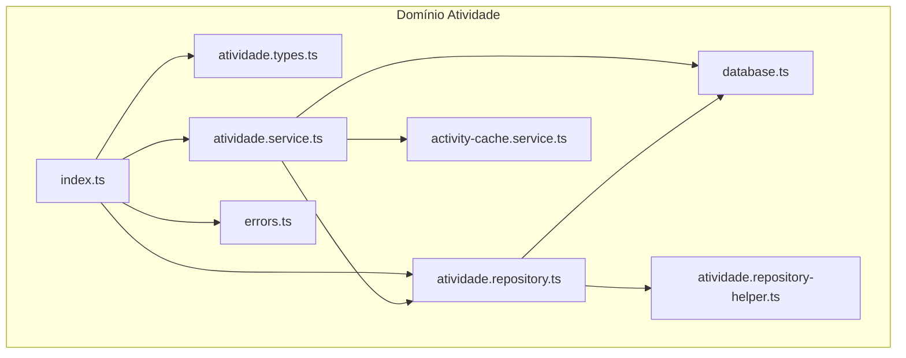
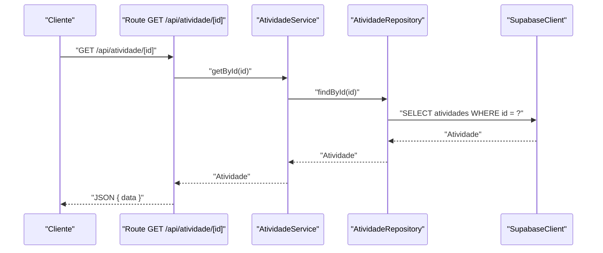
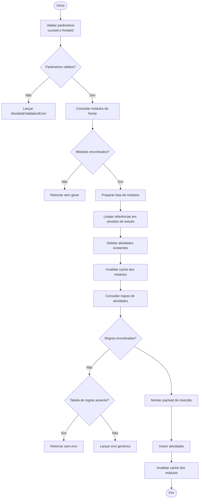
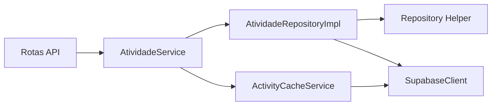

# Estrutura de um Serviço Backend

<cite>
**Arquivos Referenciados neste Documento**
- [atividade.types.ts](file://backend/services/atividade/atividade.types.ts)
- [atividade.service.ts](file://backend/services/atividade/atividade.service.ts)
- [atividade.repository.ts](file://backend/services/atividade/atividade.repository.ts)
- [atividade.repository-helper.ts](file://backend/services/atividade/atividade.repository-helper.ts)
- [errors.ts](file://backend/services/atividade/errors.ts)
- [index.ts](file://backend/services/atividade/index.ts)
- [activity-cache.service.ts](file://backend/services/cache/activity-cache.service.ts)
- [database.ts](file://backend/clients/database.ts)
- [atividade [id] route.ts](file://app/api/atividade/[id]/route.ts)
- [atividade aluno [alunoId] route.ts](file://app/api/atividade/aluno/[alunoId]/route.ts)
- [atividade gerar-estrutura route.ts](file://app/api/atividade/gerar-estrutura/route.ts)
</cite>

## Sumário
Este documento apresenta a estrutura modular de um serviço backend no projeto Área do Aluno, com foco no serviço de “atividade”. Ele explica o padrão de organização por domínio: definição de tipos (types.ts) com interfaces de entidades e DTOs, implementação da lógica de negócio no service.ts, acesso ao banco de dados no repository.ts, e tratamento padronizado de erros em errors.ts. Utiliza o serviço de atividade como exemplo prático, documentando as responsabilidades de cada camada e como a separação de preocupações facilita manutenção e testes. Também aborda boas práticas como tipagem rigorosa, validação de entrada e uso de enums para estados, além de como os erros personalizados são lançados e capturados entre camadas.

## Introdução
O backend do projeto Área do Aluno adota um padrão de organização modular por domínio. Cada domínio (ex: atividade) é representado por uma pasta contendo:
- Tipos e DTOs (types.ts)
- Lógica de negócio (service.ts)
- Acesso a dados (repository.ts)
- Tratamento de erros (errors.ts)
- Ponto de entrada consolidado (index.ts)

Essa estrutura permite uma divisão clara de responsabilidades, facilita testes unitários e integração, e melhora a manutenção ao longo do tempo.

## Estrutura de Pastas do Domínio Atividade
A pasta do domínio atividade organiza os arquivos conforme o padrão descrito acima. A seguir, vemos o diagrama de dependências entre os principais arquivos do domínio.

**Diagrama fontes**
- [atividade.types.ts](file://backend/services/atividade/atividade.types.ts#L1-L76)
- [atividade.service.ts](file://backend/services/atividade/atividade.service.ts#L1-L274)
- [atividade.repository.ts](file://backend/services/atividade/atividade.repository.ts#L1-L199)
- [atividade.repository-helper.ts](file://backend/services/atividade/atividade.repository-helper.ts#L1-L282)
- [errors.ts](file://backend/services/atividade/errors.ts#L1-L24)
- [index.ts](file://backend/services/atividade/index.ts#L1-L29)
- [activity-cache.service.ts](file://backend/services/cache/activity-cache.service.ts#L1-L103)
- [database.ts](file://backend/clients/database.ts#L1-L43)

**Seção fontes**
- [atividade.types.ts](file://backend/services/atividade/atividade.types.ts#L1-L76)
- [atividade.service.ts](file://backend/services/atividade/atividade.service.ts#L1-L274)
- [atividade.repository.ts](file://backend/services/atividade/atividade.repository.ts#L1-L199)
- [atividade.repository-helper.ts](file://backend/services/atividade/atividade.repository-helper.ts#L1-L282)
- [errors.ts](file://backend/services/atividade/errors.ts#L1-L24)
- [index.ts](file://backend/services/atividade/index.ts#L1-L29)
- [activity-cache.service.ts](file://backend/services/cache/activity-cache.service.ts#L1-L103)
- [database.ts](file://backend/clients/database.ts#L1-L43)

## Tipagem e DTOs (types.ts)
O arquivo de tipos define:
- Enumeração de tipos de atividade
- Interfaces de entidade e DTOs de criação/atualização
- Tipos auxiliares para retornos com progresso e hierarquia

Principais elementos:
- Enumeração de tipos de atividade com valores restritos
- Interface Atividade com campos de metadados e timestamps
- DTOs CreateAtividadeInput e UpdateAtividadeInput
- Interface AtividadeComProgressoEHierarquia com dados de progresso e hierarquia
- Função utilitária atividadeRequerDesempenho

Boas práticas evidenciadas:
- Tipagem rigorosa com union types para estados
- Uso de interfaces para DTOs de entrada e saída
- Separação entre entidade e DTOs de transferência

**Seção fontes**
- [atividade.types.ts](file://backend/services/atividade/atividade.types.ts#L1-L76)

## Camada de Lógica de Negócio (service.ts)
Responsabilidades:
- Validação de entradas e regras de negócio
- Orquestração de chamadas ao repositório e ao cache
- Geração de estruturas personalizadas de atividades com base em regras
- Tratamento de erros específicos e lançamento de exceções personalizadas

Detalhes importantes:
- listByModulo: utiliza cache de atividades por módulo e converte dados para o formato Atividade
- getById: garante que a atividade existe antes de retornar
- create/update/delete: validações de campos obrigatórios e atualização de cache
- listByAlunoMatriculas: delega para um helper que monta dados hierárquicos e progresso
- gerarAtividadesPersonalizadas: implementa regras complexas de geração de atividades personalizadas, com tratamento de erro específico para ausência da tabela de regras

Boas práticas:
- Validação de entrada com mensagens claras
- Uso de exceptions personalizadas (AtividadeNotFoundError, AtividadeValidationError)
- Invalidation de cache após operações de escrita
- Separação de lógica complexa em helpers

**Seção fontes**
- [atividade.service.ts](file://backend/services/atividade/atividade.service.ts#L1-L274)

## Camada de Acesso a Dados (repository.ts)
Responsabilidades:
- Definição de contrato de repositório (interface)
- Implementação concreta de operações CRUD
- Mapeamento de linhas de banco para entidades
- Chamadas ao cliente Supabase

Detalhes:
- Interface AtividadeRepository com métodos de listagem, busca, criação, atualização e exclusão
- Implementação AtividadeRepositoryImpl com selects, inserts, updates e deletes
- Mapeamento de rows para entidades com conversão de datas
- Uso de helper para consultas complexas de atividades por aluno

Boas práticas:
- Centralização de erros de acesso a dados em exceptions genéricas
- Mapeamento explícito de campos e tipos
- Separação de lógica complexa em helpers

**Seção fontes**
- [atividade.repository.ts](file://backend/services/atividade/atividade.repository.ts#L1-L199)

## Helpers de Consulta Complexa (repository-helper.ts)
Responsabilidades:
- Montagem de consultas complexas para atividades de um aluno
- Junção de tabelas (cursos, disciplinas, frentes, módulos, atividades)
- Retorno de dados com progresso e informações hierárquicas

Detalhes:
- Consulta sequencial de cursos, disciplinas, frentes e módulos
- Busca de atividades associadas e progresso do aluno
- Mapeamento de resultados para AtividadeComProgressoEHierarquia
- Ordenação final por curso, disciplina, frente e número de módulo

**Seção fontes**
- [atividade.repository-helper.ts](file://backend/services/atividade/atividade.repository-helper.ts#L1-L282)

## Tratamento de Erros (errors.ts)
Definição de exceptions personalizadas:
- AtividadeNotFoundError: lançada quando uma atividade não é encontrada
- AtividadeValidationError: usada para erros de validação de entrada
- AtividadeConflictError: disponível para conflitos de negócio

Benefícios:
- Padronização do tratamento de erros entre camadas
- Facilita testes e debugging com nomes de erro claros

**Seção fontes**
- [errors.ts](file://backend/services/atividade/errors.ts#L1-L24)

## Ponto de Entrada Consolidado (index.ts)
Responsabilidades:
- Criação e cache do serviço atividadeService
- Exportação consolidada de types, service, repository e errors
- Uso de Proxy para expor métodos do serviço

Benefícios:
- Facilita importações em outras partes do sistema
- Garante instância única do serviço

**Seção fontes**
- [index.ts](file://backend/services/atividade/index.ts#L1-L29)

## Integração com Camada de API (rotas)
As rotas da API interagem com o serviço atividade e tratam erros personalizados:
- Rota GET /api/atividade/[id]: busca atividade por ID e serializa resposta
- Rota PATCH/DELETE /api/atividade/[id]: atualiza ou remove atividade com autenticação
- Rota GET /api/atividade/aluno/[alunoId]: lista atividades do aluno com permissões
- Rota POST /api/atividade/gerar-estrutura: gera estrutura personalizada com base em regras

Fluxo típico de uma requisição GET /api/atividade/[id]:

**Diagrama fontes**
- [atividade [id] route.ts](file://app/api/atividade/[id]/route.ts#L1-L99)
- [atividade.service.ts](file://backend/services/atividade/atividade.service.ts#L1-L274)
- [atividade.repository.ts](file://backend/services/atividade/atividade.repository.ts#L1-L199)
- [database.ts](file://backend/clients/database.ts#L1-L43)

**Seção fontes**
- [atividade [id] route.ts](file://app/api/atividade/[id]/route.ts#L1-L99)
- [atividade aluno [alunoId] route.ts](file://app/api/atividade/aluno/[alunoId]/route.ts#L1-L82)
- [atividade gerar-estrutura route.ts](file://app/api/atividade/gerar-estrutura/route.ts#L1-L57)

## Exemplo Prático: Serviço de Atividade
Aqui estão os principais pontos de implementação do domínio atividade:

- Tipagem e DTOs:
  - [Tipos de atividade e interfaces](file://backend/services/atividade/atividade.types.ts#L1-L76)

- Lógica de negócio:
  - [Validações e regras de negócio](file://backend/services/atividade/atividade.service.ts#L1-L274)

- Acesso a dados:
  - [Interface e implementação do repositório](file://backend/services/atividade/atividade.repository.ts#L1-L199)
  - [Helper de consulta complexa](file://backend/services/atividade/atividade.repository-helper.ts#L1-L282)

- Tratamento de erros:
  - [Exceptions personalizadas](file://backend/services/atividade/errors.ts#L1-L24)

- Integração com API:
  - [Rota GET /api/atividade/[id]](file://app/api/atividade/[id]/route.ts#L1-L99)
  - [Rota GET /api/atividade/aluno/[alunoId]](file://app/api/atividade/aluno/[alunoId]/route.ts#L1-L82)
  - [Rota POST /api/atividade/gerar-estrutura](file://app/api/atividade/gerar-estrutura/route.ts#L1-L57)

## Boas Práticas Aplicadas
- Tipagem rigorosa:
  - Uso de union types para estados de atividade
  - Interfaces bem definidas para DTOs
  - [Tipos de atividade e DTOs](file://backend/services/atividade/atividade.types.ts#L1-L76)

- Validação de entrada:
  - Validação de campos obrigatórios nos métodos create/update
  - [Validações no service](file://backend/services/atividade/atividade.service.ts#L1-L274)

- Uso de enums para estados:
  - Enumeração de tipos de atividade
  - [Enumeração de tipos](file://backend/services/atividade/atividade.types.ts#L1-L12)

- Tratamento padronizado de erros:
  - Exceptions personalizadas e captura em rotas
  - [Erros personalizados](file://backend/services/atividade/errors.ts#L1-L24)
  - [Tratamento de erros nas rotas](file://app/api/atividade/[id]/route.ts#L1-L99)

- Cache de leitura:
  - Uso de cache para estrutura de atividades por módulo
  - [Cache de atividades](file://backend/services/cache/activity-cache.service.ts#L1-L103)

## Fluxo de Geração de Atividades Personalizadas
O método gerarAtividadesPersonalizadas demonstra uma lógica complexa de negócio com validações e tratamento de erros:

**Diagrama fontes**
- [atividade.service.ts](file://backend/services/atividade/atividade.service.ts#L120-L263)

**Seção fontes**
- [atividade.service.ts](file://backend/services/atividade/atividade.service.ts#L120-L263)

## Dependências e Acoplamento
- O service depende do repository e do cache
- O repository depende do cliente de banco
- As rotas dependem do serviço e tratam erros personalizados
- O helper de repository depende do cliente de banco

**Diagrama fontes**
- [atividade [id] route.ts](file://app/api/atividade/[id]/route.ts#L1-L99)
- [atividade.service.ts](file://backend/services/atividade/atividade.service.ts#L1-L274)
- [atividade.repository.ts](file://backend/services/atividade/atividade.repository.ts#L1-L199)
- [atividade.repository-helper.ts](file://backend/services/atividade/atividade.repository-helper.ts#L1-L282)
- [activity-cache.service.ts](file://backend/services/cache/activity-cache.service.ts#L1-L103)
- [database.ts](file://backend/clients/database.ts#L1-L43)

**Seção fontes**
- [atividade [id] route.ts](file://app/api/atividade/[id]/route.ts#L1-L99)
- [atividade.service.ts](file://backend/services/atividade/atividade.service.ts#L1-L274)
- [atividade.repository.ts](file://backend/services/atividade/atividade.repository.ts#L1-L199)
- [atividade.repository-helper.ts](file://backend/services/atividade/atividade.repository-helper.ts#L1-L282)
- [activity-cache.service.ts](file://backend/services/cache/activity-cache.service.ts#L1-L103)
- [database.ts](file://backend/clients/database.ts#L1-L43)

## Considerações de Desempenho
- Cache de leitura: o cache de atividades por módulo reduz o número de consultas ao banco
- Invalidação de cache: após operações de escrita, o cache é invalidado para manter consistência
- Consultas complexas: o helper de atividades do aluno faz várias joins, mas são otimizadas com selects específicos

**Seção fontes**
- [activity-cache.service.ts](file://backend/services/cache/activity-cache.service.ts#L1-L103)
- [atividade.service.ts](file://backend/services/atividade/atividade.service.ts#L1-L274)
- [atividade.repository-helper.ts](file://backend/services/atividade/atividade.repository-helper.ts#L1-L282)

## Guia de Troubleshooting
- Erros de validação:
  - Verifique se campos obrigatórios estão presentes e formatados corretamente
  - [Validações no service](file://backend/services/atividade/atividade.service.ts#L1-L274)

- Erros de regras de atividades:
  - Se a tabela regras_atividades não existir, o serviço retorna silenciosamente
  - [Verificação de ausência de tabela](file://backend/services/atividade/atividade.service.ts#L120-L199)

- Erros de acesso ao banco:
  - O repositório lança erros genéricos com mensagens descritivas
  - [Tratamento de erros no repository](file://backend/services/atividade/atividade.repository.ts#L1-L199)

- Erros de cache:
  - Confirme se o cache está sendo invalidado após operações de escrita
  - [Invalidação de cache](file://backend/services/atividade/atividade.service.ts#L1-L274)

**Seção fontes**
- [atividade.service.ts](file://backend/services/atividade/atividade.service.ts#L120-L274)
- [atividade.repository.ts](file://backend/services/atividade/atividade.repository.ts#L1-L199)

## Conclusão
A estrutura modular do domínio atividade exemplifica boas práticas de arquitetura backend:
- Tipagem rigorosa e DTOs bem definidos
- Separação clara de responsabilidades entre camadas
- Tratamento padronizado de erros com exceptions personalizadas
- Uso de cache para melhorar desempenho de leitura
- Validações de entrada e regras de negócio centralizadas

Essa organização facilita manutenção, testes e evolução do sistema ao longo do tempo.