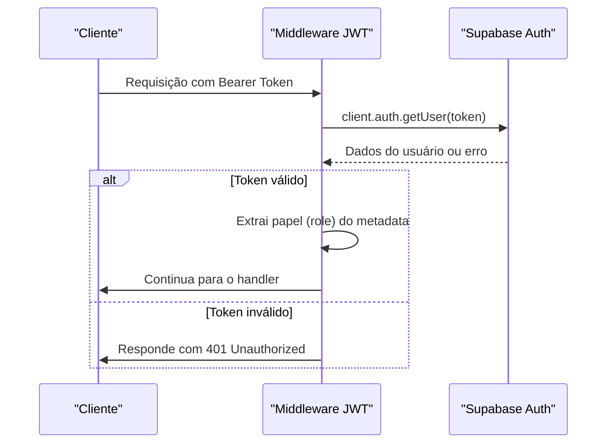
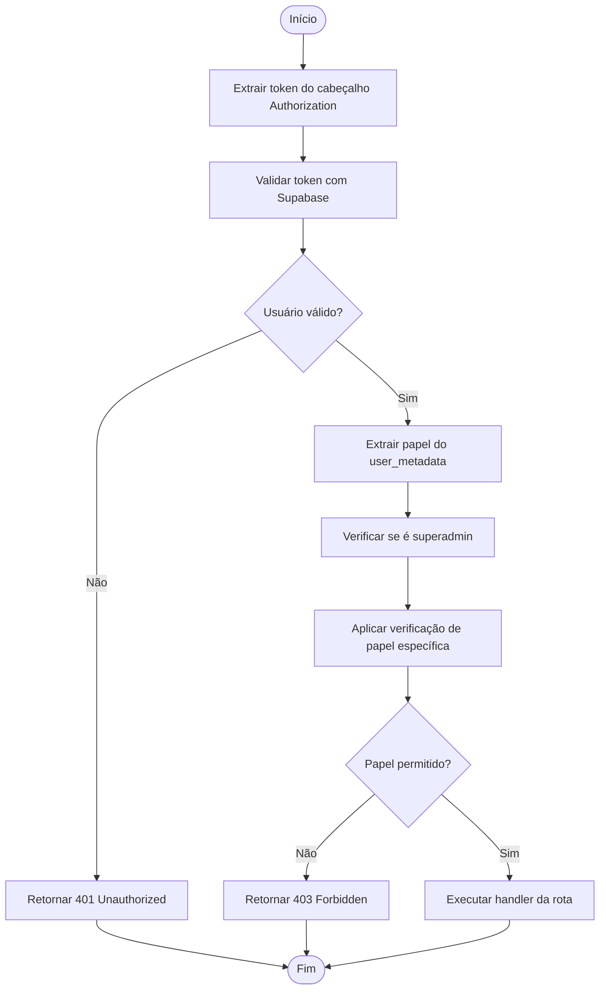
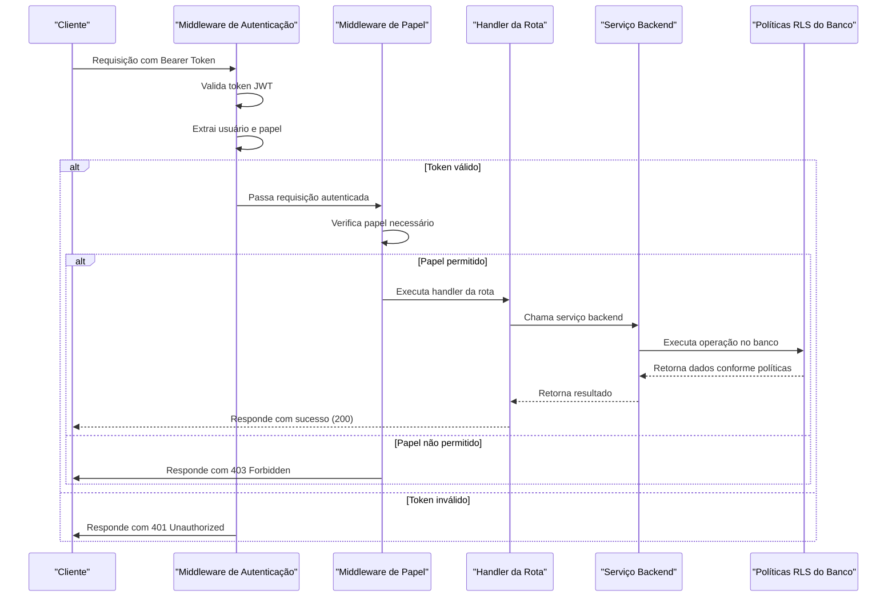

# Integração com Autenticação e Autorização

<cite>
**Arquivos Referenciados neste Documento**   
- [middleware.ts](file://backend/auth/middleware.ts)
- [auth.service.ts](file://backend/auth/auth.service.ts)
- [types.ts](file://backend/auth/types.ts)
- [route.ts](file://app/api/student/[id]/route.ts)
- [route.ts](file://app/api/teacher/[id]/route.ts)
- [route.ts](file://app/api/course/[id]/route.ts)
- [route.ts](file://app/api/enrollment/[id]/route.ts)
- [api-key.service.ts](file://backend/services/api-key/api-key.service.ts)
- [authentication.md](file://docs/authentication.md)
</cite>

## Sumário
1. [Introdução](#introdução)
2. [Fluxo de Autenticação JWT](#fluxo-de-autenticação-jwt)
3. [Extração e Validação do Usuário](#extração-e-validação-do-usuário)
4. [Verificação de Papéis (Roles)](#verificação-de-papéis-roles)
5. [Exemplos de Rotas com Verificação de Papel](#exemplos-de-rotas-com-verificação-de-papel)
6. [Fluxo Completo da Requisição HTTP ao Serviço](#fluxo-completo-da-requisição-http-ao-serviço)
7. [Adição de Novas Regras de Autorização](#adição-de-novas-regras-de-autorização)
8. [Considerações sobre Segurança e RLS](#considerações-sobre-segurança-e-rls)

## Introdução
Este documento detalha a integração dos serviços backend com o sistema de autenticação e autorização do projeto. O sistema utiliza tokens JWT fornecidos pelo Supabase para autenticar usuários e validar suas permissões com base em papéis (roles) como aluno, professor ou superadmin. Além disso, suporta autenticação via API Key para integrações externas. A autorização é implementada através de middlewares que garantem acesso seguro às operações sensíveis.

## Fluxo de Autenticação JWT
O processo de autenticação inicia-se com a apresentação de um token JWT no cabeçalho `Authorization` da requisição HTTP, no formato `Bearer <token>`. O middleware de autenticação extrai esse token e utiliza o cliente Supabase para validar sua autenticidade e obter os dados do usuário autenticado.

**Fontes do Diagrama**
- [middleware.ts](file://backend/auth/middleware.ts#L11-L51)

**Fontes da Seção**
- [middleware.ts](file://backend/auth/middleware.ts#L11-L51)
- [auth.service.ts](file://backend/auth/auth.service.ts#L44-L75)

## Extração e Validação do Usuário
A função `getAuthUser` no arquivo `middleware.ts` é responsável por extrair e validar o usuário a partir do token JWT. Ela verifica a presença do cabeçalho de autorização, valida o token com o Supabase e extrai o papel (role) do usuário a partir dos metadados (`user_metadata`). O papel padrão é `aluno`, mas pode ser `professor` ou `superadmin`. O sistema também verifica a flag `is_superadmin` nos metadados para promover um professor a superadmin.

**Fontes da Seção**
- [middleware.ts](file://backend/auth/middleware.ts#L11-L51)
- [types.ts](file://backend/auth/types.ts#L1-L8)

## Verificação de Papéis (Roles)
O sistema oferece funções de middleware especializadas para verificar papéis específicos antes da execução de operações sensíveis. Essas funções incluem:
- `requireRole(role)`: Garante que o usuário tenha um papel específico.
- `requireSuperAdmin()`: Restringe o acesso apenas a superadmins.
- `requireUserAuth()`: Exige autenticação de usuário, mas não valida papel.
- `requireAuth()`: Aceita autenticação por JWT ou API Key.

Esses middlewares são aplicados como decoradores nas rotas da API para controlar o acesso com base no papel do usuário.

**Fontes do Diagrama**
- [middleware.ts](file://backend/auth/middleware.ts#L153-L191)

**Fontes da Seção**
- [middleware.ts](file://backend/auth/middleware.ts#L153-L191)
- [types.ts](file://backend/auth/types.ts#L1-L8)

## Exemplos de Rotas com Verificação de Papel
### Atualização de Matrícula (Enrollment)
A rota `PUT /api/enrollment/[id]` permite que professores e superadmins atualizem os detalhes de uma matrícula, como datas de acesso e status ativo. A verificação de papel é feita diretamente no handler, garantindo que apenas usuários com papel `professor` ou `superadmin` possam executar a operação.

**Fontes da Seção**
- [route.ts](file://app/api/enrollment/[id]/route.ts#L53-L70)

### Atualização de Curso (Course)
A rota `PUT /api/course/[id]` utiliza o middleware `requireAuth` para garantir que apenas usuários autenticados (com JWT ou API Key) possam atualizar um curso. As políticas RLS (Row Level Security) no banco de dados garantem que apenas o criador do curso ou um superadmin possa modificá-lo.

**Fontes da Seção**
- [route.ts](file://app/api/course/[id]/route.ts#L68-L128)

### Atualização de Aluno (Student)
A rota `PUT /api/student/[id]` utiliza `requireAuth` para autenticar a requisição. As políticas RLS garantem que apenas o próprio aluno ou um superadmin possa modificar os dados do aluno.

**Fontes da Seção**
- [route.ts](file://app/api/student/[id]/route.ts#L61-L83)

## Fluxo Completo da Requisição HTTP ao Serviço
O fluxo completo desde a requisição HTTP até a execução no serviço backend envolve múltiplas camadas de segurança:

**Fontes do Diagrama**
- [middleware.ts](file://backend/auth/middleware.ts#L115-L191)
- [route.ts](file://app/api/enrollment/[id]/route.ts#L53-L70)

**Fontes da Seção**
- [middleware.ts](file://backend/auth/middleware.ts#L115-L191)
- [route.ts](file://app/api/enrollment/[id]/route.ts#L53-L70)
- [authentication.md](file://docs/authentication.md#L130-L135)

## Adição de Novas Regras de Autorização
Para adicionar novas regras de autorização em serviços específicos, siga estas etapas:
1. **Identifique o papel necessário**: Determine se a operação deve ser acessível por `aluno`, `professor`, `superadmin` ou uma combinação.
2. **Escolha o middleware apropriado**: Use `requireRole('professor')` para papéis específicos ou `requireSuperAdmin()` para acesso restrito.
3. **Aplique o middleware na rota**: Envolve o handler da rota com a função de middleware escolhida.
4. **Valide no serviço (opcional)**: Para lógica adicional, valide o papel novamente dentro do serviço backend.
5. **Configure RLS no banco de dados**: Certifique-se de que as políticas RLS no Supabase reflitam as mesmas restrições.

**Fontes da Seção**
- [middleware.ts](file://backend/auth/middleware.ts#L153-L191)
- [authentication.md](file://docs/authentication.md#L130-L135)

## Considerações sobre Segurança e RLS
O sistema utiliza uma abordagem de segurança em camadas:
- **Autenticação JWT**: Garante que o usuário é quem diz ser.
- **Autorização por Papel**: Controla o acesso com base no papel do usuário.
- **Políticas RLS (Row Level Security)**: Implementa controles de acesso no nível do banco de dados, garantindo que consultas maliciosas não possam acessar dados não autorizados.
- **API Keys**: Permitem autenticação para sistemas externos, com controle de expiração e atividade.

Os superadmins têm acesso total a todos os dados, contornando as políticas RLS padrão, mas ainda são autenticados via JWT. As API Keys usam a Service Role Key, que também contorna as políticas RLS, portanto devem ser gerenciadas com extrema cautela.

**Fontes da Seção**
- [authentication.md](file://docs/authentication.md#L130-L135)
- [middleware.ts](file://backend/auth/middleware.ts#L87-L113)
- [api-key.service.ts](file://backend/services/api-key/api-key.service.ts#L81-L99)