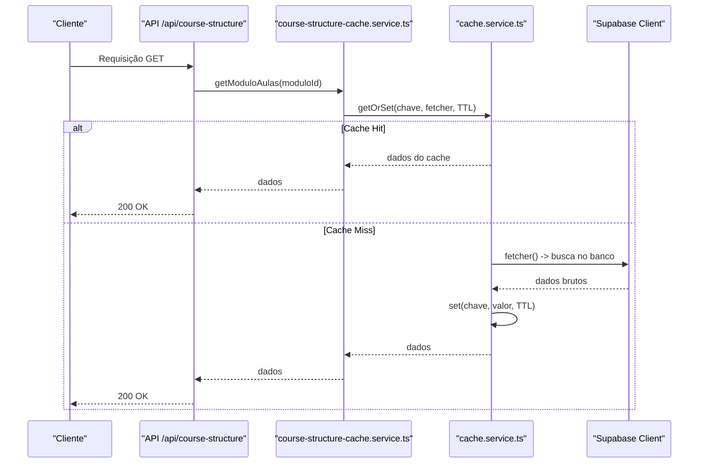
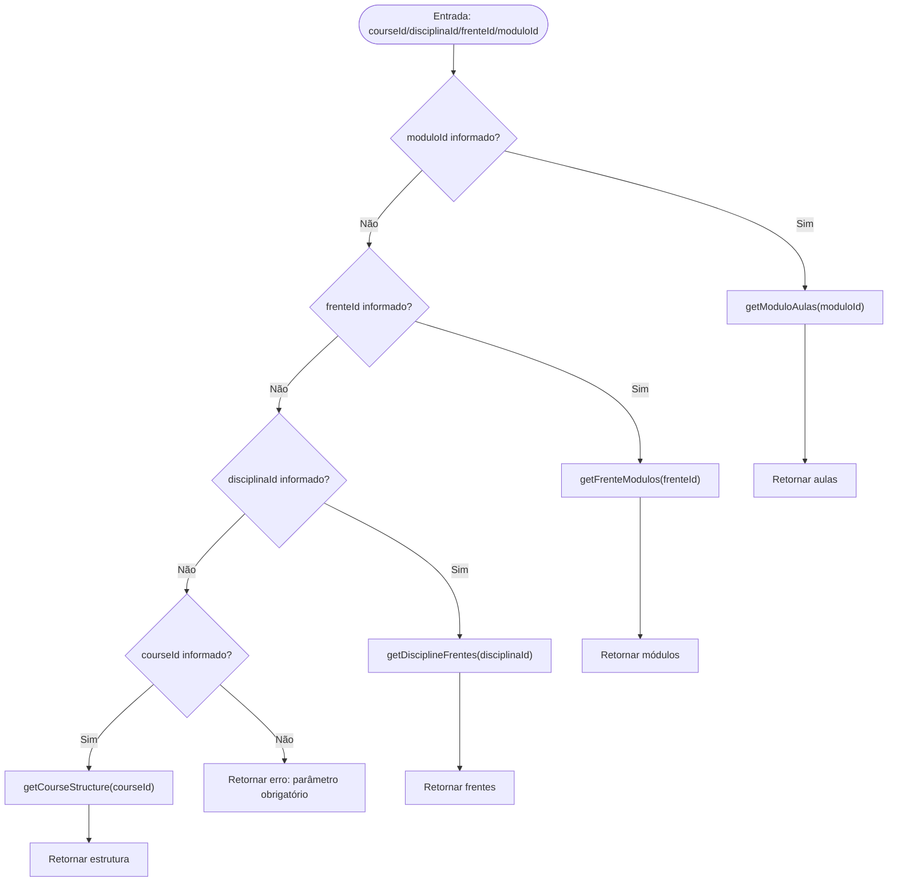
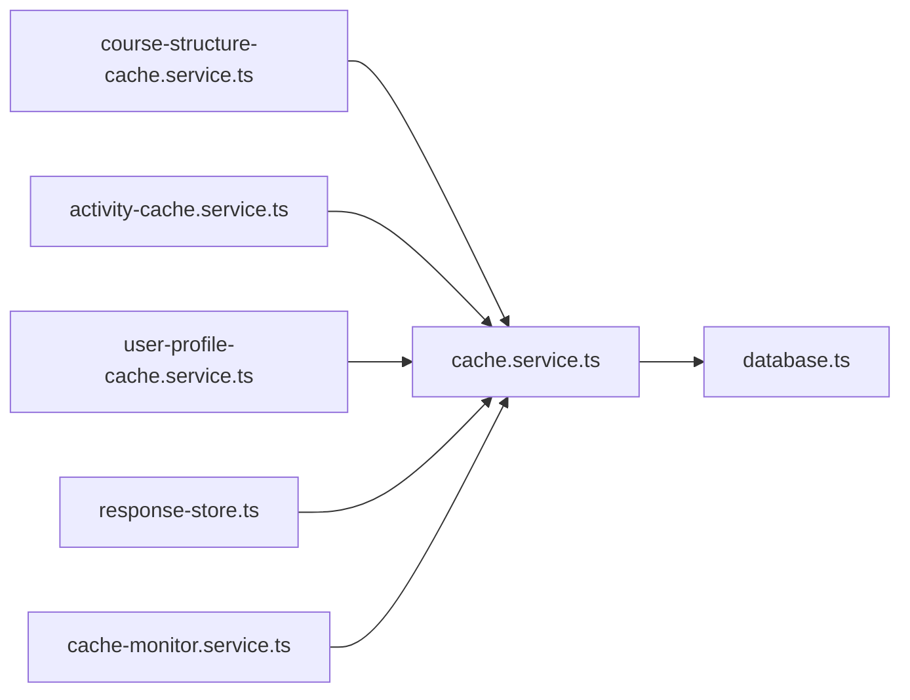

# Integração com Cache Distribuído (Redis)

<cite>
**Arquivo referenciados neste documento**
- [cache.service.ts](file://backend/services/cache/cache.service.ts)
- [course-structure-cache.service.ts](file://backend/services/cache/course-structure-cache.service.ts)
- [activity-cache.service.ts](file://backend/services/cache/activity-cache.service.ts)
- [user-profile-cache.service.ts](file://backend/services/cache/user-profile-cache.service.ts)
- [cache-monitor.service.ts](file://backend/services/cache/cache-monitor.service.ts)
- [response-store.ts](file://backend/services/cache/response-store.ts)
- [index.ts](file://backend/services/cache/index.ts)
- [database.ts](file://backend/clients/database.ts)
- [route.ts](file://app/api/course-structure/route.ts)
- [IMPLEMENTACAO_CACHE_COMPLETA.md](file://docs/IMPLEMENTACAO_CACHE_COMPLETA.md)
- [CHECKLIST_CACHE_IMPLEMENTACAO.md](file://docs/CHECKLIST_CACHE_IMPLEMENTACAO.md)
</cite>

## Sumário
- Introdução
- Estrutura do projeto de cache
- Arquitetura e fluxo de cache
- Detalhamento do cache de estrutura de cursos
- Padrões de chave e TTL
- Como um novo serviço se integra ao cache
- Benefícios e impactos
- Boas práticas e consistência
- Análise de dependências
- Considerações finais

## Introdução
Este documento explica como o backend utiliza o cache distribuído com Upstash Redis (Redis REST) para otimizar o desempenho. Ele se concentra no serviço de cache e no exemplo prático de cache da estrutura de cursos, mostrando como os dados são armazenados, recuperados e invalidados. Também apresenta os padrões de chave, estratégias de TTL, e orientações para que novos serviços integrem o cache de forma eficiente. São abordados os benefícios para escalabilidade e redução de carga no banco de dados, além de práticas recomendadas para evitar dados desatualizados.

## Estrutura do projeto de cache
O sistema de cache é composto por um serviço genérico e alguns serviços especializados:

- Serviço genérico de cache: fornece operações básicas (obter, definir, deletar, deletar múltiplos) e um padrão de recuperação “cache-aside”.
- Serviços especializados:
  - Estrutura de cursos (hierarquia: cursos → disciplinas → frentes → módulos → aulas)
  - Atividades por módulo
  - Perfil de usuário
  - Armazenamento de respostas do chat (com fallback em memória)
  - Monitoramento de estatísticas de cache

```mermaid
graph TB
subgraph "Servicos de Cache"
CS["cache.service.ts"]
CSCS["course-structure-cache.service.ts"]
ACS["activity-cache.service.ts"]
UPS["user-profile-cache.service.ts"]
RS["response-store.ts"]
CMS["cache-monitor.service.ts"]
end
subgraph "API"
API["app/api/course-structure/route.ts"]
end
subgraph "Banco de Dados"
DB["Supabase (client)"]
end
API --> CSCS
CSCS --> CS
ACS --> CS
UPS --> CS
RS --> CS
CS --> DB
CS --> CMS
```

**Diagrama fontes**
- [cache.service.ts](file://backend/services/cache/cache.service.ts#L1-L191)
- [course-structure-cache.service.ts](file://backend/services/cache/course-structure-cache.service.ts#L1-L312)
- [activity-cache.service.ts](file://backend/services/cache/activity-cache.service.ts#L1-L103)
- [user-profile-cache.service.ts](file://backend/services/cache/user-profile-cache.service.ts#L1-L86)
- [response-store.ts](file://backend/services/cache/response-store.ts#L1-L233)
- [cache-monitor.service.ts](file://backend/services/cache/cache-monitor.service.ts#L1-L116)
- [route.ts](file://app/api/course-structure/route.ts#L1-L64)
- [database.ts](file://backend/clients/database.ts#L1-L43)

**Seção fontes**
- [index.ts](file://backend/services/cache/index.ts#L1-L11)

## Arquitetura e fluxo de cache
O fluxo principal segue o padrão cache-aside:

- O endpoint consulta o serviço de cache especializado.
- O serviço tenta obter os dados do cache com TTL.
- Se houver acerto (hit), retorna imediatamente.
- Se houver falha (miss), busca do banco de dados e armazena no cache com TTL.
- Em operações de escrita ou exclusão, o cache é invalidado de forma seletiva.



**Diagrama fontes**
- [route.ts](file://app/api/course-structure/route.ts#L1-L64)
- [course-structure-cache.service.ts](file://backend/services/cache/course-structure-cache.service.ts#L1-L120)
- [cache.service.ts](file://backend/services/cache/cache.service.ts#L161-L178)
- [database.ts](file://backend/clients/database.ts#L1-L43)

**Seção fontes**
- [cache.service.ts](file://backend/services/cache/cache.service.ts#L42-L178)
- [course-structure-cache.service.ts](file://backend/services/cache/course-structure-cache.service.ts#L44-L120)
- [route.ts](file://app/api/course-structure/route.ts#L1-L64)

## Detalhamento do cache de estrutura de cursos
O serviço de cache de estrutura de cursos implementa:

- Recuperação de estrutura hierárquica com TTL de 1 hora.
- Chaves específicas para cada nível da hierarquia.
- Invalidação em cascata quando dados relacionados mudam (curso → disciplina → frente → módulo).
- Recuperação de dados do banco de dados somente em miss.

Operações-chave:
- Obter estrutura de um curso
- Obter frentes de uma disciplina
- Obter módulos de uma frente
- Obter aulas de um módulo
- Invalidar cache de curso, disciplinas, frentes e módulos
- Invalidar cache de uma aula específica



**Diagrama fontes**
- [route.ts](file://app/api/course-structure/route.ts#L1-L64)
- [course-structure-cache.service.ts](file://backend/services/cache/course-structure-cache.service.ts#L44-L120)

**Seção fontes**
- [course-structure-cache.service.ts](file://backend/services/cache/course-structure-cache.service.ts#L1-L312)
- [route.ts](file://app/api/course-structure/route.ts#L1-L64)

## Padrões de chave e TTL
Os padrões de chave seguem um esquema hierárquico e explícito, facilitando invalidação seletiva e rastreamento.

- Estrutura de cursos
  - cache:curso:{cursoId}:estrutura (TTL: 1 hora)
  - cache:disciplina:{disciplinaId}:frentes (TTL: 1 hora)
  - cache:frente:{frenteId}:modulos (TTL: 1 hora)
  - cache:modulo:{moduloId}:aulas (TTL: 1 hora)

- Atividades
  - cache:modulo:{moduloId}:atividades (TTL: 30 minutos)

- Perfil de usuário
  - cache:user:{userId}:perfil (TTL: 5 minutos)

- Respostas do chat
  - chat:response:{sessionId} (TTL: 10 minutos)

- Outros (exemplos)
  - cache:sessao:{sessaoId}:estado (TTL: 10 minutos)
  - cache:user:{userId}:conversas (TTL: 5 minutos)

Esses padrões permitem:
- Identificação clara do tipo de dado e escopo.
- Invalidação seletiva com base em IDs-chave.
- Facilidade de monitoramento e depuração.

**Seção fontes**
- [IMPLEMENTACAO_CACHE_COMPLETA.md](file://docs/IMPLEMENTACAO_CACHE_COMPLETA.md#L67-L93)
- [course-structure-cache.service.ts](file://backend/services/cache/course-structure-cache.service.ts#L44-L120)
- [activity-cache.service.ts](file://backend/services/cache/activity-cache.service.ts#L40-L66)
- [user-profile-cache.service.ts](file://backend/services/cache/user-profile-cache.service.ts#L20-L40)
- [response-store.ts](file://backend/services/cache/response-store.ts#L188-L192)

## Como um novo serviço se integra ao cache
Para integrar um novo serviço com cache distribuído:

1. Definir TTL apropriado com base na frequência de acesso e risco de stale data.
2. Escolher um padrão de chave claro e hierárquico.
3. Utilizar o serviço genérico de cache (cacheService) com o método getOrSet.
4. Implementar invalidação seletiva em operações de criação/atualização/exclusão.
5. Registrar logs e/ou usar o monitoramento interno.

Exemplo de fluxo típico:
- Obter dados com cacheService.getOrSet(chave, fetcher, TTL)
- Em operações de escrita, deletar a chave correspondente ou invocar métodos de invalidação específicos
- Para dados que mudam frequentemente, considerar TTL menor e invalidação automática

**Seção fontes**
- [cache.service.ts](file://backend/services/cache/cache.service.ts#L161-L178)
- [index.ts](file://backend/services/cache/index.ts#L1-L11)

## Benefícios e impactos
- Redução de consultas ao banco de dados:
  - Estrutura de cursos: até 100% de redução de queries em casos de cache hit.
  - Materiais de curso: 100% de redução.
  - Flashcards: 50–100% de redução.
  - Atividades: 50–66% de redução.
  - Conversas: 100% de redução.
  - Sessões: 90% de redução (heartbeat).
- Melhora de performance:
  - Estrutura de cursos: de 200–500ms para <10ms.
  - Materiais: de 100–200ms para <5ms.
  - Flashcards: de 150–300ms para <10ms.
  - Atividades: de 200–400ms para 50–100ms.
  - Conversas: de 100–200ms para <5ms.
- Escalabilidade:
  - Menos sobrecarga no banco de dados.
  - Maior throughput em endpoints com dados estáticos ou raramente alterados.

**Seção fontes**
- [IMPLEMENTACAO_CACHE_COMPLETA.md](file://docs/IMPLEMENTACAO_CACHE_COMPLETA.md#L130-L146)

## Boas práticas e consistência
- TTL adequado:
  - Dados estáticos ou raramente alterados: TTL maior (ex: 1 hora).
  - Dados que mudam com frequência: TTL menor (ex: 5–10 minutos).
- Invalidação seletiva:
  - Sempre invalidar chaves específicas após operações de criação/atualização/exclusão.
  - Em estruturas hierárquicas, invalidar em cascata (pai → filhos).
- Fallback gracioso:
  - O sistema continua funcionando mesmo sem Redis configurado (cache miss).
- Monitoramento:
  - Utilize as estatísticas de cache e logs para acompanhar hit rate e erros.
- Evitar stale data:
  - Não cacheie dados que mudam com base em sessão ou preferência do usuário sem invalidação automática.
  - Prefira cache de dados públicos ou de contexto fixo.

**Seção fontes**
- [cache.service.ts](file://backend/services/cache/cache.service.ts#L1-L40)
- [cache-monitor.service.ts](file://backend/services/cache/cache-monitor.service.ts#L1-L116)
- [IMPLEMENTACAO_CACHE_COMPLETA.md](file://docs/IMPLEMENTACAO_CACHE_COMPLETA.md#L147-L164)

## Análise de dependências
- Dependências principais:
  - cache.service.ts: fornece operações de cache e fallback.
  - database.ts: fornece o cliente Supabase para acesso ao banco de dados.
  - course-structure-cache.service.ts: implementa a lógica de cache e invalidação hierárquica.
  - Outros serviços: activity-cache.service.ts, user-profile-cache.service.ts, response-store.ts, cache-monitor.service.ts.
- Importante:
  - O cache depende de variáveis de ambiente do Upstash Redis (URL e token).
  - O fallback ocorre automaticamente quando as variáveis não estão configuradas.



**Diagrama fontes**
- [cache.service.ts](file://backend/services/cache/cache.service.ts#L1-L191)
- [course-structure-cache.service.ts](file://backend/services/cache/course-structure-cache.service.ts#L1-L312)
- [activity-cache.service.ts](file://backend/services/cache/activity-cache.service.ts#L1-L103)
- [user-profile-cache.service.ts](file://backend/services/cache/user-profile-cache.service.ts#L1-L86)
- [response-store.ts](file://backend/services/cache/response-store.ts#L1-L233)
- [cache-monitor.service.ts](file://backend/services/cache/cache-monitor.service.ts#L1-L116)
- [database.ts](file://backend/clients/database.ts#L1-L43)

**Seção fontes**
- [index.ts](file://backend/services/cache/index.ts#L1-L11)

## Considerações finais
O sistema de cache com Upstash Redis está bem estruturado e pronto para uso. Ele oferece uma camada de cache genérica e serviços especializados com TTL e invalidação seletiva. A implementação da estrutura de cursos demonstra um bom padrão de chave e estratégias de invalidação em cascata. Para novos serviços, recomenda-se seguir os mesmos padrões: TTL apropriado, chaves explícitas, invalidação seletiva e monitoramento contínuo. Isso garante melhor performance, escalabilidade e consistência dos dados.