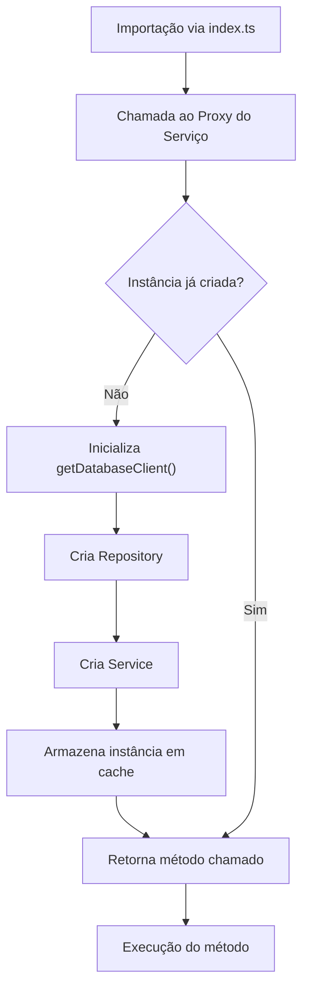
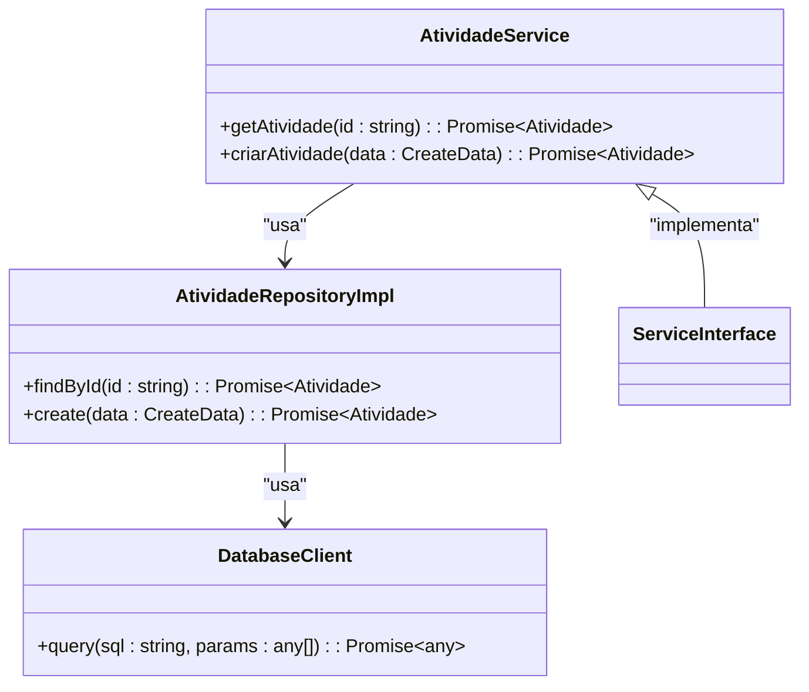
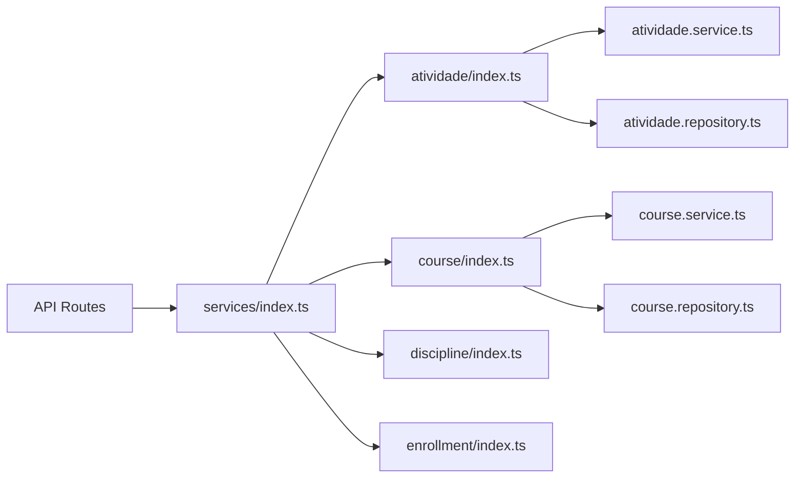

# Registro e Exportação de Serviços

<cite>
**Arquivos Referenciados neste Documento**  
- [backend/services/atividade/index.ts](file://backend/services/atividade/index.ts)
- [backend/services/api-key/index.ts](file://backend/services/api-key/index.ts)
- [backend/services/course/index.ts](file://backend/services/course/index.ts)
- [backend/services/discipline/index.ts](file://backend/services/discipline/index.ts)
- [backend/services/enrollment/index.ts](file://backend/services/enrollment/index.ts)
- [backend/services/progresso-atividade/index.ts](file://backend/services/progresso-atividade/index.ts)
- [backend/services/conversation/index.ts](file://backend/services/conversation/index.ts)
- [backend/services/chat/index.ts](file://backend/services/chat/index.ts)
- [backend/services/cache/index.ts](file://backend/services/cache/index.ts)
- [backend/services/cronograma/index.ts](file://backend/services/cronograma/index.ts)
</cite>

## Sumário
1. [Introdução](#introdução)
2. [Estrutura de Diretórios e Padrão de Barrel Files](#estrutura-de-diretórios-e-padrão-de-barrel-files)
3. [Mecanismo de Registro de Serviços](#mecanismo-de-registro-de-serviços)
4. [Padrão de Exportação e Injeção de Dependências](#padrão-de-exportação-e-injeção-de-dependências)
5. [Exemplo de Implementação: Serviço de Atividade](#exemplo-de-implementação-serviço-de-atividade)
6. [Benefícios do Padrão Barrel File](#benefícios-do-padrão-barrel-file)
7. [Como Registrar um Novo Serviço](#como-registrar-um-novo-serviço)
8. [Importância da Consistência para Escalabilidade](#importância-da-consistência-para-escalabilidade)

## Introdução
O sistema backend da aplicação utiliza um padrão estruturado de organização e disponibilização de serviços por meio de arquivos `index.ts` em cada diretório de serviço. Este mecanismo permite uma modularização clara, facilita a injeção de dependências e promove uma arquitetura escalável. Cada serviço (como atividade, curso, disciplina, etc.) exporta suas instâncias de serviço e repositório através do seu próprio `index.ts`, que atua como um *barrel file*. O arquivo raiz do diretório `services` consolida essas exportações, permitindo acesso centralizado e consistente aos serviços em toda a aplicação.

## Estrutura de Diretórios e Padrão de Barrel Files
O diretório `backend/services` contém subdiretórios para cada domínio de serviço (ex: `atividade`, `course`, `discipline`). Cada subdiretório inclui:
- Arquivos de implementação: `.service.ts`, `.repository.ts`, `.types.ts`
- Um arquivo `index.ts` que serve como *barrel file*

O *barrel file* agrega e reexporta os componentes principais do módulo, simplificando as importações em outros pontos da aplicação.

**Fontes da Seção**
- [backend/services/atividade/index.ts](file://backend/services/atividade/index.ts#L1-L29)
- [backend/services/course/index.ts](file://backend/services/course/index.ts#L1-L27)

## Mecanismo de Registro de Serviços
Cada serviço implementa um padrão de inicialização lazy por meio de uma função privada (ex: `getAtividadeService()`), que garante que a instância do serviço seja criada apenas quando necessária. O serviço é instanciado com injeção de dependência do repositório, que por sua vez recebe o cliente de banco de dados.

A exportação é feita através de um `Proxy`, permitindo acesso transparente aos métodos do serviço sem expor diretamente a instância, o que facilita testes e substituições.

**Fontes do Diagrama**
- [backend/services/atividade/index.ts](file://backend/services/atividade/index.ts#L5-L14)
- [backend/services/course/index.ts](file://backend/services/course/index.ts#L5-L14)

**Fontes da Seção**
- [backend/services/atividade/index.ts](file://backend/services/atividade/index.ts#L5-L20)
- [backend/services/course/index.ts](file://backend/services/course/index.ts#L5-L20)

## Padrão de Exportação e Injeção de Dependências
O padrão adotado combina:
- **Singleton com inicialização lazy**: Garante uma única instância por serviço, criada sob demanda.
- **Injeção de dependência explícita**: O repositório é injetado no serviço, facilitando testes e substituições.
- **Exportação centralizada**: O `index.ts` exporta tanto o serviço quanto seus tipos e erros.

Este padrão permite que os controladores da API acessem os serviços de forma consistente, sem se preocupar com sua construção interna.

**Fontes do Diagrama**
- [backend/services/atividade/atividade.service.ts](file://backend/services/atividade/atividade.service.ts)
- [backend/services/atividade/atividade.repository.ts](file://backend/services/atividade/atividade.repository.ts)

**Fontes da Seção**
- [backend/services/atividade/index.ts](file://backend/services/atividade/index.ts#L1-L25)
- [backend/services/course/index.ts](file://backend/services/course/index.ts#L1-L25)

## Exemplo de Implementação: Serviço de Atividade
O serviço `atividade` ilustra claramente o padrão:

1. O `index.ts` importa o cliente de banco e as classes de serviço e repositório.
2. Define uma variável privada `_atividadeService` para armazenar a instância.
3. Implementa `getAtividadeService()` para criar a instância apenas na primeira chamada.
4. Exporta `atividadeService` como um `Proxy` que delega chamadas à instância real.
5. Reexporta tipos, erros e classes diretamente.

Esse padrão é replicado em todos os serviços principais, garantindo uniformidade.

**Fontes da Seção**
- [backend/services/atividade/index.ts](file://backend/services/atividade/index.ts#L1-L29)

## Benefícios do Padrão Barrel File
O uso de *barrel files* traz diversos benefícios:
- **Importações limpas**: Permite `import { atividadeService } from '@/backend/services'`.
- **Modularidade**: Cada serviço é autocontido e pode ser movido ou substituído facilmente.
- **Manutenção simplificada**: Alterações internas não afetam os importadores.
- **Centralização de interfaces**: Tipos e erros são exportados junto com o serviço.
- **Escalabilidade**: Novos serviços podem ser adicionados sem alterar a estrutura de importação.

**Fontes do Diagrama**
- [backend/services/index.ts](file://backend/services/index.ts)
- [backend/services/atividade/index.ts](file://backend/services/atividade/index.ts)
- [backend/services/course/index.ts](file://backend/services/course/index.ts)

## Como Registrar um Novo Serviço
Para registrar um novo serviço (ex: `notificacao`):

1. Criar diretório `backend/services/notificacao`.
2. Implementar `notificacao.service.ts`, `notificacao.repository.ts`, `notificacao.types.ts`.
3. Criar `index.ts` com:
   - Importação do cliente de banco e classes.
   - Função `getNotificacaoService()` com inicialização lazy.
   - Exportação do serviço via `Proxy`.
   - Reexportação de tipos, serviço, repositório e erros.
4. Atualizar `backend/services/index.ts` para exportar o novo serviço.

Este processo garante que o novo serviço siga o mesmo padrão e esteja disponível para injeção em toda a aplicação.

**Fontes da Seção**
- [backend/services/atividade/index.ts](file://backend/services/atividade/index.ts#L1-L29)
- [backend/services/course/index.ts](file://backend/services/course/index.ts#L1-L27)

## Importância da Consistência para Escalabilidade
A consistência no padrão de registro e exportação é fundamental para a escalabilidade do sistema. Com dezenas de serviços potenciais, um padrão uniforme:
- Reduz o tempo de aprendizado para novos desenvolvedores.
- Minimiza erros de integração.
- Facilita a manutenção e refatoração em larga escala.
- Permite automação de tarefas (ex: geração de documentação, testes).
- Garante previsibilidade no comportamento dos serviços.

Qualquer desvio do padrão compromete esses benefícios e aumenta a dívida técnica.

**Fontes da Seção**
- [backend/services/atividade/index.ts](file://backend/services/atividade/index.ts)
- [backend/services/course/index.ts](file://backend/services/course/index.ts)
- [backend/services/discipline/index.ts](file://backend/services/discipline/index.ts)
- [backend/services/enrollment/index.ts](file://backend/services/enrollment/index.ts)