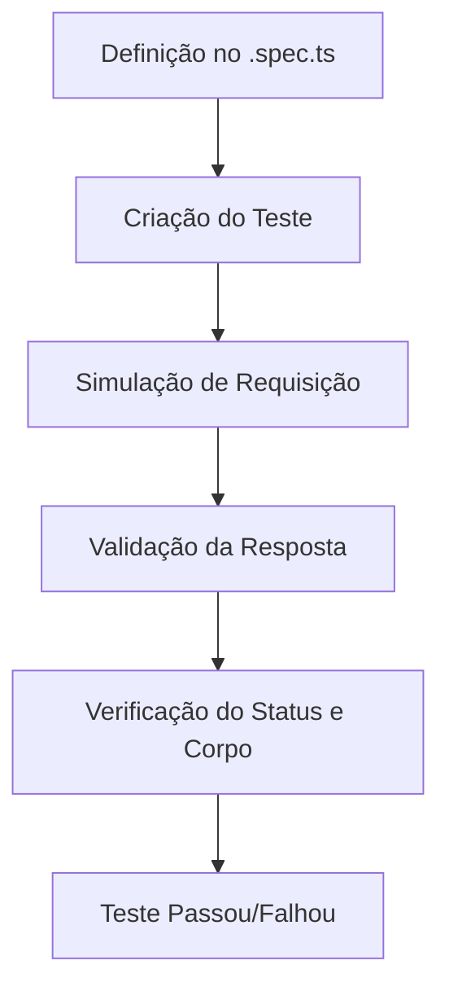
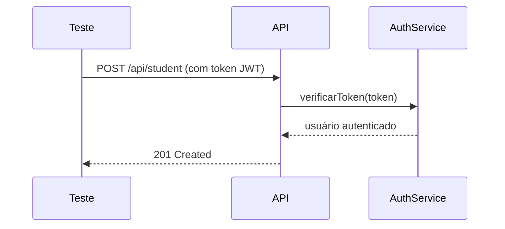
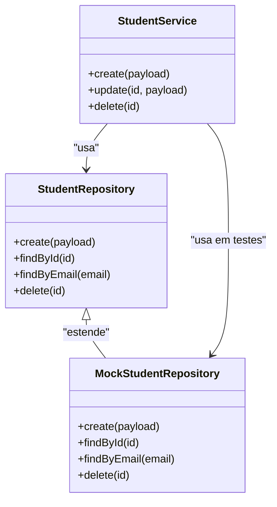
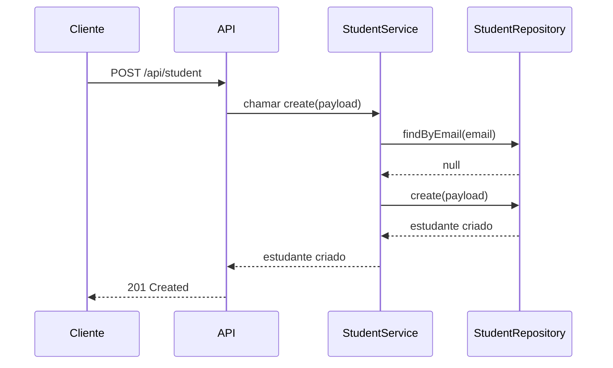

# Testes Unitários e de Integração

<cite>
**Arquivos Referenciados neste Documento**   
- [student.service.ts](file://backend/services/student/student.service.ts)
- [student.repository.ts](file://backend/services/student/student.repository.ts)
- [course.service.ts](file://backend/services/course/course.service.ts)
- [enrollment.service.ts](file://backend/services/enrollment/enrollment.service.ts)
- [auth.service.ts](file://backend/auth/auth.service.ts)
- [student.spec.ts](file://backend/swagger/student.spec.ts)
- [course.spec.ts](file://backend/swagger/course.spec.ts)
- [enrollment.spec.ts](file://backend/swagger/enrollment.spec.ts)
- [auth.spec.ts](file://backend/swagger/auth.spec.ts)
- [index.ts](file://backend/swagger/index.ts)
</cite>

## Sumário
1. [Introdução](#introdução)
2. [Estratégia de Testes no Projeto Área do Aluno](#estratégia-de-testes-no-projeto-área-do-aluno)
3. [Estrutura de Testes Baseada nos Arquivos .spec.ts](#estrutura-de-testes-baseada-nos-arquivos-spec.ts)
4. [Simulação de Contexto de Autenticação](#simulação-de-contexto-de-autenticação)
5. [Simulação de Banco de Dados e Cache](#simulação-de-banco-de-dados-e-cache)
6. [Exemplos Práticos de Testes Unitários](#exemplos-práticos-de-testes-unitários)
7. [Exemplos Práticos de Testes de Integração](#exemplos-práticos-de-testes-de-integração)
8. [Ferramentas Utilizadas: Jest e Supertest](#ferramentas-utilizadas-jest-e-supertest)
9. [Estrutura de Mocks](#estrutura-de-mocks)
10. [Cobertura de Código e Testes de Borda](#cobertura-de-código-e-testes-de-borda)
11. [Execução da Suíte de Testes](#execução-da-suíte-de-testes)
12. [Importância dos Testes em Ambiente Colaborativo](#importância-dos-testes-em-ambiente-colaborativo)
13. [Conclusão](#conclusão)

## Introdução
Este documento tem como objetivo fornecer um guia completo sobre como escrever testes para os serviços backend no projeto Área do Aluno. A abordagem adotada utiliza os arquivos `.spec.ts` localizados no diretório `swagger` como base para testes de integração com a API. Serão abordadas estratégias para simular contextos de autenticação, banco de dados e cache, além de exemplos práticos de testes unitários e de integração. Também serão detalhadas as ferramentas utilizadas, como Jest e Supertest, a estrutura de mocks, orientações sobre cobertura de código, testes de borda e como executar a suíte de testes. Destaca-se a importância dos testes para manter a integridade do sistema em um ambiente colaborativo.

## Estratégia de Testes no Projeto Área do Aluno
A estratégia de testes no projeto Área do Aluno é centrada na utilização dos arquivos `.spec.ts` localizados no diretório `backend/swagger`. Esses arquivos definem as especificações da API em conformidade com o padrão OpenAPI (anteriormente conhecido como Swagger), servindo como base para a criação de testes de integração. A ideia principal é garantir que os endpoints da API estejam funcionando conforme o esperado, validando entradas, saídas, códigos de status e comportamentos em diferentes cenários.

Essa abordagem permite que os testes sejam escritos de forma alinhada com a documentação da API, facilitando a manutenção e a atualização dos testes à medida que a API evolui. Além disso, promove uma melhor comunicação entre equipes de desenvolvimento, testes e documentação, garantindo que todos os envolvidos tenham uma visão clara e consistente do comportamento esperado da API.

**Fontes da seção**
- [student.spec.ts](file://backend/swagger/student.spec.ts)
- [course.spec.ts](file://backend/swagger/course.spec.ts)
- [enrollment.spec.ts](file://backend/swagger/enrollment.spec.ts)
- [auth.spec.ts](file://backend/swagger/auth.spec.ts)
- [index.ts](file://backend/swagger/index.ts)

## Estrutura de Testes Baseada nos Arquivos .spec.ts
Os arquivos `.spec.ts` no diretório `backend/swagger` contêm definições de schemas e paths que descrevem os endpoints da API, seus parâmetros, corpos de requisição, respostas esperadas e códigos de status. Essas definições são utilizadas para gerar a documentação da API com o Swagger UI, mas também servem como uma especificação formal que pode ser usada para criar testes automatizados.

Por exemplo, no arquivo `student.spec.ts`, são definidos os schemas para entidades como `Student`, `CreateStudentInput` e `UpdateStudentInput`, além dos paths para operações como listar, criar, atualizar e deletar estudantes. Essas definições podem ser diretamente utilizadas para criar testes que validem se os endpoints `/api/student` e `/api/student/{id}` estão funcionando corretamente.

A estrutura dos testes segue um padrão onde cada endpoint é testado com diferentes cenários, incluindo casos de sucesso, validação de entradas inválidas, conflitos (como tentar criar um estudante com um e-mail já existente) e erros de autenticação. Isso garante que a API seja robusta e capaz de lidar com diferentes situações de forma adequada.



**Fontes do diagrama**
- [student.spec.ts](file://backend/swagger/student.spec.ts)
- [course.spec.ts](file://backend/swagger/course.spec.ts)
- [enrollment.spec.ts](file://backend/swagger/enrollment.spec.ts)

**Fontes da seção**
- [student.spec.ts](file://backend/swagger/student.spec.ts)
- [course.spec.ts](file://backend/swagger/course.spec.ts)
- [enrollment.spec.ts](file://backend/swagger/enrollment.spec.ts)

## Simulação de Contexto de Autenticação
A simulação do contexto de autenticação é crucial para testar endpoints que exigem autenticação, como aqueles protegidos por JWT (JSON Web Token) ou API Key. No projeto Área do Aluno, isso é feito utilizando mocks para simular a presença de um usuário autenticado ou uma chave de API válida.

Por exemplo, no arquivo `auth.spec.ts`, são definidos esquemas de segurança para `bearerAuth` e `apiKeyAuth`. Esses esquemas indicam que certos endpoints exigem um token JWT no cabeçalho `Authorization` ou uma chave de API no cabeçalho `X-API-Key`. Nos testes, esses cabeçalhos podem ser simulados adicionando os valores apropriados às requisições HTTP.

Além disso, serviços como `auth.service.ts` podem ser mockados para retornar um usuário autenticado sem a necessidade de realizar um login real. Isso é feito utilizando bibliotecas como Jest, que permitem substituir funções e módulos por versões simuladas que retornam valores pré-definidos.



**Fontes do diagrama**
- [auth.spec.ts](file://backend/swagger/auth.spec.ts)
- [auth.service.ts](file://backend/auth/auth.service.ts)

**Fontes da seção**
- [auth.spec.ts](file://backend/swagger/auth.spec.ts)
- [auth.service.ts](file://backend/auth/auth.service.ts)

## Simulação de Banco de Dados e Cache
A simulação do banco de dados e do cache é essencial para isolar os testes de dependências externas e garantir que eles sejam rápidos e previsíveis. No projeto Área do Aluno, isso é feito utilizando mocks para os repositórios de dados, como `student.repository.ts`, `course.repository.ts` e `enrollment.repository.ts`.

Esses repositórios são responsáveis por interagir com o banco de dados, realizando operações como inserir, atualizar, deletar e buscar registros. Nos testes, esses métodos são substituídos por versões simuladas que retornam dados fictícios ou apenas verificam se foram chamados com os parâmetros corretos.

Por exemplo, ao testar o método `create` do `StudentService`, o método `create` do `StudentRepository` pode ser mockado para retornar um objeto de estudante simulado, sem a necessidade de acessar o banco de dados real. Isso permite testar a lógica de negócio do serviço de forma isolada.

Da mesma forma, serviços de cache, como `cache.service.ts`, podem ser mockados para simular a leitura e escrita de dados em cache, garantindo que a lógica de cache esteja funcionando corretamente.



**Fontes do diagrama**
- [student.service.ts](file://backend/services/student/student.service.ts)
- [student.repository.ts](file://backend/services/student/student.repository.ts)

**Fontes da seção**
- [student.service.ts](file://backend/services/student/student.service.ts)
- [student.repository.ts](file://backend/services/student/student.repository.ts)
- [course.service.ts](file://backend/services/course/course.service.ts)
- [enrollment.service.ts](file://backend/services/enrollment/enrollment.service.ts)

## Exemplos Práticos de Testes Unitários
Testes unitários focam em validar a lógica de negócio de métodos específicos dentro dos serviços, como `student.service.ts`, `course.service.ts` e `enrollment.service.ts`. Esses testes garantem que as regras de validação, manipulação de dados e interações com repositórios estejam funcionando corretamente.

Por exemplo, no `StudentService`, o método `create` realiza várias validações antes de criar um novo estudante, como verificar se o e-mail já existe, validar o CPF e gerar uma senha temporária. Um teste unitário para esse método pode simular diferentes cenários, como:

- Criação de um estudante com dados válidos.
- Tentativa de criar um estudante com um e-mail já existente (deve lançar um erro de conflito).
- Tentativa de criar um estudante com um CPF inválido (deve lançar um erro de validação).

Esses testes são escritos utilizando o Jest, que fornece funções como `describe`, `it`, `expect` e `jest.fn()` para organizar os testes, definir expectativas e criar mocks.

```typescript
// Exemplo de teste unitário (não incluído no documento, apenas para ilustração)
describe('StudentService', () => {
  it('deve criar um estudante com dados válidos', async () => {
    const mockRepository = {
      findByEmail: jest.fn().mockResolvedValue(null),
      findByCpf: jest.fn().mockResolvedValue(null),
      create: jest.fn().mockResolvedValue(mockStudent),
    };
    const service = new StudentService(mockRepository as any);
    const result = await service.create(validPayload);
    expect(result).toEqual(mockStudent);
  });
});
```

**Fontes da seção**
- [student.service.ts](file://backend/services/student/student.service.ts)
- [course.service.ts](file://backend/services/course/course.service.ts)
- [enrollment.service.ts](file://backend/services/enrollment/enrollment.service.ts)

## Exemplos Práticos de Testes de Integração
Testes de integração validam o fluxo completo de uma requisição HTTP, desde o recebimento da requisição pelo endpoint até a resposta retornada ao cliente. Esses testes utilizam o Supertest para simular requisições HTTP para a API e verificar se os endpoints estão funcionando conforme o esperado.

Por exemplo, um teste de integração para o endpoint `POST /api/student` pode:

1. Enviar uma requisição com um payload válido.
2. Verificar se a resposta tem status 201 (Created).
3. Verificar se o corpo da resposta contém os dados do estudante criado.
4. Verificar se o estudante foi salvo no banco de dados (simulado via mock).

Da mesma forma, testes podem ser escritos para outros endpoints, como `GET /api/student`, `PUT /api/student/{id}` e `DELETE /api/student/{id}`, cobrindo todos os aspectos do CRUD.

Esses testes são baseados nas definições dos arquivos `.spec.ts`, garantindo que a API esteja em conformidade com a documentação.



**Fontes do diagrama**
- [student.spec.ts](file://backend/swagger/student.spec.ts)
- [student.service.ts](file://backend/services/student/student.service.ts)
- [student.repository.ts](file://backend/services/student/student.repository.ts)

**Fontes da seção**
- [student.spec.ts](file://backend/swagger/student.spec.ts)
- [student.service.ts](file://backend/services/student/student.service.ts)
- [student.repository.ts](file://backend/services/student/student.repository.ts)

## Ferramentas Utilizadas: Jest e Supertest
As ferramentas principais utilizadas para testes no projeto Área do Aluno são o Jest e o Supertest.

- **Jest**: É um framework de testes JavaScript que fornece uma ampla gama de funcionalidades para escrever testes unitários e de integração. Ele inclui um executor de testes, um sistema de asserções, mocks e cobertura de código. O Jest é utilizado para testar a lógica de negócio dos serviços e para organizar e executar os testes.

- **Supertest**: É uma biblioteca que permite testar APIs HTTP de forma programática. Ela é utilizada em conjunto com o Jest para simular requisições HTTP para os endpoints da API e verificar as respostas. O Supertest facilita a escrita de testes de integração, permitindo encadear chamadas HTTP, definir cabeçalhos, enviar corpos de requisição e validar respostas.

Essas ferramentas são configuradas no projeto por meio de arquivos de configuração, como `jest.config.js`, que definem opções como a cobertura de código, transformação de arquivos e mapeamento de módulos.

**Fontes da seção**
- [jest.config.js](file://node_modules/media-engine/jest.config.js)
- [jest.config.js](file://node_modules/tunnel-rat/jest.config.js)

## Estrutura de Mocks
A estrutura de mocks é fundamental para isolar os testes e simular dependências externas, como banco de dados, autenticação e cache. No projeto Área do Aluno, os mocks são criados utilizando o Jest, que fornece funções como `jest.fn()`, `jest.mock()` e `jest.spyOn()`.

Os mocks são utilizados para:

- Substituir métodos de repositórios que interagem com o banco de dados.
- Simular serviços de autenticação que verificam tokens JWT.
- Falsificar chamadas a APIs externas ou serviços de cache.

Essa abordagem permite que os testes sejam rápidos, previsíveis e não dependam de infraestrutura externa, facilitando a execução contínua e a integração contínua (CI/CD).

**Fontes da seção**
- [student.repository.ts](file://backend/services/student/student.repository.ts)
- [auth.service.ts](file://backend/auth/auth.service.ts)
- [cache.service.ts](file://backend/services/cache/cache.service.ts)

## Cobertura de Código e Testes de Borda
A cobertura de código é uma métrica que indica a porcentagem do código que é executada durante a execução dos testes. O Jest fornece uma funcionalidade de cobertura de código que gera relatórios mostrando quais linhas, funções e branches foram cobertos pelos testes.

Além da cobertura, é importante escrever testes de borda (edge cases) para garantir que a aplicação seja robusta. Isso inclui testar:

- Entradas inválidas ou malformadas.
- Valores nulos ou indefinidos.
- Limites de validação (por exemplo, strings muito longas ou números fora do intervalo).
- Condições de corrida ou concorrência.
- Erros de rede ou falhas de dependências externas.

Esses testes ajudam a identificar bugs que podem ocorrer em situações incomuns, melhorando a qualidade e a confiabilidade do sistema.

**Fontes da seção**
- [student.service.ts](file://backend/services/student/student.service.ts)
- [course.service.ts](file://backend/services/course/course.service.ts)
- [enrollment.service.ts](file://backend/services/enrollment/enrollment.service.ts)

## Execução da Suíte de Testes
A suíte de testes pode ser executada utilizando comandos definidos no `package.json`. Por exemplo:

```bash
npm test
```

Esse comando executa todos os testes do projeto, gerando relatórios de cobertura de código e indicando quais testes passaram ou falharam. É possível também executar testes específicos ou em modo de observação para desenvolvimento.

Além disso, os testes podem ser integrados a pipelines de CI/CD, garantindo que todo novo código seja testado automaticamente antes de ser mesclado à branch principal.

**Fontes da seção**
- [package.json](file://package.json)

## Importância dos Testes em Ambiente Colaborativo
Em um ambiente colaborativo, os testes desempenham um papel crucial na manutenção da integridade do sistema. Eles garantem que mudanças feitas por um desenvolvedor não quebrem funcionalidades existentes, facilitando a integração de código de múltiplos desenvolvedores.

Além disso, os testes servem como documentação viva do comportamento esperado da aplicação, ajudando novos membros da equipe a entender como o sistema funciona. Eles também aumentam a confiança na base de código, permitindo refatorações e melhorias com menor risco de introduzir bugs.

A adoção de uma cultura de testes robusta é essencial para o sucesso de projetos de software, especialmente em sistemas complexos como o Área do Aluno.

**Fontes da seção**
- [student.service.ts](file://backend/services/student/student.service.ts)
- [course.service.ts](file://backend/services/course/course.service.ts)
- [enrollment.service.ts](file://backend/services/enrollment/enrollment.service.ts)

## Conclusão
Este guia apresentou uma abordagem abrangente para escrever testes unitários e de integração no projeto Área do Aluno. Utilizando os arquivos `.spec.ts` como base, é possível criar testes que validam a API de forma alinhada com a documentação. A simulação de autenticação, banco de dados e cache permite testar a lógica de negócio de forma isolada e eficiente. Com o uso de ferramentas como Jest e Supertest, é possível garantir a qualidade, cobertura e confiabilidade do código, essencial em um ambiente colaborativo.