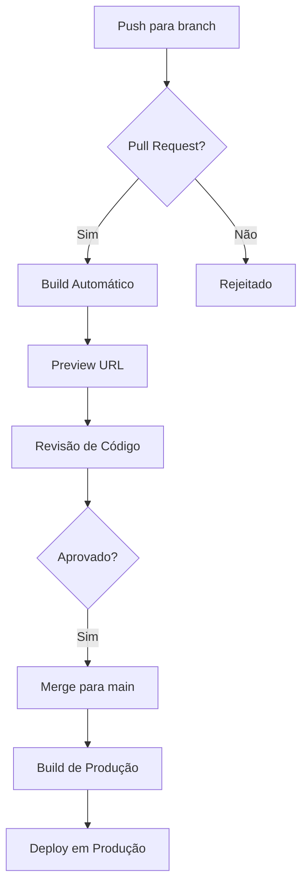

# Fluxo de Contribuição e CI/CD

<cite>
**Arquivos Referenciados neste Documento**   
- [README.md](file://README.md)
- [package.json](file://package.json)
- [eslint.config.mjs](file://eslint.config.mjs)
- [DEPLOY.md](file://docs/DEPLOY.md)
- [ENV_VARIABLES.md](file://docs/ENV_VARIABLES.md)
- [COMMIT_FINAL.md](file://docs/COMMIT_FINAL.md)
- [COMMIT_SINCRONIZADO.md](file://docs/COMMIT_SINCRONIZADO.md)
- [vercel.json](file://vercel.json)
</cite>

## Sumário
1. [Introdução](#introdução)
2. [Fluxo de Contribuição](#fluxo-de-contribuição)
3. [Práticas de Qualidade de Código](#práticas-de-qualidade-de-código)
4. [Processo de CI/CD com Vercel](#processo-de-cicd-com-vercel)
5. [Execução de Testes Locais](#execução-de-testes-locais)
6. [Resolução de Conflitos e Atualização de Branches](#resolução-de-conflitos-e-atualização-de-branches)
7. [Conclusão](#conclusão)

## Introdução
Este documento detalha o fluxo completo de contribuição para o repositório Área do Aluno, abrangendo desde o fork inicial até o deploy em produção. O processo é estruturado para garantir qualidade de código, consistência nas mensagens de commit e automação eficiente através de pipelines CI/CD.

**Seção fontes**
- [README.md](file://README.md#L1-L318)

## Fluxo de Contribuição

### Fork e Clonagem do Repositório
O processo inicia com o fork do repositório principal para o namespace do contribuidor, seguido pela clonagem local:
```bash
git clone https://github.com/seu-usuario/areadoaluno.git
cd areadoaluno
```

### Criação de Branch com Convenção de Nomenclatura
Todas as contribuições devem ser feitas em branches com nomenclatura padronizada:
- `feature/nome-da-feature` - para novas funcionalidades
- `bugfix/descrição-do-bug` - para correções de bugs
- `docs/tipo-de-documentação` - para atualizações de documentação
- `chore/tipo-de-tarefa` - para tarefas de manutenção

Exemplo:
```bash
git checkout -b feature/sala-de-estudos
```

### Commits com Mensagens Padronizadas
As mensagens de commit seguem o padrão convencional:
- `feat:` - nova funcionalidade
- `fix:` - correção de bug
- `docs:` - alterações na documentação
- `style:` - mudanças de formatação
- `refactor:` - refatoração de código
- `test:` - adição ou correção de testes
- `chore:` - atualizações de build ou dependências

Exemplo de mensagem:
```
feat: Implementação completa do módulo Sala de Estudos e Check Qualificado

- Implementação completa do módulo Sala de Estudos para alunos
- Sistema de Check Qualificado com modal de desempenho
- Backend: Services, repositories e API routes para atividades e progresso
- Frontend: Componentes de checklist, modal de desempenho e filtros
```

**Seção fontes**
- [COMMIT_SINCRONIZADO.md](file://docs/COMMIT_SINCRONIZADO.md#L109-L119)
- [COMMIT_FINAL.md](file://docs/COMMIT_FINAL.md#L1-L37)

### Pull Request com Descrição Detalhada
Os pull requests devem conter:
- Objetivo da mudança
- Alterações realizadas
- Instruções de teste
- Screenshots (quando aplicável)
- Referência a issues relacionadas

A revisão de código é obrigatória antes do merge, garantindo qualidade e aderência aos padrões do projeto.

**Seção fontes**
- [README.md](file://README.md#L219-L221)

## Práticas de Qualidade de Código

### Linting com ESLint
O projeto utiliza ESLint configurado com regras específicas para Next.js e TypeScript. A configuração está definida em `eslint.config.mjs`:

```javascript
import { defineConfig, globalIgnores } from "eslint/config";
import nextVitals from "eslint-config-next/core-web-vitals";
import nextTs from "eslint-config-next/typescript";

const eslintConfig = defineConfig([
  ...nextVitals,
  ...nextTs,
  globalIgnores([
    ".next/**",
    "out/**",
    "build/**",
    "next-env.d.ts",
  ]),
]);
```

Para executar o lint:
```bash
npm run lint
```

### Formatação com Prettier
Embora não explicitamente mencionado, o uso combinado de ESLint com Next.js implica na utilização de Prettier para formatação de código, garantindo consistência no estilo entre todos os contribuidores.

### Git Hooks para Validação de Commits
Os hooks do Git são utilizados para validar commits antes de serem finalizados, garantindo que:
- O lint seja executado antes de cada commit
- As mensagens de commit sigam o padrão estabelecido
- Os testes passem antes da submissão

Essa validação automatizada previne a introdução de erros comuns e mantém a qualidade do código base.

**Seção fontes**
- [eslint.config.mjs](file://eslint.config.mjs#L1-L19)
- [package.json](file://package.json#L9-L10)

## Processo de CI/CD com Vercel

### Configuração do Deploy
O projeto está configurado para deploy automático na Vercel, com o arquivo `vercel.json` definindo as configurações básicas:

```json
{
  "buildCommand": "npm run build",
  "devCommand": "npm run dev",
  "installCommand": "npm install",
  "framework": "nextjs",
  "regions": ["iad1"]
}
```

### Deploy de Preview
Cada pull request gera automaticamente um ambiente de preview na Vercel, permitindo:
- Teste da funcionalidade em ambiente semelhante à produção
- Demonstração para revisores
- Validação de integração antes do merge

### Deploy em Produção
O deploy em produção ocorre automaticamente quando o código é mergeado na branch `main`. O processo inclui:
1. Instalação de dependências
2. Build da aplicação
3. Execução de testes (se configurados)
4. Deploy da versão final

As variáveis de ambiente são gerenciadas diretamente na Vercel, separando valores sensíveis do código versionado.



**Fontes do diagrama**
- [vercel.json](file://vercel.json#L1-L9)
- [DEPLOY.md](file://docs/DEPLOY.md#L1-L191)

**Seção fontes**
- [vercel.json](file://vercel.json#L1-L9)
- [DEPLOY.md](file://docs/DEPLOY.md#L1-L191)
- [ENV_VARIABLES.md](file://docs/ENV_VARIABLES.md#L1-L138)

## Execução de Testes Locais

### Scripts Disponíveis
O projeto inclui scripts para execução de testes e verificação de qualidade:

```json
"scripts": {
  "dev": "next dev",
  "build": "next build",
  "start": "next start",
  "lint": "eslint"
}
```

### Verificação de Cobertura de Código
Embora os testes específicos não sejam detalhados nos arquivos analisados, a estrutura do projeto sugere a utilização de testes unitários e de integração. Para verificar a cobertura de código:

1. Execute os testes com cobertura habilitada
2. Analise o relatório gerado
3. Identifique áreas sem cobertura
4. Implemente testes adicionais conforme necessário

A verificação regular da cobertura de código garante que novas funcionalidades estejam adequadamente testadas.

**Seção fontes**
- [package.json](file://package.json#L5-L10)

## Resolução de Conflitos e Atualização de Branches

### Atualização com o Main Upstream
Para manter a branch local atualizada com as mudanças do repositório principal:

```bash
git fetch upstream
git checkout main
git merge upstream/main
git checkout sua-branch
git rebase main
```

### Resolução de Conflitos de Merge
Quando ocorrem conflitos durante o rebase ou merge:

1. Identifique os arquivos em conflito
2. Edite manualmente os arquivos para resolver as discrepâncias
3. Marque os conflitos como resolvidos com `git add`
4. Continue o processo de rebase ou merge

A resolução cuidadosa de conflitos evita a introdução de bugs e mantém a integridade do código base.

**Seção fontes**
- [README.md](file://README.md#L213-L217)

## Conclusão
O fluxo de contribuição para o repositório Área do Aluno é robusto e bem definido, incorporando práticas modernas de desenvolvimento de software. A combinação de convenções de código rigorosas, automação de qualidade e CI/CD eficiente garante que o projeto mantenha alta qualidade e seja sustentável a longo prazo. A documentação clara e os processos padronizados facilitam a contribuição de novos desenvolvedores e garantem consistência em todo o código base.