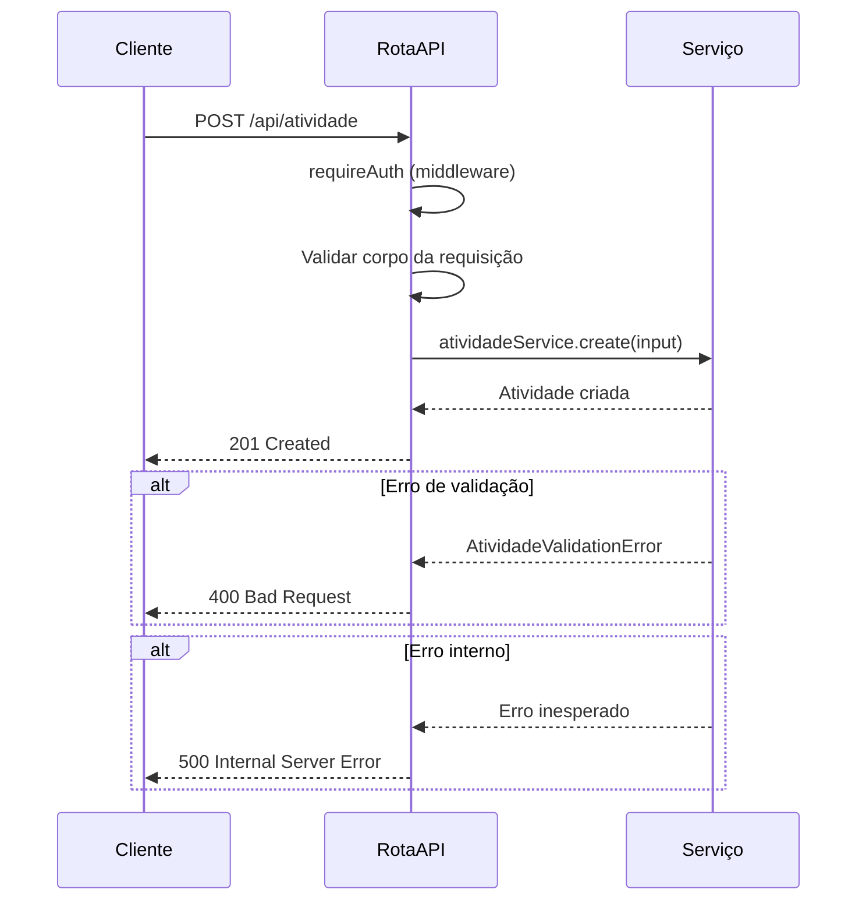
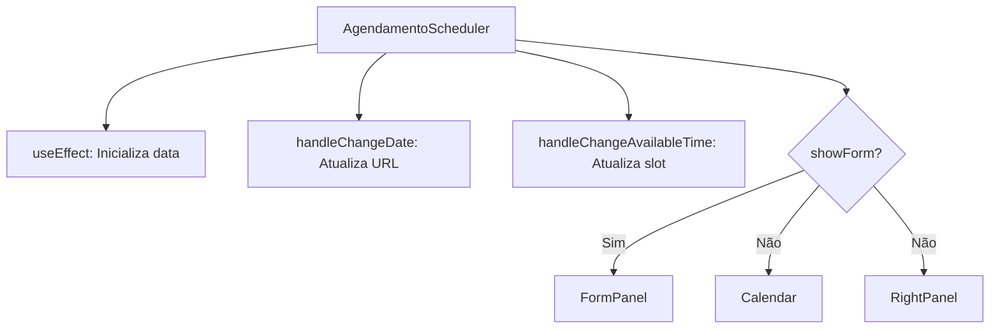
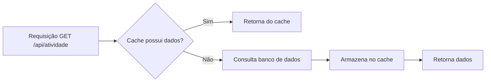

# Guia do Desenvolvedor

<cite>
**Arquivos Referenciados neste Documento**  
- [README.md](file://README.md)
- [package.json](file://package.json)
- [atividade.service.ts](file://backend/services/atividade/atividade.service.ts)
- [atividade.repository.ts](file://backend/services/atividade/atividade.repository.ts)
- [atividade.types.ts](file://backend/services/atividade/atividade.types.ts)
- [errors.ts](file://backend/services/atividade/errors.ts)
- [index.ts](file://backend/services/atividade/index.ts)
- [route.ts](file://app/api/atividade/route.ts)
- [api-client.ts](file://lib/api-client.ts)
- [client.ts](file://lib/client.ts)
- [server.ts](file://lib/server.ts)
- [middleware.ts](file://lib/middleware.ts)
- [auth.ts](file://lib/auth.ts)
- [utils.ts](file://lib/utils.ts)
- [index.tsx](file://components/agendamento/index.tsx)
- [index.tsx](file://components/calendar/index.tsx)
</cite>

## Sumário
1. [Configuração do Ambiente de Desenvolvimento](#configuração-do-ambiente-de-desenvolvimento)
2. [Adicionando um Novo Serviço Backend](#adicionando-um-novo-serviço-backend)
3. [Criando uma Nova Rota API](#criando-uma-nova-rota-api)
4. [Desenvolvendo um Novo Componente React](#desenvolvendo-um-novo-componente-react)
5. [Testes, Linting e Formatação](#testes-linting-e-formatação)
6. [Fluxo de Contribuição](#fluxo-de-contribuição)
7. [Dicas de Debugging e Performance](#dicas-de-debugging-e-performance)
8. [Boas Práticas de Código](#boas-práticas-de-código)

## Configuração do Ambiente de Desenvolvimento

Para configurar o ambiente de desenvolvimento local, siga os passos abaixo:

1. **Pré-requisitos**: Certifique-se de ter o Node.js 18+ instalado.
2. **Variáveis de Ambiente**: Crie um arquivo `.env.local` na raiz do projeto com as variáveis necessárias, conforme descrito no [README.md](file://README.md). As principais variáveis são:
   - `NEXT_PUBLIC_SUPABASE_URL`
   - `NEXT_PUBLIC_SUPABASE_PUBLISHABLE_OR_ANON_KEY`
   - `SUPABASE_URL`
   - `SUPABASE_SECRET_KEY`
   - `UPSTASH_REDIS_REST_URL` (opcional)
   - `UPSTASH_REDIS_REST_TOKEN` (opcional)

3. **Instalação de Dependências**: Execute `npm install` para instalar todas as dependências listadas no [package.json](file://package.json).

4. **Execução em Desenvolvimento**: Use `npm run dev` para iniciar o servidor de desenvolvimento. A aplicação estará disponível em `http://localhost:3000`.

**Seção fontes**
- [README.md](file://README.md#L87-L123)
- [package.json](file://package.json#L5-L9)

## Adicionando um Novo Serviço Backend

Para adicionar um novo serviço backend, siga o padrão de estrutura modular do projeto. Cada serviço reside em `backend/services/nome-servico/` e deve conter os seguintes arquivos:

- `nome-servico.types.ts`: Define os tipos, interfaces e DTOs.
- `nome-servico.service.ts`: Contém a lógica de negócio.
- `nome-servico.repository.ts`: Implementa a interface com o banco de dados.
- `errors.ts`: Define erros específicos do serviço.
- `index.ts`: Exporta os componentes do serviço.

### Exemplo: Criação do Serviço de Atividade

O serviço de atividade, localizado em `backend/services/atividade/`, exemplifica essa estrutura. O arquivo [atividade.types.ts](file://backend/services/atividade/atividade.types.ts) define interfaces como `Atividade`, `CreateAtividadeInput` e `UpdateAtividadeInput`. O [atividade.service.ts](file://backend/services/atividade/atividade.service.ts) implementa a lógica de negócio, utilizando validações e tratamento de erros. O [atividade.repository.ts](file://backend/services/atividade/atividade.repository.ts) interage com o Supabase, seguindo o padrão de repositório. O [errors.ts](file://backend/services/atividade/errors.ts) exporta classes de erro como `AtividadeNotFoundError` e `AtividadeValidationError`. O [index.ts](file://backend/services/atividade/index.ts) centraliza as exportações e fornece uma instância singleton do serviço via proxy.

**Seção fontes**
- [atividade.types.ts](file://backend/services/atividade/atividade.types.ts)
- [atividade.service.ts](file://backend/services/atividade/atividade.service.ts)
- [atividade.repository.ts](file://backend/services/atividade/atividade.repository.ts)
- [errors.ts](file://backend/services/atividade/errors.ts)
- [index.ts](file://backend/services/atividade/index.ts)

## Criando uma Nova Rota API

As rotas API são definidas em `app/api/` usando o App Router do Next.js. Para criar uma nova rota, crie um diretório com o nome do endpoint e um arquivo `route.ts` dentro dele.

### Estrutura de uma Rota

O arquivo `route.ts` exporta funções assíncronas para cada método HTTP (GET, POST, PUT, DELETE). Ele deve incluir:

1. **Autenticação**: Use o middleware `requireAuth` do [backend/auth/middleware](file://backend/auth/middleware.ts) para proteger rotas.
2. **Validação de Entrada**: Valide os dados recebidos.
3. **Tratamento de Erros**: Utilize blocos `try/catch` e funções de tratamento de erro.

### Exemplo: Rota de Atividades

A rota em `app/api/atividade/route.ts` demonstra esse padrão. A função `GET` lista atividades filtradas por `modulo_id` ou `frente_id`. A função `POST`, protegida por `requireAuth`, cria uma nova atividade. O tratamento de erros é centralizado na função `handleError`, que retorna respostas apropriadas com base no tipo de erro (ex: `AtividadeValidationError` resulta em status 400).

**Fontes do Diagrama**
- [route.ts](file://app/api/atividade/route.ts#L1-L83)
- [atividade.service.ts](file://backend/services/atividade/atividade.service.ts#L50-L70)

**Seção fontes**
- [route.ts](file://app/api/atividade/route.ts)

## Desenvolvendo um Novo Componente React

Componentes React são armazenados em `components/`. Para criar um novo componente:

1. **Estrutura de Arquivo**: Crie um arquivo `.tsx` no diretório apropriado. Para componentes complexos, use um diretório com `index.tsx` e arquivos auxiliares.
2. **Boas Práticas**: Utilize `use client` para componentes interativos, siga o padrão de design do Shadcn/ui, e garanta acessibilidade (ARIA, teclado, contraste).
3. **Testes**: Escreva testes unitários em `__tests__/` ou `tests/` usando Jest e React Testing Library.

### Exemplo: Componente de Agendamento

O componente `AgendamentoScheduler` em `components/agendamento/index.tsx` é um componente cliente que gerencia o estado de data e horário usando `useState` e `useEffect`. Ele utiliza `useRouter` e `useSearchParams` para sincronizar o estado com a URL, permitindo navegação compartilhável. O componente é dividido em painéis (`FormPanel`, `LeftPanel`, `RightPanel`) para melhor organização.

**Fontes do Diagrama**
- [index.tsx](file://components/agendamento/index.tsx#L1-L89)

**Seção fontes**
- [index.tsx](file://components/agendamento/index.tsx)

## Testes, Linting e Formatação

O projeto utiliza ferramentas para garantir qualidade de código:

- **Testes**: O script `npm run test` executa testes. Utilize Jest para testes unitários e integração. Teste funções de serviço, repositórios e componentes.
- **Linting**: O ESLint é configurado via `eslint.config.mjs`. Execute `npm run lint` para verificar problemas. O projeto segue regras estritas para TypeScript e React.
- **Formatação**: O Prettier é usado para formatação consistente. Configure seu editor para formatar ao salvar.

**Seção fontes**
- [package.json](file://package.json#L9)
- [eslint.config.mjs](file://eslint.config.mjs)

## Fluxo de Contribuição

Siga este fluxo para contribuir com o projeto:

1. **Fork**: Faça um fork do repositório.
2. **Branch**: Crie uma nova branch com um nome descritivo (ex: `feature/novo-componente`).
3. **Commit**: Faça commits com mensagens claras e concisas, seguindo o padrão convencional.
4. **Pull Request**: Abra um PR para a branch `main`. Descreva as mudanças, referencie issues e inclua testes.

## Dicas de Debugging e Performance

- **Debugging**: Use `console.log` em desenvolvimento. Para erros de API, verifique o log detalhado em `api-client.ts`, que captura erros de rede, HTML inesperado e respostas vazias.
- **Performance**: Utilize o cache do Redis (Upstash) para endpoints caros. O serviço `activityCacheService` em `backend/services/cache/activity-cache.service.ts` demonstra o uso de cache para listas de atividades.

**Fontes do Diagrama**
- [atividade.service.ts](file://backend/services/atividade/atividade.service.ts#L21-L40)
- [activity-cache.service.ts](file://backend/services/cache/activity-cache.service.ts)

## Boas Práticas de Código

- **SOLID, KISS, YAGNI**: Siga esses princípios. Mantenha classes e funções pequenas e coesas.
- **API-First**: Desenvolva o backend de forma independente do frontend.
- **Tipagem Estrita**: Use TypeScript para evitar erros em tempo de execução.
- **Tratamento de Erros**: Sempre trate erros de forma apropriada e forneça mensagens úteis.
- **Acessibilidade**: Todos os componentes devem ser acessíveis.