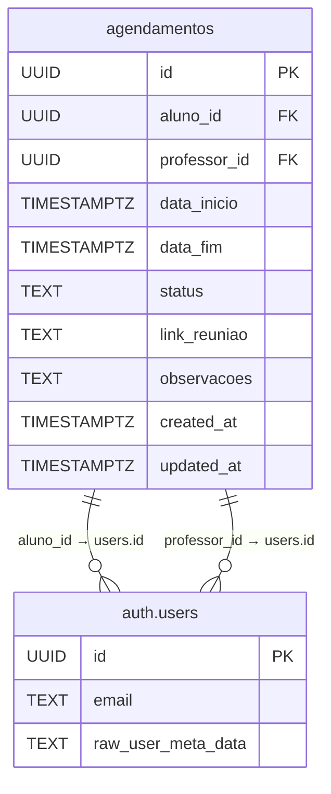

# Entidade Agendamento

<cite>
**Arquivos Referenciados neste Documento**  
- [agendamentos.ts](file://app/actions/agendamentos.ts)
- [index.tsx](file://components/agendamento/index.tsx)
- [agendamento-card.tsx](file://components/professor/agendamento-card.tsx)
- [meus-agendamentos-list.tsx](file://components/agendamento/meus-agendamentos-list.tsx)
- [agendamento-validations.ts](file://lib/agendamento-validations.ts)
- [20251208_create_agendamentos.sql](file://supabase/migrations/20251208_create_agendamentos.sql)
- [20251210_enhance_agendamentos.sql](file://supabase/migrations/20251210_enhance_agendamentos.sql)
- [route.ts](file://app/api/agendamentos/[id]/ical/route.ts)
</cite>

## Sumário
1. [Introdução](#introdução)
2. [Campos da Entidade](#campos-da-entidade)
3. [Relações com Aluno e Professor](#relações-com-aluno-e-professor)
4. [Fluxo de Status](#fluxo-de-status)
5. [Exemplos de Dados](#exemplos-de-dados)
6. [Integração com Calendários (ICS)](#integração-com-calendários-ics)
7. [Políticas RLS](#políticas-rls)
8. [Diagrama de Relacionamento](#diagrama-de-relacionamento)

## Introdução

A entidade **Agendamento** representa uma sessão de atendimento agendada entre um aluno e um professor na plataforma. Essa entidade é central para a funcionalidade de mentoria, permitindo que alunos solicitem sessões, professores confirmem ou rejeitem e ambas as partes gerenciem suas agendas. O agendamento inclui informações sobre data, horário, status, observações e integração com ferramentas externas de reunião.

O ciclo de vida de um agendamento começa com uma solicitação do aluno, seguida pela confirmação ou rejeição pelo professor. Após a confirmação, o aluno pode cancelar dentro de um prazo permitido. Após a realização da sessão, o status pode ser atualizado para "concluído".

**Section sources**
- [agendamentos.ts](file://app/actions/agendamentos.ts#L17-L33)
- [20251208_create_agendamentos.sql](file://supabase/migrations/20251208_create_agendamentos.sql#L11-L22)

## Campos da Entidade

A tabela `agendamentos` contém os seguintes campos:

| Campo | Tipo | Descrição |
|-------|------|-----------|
| `id` | UUID | Identificador único do agendamento |
| `aluno_id` | UUID | Chave estrangeira referenciando o aluno (tabela `auth.users`) |
| `professor_id` | UUID | Chave estrangeira referenciando o professor (tabela `auth.users`) |
| `data_hora_inicio` | TIMESTAMPTZ | Data e hora de início da sessão |
| `data_hora_fim` | TIMESTAMPTZ | Data e hora de término da sessão |
| `titulo` | TEXT | Título da sessão (gerado automaticamente como "Mentoria com [nome]") |
| `descricao` | TEXT | Descrição opcional da sessão |
| `status` | TEXT | Status atual: `pendente`, `confirmado`, `cancelado`, `concluido` |
| `created_at` | TIMESTAMPTZ | Timestamp de criação |
| `updated_at` | TIMESTAMPTZ | Timestamp da última atualização |

Observações:
- O campo `status` controla o fluxo do agendamento.
- `link_reuniao` é opcional e pode ser gerado automaticamente com integrações (Google Meet, Zoom).
- `observacoes` permite que o aluno inclua detalhes sobre o propósito da sessão.

**Section sources**
- [20251208_create_agendamentos.sql](file://supabase/migrations/20251208_create_agendamentos.sql#L11-L22)
- [20251210_enhance_agendamentos.sql](file://supabase/migrations/20251210_enhance_agendamentos.sql#L8-L13)

## Relações com Aluno e Professor

A entidade `agendamentos` está relacionada a duas entidades principais:

- **Aluno**: Relacionamento via `aluno_id` → `auth.users(id)`
- **Professor**: Relacionamento via `professor_id` → `auth.users(id)`

Essas relações são usadas para:
- Validar permissões de acesso (RLS)
- Exibir informações do usuário (nome, email, avatar)
- Enviar notificações e e-mails

Nos componentes front-end, essas relações são carregadas usando seleções com junção no Supabase, como no exemplo:

```ts
.select(`
  *,
  aluno:alunos!agendamentos_aluno_id_fkey(id, nome, email, avatar_url),
  professor:professores!agendamentos_professor_id_fkey(id, nome, email, avatar_url)
`)
```

**Section sources**
- [agendamentos.ts](file://app/actions/agendamentos.ts#L306-L307)
- [route.ts](file://app/api/agendamentos/[id]/ical/route.ts#L40-L45)

## Fluxo de Status

O campo `status` controla o estado do agendamento e define as ações permitidas:

| Status | Descrição | Transições Possíveis |
|--------|-----------|----------------------|
| `pendente` | Aluno solicitou, professor ainda não confirmou | → `confirmado`, → `cancelado` (por professor) |
| `confirmado` | Professor aceitou o agendamento | → `cancelado`, → `concluido` |
| `cancelado` | Sessão foi cancelada (por aluno ou professor) | Final |
| `concluido` | Sessão foi realizada com sucesso | Final |

Regras de negócio:
- Alunos podem cancelar agendamentos **confirmados** com pelo menos 2 horas de antecedência.
- Professores podem rejeitar (`cancelado`) agendamentos `pendente`.
- O status `concluido` é definido manualmente após a sessão.

A validação do tempo mínimo para cancelamento é feita pela função `validateCancellation` no arquivo `agendamento-validations.ts`.

**Section sources**
- [agendamentos.ts](file://app/actions/agendamentos.ts#L23-L32)
- [agendamento-validations.ts](file://lib/agendamento-validations.ts#L133-L145)

## Exemplos de Dados

Exemplo de um agendamento **pendente**:
```json
{
  "id": "a1b2c3d4",
  "aluno_id": "u123",
  "professor_id": "p456",
  "data_inicio": "2025-03-15T14:00:00Z",
  "data_fim": "2025-03-15T14:30:00Z",
  "status": "pendente",
  "observacoes": "Dúvidas sobre o projeto final",
  "created_at": "2025-03-10T10:00:00Z"
}
```

Exemplo de um agendamento **confirmado**:
```json
{
  "id": "a1b2c3d4",
  "aluno_id": "u123",
  "professor_id": "p456",
  "data_inicio": "2025-03-15T14:00:00Z",
  "data_fim": "2025-03-15T14:30:00Z",
  "status": "confirmado",
  "link_reuniao": "https://meet.google.com/abc-defg-hij",
  "confirmado_em": "2025-03-10T11:30:00Z",
  "updated_at": "2025-03-10T11:30:00Z"
}
```

**Section sources**
- [agendamentos.ts](file://app/actions/agendamentos.ts#L17-L33)
- [agendamento-card.tsx](file://components/professor/agendamento-card.tsx#L24-L29)

## Integração com Calendários (ICS)

A plataforma permite exportar agendamentos para calendários (Google Calendar, Outlook) via arquivo ICS. O endpoint `/api/agendamentos/[id]/ical` gera um arquivo `.ics` com os detalhes da sessão.

Funcionalidades:
- Download direto do arquivo ICS
- Adição automática ao calendário do usuário
- Inclusão de link da reunião, descrição e participantes

O arquivo ICS é gerado usando a biblioteca `ical-generator`, com os seguintes campos:
- `summary`: Título da reunião
- `description`: Detalhes da sessão
- `location`: Link da reunião
- `start`/`end`: Data e hora

O botão "Adicionar ao Calendário" está disponível na visualização de detalhes do agendamento.

**Section sources**
- [route.ts](file://app/api/agendamentos/[id]/ical/route.ts#L1-L129)
- [meus-agendamentos-list.tsx](file://components/agendamento/meus-agendamentos-list.tsx#L164-L168)

## Políticas RLS

As políticas de segurança de linha (RLS) garantem que usuários acessem apenas seus agendamentos:

| Política | Descrição |
|---------|-----------|
| `Professors can view own appointments` | Professor visualiza apenas seus agendamentos (`professor_id = auth.uid()`) |
| `Students can view own appointments` | Aluno visualiza apenas seus agendamentos (`aluno_id = auth.uid()`) |
| `Students can create appointments` | Aluno pode criar agendamentos apenas com seu `aluno_id` |
| `Professors can update own appointments` | Professor pode atualizar (confirmar/cancelar) seus agendamentos |
| `Students can update own appointments` | Aluno pode cancelar agendamentos `pendente` ou `confirmado` |

Essas políticas estão definidas no arquivo de migração SQL e garantem que não haja acesso não autorizado.

**Section sources**
- [20251208_create_agendamentos.sql](file://supabase/migrations/20251208_create_agendamentos.sql#L42-L65)

## Diagrama de Relacionamento



**Diagram sources**
- [20251208_create_agendamentos.sql](file://supabase/migrations/20251208_create_agendamentos.sql#L11-L22)
- [20251210_enhance_agendamentos.sql](file://supabase/migrations/20251210_enhance_agendamentos.sql#L8-L13)