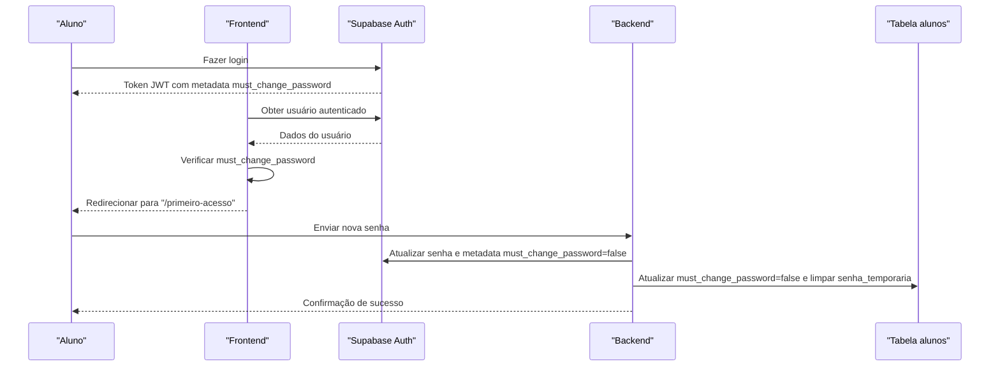

# Entidade Aluno

<cite>
**Arquivos Referenciados neste Documento**
- [20250120_create_alunos.sql](file://supabase/migrations/20250120_create_alunos.sql)
- [20250124_add_student_passwords_and_courses.sql](file://supabase/migrations/20250124_add_student_passwords_and_courses.sql)
- [20250128_ensure_professor_record_on_login.sql](file://supabase/migrations/20250128_ensure_professor_record_on_login.sql)
- [20250129_fix_alunos_rls_update_policy.sql](file://supabase/migrations/20250129_fix_alunos_rls_update_policy.sql)
- [student.types.ts](file://backend/services/student/student.types.ts)
- [student.repository.ts](file://backend/services/student/student.repository.ts)
- [student.service.ts](file://backend/services/student/student.service.ts)
- [student.import.service.ts](file://backend/services/student/student.import.service.ts)
- [index.ts](file://backend/services/student/index.ts)
- [aluno-table.tsx](file://components/aluno-table.tsx)
- [route.ts (import)](file://app/api/student/import/route.ts)
- [auth.ts](file://lib/auth.ts)
- [primeiro-acesso/page.tsx](file://app/primeiro-acesso/page.tsx)
- [profile-settings.tsx](file://components/profile-settings.tsx)
- [student.spec.ts](file://backend/swagger/student.spec.ts)
</cite>

## Sumário
- Apresentação da entidade Aluno e seus campos
- Relação com auth.users (herança e chave estrangeira)
- Política RLS que restringe acesso aos próprios dados
- Trigger que cria automaticamente o registro do aluno no primeiro login
- Gestão de senhas iniciais com mustChangePassword e temporaryPassword
- Exemplos de dados representativos
- Importação em massa via CSV/Excel com template e validações

## Introdução
A entidade Aluno representa os estudantes da plataforma e é estreitamente vinculada ao sistema de autenticação Supabase. O Aluno herda o identificador único (UUID) do usuário autenticado e possui um conjunto de dados pessoais e acadêmicos. Além disso, o sistema aplica políticas de segurança de nível de linha (RLS) para garantir que cada aluno só possa acessar e modificar seus próprios dados. Um gatilho automático garante que o registro do aluno seja criado assim que o usuário fizer login pela primeira vez. O sistema também oferece um fluxo de definição de senha inicial com flags de mudança obrigatória e armazenamento temporário da senha.

## Estrutura da Entidade Aluno
A tabela pública alunos possui os seguintes campos:

- id: UUID, chave primária e referência obrigatória a auth.users(id). A exclusão em cascata sincroniza registros deletados no auth.users com a tabela alunos.
- nome_completo: Texto com o nome completo do aluno.
- email: Texto único e obrigatório, usado como identificador principal de login.
- cpf: Texto único (opcional).
- telefone: Texto (opcional).
- data_nascimento: Data (opcional).
- endereco: Texto (opcional).
- cep: Texto (opcional).
- numero_matricula: Texto único (opcional).
- instagram: Texto (opcional).
- twitter: Texto (opcional).
- created_at: Timestamp com timezone, padrão agora.
- updated_at: Timestamp com timezone, padrão agora.

A tabela também inclui um gatilho para atualizar automaticamente updated_at sempre que um registro é modificado.

**Fontes**
- file://supabase/migrations/20250120_create_alunos.sql#L6-L21
- file://supabase/migrations/20250120_create_alunos.sql#L23-L38

## Herança com auth.users
A entidade Aluno herda o identificador do usuário autenticado. Isso significa que:
- O campo id da tabela alunos é uma chave estrangeira que aponta para auth.users(id).
- A exclusão em cascata garante que, ao remover um usuário em auth.users, o registro correspondente em alunos também será removido automaticamente.
- O trigger handle_new_user (definido posteriormente) garante que, ao criar um novo usuário, o registro do aluno seja criado automaticamente na primeira autenticação.

**Fontes**
- file://supabase/migrations/20250120_create_alunos.sql#L6-L11
- file://supabase/migrations/20250128_ensure_professor_record_on_login.sql#L139-L155

## Política RLS (Row Level Security)
As políticas RLS permitem que cada usuário acesse apenas seus próprios dados:
- SELECT: Alunos podem visualizar apenas o próprio registro (com base em auth.uid() = id).
- UPDATE: Alunos podem atualizar apenas seus próprios dados (com base em auth.uid() = id).
- INSERT: Alunos podem inserir apenas seus próprios dados (com base em auth.uid() = id).

Essas políticas foram ajustadas para incluir WITH CHECK em UPDATE, garantindo que alunos só possam atualizar dados associados ao próprio id.

**Fontes**
- file://supabase/migrations/20250120_create_alunos.sql#L40-L55
- file://supabase/migrations/20250129_fix_alunos_rls_update_policy.sql#L6-L14

## Trigger de Criação Automática no Primeiro Login
Quando um usuário faz login, o sistema garante que o registro do aluno exista. O trigger handle_new_user:
- Verifica o papel do usuário (role) lido do metadata do usuário.
- Se o papel for aluno, insere ou atualiza o registro em alunos com email e nome completo.
- Em caso de conflito (ON CONFLICT), atualiza os dados existentes mantendo a integridade dos dados.

Isso garante que o aluno tenha um registro criado automaticamente no primeiro login.

**Fontes**
- file://supabase/migrations/20250128_ensure_professor_record_on_login.sql#L111-L159

## Gestão de Senhas Iniciais: mustChangePassword e temporaryPassword
Para gerenciar senhas iniciais, a entidade Aluno inclui dois campos relacionados:
- must_change_password: Booleano que indica se o aluno precisa alterar a senha no primeiro acesso.
- senha_temporaria: Armazena uma senha temporária usada no primeiro acesso.

No backend:
- O serviço de Aluno gera uma senha temporária padrão com base no CPF e no nome do curso principal.
- Ao atualizar a senha no primeiro acesso, o sistema atualiza o usuário no auth e define must_change_password como false.
- A interface de perfil também atualiza must_change_password e limpa senha_temporaria na tabela alunos quando o aluno muda a senha.

No frontend:
- A página de primeiro acesso redireciona alunos cujo must_change_password é verdadeiro.
- O formulário de primeiro acesso permite que o aluno defina uma nova senha e desative o flag de mudança obrigatória.

**Fontes**
- file://supabase/migrations/20250124_add_student_passwords_and_courses.sql#L6-L11
- file://backend/services/student/student.service.ts#L404-L433
- file://components/profile-settings.tsx#L75-L117
- file://lib/auth.ts#L73-L96
- file://app/primeiro-acesso/page.tsx#L1-L37

## Exemplos de Dados Representativos
A seguir estão exemplos representativos de dados de Aluno. Estes valores ajudam a entender os tipos esperados e restrições.

- id: UUID (ex: 123e4567-e89b-12d3-a456-426614174000)
- nome_completo: Texto (ex: "Ana Silva")
- email: Texto único e obrigatório (ex: "ana.silva@example.com")
- cpf: Texto único (ex: "12345678901")
- telefone: Texto (ex: "11987654321")
- data_nascimento: Data (ex: "2000-01-01")
- endereco: Texto (ex: "Rua das Flores, 123")
- cep: Texto (ex: "12345678")
- numero_matricula: Texto único (ex: "MAT2025001")
- instagram: Texto (ex: "@anasilva")
- twitter: Texto (ex: "@anasilva")
- must_change_password: Booleano (ex: true)
- senha_temporaria: Texto (ex: "12345678901@CURSOEXEMPLO")
- created_at: Timestamp com timezone (ex: "2025-01-20T10:00:00Z")
- updated_at: Timestamp com timezone (ex: "2025-01-20T10:00:00Z")

**Fontes**
- file://supabase/migrations/20250120_create_alunos.sql#L6-L21
- file://supabase/migrations/20250124_add_student_passwords_and_courses.sql#L6-L11
- file://backend/swagger/student.spec.ts#L1-L20

## Importação em Massa via CSV/Excel
O sistema permite importar alunos em massa através de arquivos CSV/XLSX. O processo inclui:

- Template e colunas aceitas:
  - Nome Completo
  - Email
  - CPF
  - Telefone
  - Número de Matrícula
  - Cursos (valores múltiplos separados por ponto e vírgula)
  - Senha Temporária

- Validações:
  - Campos obrigatórios: nome completo, email, CPF, telefone, número de matrícula, senha temporária.
  - Cursos: devem corresponder a nomes válidos previamente cadastrados.
  - Formato de dados: CPF e CEP com dígitos, telefone com números, etc.

- Processo:
  - O frontend lê o arquivo CSV/XLSX, normaliza os cabeçalhos e converte os dados em um formato padronizado.
  - São feitas validações locais e geração de relatório com resultados (criado, ignorado, falha).
  - O payload é enviado para a rota de importação (/api/student/import), que delega para o serviço de importação.
  - O serviço de importação:
    - Valida cada linha.
    - Resolve os cursos existentes.
    - Cria alunos com mustChangePassword=true e senha temporária.
    - Retorna um resumo com totais e detalhes.

- Permissões:
  - Apenas professores ou superadmins podem importar alunos.

**Fontes**
- file://components/aluno-table.tsx#L140-L160
- file://components/aluno-table.tsx#L169-L232
- file://components/aluno-table.tsx#L366-L393
- file://components/aluno-table.tsx#L1164-L1213
- file://components/aluno-table.tsx#L1794-L1822
- file://app/api/student/import/route.ts#L1-L93
- file://backend/services/student/student.import.service.ts#L1-L104

## Fluxo de Primeiro Acesso
O fluxo de primeiro acesso ocorre quando mustChangePassword é verdadeiro. O sistema redireciona o aluno para a página de primeiro acesso, onde ele pode definir uma nova senha. Após a definição, o sistema atualiza o usuário no auth e desativa o flag must_change_password.



**Fontes**
- file://lib/auth.ts#L73-L96
- file://app/primeiro-acesso/page.tsx#L1-L37
- file://components/profile-settings.tsx#L75-L117
- file://backend/services/student/student.service.ts#L415-L433

## Relacionamento com Cursos
A entidade Aluno também se relaciona com a entidade Cursos por meio de uma tabela de junção alunos_cursos. Essa relação permite que um aluno esteja matriculado em múltiplos cursos. A migração cria a tabela e um índice opcional para otimizar buscas por curso.

**Fontes**
- file://supabase/migrations/20250124_add_student_passwords_and_courses.sql#L11-L21

## Resumo de Tipos e Serviços
A camada de backend define os tipos e serviços relacionados a Aluno:

- Tipos:
  - Student: inclui todos os campos da entidade Aluno, além de mustChangePassword e temporaryPassword.
  - CreateStudentInput e UpdateStudentInput: definições de entrada para criação e atualização.

- Repositório e Serviço:
  - O repositório atualiza campos específicos e aplica mustChangePassword e temporaryPassword.
  - O serviço gera senhas temporárias padrão e atualiza a senha no auth com o flag must_change_password.

**Fontes**
- file://backend/services/student/student.types.ts#L1-L57
- file://backend/services/student/student.repository.ts#L224-L263
- file://backend/services/student/student.service.ts#L404-L433

## Diagrama de Arquitetura do Cadastro de Aluno
```mermaid
graph TB
subgraph "Autenticação"
Auth["Supabase Auth<br/>auth.users"]
end
subgraph "Camada de Dados"
Alunos["Tabela alunos<br/>id (FK auth.users)"]
AlunosCursos["Tabela alunos_cursos<br/>aluno_id, curso_id"]
end
subgraph "Backend"
Repo["Repositório alunos"]
Service["Serviço alunos"]
Import["Serviço importação alunos"]
end
subgraph "Frontend"
UI["Interface de importação CSV/XLSX"]
PrimeiroAcesso["Página Primeiro Acesso"]
end
Auth --> Alunos
Alunos <- --> AlunosCursos
UI --> Import
Import --> Service
Service --> Repo
Auth --> PrimeiroAcesso
```

**Fontes**
- file://supabase/migrations/20250120_create_alunos.sql#L6-L21
- file://supabase/migrations/20250124_add_student_passwords_and_courses.sql#L11-L21
- file://app/api/student/import/route.ts#L1-L93
- file://components/aluno-table.tsx#L140-L160

## Considerações de Desempenho
- Índice na tabela alunos_cursos (curso_id) ajuda em consultas de busca por curso.
- Gatilho handle_updated_at evita sobrecarga de atualizações manuais de updated_at.

**Fontes**
- file://supabase/migrations/20250120_create_alunos.sql#L23-L38
- file://supabase/migrations/20250124_add_student_passwords_and_courses.sql#L19-L21

## Conclusão
A entidade Aluno é uma camada essencial da plataforma, integrada ao Supabase Auth e protegida por políticas RLS. O sistema garante a criação automática do registro no primeiro login, oferece um fluxo seguro de definição de senha inicial e permite importação em massa com validações rigorosas. Essas práticas asseguram integridade, segurança e facilidade de gerenciamento de dados acadêmicos.