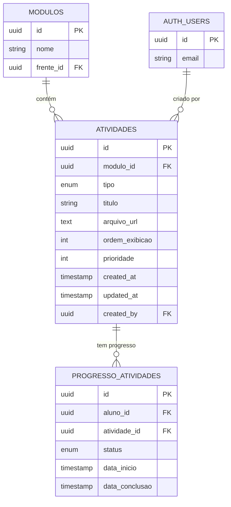
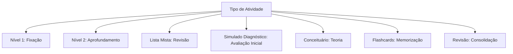

# Entidade Atividade

<cite>
**Arquivos Referenciados neste Documento**  
- [20250131_create_atividades_tables.sql](file://supabase/migrations/20250131_create_atividades_tables.sql)
- [atividade.types.ts](file://backend/services/atividade/atividade.types.ts)
- [atividade.service.ts](file://backend/services/atividade/atividade.service.ts)
- [atividade.repository.ts](file://backend/services/atividade/atividade.repository.ts)
- [atividade.repository-helper.ts](file://backend/services/atividade/atividade.repository-helper.ts)
- [route.ts](file://app/api/atividade/route.ts)
- [\[id\]/route.ts](file://app/api/atividade/[id]/route.ts)
- [aluno/\[alunoId\]/route.ts](file://app/api/atividade/aluno/[alunoId]/route.ts)
- [gerar-estrutura/route.ts](file://app/api/atividade/gerar-estrutura/route.ts)
- [regras-atividade.types.ts](file://backend/services/regras-atividade/regras-atividade.types.ts)
- [regras-atividade.service.ts](file://backend/services/regras-atividade/regras-atividade.service.ts)
- [regras-atividades/route.ts](file://app/api/regras-atividades/route.ts)
- [regras-atividades/\[id\]/route.ts](file://app/api/regras-atividades/[id]/route.ts)
</cite>

## Sumário
1. [Introdução](#introdução)
2. [Campos da Entidade Atividade](#campos-da-entidade-atividade)
3. [Relações com Outras Entidades](#relações-com-outras-entidades)
4. [Enumeração de Tipos de Atividade](#enumeração-de-tipos-de-atividade)
5. **Uso do Campo `prioridade` no Gerador de Cronogramas**
6. [Políticas RLS (Row Level Security)](#políticas-rls-row-level-security)
7. [Upload de Arquivos e Gestão de URLs](#upload-de-arquivos-e-gestão-de-urls)
8. [Exemplos de Dados](#exemplos-de-dados)
9. [Uso na Sala de Estudos](#uso-na-sala-de-estudos)
10. [Considerações Finais](#considerações-finais)

## Introdução

A entidade **Atividade** representa um material de estudo dentro do sistema, como apostilas, vídeos, listas de exercícios ou simulados. Ela está diretamente associada a um **Módulo** e pode ser acessada por alunos matriculados em cursos relevantes. Cada atividade possui metadados que definem seu tipo, título, ordem de exibição, prioridade e status de conclusão, além de um arquivo associado (via URL) ou um link externo. O progresso do aluno é registrado na tabela **ProgressoAtividade**, permitindo rastreamento detalhado.

**Fontes da seção**
- [20250131_create_atividades_tables.sql](file://supabase/migrations/20250131_create_atividades_tables.sql#L43-L69)
- [atividade.types.ts](file://backend/services/atividade/atividade.types.ts#L14-L27)

## Campos da Entidade Atividade

A tabela `atividades` contém os seguintes campos:

| Campo | Tipo | Obrigatório | Descrição |
|-------|------|-------------|-----------|
| `id` | UUID | Sim | Identificador único da atividade. Gerado automaticamente. |
| `modulo_id` | UUID | Sim | Chave estrangeira para a tabela `modulos`. Define a qual módulo a atividade pertence. |
| `tipo` | enum_tipo_atividade | Sim | Define o tipo da atividade (ex: Nivel_1, Simulado_Diagnostico). |
| `titulo` | TEXT | Sim | Título descritivo da atividade. |
| `arquivo_url` | TEXT | Não | URL do arquivo associado (ex: PDF, vídeo). Pode ser nulo se houver link externo. |
| `ordem_exibicao` | INTEGER | Não | Define a ordem de exibição dentro do módulo. Padrão: 0. |
| `prioridade` | INTEGER (0-5) | Não | Usado no gerador de cronogramas para filtragem. Prioridade 0 é ignorada. |
| `created_at` | TIMESTAMP | Sim | Data e hora de criação. Padrão: NOW(). |
| `updated_at` | TIMESTAMP | Sim | Data e hora da última atualização. Atualizado automaticamente. |
| `created_by` | UUID | Não | Chave estrangeira para `auth.users`. Identifica o professor que criou a atividade. |

**Fontes da seção**
- [20250131_create_atividades_tables.sql](file://supabase/migrations/20250131_create_atividades_tables.sql#L43-L69)
- [atividade.types.ts](file://backend/services/atividade/atividade.types.ts#L14-L27)

## Relações com Outras Entidades

A entidade Atividade está relacionada a várias outras entidades do sistema:

- **Módulo**: Relação de muitos para um (`modulo_id` → `modulos.id`). Cada atividade pertence a um único módulo.
- **ProgressoAtividade**: Relação de um para muitos. Cada atividade pode ter múltiplos registros de progresso, um para cada aluno.
- **auth.users**: Relação opcional de muitos para um (`created_by` → `auth.users.id`). Identifica o professor criador.



**Fontes do diagrama**
- [20250131_create_atividades_tables.sql](file://supabase/migrations/20250131_create_atividades_tables.sql#L43-L103)
- [atividade.types.ts](file://backend/services/atividade/atividade.types.ts#L14-L27)

**Fontes da seção**
- [20250131_create_atividades_tables.sql](file://supabase/migrations/20250131_create_atividades_tables.sql#L43-L103)
- [atividade.repository-helper.ts](file://backend/services/atividade/atividade.repository-helper.ts#L39-L282)

## Enumeração de Tipos de Atividade

O campo `tipo` utiliza um tipo ENUM chamado `enum_tipo_atividade`, que inclui os seguintes valores:

- `Nivel_1`
- `Nivel_2`
- `Lista_Mista`
- `Simulado_Diagnostico`
- `Conceituario`
- `Flashcards`
- `Revisao`
- `Nivel_3`
- `Nivel_4`
- `Simulado_Cumulativo`
- `Simulado_Global`

Esses tipos permitem categorizar as atividades por nível de dificuldade, formato ou propósito pedagógico.



**Fontes do diagrama**
- [20250131_create_atividades_tables.sql](file://supabase/migrations/20250131_create_atividades_tables.sql#L23-L37)
- [atividade.types.ts](file://backend/services/atividade/atividade.types.ts#L1-L12)

**Fontes da seção**
- [20250131_create_atividades_tables.sql](file://supabase/migrations/20250131_create_atividades_tables.sql#L23-L37)
- [atividade.types.ts](file://backend/services/atividade/atividade.types.ts#L1-L12)

## **Uso do Campo `prioridade` no Gerador de Cronogramas**

O campo `prioridade` (0-5) é utilizado pelo gerador de cronogramas para filtrar quais atividades devem ser incluídas na distribuição de estudos. Atividades com `prioridade = 0` são **ignoradas** durante a geração do cronograma, permitindo que professores marquem conteúdos opcionais ou complementares que não devem ser priorizados.

O gerador de cronogramas considera apenas atividades com `prioridade >= 1`, garantindo que o plano de estudos se concentre nos conteúdos essenciais. Esse mecanismo permite flexibilidade na configuração pedagógica, permitindo a inclusão de materiais extras sem sobrecarregar o cronograma principal.

**Fontes da seção**
- [cronograma.service.ts](file://backend/services/cronograma/cronograma.service.ts#L387-L397)
- [FLUXO_GERACAO_CRONOGRAMA.md](file://docs/FLUXO_GERACAO_CRONOGRAMA.md#L311-L312)

## Políticas RLS (Row Level Security)

A tabela `atividades` possui políticas de segurança de linha (RLS) que controlam o acesso:

- **Leitura**: Visível para todos os usuários (`USING (true)`).
- **Escrita (INSERT/UPDATE/DELETE)**: Apenas professores e superadmin podem gerenciar atividades.

Isso garante que qualquer aluno possa visualizar os materiais disponíveis, mas apenas professores autorizados possam criar, editar ou remover atividades.

```sql
CREATE POLICY "Atividades visíveis para todos" ON public.atividades FOR SELECT USING (true);
CREATE POLICY "Professores gerenciam atividades" ON public.atividades 
    FOR ALL USING (EXISTS (SELECT 1 FROM public.professores WHERE id = auth.uid()));
```

**Fontes da seção**
- [20250131_create_atividades_tables.sql](file://supabase/migrations/20250131_create_atividades_tables.sql#L127-L132)

## Upload de Arquivos e Gestão de URLs

O campo `arquivo_url` armazena a URL do arquivo após upload direto ao bucket do Supabase (ex: `materiais-didaticos`). O processo é:

1. O professor faz upload do arquivo via interface.
2. O arquivo é armazenado no bucket com uma URL gerada.
3. A URL é salva no campo `arquivo_url` da atividade.
4. O campo `gabarito_url` pode armazenar um gabarito separado.

A atualização da URL é feita via PATCH na rota `/api/atividade/[id]`, garantindo segurança e integridade.

**Fontes da seção**
- [\[id\]/route.ts](file://app/api/atividade/[id]/route.ts#L53-L74)
- [atividade.service.ts](file://backend/services/atividade/atividade.service.ts#L72-L85)

## Exemplos de Dados

Exemplo de uma atividade de nível 1:

```json
{
  "id": "a1b2c3d4",
  "modulo_id": "m1n2o3p4",
  "tipo": "Nivel_1",
  "titulo": "Lista Nível 1 (Fixação)",
  "arquivo_url": "https://supabase.com/storage/v1/object/public/materiais-didaticos/apostila_n1.pdf",
  "ordem_exibicao": 2,
  "prioridade": 3,
  "created_at": "2025-01-20T10:00:00Z",
  "updated_at": "2025-01-20T10:00:00Z",
  "created_by": "u5v6w7x8"
}
```

**Fontes da seção**
- [atividade.types.ts](file://backend/services/atividade/atividade.types.ts#L14-L27)
- [route.ts](file://app/api/atividade/route.ts#L9-L22)

## Uso na Sala de Estudos

Na **Sala de Estudos**, as atividades são listadas agrupadas por curso, disciplina, frente e módulo. O aluno visualiza o progresso (Pendente, Iniciado, Concluído) e pode acessar o material diretamente. A ordenação é feita por `ordem_exibicao` e `created_at`, garantindo uma experiência pedagógica coerente.

A API `/api/atividade/aluno/[alunoId]` fornece todas as atividades do aluno com progresso, hierarquia e metadados.

**Fontes da seção**
- [aluno/\[alunoId\]/route.ts](file://app/api/atividade/aluno/[alunoId]/route.ts#L58-L72)
- [atividade.repository-helper.ts](file://backend/services/atividade/atividade.repository-helper.ts#L39-L282)

## Considerações Finais

A entidade Atividade é central para a estrutura de conteúdos do sistema. Sua flexibilidade, combinada com políticas de segurança e integração com o gerador de cronogramas, permite uma gestão pedagógica eficiente. O uso de `prioridade` para filtragem e a separação clara entre criação (professor) e consumo (aluno) garantem um fluxo de trabalho escalável e seguro.

**Fontes da seção**
- [20250131_create_atividades_tables.sql](file://supabase/migrations/20250131_create_atividades_tables.sql)
- [atividade.service.ts](file://backend/services/atividade/atividade.service.ts)
- [atividade.repository-helper.ts](file://backend/services/atividade/atividade.repository-helper.ts)