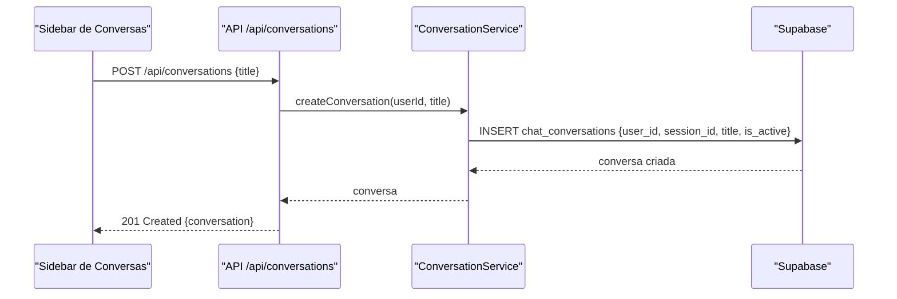
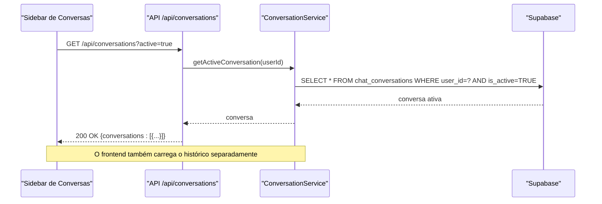
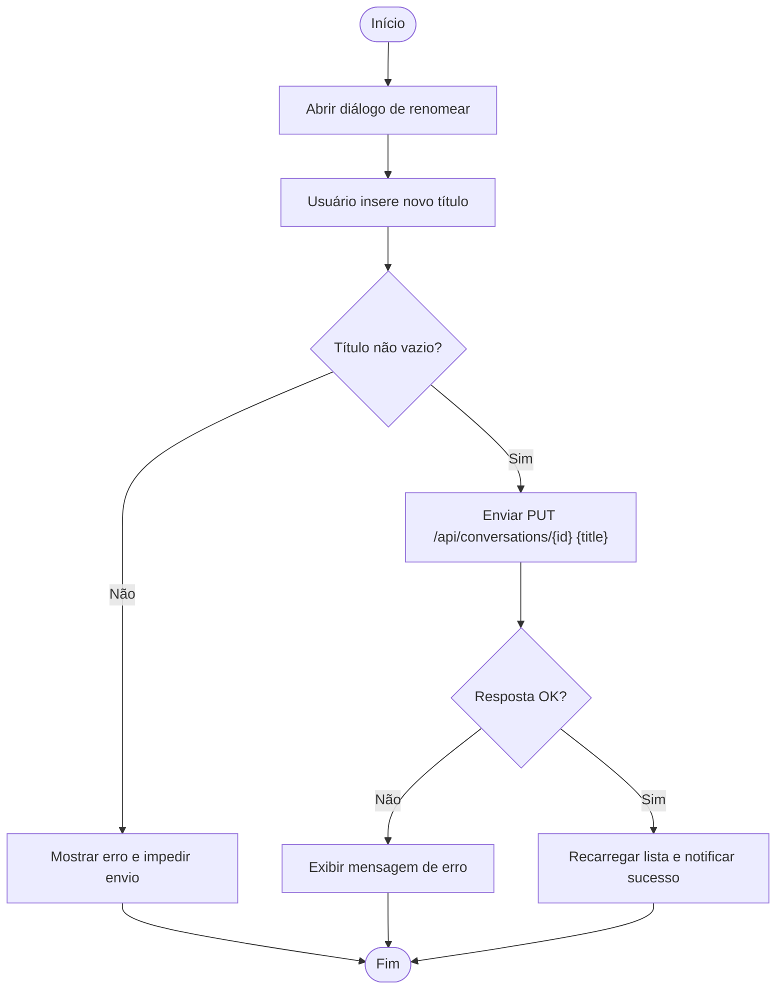
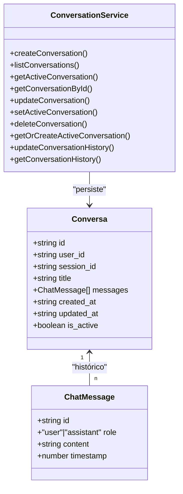

# Entidade Conversa

<cite>
**Arquivo referenciado nesta documentação**
- [20250122_create_chat_conversations.sql](file://supabase/migrations/20250122_create_chat_conversations.sql)
- [conversation.types.ts](file://backend/services/conversation/conversation.types.ts)
- [conversation.service.ts](file://backend/services/conversation/conversation.service.ts)
- [conversations.route.ts](file://app/api/conversations/route.ts)
- [conversations.[id].route.ts](file://app/api/conversations/[id]/route.ts)
- [conversations-sidebar.tsx](file://components/conversations-sidebar.tsx)
- [rename-conversation-dialog.tsx](file://components/rename-conversation-dialog.tsx)
</cite>

## Sumário
Esta documentação descreve a entidade Conversa, que representa uma sessão de chat com IA no sistema. Ela explica os campos, relacionamentos com o usuário, o papel do campo ativo para arquivamento e o uso do session_id com o N8N. Também detalha políticas de segurança (RLS), fluxos de API e boas práticas de renomeação.

## Introdução
A entidade Conversa armazena as sessões de chat com o assistente IA. Cada conversa pertence a um único usuário e pode ser marcada como ativa, sendo usada como “foco” da experiência do usuário. O campo session_id é um identificador único usado pelo N8N para manter o contexto entre interações.

## Estrutura da Entidade
Abaixo estão os principais campos da entidade Conversa:

- id: Identificador único da conversa (UUID)
- user_id: Chave estrangeira para auth.users (usuário proprietário)
- session_id: Identificador único usado pelo N8N (único)
- title: Título da conversa (padrão: “Nova Conversa”)
- messages: Histórico completo de mensagens em formato JSONB (padrão: array vazio)
- created_at: Timestamp de criação
- updated_at: Timestamp de última atualização
- is_active: Indica se a conversa é a atualmente ativa do usuário (apenas uma por usuário)

Observações importantes:
- O campo is_active garante que apenas uma conversa esteja ativa por usuário, com triggers e lógica de serviço que desmarcam outras conversas quando uma é marcada como ativa.
- O session_id é único e serve como identificador externo com o N8N, mantendo o contexto da conversa fora do banco de dados.

**Seção fonte**
- [20250122_create_chat_conversations.sql](file://supabase/migrations/20250122_create_chat_conversations.sql#L6-L16)
- [20250122_create_chat_conversations.sql](file://supabase/migrations/20250122_create_chat_conversations.sql#L19-L23)

## Relacionamento com o Usuário
- A conversa pertence a um único usuário (relacionamento com auth.users).
- As políticas de segurança (RLS) garantem que cada usuário só veja e manipule suas próprias conversas.

**Seção fonte**
- [20250122_create_chat_conversations.sql](file://supabase/migrations/20250122_create_chat_conversations.sql#L9-L10)
- [20250122_create_chat_conversations.sql](file://supabase/migrations/20250122_create_chat_conversations.sql#L38-L60)

## Uso do session_id com o N8N
- O session_id é um identificador único usado pelo N8N para persistir o contexto da conversa.
- Ele é único no banco de dados e serve como chave externa entre o sistema e o agente N8N.

**Seção fonte**
- [20250122_create_chat_conversations.sql](file://supabase/migrations/20250122_create_chat_conversations.sql#L10-L10)
- [20250122_create_chat_conversations.sql](file://supabase/migrations/20250122_create_chat_conversations.sql#L19-L21)

## Arquivamento com o campo is_active
- O campo is_active permite que o usuário tenha uma única conversa ativa.
- Quando uma conversa é marcada como ativa, todas as demais do mesmo usuário são desmarcadas automaticamente.
- A API e o frontend permitem marcar uma conversa como ativa (pinar) e obter a conversa ativa.

**Seção fonte**
- [20250122_create_chat_conversations.sql](file://supabase/migrations/20250122_create_chat_conversations.sql#L31-L33)
- [20250122_create_chat_conversations.sql](file://supabase/migrations/20250122_create_chat_conversations.sql#L77-L100)
- [conversation.service.ts](file://backend/services/conversation/conversation.service.ts#L177-L187)
- [conversations-sidebar.tsx](file://components/conversations-sidebar.tsx#L124-L146)

## Exemplos de Dados
- Um registro típico de conversa inclui: id, user_id, session_id, title, messages, created_at, updated_at, is_active.
- Exemplo de histórico de mensagens: array de objetos com campos como role, content, timestamp.

**Seção fonte**
- [20250122_create_chat_conversations.sql](file://supabase/migrations/20250122_create_chat_conversations.sql#L12-L12)
- [conversation.types.ts](file://backend/services/conversation/conversation.types.ts#L1-L18)

## Políticas RLS (Controle de Acesso)
- Visualizar: somente o usuário dono pode ler suas conversas.
- Inserir: somente o usuário autenticado pode criar conversas.
- Atualizar: somente o usuário dono pode modificar.
- Deletar: somente o usuário dono pode excluir.

Essas políticas são aplicadas diretamente no banco de dados e garantem integridade de acesso.

**Seção fonte**
- [20250122_create_chat_conversations.sql](file://supabase/migrations/20250122_create_chat_conversations.sql#L38-L60)

## Fluxos de API e Frontend
A seguir, o fluxo de criação de uma nova conversa e como o frontend interage com a API.

**Fontes do diagrama**
- [conversations.route.ts](file://app/api/conversations/route.ts#L52-L87)
- [conversation.service.ts](file://backend/services/conversation/conversation.service.ts#L16-L40)

Outro fluxo importante é a obtenção da conversa ativa:

**Fontes do diagrama**
- [conversations.route.ts](file://app/api/conversations/route.ts#L11-L32)
- [conversation.service.ts](file://backend/services/conversation/conversation.service.ts#L76-L98)

## Renomeação de Conversa
- O frontend apresenta um diálogo para renomear a conversa.
- A ação envia uma requisição PUT para /api/conversations/[id] com o novo título.
- O backend valida que o título não esteja vazio e atualiza a conversa.

**Fontes do fluxo**
- [rename-conversation-dialog.tsx](file://components/rename-conversation-dialog.tsx#L41-L96)
- [conversations.[id].route.ts](file://app/api/conversations/[id]/route.ts#L48-L83)
- [conversation.service.ts](file://backend/services/conversation/conversation.service.ts#L121-L175)

## Relacionamento com Histórico de Mensagens
- A entidade Conversa armazena o histórico de mensagens em JSONB.
- Além disso, há um mecanismo separado de persistência de histórico (chat_conversation_history) com upsert baseado em conversation_id.

**Seção fonte**
- [20250122_create_chat_conversations.sql](file://supabase/migrations/20250122_create_chat_conversations.sql#L12-L12)
- [conversation.service.ts](file://backend/services/conversation/conversation.service.ts#L225-L271)

## Boas Práticas de Renomeação
- Valide que o título não esteja vazio antes de enviar a requisição.
- Utilize o diálogo de renomeação integrado ao frontend para evitar inconsistências.
- Após renomear, recarregue a lista de conversas para refletir a mudança imediatamente.

**Seção fonte**
- [rename-conversation-dialog.tsx](file://components/rename-conversation-dialog.tsx#L41-L96)
- [conversations-sidebar.tsx](file://components/conversations-sidebar.tsx#L148-L153)

## Resumo de Campos
- id: UUID, chave primária
- user_id: UUID, FK para auth.users
- session_id: Texto único, usado pelo N8N
- title: Texto, padrão “Nova Conversa”
- messages: JSONB, histórico de mensagens
- created_at / updated_at: Timestamps
- is_active: Booleano, indica conversa ativa

**Seção fonte**
- [20250122_create_chat_conversations.sql](file://supabase/migrations/20250122_create_chat_conversations.sql#L6-L16)

## Diagrama de Classes (Modelagem)

**Fontes do diagrama**
- [conversation.types.ts](file://backend/services/conversation/conversation.types.ts#L1-L54)
- [conversation.service.ts](file://backend/services/conversation/conversation.service.ts#L1-L274)

## Conclusão
A entidade Conversa é o núcleo da funcionalidade de chat com IA. Com RLS ativa, session_id exclusivo e o controle de conversa ativa, ela oferece segurança, rastreabilidade com o N8N e uma experiência de usuário fluida. O frontend e a API seguem um padrão claro de operações CRUD com validações e cache para melhor performance.