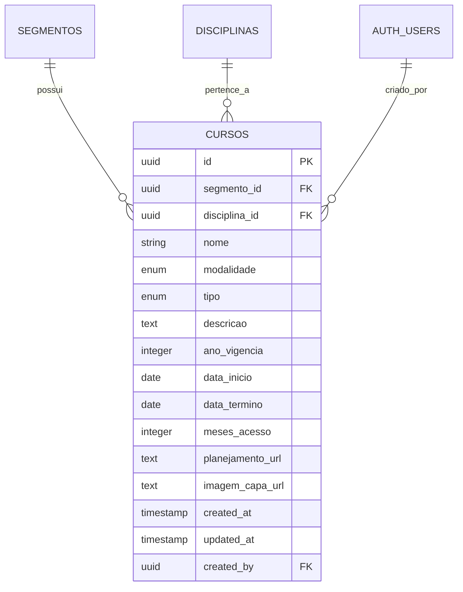
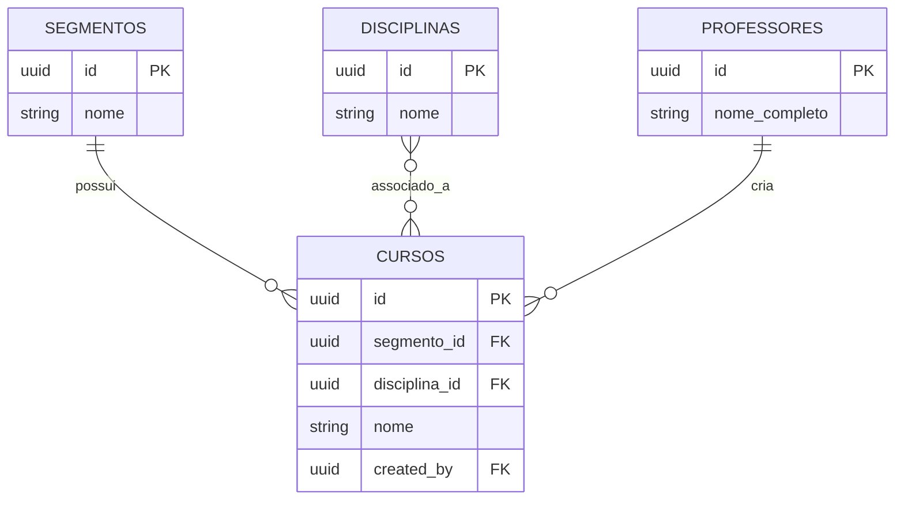
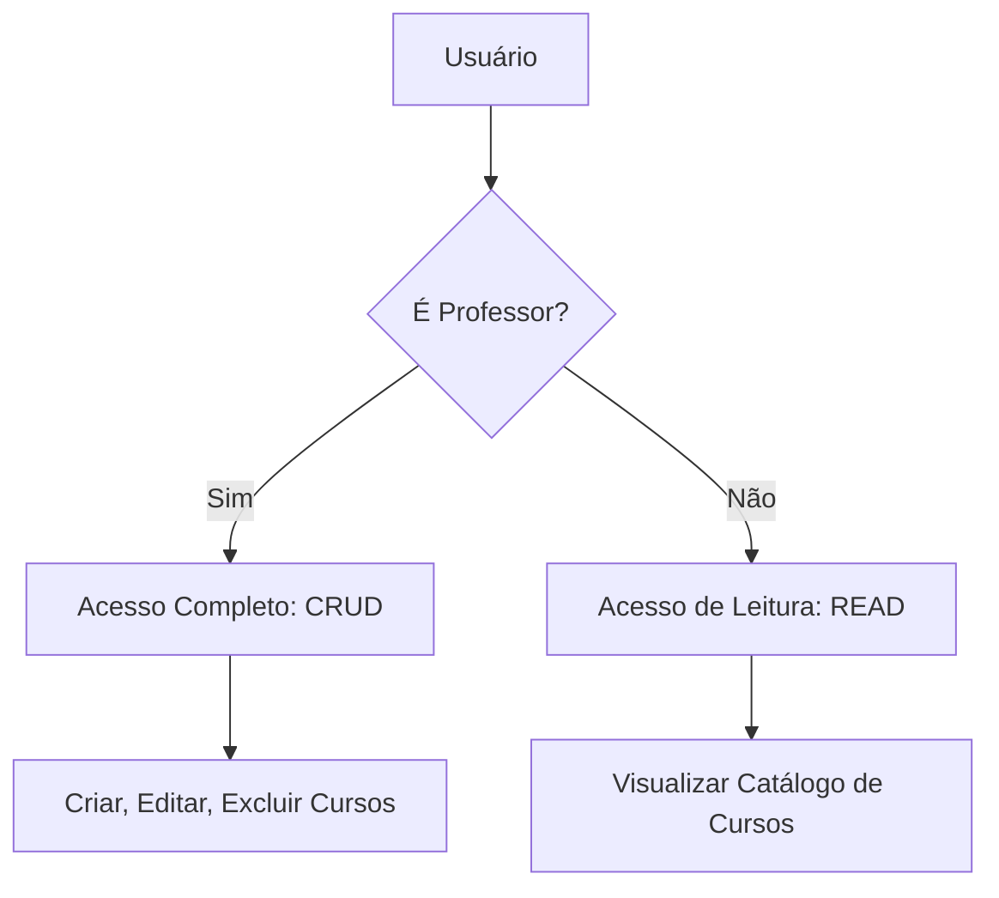
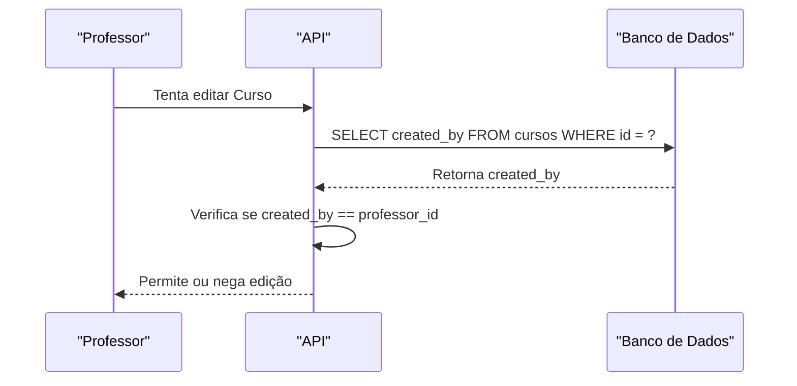

# Entidade Curso

<cite>
**Arquivos Referenciados neste Documento**   
- [schema.md](file://docs/schema/schema.md)
- [course.types.ts](file://backend/services/course/course.types.ts)
- [course.service.ts](file://backend/services/course/course.service.ts)
- [course.repository.ts](file://backend/services/course/course.repository.ts)
- [route.ts](file://app/api/course/route.ts)
</cite>

## Sumário
1. [Introdução](#introdução)
2. [Estrutura da Entidade Curso](#estrutura-da-entidade-curso)
3. [Campos da Entidade](#campos-da-entidade)
4. [Relacionamentos com Outras Entidades](#relacionamentos-com-outras-entidades)
5. [Políticas RLS (Row Level Security)](#políticas-rls-row-level-security)
6. [Exemplos de Dados](#exemplos-de-dados)
7. [Padrões de Nomenclatura](#padrões-de-nomenclatura)
8. [Uso do Campo created_by para Controle de Autorização](#uso-do-campo-created_by-para-controle-de-autorização)

## Introdução
A entidade **Curso** é um componente central do sistema, representando ofertas educacionais que podem ser acessadas por alunos. Esta documentação detalha sua estrutura, relacionamentos, políticas de segurança e padrões de uso, com foco especial no controle de acesso e autorização baseado no campo `created_by`.

## Estrutura da Entidade Curso

A entidade Curso é definida no banco de dados com uma estrutura que permite flexibilidade na modelagem de diferentes tipos de cursos, modalidades e períodos de vigência. A tabela `cursos` é a base para armazenar todas as informações sobre os cursos oferecidos.



**Fontes do Diagrama**
- [schema.md](file://docs/schema/schema.md#L46-L63)
- [course.types.ts](file://backend/services/course/course.types.ts#L4-L21)

**Fontes da Seção**
- [schema.md](file://docs/schema/schema.md#L46-L63)
- [course.types.ts](file://backend/services/course/course.types.ts#L4-L21)

## Campos da Entidade

A entidade Curso possui os seguintes campos:

- `id`: Identificador único do curso (UUID)
- `segmento_id`: Chave estrangeira para a entidade Segmento
- `disciplina_id`: Chave estrangeira para a entidade Disciplina (mantida para compatibilidade)
- `nome`: Nome do curso
- `modalidade`: Modalidade do curso (EAD ou LIVE)
- `tipo`: Tipo do curso (Superextensivo, Extensivo, etc.)
- `descricao`: Descrição detalhada do curso
- `ano_vigencia`: Ano de vigência do curso
- `data_inicio`: Data de início do curso
- `data_termino`: Data de término do curso
- `meses_acesso`: Número de meses de acesso ao curso
- `planejamento_url`: URL para o planejamento do curso
- `imagem_capa_url`: URL da imagem de capa do curso
- `created_at`: Data de criação do curso
- `updated_at`: Data da última atualização do curso
- `created_by`: Usuário que criou o curso (chave estrangeira para auth.users)

**Fontes da Seção**
- [schema.md](file://docs/schema/schema.md#L46-L63)
- [course.types.ts](file://backend/services/course/course.types.ts#L4-L21)

## Relacionamentos com Outras Entidades

A entidade Curso possui relacionamentos com três entidades principais:

1. **Segmento**: Um curso pertence a um segmento (ex: Pré-vestibular, Concursos)
2. **Disciplina**: Um curso está associado a uma ou mais disciplinas
3. **Professor**: Um curso é criado por um professor, identificado pelo campo `created_by`

O relacionamento com disciplinas foi expandido para suportar múltiplas disciplinas por curso, utilizando uma tabela de junção `cursos_disciplinas`, embora o campo `disciplina_id` seja mantido para compatibilidade com versões anteriores.



**Fontes do Diagrama**
- [schema.md](file://docs/schema/schema.md#L31-L44)
- [course.repository.ts](file://backend/services/course/course.repository.ts#L21-L37)

**Fontes da Seção**
- [schema.md](file://docs/schema/schema.md#L31-L63)
- [course.repository.ts](file://backend/services/course/course.repository.ts#L21-L37)

## Políticas RLS (Row Level Security)

As políticas de segurança de linha (RLS) garantem que:

1. **Leitura pública do catálogo**: Qualquer usuário pode visualizar os cursos
2. **Escrita restrita a professores**: Apenas professores podem criar, editar ou excluir cursos

As políticas implementadas são:

- `Catálogo de Cursos é Público`: Permite SELECT para todos os usuários
- `Professores criam cursos`: Permite INSERT apenas para professores
- `Professores editam seus cursos`: Permite UPDATE apenas para o criador do curso
- `Professores deletam seus cursos`: Permite DELETE apenas para o criador do curso

Essas políticas são implementadas no nível do banco de dados e garantem que apenas professores autenticados possam modificar cursos, enquanto mantêm o catálogo acessível a todos.



**Fontes do Diagrama**
- [schema.md](file://docs/schema/schema.md#L157-L158)
- [schema.md](file://docs/schema/schema.md#L348-L355)

**Fontes da Seção**
- [schema.md](file://docs/schema/schema.md#L157-L158)
- [schema.md](file://docs/schema/schema.md#L348-L355)
- [route.ts](file://app/api/course/route.ts#L53-L54)

## Exemplos de Dados

Exemplo de um curso Superextensivo de Matemática:

```json
{
  "id": "a1b2c3d4-e5f6-7890-g1h2-i3j4k5l6m7n8",
  "segmento_id": "p1q2r3s4-t5u6-7890-v1w2-x3y4z5a6b7c8",
  "disciplina_id": "d1e2f3g4-h5i6-7890-j1k2-l3m4n5o6p7q8",
  "nome": "Superextensivo Matemática 2025",
  "modalidade": "EAD",
  "tipo": "Superextensivo",
  "descricao": "Curso completo de matemática para vestibulares e concursos",
  "ano_vigencia": 2025,
  "data_inicio": "2025-01-01",
  "data_termino": "2025-12-31",
  "meses_acesso": 12,
  "planejamento_url": "https://storage.example.com/planejamento/superext-mat-2025.pdf",
  "imagem_capa_url": "https://storage.example.com/imagens/capas/superext-mat-2025.jpg",
  "created_at": "2024-12-15T10:30:00Z",
  "updated_at": "2024-12-15T10:30:00Z",
  "created_by": "u1v2w3x4-y5z6-7890-a1b2-c3d4e5f6g7h8"
}
```

**Fontes da Seção**
- [course.types.ts](file://backend/services/course/course.types.ts#L4-L21)
- [course.service.ts](file://backend/services/course/course.service.ts#L34-L72)

## Padrões de Nomenclatura

Os padrões de nomenclatura seguem convenções consistentes:

- **Campos no banco de dados**: Utilizam snake_case (ex: `ano_vigencia`, `data_inicio`)
- **Campos no código TypeScript**: Utilizam camelCase (ex: `year`, `startDate`)
- **Enums**: Valores definidos como strings com capitalização inicial (ex: 'Superextensivo', 'Extensivo')
- **Modalidades**: Valores 'EAD' e 'LIVE' em maiúsculas

Esses padrões garantem consistência entre o banco de dados e a camada de aplicação, facilitando a manutenção e evolução do sistema.

**Fontes da Seção**
- [schema.md](file://docs/schema/schema.md#L55-L58)
- [course.types.ts](file://backend/services/course/course.types.ts#L1-L2)

## Uso do Campo created_by para Controle de Autorização

O campo `created_by` é fundamental para o controle de autorização no sistema:

1. **Identificação do criador**: Armazena o ID do professor que criou o curso
2. **Controle de acesso**: Usado nas políticas RLS para verificar se o usuário atual pode modificar o curso
3. **Auditoria**: Permite rastrear quem criou ou modificou cada curso

A autorização é verificada tanto no nível do banco de dados (através de políticas RLS) quanto na camada de aplicação (no serviço de cursos). Quando um professor tenta editar um curso, o sistema verifica se o `created_by` do curso corresponde ao ID do professor autenticado.



**Fontes do Diagrama**
- [schema.md](file://docs/schema/schema.md#L248)
- [schema.md](file://docs/schema/schema.md#L352)
- [course.service.ts](file://backend/services/course/course.service.ts#L81-L161)

**Fontes da Seção**
- [schema.md](file://docs/schema/schema.md#L248)
- [schema.md](file://docs/schema/schema.md#L352)
- [course.service.ts](file://backend/services/course/course.service.ts#L81-L161)
- [route.ts](file://app/api/course/route.ts#L53-L54)