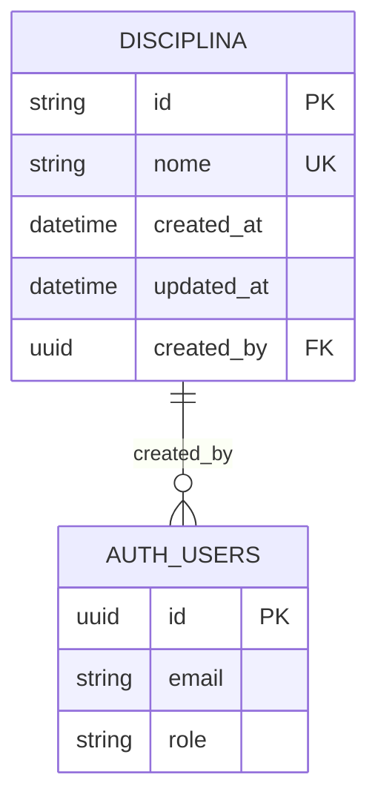
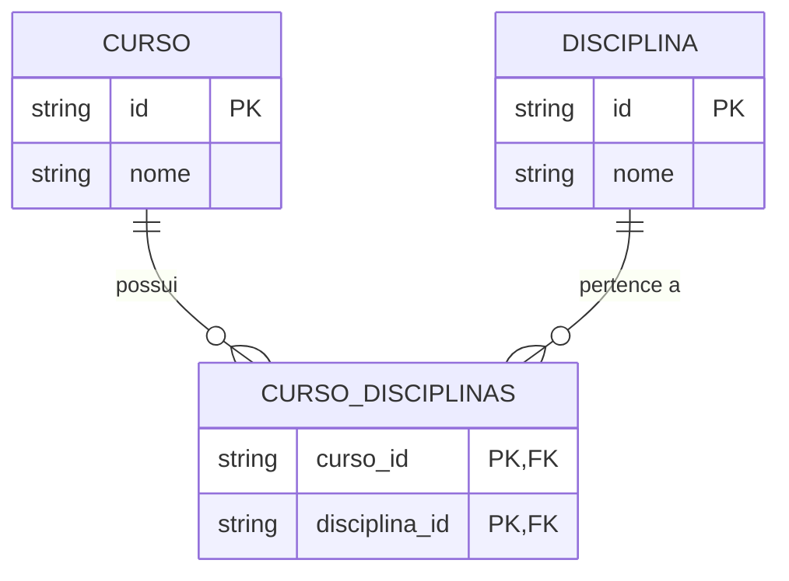
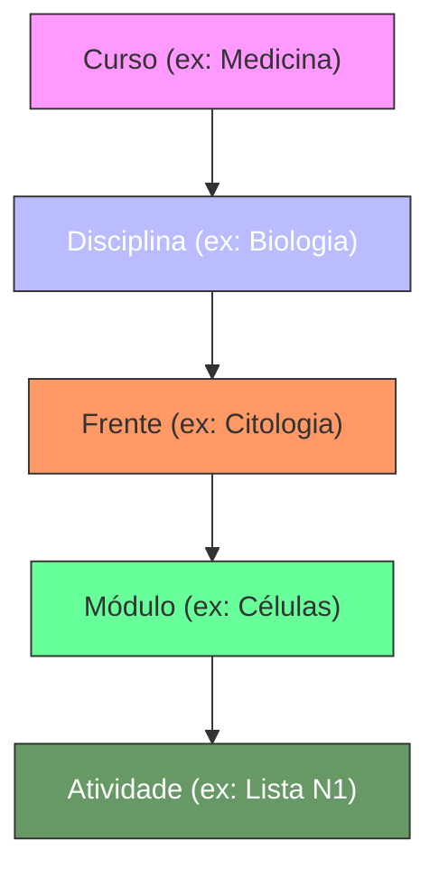

# Entidade Disciplina

<cite>
**Arquivos Referenciados neste Documento**  
- [discipline.types.ts](file://backend/services/discipline/discipline.types.ts)
- [discipline.service.ts](file://backend/services/discipline/discipline.service.ts)
- [discipline.repository.ts](file://backend/services/discipline/discipline.repository.ts)
- [route.ts](file://app/api/discipline/route.ts)
- [20250131_ensure_disciplinas_created_by.sql](file://supabase/migrations/20250131_ensure_disciplinas_created_by.sql)
- [schema.md](file://docs/schema/schema.md)
- [sala-estudos-filters.tsx](file://components/sala-estudos-filters.tsx)
</cite>

## Sumário
1. [Introdução](#introdução)
2. [Estrutura da Entidade](#estrutura-da-entidade)
3. [Campos da Entidade](#campos-da-entidade)
4. [Relação com Cursos](#relação-com-cursos)
5. [Políticas de RLS (Row Level Security)](#políticas-de-rls-row-level-security)
6. [Uso em Filtros de Busca](#uso-em-filtros-de-busca)
7. [Exemplos de Dados e Normalização](#exemplos-de-dados-e-normalização)
8. [Conclusão](#conclusão)

## Introdução

A entidade **Disciplina** é um componente fundamental do sistema, servindo como um catálogo de áreas de conhecimento que estruturam os conteúdos dos cursos. Ela permite organizar o conteúdo educacional por áreas específicas, como Matemática, Física, Biologia, entre outras. A entidade é projetada para ser de leitura pública, permitindo que todos os usuários possam visualizar as disciplinas disponíveis, mas com escrita restrita apenas a professores autenticados. Isso garante que apenas usuários autorizados possam criar ou modificar disciplinas, mantendo a integridade e consistência do catálogo.

**Seção fontes**
- [schema.md](file://docs/schema/schema.md#L39-L44)

## Estrutura da Entidade

A entidade Disciplina é implementada como uma tabela no banco de dados PostgreSQL, com os seguintes campos principais: `id`, `nome`, `created_at`, `updated_at` e `created_by`. O campo `id` é um UUID gerado automaticamente, servindo como identificador único. O campo `nome` armazena o nome da disciplina, sendo único no sistema para evitar duplicações. Os campos `created_at` e `updated_at` registram automaticamente os timestamps de criação e atualização, respectivamente. O campo `created_by` é uma chave estrangeira que referencia o usuário (professor) responsável pela criação da disciplina na tabela `auth.users`.

A estrutura da entidade é mapeada para uma interface TypeScript no backend, garantindo tipagem segura e consistência entre o frontend e o backend. A comunicação entre essas camadas é feita através de serviços e repositórios que abstraem a lógica de negócios e a interação com o banco de dados.

**Fontes do diagrama**
- [schema.md](file://docs/schema/schema.md#L39-L44)
- [discipline.types.ts](file://backend/services/discipline/discipline.types.ts#L1-L6)

**Seção fontes**
- [discipline.types.ts](file://backend/services/discipline/discipline.types.ts#L1-L6)
- [discipline.repository.ts](file://backend/services/discipline/discipline.repository.ts#L15-L20)

## Campos da Entidade

### id
O campo `id` é um identificador único gerado automaticamente utilizando UUID. Ele serve como chave primária da tabela e é utilizado para referenciar a disciplina em outras entidades, como Cursos e Frentes.

### nome
O campo `nome` armazena o nome da disciplina, como "Matemática" ou "Física". Ele possui validações rigorosas para garantir a qualidade dos dados:
- Mínimo de 3 caracteres
- Máximo de 120 caracteres
- Valor obrigatório
- Deve ser único no sistema

Essas validações são implementadas tanto no backend quanto no frontend, garantindo que apenas nomes válidos sejam armazenados.

### created_at e updated_at
Os campos `created_at` e `updated_at` são timestamps que registram automaticamente a data e hora de criação e última atualização da disciplina, respectivamente. Eles são mantidos atualizados por triggers no banco de dados, garantindo consistência e auditoria.

### created_by
O campo `created_by` é uma chave estrangeira que referencia o ID do usuário (professor) que criou a disciplina na tabela `auth.users`. Esse campo é preenchido automaticamente pela trigger `set_created_by_disciplinas` antes da inserção, utilizando o ID do usuário autenticado. Isso permite rastrear qual professor foi responsável pela criação de cada disciplina, facilitando auditoria e governança.

**Seção fontes**
- [discipline.types.ts](file://backend/services/discipline/discipline.types.ts#L1-L6)
- [discipline.service.ts](file://backend/services/discipline/discipline.service.ts#L79-L97)
- [20250131_ensure_disciplinas_created_by.sql](file://supabase/migrations/20250131_ensure_disciplinas_created_by.sql#L9-L18)

## Relação com Cursos

A entidade Disciplina está diretamente relacionada à entidade Curso através de uma tabela de junção chamada `cursos_disciplinas`. Essa relação muitos-para-muitos permite que um curso tenha múltiplas disciplinas e que uma disciplina possa pertencer a múltiplos cursos. Por exemplo, a disciplina "Matemática" pode estar presente em cursos de "Medicina" e "Engenharia".

Essa relação é gerenciada pelo serviço `CourseRepository` no backend, que fornece métodos para associar e desassociar disciplinas de um curso. Quando um professor configura um curso, ele pode selecionar quais disciplinas farão parte daquele curso específico.

**Fontes do diagrama**
- [course.repository.ts](file://backend/services/course/course.repository.ts#L249-L274)
- [schema.md](file://docs/schema/schema.md#L47-L63)

**Seção fontes**
- [course.repository.ts](file://backend/services/course/course.repository.ts#L249-L274)

## Políticas de RLS (Row Level Security)

As políticas de segurança de nível de linha (RLS) são fundamentais para controlar o acesso à entidade Disciplina. As políticas implementadas são:

- **Leitura Pública**: Qualquer usuário autenticado pode visualizar a lista de disciplinas. Isso é essencial para que alunos possam explorar o catálogo de disciplinas disponíveis.
- **Escrita Restrita**: Apenas professores autenticados podem criar, atualizar ou excluir disciplinas. Isso é garantido pela política RLS que verifica se o usuário pertence à tabela `professores`.

A política de escrita utiliza a verificação `EXISTS (SELECT 1 FROM public.professores WHERE id = auth.uid())` para garantir que apenas professores possam modificar disciplinas. Além disso, a trigger `set_created_by_disciplinas` garante que o campo `created_by` seja automaticamente preenchido com o ID do professor criador.

**Seção fontes**
- [schema.md](file://docs/schema/schema.md#L156-L157)
- [schema.md](file://docs/schema/schema.md#L363-L365)

## Uso em Filtros de Busca

A entidade Disciplina desempenha um papel crucial nos filtros de busca da **Sala de Estudos** e do **Cronograma**, servindo como um nível intermediário de filtragem entre o Curso e a Frente. O fluxo de filtragem segue a hierarquia: Curso → Disciplina → Frente → Módulo → Atividade.

No componente `SalaEstudosFilters`, implementado em `sala-estudos-filters.tsx`, os usuários podem selecionar um curso, o que carrega dinamicamente as disciplinas associadas àquele curso. Ao selecionar uma disciplina, o sistema filtra as frentes correspondentes, permitindo uma navegação hierárquica eficiente pelo conteúdo.

Esse padrão de filtragem é essencial para organizar grandes volumes de conteúdo educacional, permitindo que os alunos encontrem rapidamente os materiais relevantes para sua área de estudo.

**Fontes do diagrama**
- [sala-estudos-filters.tsx](file://components/sala-estudos-filters.tsx#L57-L59)
- [GUIA_VISUAL_SALA_ESTUDOS.md](file://docs/GUIA_VISUAL_SALA_ESTUDOS.md#L32-L43)

**Seção fontes**
- [sala-estudos-filters.tsx](file://components/sala-estudos-filters.tsx#L19-L22)
- [GUIA_VISUAL_SALA_ESTUDOS.md](file://docs/GUIA_VISUAL_SALA_ESTUDOS.md#L32-L43)

## Exemplos de Dados e Normalização

A seguir estão exemplos de dados válidos para a entidade Disciplina:

| id | nome | created_at | updated_at | created_by |
|----|------|------------|------------|------------|
| a1b2c3d4 | Matemática | 2025-01-15T10:00:00Z | 2025-01-15T10:00:00Z | usr-001 |
| e5f6g7h8 | Física | 2025-01-15T10:05:00Z | 2025-01-15T10:05:00Z | usr-001 |
| i9j0k1l2 | Química | 2025-01-15T10:10:00Z | 2025-01-15T10:10:00Z | usr-002 |

Para garantir a normalização dos nomes de disciplinas, as seguintes orientações devem ser seguidas:
- Utilizar capitalização padrão (ex: "Matemática", não "matemática" ou "MATEMÁTICA")
- Evitar abreviações não padronizadas
- Manter consistência na nomenclatura (ex: usar sempre "Ciências da Natureza" em vez de alternar com "Ciências Naturais")
- Normalizar espaços extras e caracteres especiais

Essas práticas garantem que a busca e filtragem funcionem corretamente, evitando duplicações por variações de escrita.

**Seção fontes**
- [schema.md](file://docs/schema/schema.md#L192-L194)
- [discipline.service.ts](file://backend/services/discipline/discipline.service.ts#L26-L31)

## Conclusão

A entidade Disciplina é um pilar central na organização do conteúdo educacional do sistema, fornecendo uma estrutura clara e hierárquica para categorizar conhecimentos. Sua implementação combina segurança rigorosa através de RLS, usabilidade através de filtros hierárquicos e integridade de dados através de validações e normalização. O rastreamento do professor criador via campo `created_by` adiciona uma camada importante de governança, permitindo auditoria e responsabilidade sobre o conteúdo criado. Essa entidade é fundamental para o funcionamento eficiente da Sala de Estudos, Cronograma e outros módulos que dependem da organização por áreas de conhecimento.