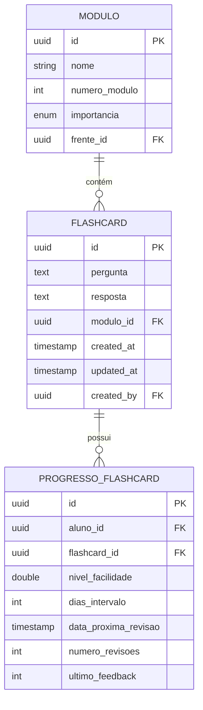

# Entidade Flashcard

<cite>
**Arquivos Referenciados neste Documento**   
- [flashcards.service.ts](file://backend/services/flashcards/flashcards.service.ts#L1-L1580)
- [flashcards.schema.md](file://docs/CONFIGURACAO_FLASHCARDS.md#L71-L88)
- [route.ts](file://app/api/flashcards/route.ts#L1-L162)
- [import/route.ts](file://app/api/flashcards/import/route.ts#L1-L44)
- [revisao/route.ts](file://app/api/flashcards/revisao/route.ts#L1-L36)
- [feedback/route.ts](file://app/api/flashcards/feedback/route.ts#L1-L38)
- [VERIFICACAO_FLASHCARDS_MODULOS.md](file://docs/VERIFICACAO_FLASHCARDS_MODULOS.md#L1-L105)
- [ANALISE_SERVICO_FLASHCARDS.md](file://docs/ANALISE_SERVICO_FLASHCARDS.md#L1-L278)
</cite>

## Sumário
1. [Introdução](#introdução)
2. [Campos da Entidade](#campos-da-entidade)
3. [Relacionamentos](#relacionamentos)
4. [Revisão com Sistema de Espaçamento Repetido (SRS)](#revisão-com-sistema-de-espaçamento-repetido-srs)
5. [Importação em Massa](#importação-em-massa)
6. [Políticas RLS](#políticas-rls)
7. [Exemplos de Dados](#exemplos-de-dados)
8. [Considerações Finais](#considerações-finais)

## Introdução

A entidade `Flashcard` representa um par de memorização utilizado no sistema de aprendizado por micro-sessões. Cada flashcard contém uma pergunta e uma resposta, sendo associado a um módulo específico dentro da estrutura hierárquica de cursos, disciplinas e frentes. O uso de flashcards é centralizado no sistema de revisão inteligente baseado em algoritmos de espaçamento repetido (SRS), permitindo que os alunos revisem conteúdos com base em sua dificuldade percebida.

A entidade é gerenciada por professores, que podem criar, editar ou importar flashcards em massa. Os alunos interagem com os flashcards durante sessões de revisão, fornecendo feedback que alimenta o algoritmo SRS e influencia futuras revisões.

**Seção fontes**
- [ANALISE_SERVICO_FLASHCARDS.md](file://docs/ANALISE_SERVICO_FLASHCARDS.md#L1-L278)
- [CONFIGURACAO_FLASHCARDS.md](file://docs/CONFIGURACAO_FLASHCARDS.md#L71-L88)

## Campos da Entidade

A tabela `flashcards` possui os seguintes campos:

| Campo | Tipo | Descrição |
|-------|------|-----------|
| `id` | UUID | Identificador único do flashcard |
| `pergunta` | TEXT | Texto da pergunta apresentada ao aluno |
| `resposta` | TEXT | Texto da resposta correta |
| `modulo_id` | UUID | Chave estrangeira referenciando o módulo ao qual o flashcard pertence |
| `created_at` | TIMESTAMP | Data e hora de criação do flashcard |
| `updated_at` | TIMESTAMP | Data e hora da última atualização |
| `created_by` | UUID | Chave estrangeira referenciando o usuário (professor) que criou o flashcard |

O campo `created_by` é essencial para controle de autorização, garantindo que apenas professores possam gerenciar flashcards. Esse campo também permite auditoria de criação e edição.

**Seção fontes**
- [CONFIGURACAO_FLASHCARDS.md](file://docs/CONFIGURACAO_FLASHCARDS.md#L71-L88)
- [flashcards.service.ts](file://backend/services/flashcards/flashcards.service.ts#L71-L75)

## Relacionamentos

A entidade `Flashcard` está diretamente relacionada à entidade `Modulo` através do campo `modulo_id`. Essa relação é fundamental para a organização do conteúdo, pois os flashcards são agrupados por módulos, que por sua vez pertencem a frentes, disciplinas e cursos.

Além disso, o campo `created_by` estabelece um relacionamento com a tabela `auth.users`, permitindo identificar o professor responsável pela criação do flashcard. Isso é usado nas políticas de segurança (RLS) para garantir que apenas professores possam criar ou editar flashcards.

A importância do flashcard é herdada do módulo ao qual pertence. Por exemplo, se um módulo tem importância "Alta", todos os seus flashcards serão considerados de alta importância, influenciando o modo de revisão "Mais Cobrados".



**Fontes do diagrama**
- [VERIFICACAO_FLASHCARDS_MODULOS.md](file://docs/VERIFICACAO_FLASHCARDS_MODULOS.md#L1-L105)
- [CONFIGURACAO_FLASHCARDS.md](file://docs/CONFIGURACAO_FLASHCARDS.md#L71-L88)

## Revisão com Sistema de Espaçamento Repetido (SRS)

Os flashcards são revisados por meio de um sistema de Espaçamento Repetido (SRS), implementado com base no algoritmo SM-2. O progresso de cada aluno é armazenado na tabela `progresso_flashcards`, que registra:

- Nível de facilidade
- Intervalo de dias até a próxima revisão
- Data da próxima revisão
- Número de revisões realizadas
- Último feedback fornecido

Os alunos podem escolher entre diferentes modos de revisão:
- **Revisão Geral**: Flashcards de módulos já estudados
- **Mais Cobrados**: Flashcards de módulos com importância "Alta"
- **Mais Errados (UTI)**: Distribuição ponderada com 50% de "Errei", 30% de "Parcial" e 20% de "Difícil"

Cada sessão consiste em 10 flashcards, e ao final, o aluno recebe um resumo com seu desempenho e pode optar por continuar estudando.

**Seção fontes**
- [IMPLEMENTACAO_MICRO_LEARNING_FLASHCARDS.md](file://docs/IMPLEMENTACAO_MICRO_LEARNING_FLASHCARDS.md#L1-L241)
- [flashcards.service.ts](file://backend/services/flashcards/flashcards.service.ts#L918-L966)

## Importação em Massa

A importação de flashcards em massa é realizada via CSV ou XLSX. O arquivo deve conter três colunas: `Módulo`, `Pergunta` e `Resposta`. O campo `Módulo` deve conter o número do módulo (ex: 1, 2, 3), não o nome.

O processo de importação valida:
- Existência do módulo
- Campos obrigatórios preenchidos
- Formato do arquivo (UTF-8, delimitador ponto e vírgula)

Após a importação, o sistema retorna um relatório com o total de registros processados, inseridos e erros encontrados. O endpoint utilizado é `POST /api/flashcards/import`.

**Seção fontes**
- [CONFIGURACAO_FLASHCARDS.md](file://docs/CONFIGURACAO_FLASHCARDS.md#L150-L191)
- [import/route.ts](file://app/api/flashcards/import/route.ts#L1-L44)

## Políticas RLS

As políticas de Segurança no Nível de Linha (RLS) garantem que:
- Apenas professores possam criar, editar ou deletar flashcards
- Alunos só possam ver flashcards dos módulos de seus cursos matriculados
- O progresso de revisão é acessível apenas pelo aluno correspondente

A política para a tabela `flashcards` permite acesso total a professores, verificando a existência do usuário na tabela `professores`. Já a tabela `progresso_flashcards` usa a condição `auth.uid() = aluno_id` para restringir o acesso.

```sql
-- Política para flashcards: Professores podem tudo
CREATE POLICY "Professores podem gerenciar flashcards"
ON public.flashcards
FOR ALL
USING (
  EXISTS (
    SELECT 1 FROM public.professores
    WHERE id = auth.uid()
  )
);

-- Política para progresso: Alunos veem apenas seus próprios
CREATE POLICY "Alunos veem apenas seu progresso"
ON public.progresso_flashcards
FOR ALL
USING (auth.uid() = aluno_id);
```

**Seção fontes**
- [CONFIGURACAO_FLASHCARDS.md](file://docs/CONFIGURACAO_FLASHCARDS.md#L218-L239)
- [flashcards.service.ts](file://backend/services/flashcards/flashcards.service.ts#L121-L131)

## Exemplos de Dados

Exemplo de registro na tabela `flashcards`:

```json
{
  "id": "a1b2c3d4-e5f6-7890-g1h2-i3j4k5l6m7n8",
  "modulo_id": "m1n2o3p4-q5r6-7890-s1t2-u3v4w5x6y7z8",
  "pergunta": "Qual é a fórmula de Bhaskara?",
  "resposta": "x = (-b ± √(b²-4ac)) / 2a",
  "created_at": "2025-01-30T10:00:00Z",
  "updated_at": "2025-01-30T10:00:00Z",
  "created_by": "p1q2r3s4-t5u6-7890-v1w2-x3y4z5a6b7c8"
}
```

Exemplo de arquivo CSV para importação:

```csv
Módulo;Pergunta;Resposta
1;Qual é a fórmula de Bhaskara?;"x = (-b ± √(b²-4ac)) / 2a"
2;Qual é a segunda lei de Newton?;F = ma
3;O que é fotossíntese?;Processo pelo qual plantas convertem luz em energia
```

**Seção fontes**
- [CONFIGURACAO_FLASHCARDS.md](file://docs/CONFIGURACAO_FLASHCARDS.md#L162-L191)

## Considerações Finais

A entidade `Flashcard` é um componente central do sistema de aprendizagem ativa, integrando-se perfeitamente com a estrutura de cursos e o sistema de revisão inteligente. Sua implementação robusta, com validações, políticas de segurança e suporte a importação em massa, garante escalabilidade e usabilidade.

A relação com `progresso_flashcards` permite um acompanhamento personalizado do desempenho do aluno, enquanto o uso de RLS assegura a integridade dos dados e o controle de acesso. A herança de importância do módulo simplifica a gestão de prioridades sem necessidade de campos redundantes.

**Seção fontes**
- [ANALISE_SERVICO_FLASHCARDS.md](file://docs/ANALISE_SERVICO_FLASHCARDS.md#L1-L278)
- [VERIFICACAO_FLASHCARDS_MODULOS.md](file://docs/VERIFICACAO_FLASHCARDS_MODULOS.md#L1-L105)