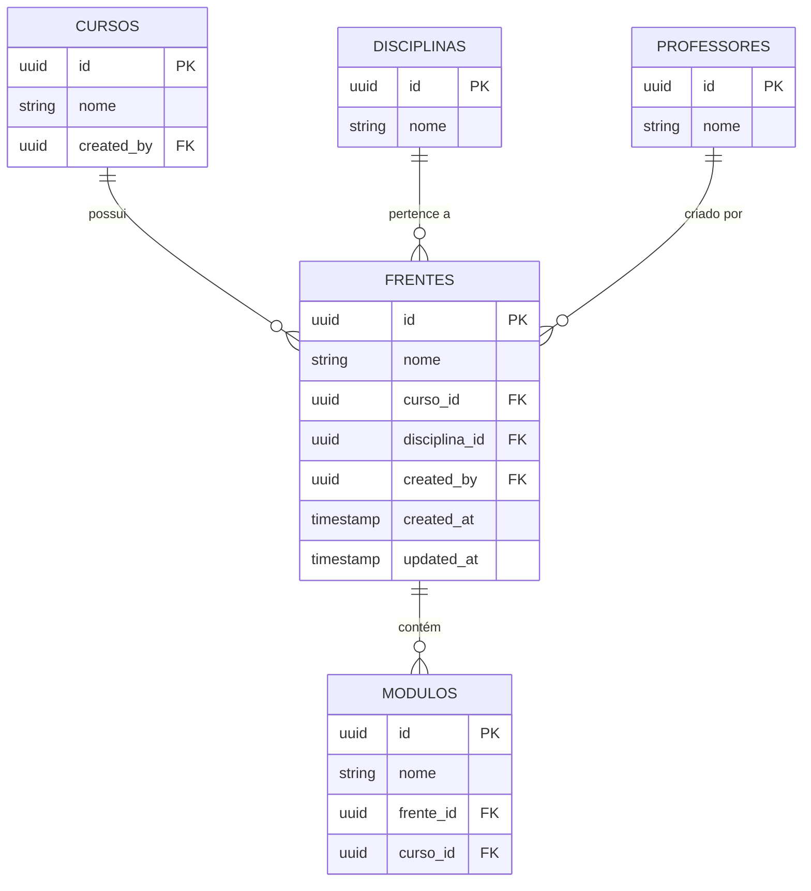
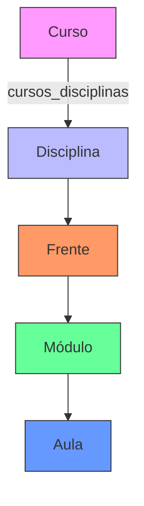

# Entidade Frente

<cite>
**Arquivos Referenciados neste Documento**  
- [frentes](file://supabase/migrations/20251125_add_course_binding_and_filters.sql#L7-L13)
- [modulos](file://supabase/migrations/20251125_add_course_binding_and_filters.sql#L14-L20)
- [aulas](file://supabase/migrations/20251125_add_course_binding_and_filters.sql#L21-L27)
- [cursos_disciplinas](file://docs/VINCULOS_CURSO_DISCIPLINA_FRENTE_MODULO.md#L11-L12)
- [frente\[id]\route.ts](file://app/api/frente/[id]/route.ts)
- [20250128_add_created_by_to_content_tables.sql](file://supabase/migrations/20250128_add_created_by_to_content_tables.sql#L5-L11)
- [schema.md](file://docs/schema/schema.md#L369-L377)
- [VINCULOS_CURSO_DISCIPLINA_FRENTE_MODULO.md](file://docs/VINCULOS_CURSO_DISCIPLINA_FRENTE_MODULO.md)
- [test-frentes.sql](file://supabase/test-frentes.sql)
- [types.ts](file://app/(dashboard)/aluno/sala-de-estudos/types.ts#L42-L48)
</cite>

## Sumário
1. [Introdução](#introdução)
2. [Campos da Entidade Frente](#campos-da-entidade-frente)
3. [Relações Hierárquicas](#relações-hierárquicas)
4. [Controle de Autorização com `created_by`](#controle-de-autorização-com-created_by)
5. [Políticas RLS (Row Level Security)](#políticas-rls-row-level-security)
6. [Exemplos de Dados](#exemplos-de-dados)
7. [Orientações para Nomenclatura](#orientações-para-nomenclatura)
8. [Diagrama de Estrutura Hierárquica](#diagrama-de-estrutura-hierárquica)
9. [Considerações Finais](#considerações-finais)

## Introdução

A entidade **Frente** representa um módulo temático dentro de um curso, servindo como uma subdivisão lógica de uma disciplina específica. Por exemplo, em um curso de Matemática, pode haver frentes como "Frente A - Matemática Básica", "Frente B - Álgebra" e "Frente C - Geometria". Esta documentação detalha a estrutura, relações, políticas de acesso e boas práticas para o uso da entidade Frente no sistema.

**Seção fontes**
- [VINCULOS_CURSO_DISCIPLINA_FRENTE_MODULO.md](file://docs/VINCULOS_CURSO_DISCIPLINA_FRENTE_MODULO.md#L1-L10)

## Campos da Entidade Frente

A tabela `frentes` possui os seguintes campos:

- **`id`**: UUID único que identifica a frente.
- **`nome`**: Nome descritivo da frente (ex: "Frente A - Matemática Básica").
- **`curso_id`**: Chave estrangeira que referencia o curso ao qual a frente pertence. Este campo é obrigatório após a migração `20251125`.
- **`created_at`**: Timestamp de criação do registro, gerado automaticamente.
- **`updated_at`**: Timestamp da última atualização do registro, mantido por trigger.
- **`created_by`**: Chave estrangeira que referencia o usuário (professor) que criou a frente, estabelecendo o controle de autorização.

**Seção fontes**
- [20251125_add_course_binding_and_filters.sql](file://supabase/migrations/20251125_add_course_binding_and_filters.sql#L7-L13)
- [20250128_add_created_by_to_content_tables.sql](file://supabase/migrations/20250128_add_created_by_to_content_tables.sql#L5-L11)

## Relações Hierárquicas

A entidade Frente está posicionada na hierarquia entre **Disciplina** e **Módulo**, formando uma estrutura de organização de conteúdo:

```
Curso
└── cursos_disciplinas (relacionamento muitos-para-muitos)
    └── Disciplina
        └── Frente (tem curso_id e disciplina_id)
            └── Módulo (tem frente_id e curso_id - pode ser NULL)
                └── Aula (tem modulo_id e curso_id - pode ser NULL)
```

Cada frente pertence a uma disciplina específica e a um curso, e contém um ou mais módulos. Essa estrutura permite organizar o conteúdo de forma modular e temática.

**Seção fontes**
- [VINCULOS_CURSO_DISCIPLINA_FRENTE_MODULO.md](file://docs/VINCULOS_CURSO_DISCIPLINA_FRENTE_MODULO.md#L9-L16)

## Controle de Autorização com `created_by`

O campo `created_by` é essencial para o controle de autorização, pois armazena o ID do professor que criou a frente. Esse campo é usado pelas políticas RLS para determinar quem pode editar ou excluir a frente. Apenas o professor que criou a frente ou o criador do curso ao qual ela pertence pode modificar seu conteúdo.

**Seção fontes**
- [20250128_add_created_by_to_content_tables.sql](file://supabase/migrations/20250128_add_created_by_to_content_tables.sql#L5-L11)

## Políticas RLS (Row Level Security)

As políticas RLS garantem que apenas professores autorizados possam criar, editar ou excluir frentes:

- **Criação**: Apenas professores podem criar frentes.
- **Edição**: Apenas o criador da frente ou o criador do curso pode editar a frente.
- **Exclusão**: A exclusão segue a mesma regra de edição, garantindo que apenas usuários com autoridade sobre o curso ou sobre a frente possam removê-la.

Essas políticas são implementadas diretamente no banco de dados e são essenciais para manter a integridade e segurança dos dados.



**Fontes do diagrama**
- [frentes](file://supabase/migrations/20251125_add_course_binding_and_filters.sql#L7-L13)
- [modulos](file://supabase/migrations/20251125_add_course_binding_and_filters.sql#L14-L20)
- [cursos_disciplinas](file://docs/VINCULOS_CURSO_DISCIPLINA_FRENTE_MODULO.md#L11-L12)

**Seção fontes**
- [schema.md](file://docs/schema/schema.md#L369-L377)
- [20250128_add_created_by_to_content_tables.sql](file://supabase/migrations/20250128_add_created_by_to_content_tables.sql#L86-L110)

## Exemplos de Dados

Exemplo de uma frente válida:

```json
{
  "id": "a1b2c3d4-e5f6-7890-g1h2-i3j4k5l6m7n8",
  "nome": "Frente A - Matemática Básica",
  "curso_id": "c1d2e3f4-g5h6-7890-i1j2-k3l4m5n6o7p8",
  "disciplina_id": "d40e20e4-7a2b-4c22-9184-a8504b9c1c6c",
  "created_by": "u1v2w3x4-y5z6-7890-a1b2-c3d4e5f6g7h8",
  "created_at": "2025-01-28T10:00:00Z",
  "updated_at": "2025-01-28T10:00:00Z"
}
```

**Seção fontes**
- [test-frentes.sql](file://supabase/test-frentes.sql#L5-L17)

## Orientações para Nomenclatura

Recomenda-se seguir o padrão: **"Frente X - [Tema Específico]"**, onde X é uma letra (A, B, C, etc.) e o tema específico descreve o conteúdo da frente. Isso garante consistência e facilita a identificação do conteúdo pelos alunos.

**Seção fontes**
- [VINCULOS_CURSO_DISCIPLINA_FRENTE_MODULO.md](file://docs/VINCULOS_CURSO_DISCIPLINA_FRENTE_MODULO.md#L1-L10)

## Diagrama de Estrutura Hierárquica



**Fontes do diagrama**
- [VINCULOS_CURSO_DISCIPLINA_FRENTE_MODULO.md](file://docs/VINCULOS_CURSO_DISCIPLINA_FRENTE_MODULO.md#L9-L16)

## Considerações Finais

A entidade Frente é fundamental para a organização temática do conteúdo nos cursos. Sua correta implementação, juntamente com as políticas RLS, garante que o conteúdo seja bem estruturado e acessível apenas por professores autorizados. A manutenção do campo `curso_id` preenchido é essencial para evitar problemas de consistência.

**Seção fontes**
- [VINCULOS_CURSO_DISCIPLINA_FRENTE_MODULO.md](file://docs/VINCULOS_CURSO_DISCIPLINA_FRENTE_MODULO.md#L1-L10)
- [schema.md](file://docs/schema/schema.md#L369-L377)