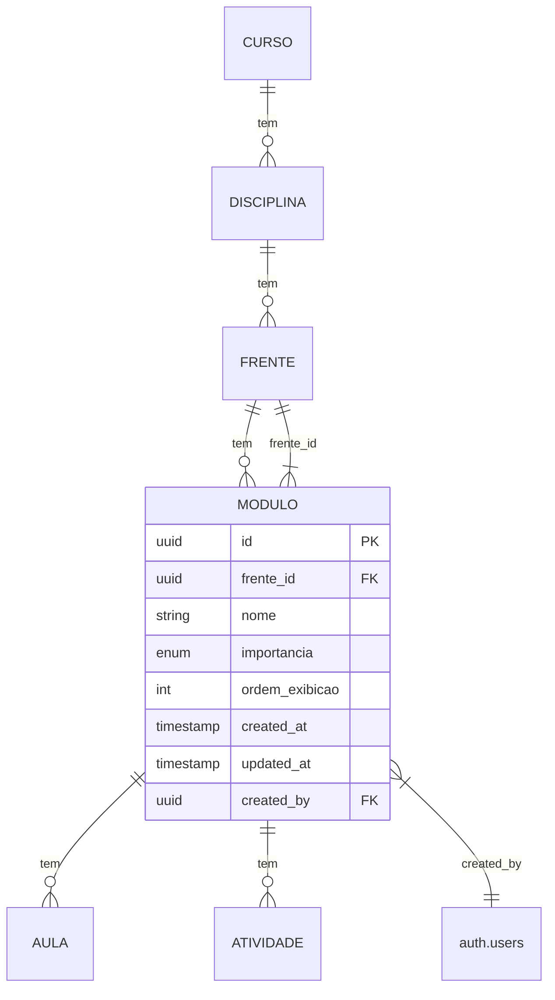
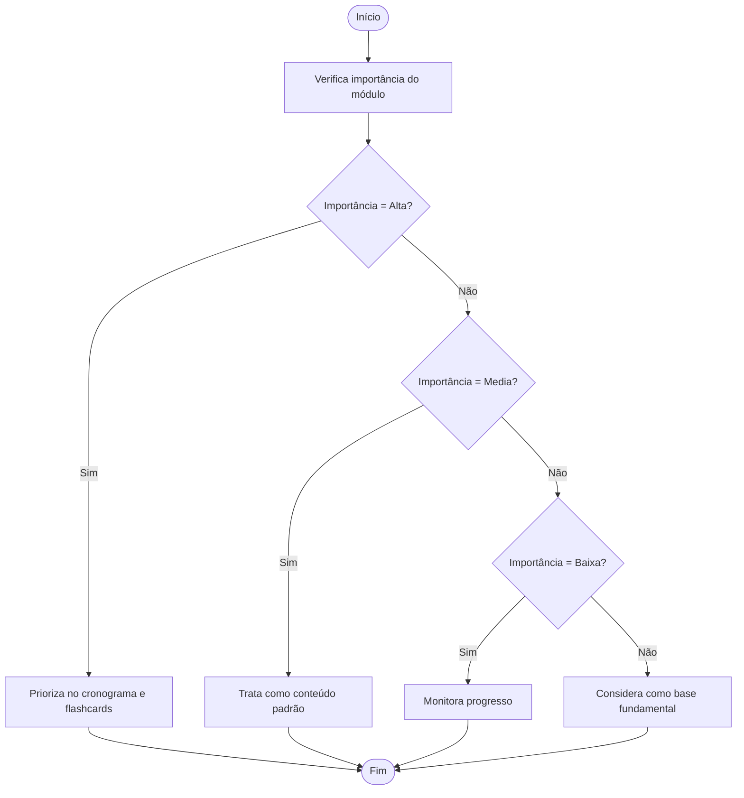

# Entidade Módulo

<cite>
**Arquivos Referenciados neste Documento**  
- [20250131_ensure_importancia_modulo.sql](file://supabase/migrations/20250131_ensure_importancia_modulo.sql)
- [20250131_update_importancia_default_to_media.sql](file://supabase/migrations/20250131_update_importancia_default_to_media.sql)
- [20250131_create_atividades_tables.sql](file://supabase/migrations/20250131_create_atividades_tables.sql)
- [VINCULOS_CURSO_DISCIPLINA_FRENTE_MODULO.md](file://docs/VINCULOS_CURSO_DISCIPLINA_FRENTE_MODULO.md)
- [FLUXO_GERACAO_CRONOGRAMA.md](file://docs/FLUXO_GERACAO_CRONOGRAMA.md)
- [FLUXO_CALENDARIO.md](file://docs/FLUXO_CALENDARIO.md)
- [conteudos-client.tsx](file://app/(dashboard)/conteudos/conteudos-client.tsx)
- [schedule-wizard.tsx](file://components/schedule-wizard.tsx)
- [route.ts](file://app/api/modulo/[id]/route.ts)
</cite>

## Sumário
1. [Introdução](#introdução)
2. [Campos da Entidade Módulo](#campos-da-entidade-módulo)
3. [Relações com Outras Entidades](#relações-com-outras-entidades)
4. [Uso do Campo Importância](#uso-do-campo-importância)
5. [Exemplos de Dados](#exemplos-de-dados)
6. [Orientações para Definição de Importância](#orientações-para-definição-de-importância)
7. [Políticas RLS](#políticas-rls)
8. [Uso em Filtros de Busca](#uso-em-filtros-de-busca)

## Introdução

A entidade **Módulo** representa uma unidade de conteúdo dentro de uma **Frente**, servindo como uma subdivisão temática que organiza o conteúdo de estudo. Cada módulo pertence a uma única frente e pode conter múltiplas aulas e atividades. O módulo é uma peça fundamental na estruturação do cronograma de estudos, permitindo a organização hierárquica do conteúdo por disciplina, frente e módulo.

A importância do módulo é um fator crítico na geração de cronogramas, influenciando diretamente a priorização do conteúdo a ser estudado. Além disso, políticas de segurança (RLS) garantem que apenas professores possam editar módulos, assegurando a integridade do conteúdo.

**Fontes da seção**
- [VINCULOS_CURSO_DISCIPLINA_FRENTE_MODULO.md](file://docs/VINCULOS_CURSO_DISCIPLINA_FRENTE_MODULO.md#L7-L16)
- [FLUXO_GERACAO_CRONOGRAMA.md](file://docs/FLUXO_GERACAO_CRONOGRAMA.md#L9-L13)

## Campos da Entidade Módulo

A entidade Módulo possui os seguintes campos:

- **`id`**: UUID único que identifica o módulo.
- **`frente_id`**: Chave estrangeira que referencia a entidade Frente, indicando a qual frente o módulo pertence.
- **`nome`**: Nome descritivo do módulo (ex: "Funções Quadráticas").
- **`importancia`**: Enum que define o nível de importância do módulo, com valores: `Alta`, `Media`, `Baixa`, `Base`.
- **`ordem_exibicao`**: Número inteiro que define a ordem de exibição do módulo dentro da frente.
- **`created_at`**: Timestamp que indica quando o módulo foi criado.
- **`updated_at`**: Timestamp que indica a última atualização do módulo.
- **`created_by`**: Chave estrangeira que referencia o usuário (professor) que criou o módulo, utilizando o ID da tabela `auth.users`.

O campo `importancia` tem um valor padrão de `Media`, conforme definido nas migrações do banco de dados. Esse campo é crucial para a priorização do conteúdo no gerador de cronogramas e no modo "Mais Cobrados" dos flashcards.

**Fontes da seção**
- [20250131_ensure_importancia_modulo.sql](file://supabase/migrations/20250131_ensure_importancia_modulo.sql#L10-L17)
- [20250131_update_importancia_default_to_media.sql](file://supabase/migrations/20250131_update_importancia_default_to_media.sql#L7-L8)

## Relações com Outras Entidades

A entidade Módulo está diretamente relacionada com outras entidades do sistema, formando uma hierarquia de conteúdo:



**Fontes do diagrama**
- [VINCULOS_CURSO_DISCIPLINA_FRENTE_MODULO.md](file://docs/VINCULOS_CURSO_DISCIPLINA_FRENTE_MODULO.md#L9-L16)
- [20250131_create_atividades_tables.sql](file://supabase/migrations/20250131_create_atividades_tables.sql#L47)

A relação com a entidade **Frente** é obrigatória, sendo estabelecida pela chave estrangeira `frente_id`. Já a relação com **Atividade** é feita através do campo `modulo_id` na tabela de atividades, permitindo que cada módulo contenha múltiplas atividades de diferentes tipos (ex: listas, simulados, flashcards).

## Uso do Campo Importância

O campo `importancia` é utilizado para priorizar o conteúdo no gerador de cronogramas e no modo "Mais Cobrados" dos flashcards. Os valores possíveis são:

- **Alta**: Conteúdo que aparece frequentemente em provas e é essencial para a aprovação.
- **Media**: Conteúdo importante, mas com recorrência moderada.
- **Baixa**: Conteúdo menos frequente, mas ainda relevante.
- **Base**: Conhecimento fundamental que serve de alicerce para outros conteúdos.

No gerador de cronogramas, módulos com importância `Alta` são priorizados na distribuição das aulas, garantindo que o aluno estude primeiro os conteúdos mais cobrados. No modo "Mais Cobrados" dos flashcards, as cartões são ordenados com base na importância do módulo ao qual pertencem.

O valor padrão é `Media`, conforme definido na migração `20250131_update_importancia_default_to_media.sql`, que também atualiza todos os módulos existentes com valor `Base` ou `NULL` para `Media`.



**Fontes do diagrama**
- [20250131_ensure_importancia_modulo.sql](file://supabase/migrations/20250131_ensure_importancia_modulo.sql#L20)
- [FLUXO_GERACAO_CRONOGRAMA.md](file://docs/FLUXO_GERACAO_CRONOGRAMA.md#L12-L13)

**Fontes da seção**
- [20250131_ensure_importancia_modulo.sql](file://supabase/migrations/20250131_ensure_importancia_modulo.sql#L20)
- [FLUXO_GERACAO_CRONOGRAMA.md](file://docs/FLUXO_GERACAO_CRONOGRAMA.md#L12-L13)

## Exemplos de Dados

Abaixo estão exemplos de registros da entidade Módulo:

```json
{
  "id": "a1b2c3d4-e5f6-7890-g1h2-i3j4k5l6m7n8",
  "frente_id": "x1y2z3a4-b5c6-7890-d1e2-f3g4h5i6j7k8",
  "nome": "Funções Quadráticas",
  "importancia": "Alta",
  "ordem_exibicao": 3,
  "created_at": "2025-01-20T10:30:00Z",
  "updated_at": "2025-01-20T10:30:00Z",
  "created_by": "u1v2w3x4-y5z6-7890-a1b2-c3d4e5f6g7h8"
}
```

```json
{
  "id": "b2c3d4e5-f6g7-8901-h2i3-j4k5l6m7n8o9",
  "frente_id": "y2z3a4b5-c6d7-8901-e2f3-g4h5i6j7k8l9",
  "nome": "Geometria Analítica",
  "importancia": "Media",
  "ordem_exibicao": 2,
  "created_at": "2025-01-20T11:15:00Z",
  "updated_at": "2025-01-20T11:15:00Z",
  "created_by": "v2w3x4y5-z6a7-8901-b2c3-d4e5f6g7h8i9"
}
```

Esses exemplos ilustram como os módulos são estruturados, mostrando a relação com a frente, o nome descritivo, a importância e os metadados de criação e atualização.

**Fontes da seção**
- [20250131_ensure_importancia_modulo.sql](file://supabase/migrations/20250131_ensure_importancia_modulo.sql#L10-L17)
- [VINCULOS_CURSO_DISCIPLINA_FRENTE_MODULO.md](file://docs/VINCULOS_CURSO_DISCIPLINA_FRENTE_MODULO.md#L36-L42)

## Orientações para Definição de Importância

A definição do nível de importância de um módulo deve ser feita com base na análise histórica de provas e na relevância do conteúdo. As orientações são:

- **Alta**: Atribua este nível para conteúdos que aparecem frequentemente em provas como ENEM, FUVEST, UNICAMP, UERJ, entre outras. São conteúdos essenciais para a aprovação.
- **Media**: Use para conteúdos importantes, mas que têm recorrência moderada nas provas. São relevantes, mas não críticos.
- **Baixa**: Atribua para conteúdos menos frequentes, mas que ainda podem aparecer em algumas provas.
- **Base**: Use para conhecimentos fundamentais que servem de alicerce para outros conteúdos, mesmo que não sejam diretamente cobrados.

No frontend, o professor pode editar a importância do módulo através de um seletor de opções, como mostrado no componente `conteudos-client.tsx`. O valor padrão é `Media`, garantindo que todos os módulos tenham um nível de importância definido.

**Fontes da seção**
- [conteudos-client.tsx](file://app/(dashboard)/conteudos/conteudos-client.tsx#L1797-L1813)
- [schedule-wizard.tsx](file://components/schedule-wizard.tsx#L1585-L1628)

## Políticas RLS

As políticas de segurança em nível de linha (RLS) para a entidade Módulo garantem que apenas professores possam editar módulos. A política de inserção e atualização é definida como:

```sql
CREATE POLICY "Professores gerenciam módulos" ON public.modulos 
    FOR ALL USING (EXISTS (SELECT 1 FROM public.professores WHERE id = auth.uid()));
```

Isso significa que apenas usuários com registro na tabela `professores` podem criar ou modificar módulos. A política de leitura permite que todos os usuários vejam os módulos, pois o conteúdo é considerado público para fins de estudo.

A API `modulo/[id]/route.ts` valida se o usuário é professor antes de permitir a atualização da importância do módulo, adicionando uma camada adicional de segurança.

**Fontes da seção**
- [20250131_ensure_importancia_modulo.sql](file://supabase/migrations/20250131_ensure_importancia_modulo.sql#L127-L131)
- [route.ts](file://app/api/modulo/[id]/route.ts#L24-L33)

## Uso em Filtros de Busca

Ao buscar módulos, é importante considerar a compatibilidade com dados legados. Módulos podem ter `curso_id = NULL`, mesmo quando a frente tem `curso_id` preenchido. Para garantir compatibilidade, recomenda-se usar o operador `OR` na consulta:

```typescript
const { data: modulos } = await supabase
  .from('modulos')
  .select('id, nome, numero_modulo, frente_id, curso_id')
  .eq('frente_id', frenteId)
  .or(`curso_id.eq.${cursoId},curso_id.is.null`)
  .order('numero_modulo', { ascending: true })
```

Este padrão de busca garante que módulos legados sejam incluídos nos resultados, mesmo sem `curso_id` preenchido. A hierarquia lógica indica que se uma frente tem `curso_id = X`, todos os módulos daquela frente pertencem ao curso X, independentemente do valor de `curso_id` no módulo.

**Fontes da seção**
- [VINCULOS_CURSO_DISCIPLINA_FRENTE_MODULO.md](file://docs/VINCULOS_CURSO_DISCIPLINA_FRENTE_MODULO.md#L73-L82)
- [FLUXO_GERACAO_CRONOGRAMA.md](file://docs/FLUXO_GERACAO_CRONOGRAMA.md#L173-L176)