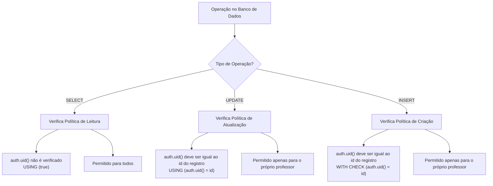
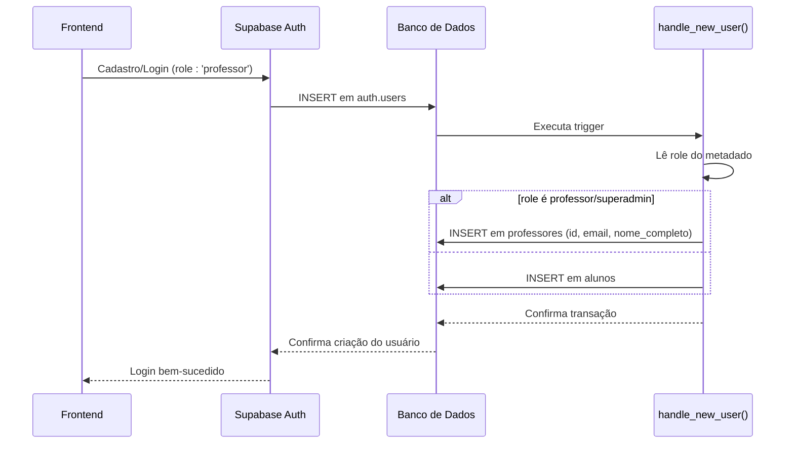

# Entidade Professor

<cite>
**Arquivos Referenciados neste Documento**   
- [professor-table.tsx](file://components/professor-table.tsx)
- [teacher.service.ts](file://backend/services/teacher/teacher.service.ts)
- [teacher.repository.ts](file://backend/services/teacher/teacher.repository.ts)
- [schema.md](file://docs/schema/schema.md)
- [20250128_ensure_professor_record_on_login.sql](file://supabase/migrations/20250128_ensure_professor_record_on_login.sql)
- [20250128_fix_professor_rls_insert_policy.sql](file://supabase/migrations/20250128_fix_professor_rls_insert_policy.sql)
- [route.ts](file://app/api/teacher/[id]/route.ts)
- [route.ts](file://app/api/teacher/route.ts)
- [teacher.spec.ts](file://backend/swagger/teacher.spec.ts)
- [first-professor-superadmin.md](file://docs/first-professor-superadmin.md)
</cite>

## Sumário
1. [Introdução](#introdução)
2. [Campos da Entidade Professor](#campos-da-entidade-professor)
3. [Relação com auth.users](#relação-com-authusers)
4. [Políticas RLS (Row Level Security)](#políticas-rls-row-level-security)
5. [Trigger handle_new_user](#trigger-handle_new_user)
6. [Uso do Campo created_by](#uso-do-campo-created_by)
7. [Exemplos de Dados](#exemplos-de-dados)
8. [Configuração do Perfil de Vitrine](#configuração-do-perfil-de-vitrine)
9. [Conclusão](#conclusão)

## Introdução

A entidade **Professor** é um componente central do sistema, representando os docentes que criam e gerenciam conteúdos educacionais. Esta entidade está intimamente ligada ao sistema de autenticação do Supabase (`auth.users`) e implementa políticas de segurança rigorosas para garantir que apenas o professor autorizado possa editar seu próprio perfil, enquanto permite acesso público à visualização dos perfis.

O ciclo de vida do registro do professor é automatizado: ao se cadastrar com o papel (role) de 'professor', um registro correspondente é criado na tabela `professores`. O primeiro professor cadastrado é automaticamente promovido a superadmin, recebendo privilégios administrativos adicionais.

Esta documentação detalha a estrutura da entidade, suas políticas de segurança, mecanismos de autoria e orientações para configuração do perfil público (vitrine).

**Seção fontes**
- [schema.md](file://docs/schema/schema.md#L208-L225)
- [first-professor-superadmin.md](file://docs/first-professor-superadmin.md#L1-L54)

## Campos da Entidade Professor

A tabela `professores` armazena informações detalhadas sobre cada docente. Os campos são mapeados entre o nome no banco de dados (PostgreSQL) e o nome no código da aplicação (TypeScript).

| Campo (Banco de Dados) | Campo (Aplicação) | Tipo | Obrigatório | Descrição |
|------------------------|-------------------|------|-------------|-----------|
| `id` | `id` | UUID | Sim | Chave primária e FK para `auth.users(id)`. Representa o ID único do usuário no sistema de autenticação. |
| `nome_completo` | `fullName` | TEXT | Sim | Nome completo do professor. |
| `email` | `email` | TEXT | Sim | Endereço de e-mail do professor, usado para login e comunicação. Deve ser único. |
| `cpf` | `cpf` | TEXT | Não | Número do CPF do professor. Deve conter exatamente 11 dígitos numéricos. |
| `telefone` | `phone` | TEXT | Não | Número de telefone do professor. Pode conter entre 10 e 15 dígitos. |
| `biografia` | `biography` | TEXT | Não | Texto descritivo sobre o professor, sua experiência e qualificações. Máximo de 2000 caracteres. |
| `foto_url` | `photoUrl` | TEXT | Não | URL de uma imagem pública que representa o professor. Deve ser uma URL válida. |
| `especialidade` | `specialty` | TEXT | Não | Campo para descrever a especialidade acadêmica do professor (ex: "Doutor em História"). Máximo de 200 caracteres. |
| `created_at` | `createdAt` | TIMESTAMP | Sim | Data e hora de criação do registro. Preenchido automaticamente pelo banco de dados. |
| `updated_at` | `updatedAt` | TIMESTAMP | Sim | Data e hora da última atualização do registro. Atualizado automaticamente por um trigger. |

**Seção fontes**
- [schema.md](file://docs/schema/schema.md#L210-L225)
- [teacher.repository.ts](file://backend/services/teacher/teacher.repository.ts#L16-L27)
- [professor-table.tsx](file://components/professor-table.tsx#L78-L89)

## Relação com auth.users

A entidade Professor está diretamente vinculada à tabela de autenticação do Supabase, `auth.users`, através de uma chave estrangeira (FK). O campo `id` da tabela `professores` é uma FK que referencia `auth.users(id)` com a ação `ON DELETE CASCADE`.

Isso significa que:
- **Integridade Referencial**: Um registro em `professores` não pode existir sem um usuário correspondente em `auth.users`.
- **Exclusão em Cascata**: Se um usuário for excluído do sistema de autenticação, seu registro em `professores` será automaticamente removido.
- **Sincronização de Dados**: Informações como o e-mail são mantidas sincronizadas entre as duas tabelas.

A relação é de um-para-um: cada usuário com o papel de 'professor' possui exatamente um registro correspondente na tabela `professores`.

```mermaid
erDiagram
auth.users {
uuid id PK
text email
jsonb raw_user_meta_data
}
professores {
uuid id PK FK
string nome_completo
string email
string cpf UK
string telefone
string biografia
string foto_url
string especialidade
timestamp created_at
timestamp updated_at
}
auth.users ||--o{ professores : "1 para 1"
```

**Fontes do diagrama**
- [schema.md](file://docs/schema/schema.md#L210-L212)
- [20250128_ensure_professor_record_on_login.sql](file://supabase/migrations/20250128_ensure_professor_record_on_login.sql#L23-L24)

## Políticas RLS (Row Level Security)

O sistema implementa políticas de segurança em nível de linha (RLS) para controlar o acesso à tabela `professores`. Essas políticas são definidas no Supabase e garantem que as operações no banco de dados respeitem as regras de negócio de autorização.

### Política de Leitura (SELECT)
- **Nome**: "Perfil dos professores é público"
- **Descrição**: Permite que qualquer usuário autenticado (ou mesmo não autenticado, se o público tiver acesso) veja os perfis de todos os professores.
- **Expressão**: `USING (true)`
- **Justificativa**: Os perfis dos professores são considerados dados públicos, funcionando como uma vitrine para os alunos.

### Política de Atualização (UPDATE)
- **Nome**: "Professor edita seu perfil"
- **Descrição**: Permite que um professor atualize apenas seu próprio registro.
- **Expressão**: `USING (auth.uid() = id)`
- **Justificativa**: Garante que um professor não possa alterar as informações de outro professor, protegendo a integridade dos dados.

### Política de Criação (INSERT)
- **Nome**: "Professores podem criar seu próprio registro"
- **Descrição**: Permite que um usuário insira um registro na tabela `professores` apenas se o `id` do registro for igual ao seu próprio `auth.uid()`.
- **Expressão**: `WITH CHECK (auth.uid() = id)`
- **Justificativa**: Essa política é um mecanismo de segurança adicional. Embora a criação do registro seja feita automaticamente pela trigger `handle_new_user`, esta política garante que, se um cliente tentar criar um registro diretamente, só poderá fazê-lo para seu próprio ID.



**Fontes do diagrama**
- [schema.md](file://docs/schema/schema.md#L337-L341)
- [20250128_fix_professor_rls_insert_policy.sql](file://supabase/migrations/20250128_fix_professor_rls_insert_policy.sql#L13-L15)

**Seção fontes**
- [schema.md](file://docs/schema/schema.md#L337-L341)
- [20250128_fix_professor_rls_insert_policy.sql](file://supabase/migrations/20250128_fix_professor_rls_insert_policy.sql#L1-L28)

## Trigger handle_new_user

A trigger `handle_new_user` é um componente crítico na arquitetura de autenticação e autorização do sistema. Ela é executada automaticamente após a inserção de um novo usuário na tabela `auth.users` e é responsável por criar o registro correspondente na tabela `professores` quando apropriado.

### Funcionamento
1.  **Evento**: `AFTER INSERT ON auth.users`.
2.  **Verificação de Papel**: A trigger lê o campo `role` dos metadados do usuário (`raw_user_meta_data->>'role'`).
3.  **Criação Condicional**:
    *   Se o `role` for `'professor'` ou `'superadmin'`, a trigger insere um novo registro na tabela `professores`.
    *   Caso contrário (por exemplo, `role: 'aluno'`), o registro é criado na tabela `alunos`.
4.  **Dados Iniciais**: O registro do professor é preenchido com:
    *   `id`: Copiado do `auth.users`.
    *   `email`: Copiado do `auth.users`.
    *   `nome_completo`: Prioriza `full_name` nos metadados, depois `name`, depois o nome de usuário do e-mail, ou usa "Novo Professor" como padrão.
5.  **Tratamento de Conflitos**: Usa `ON CONFLICT (id) DO UPDATE` para garantir que o registro seja atualizado se já existir (por exemplo, se o e-mail for alterado).

### Objetivo
- **Automatização**: Elimina a necessidade de um passo manual de cadastro. O professor se torna ativo imediatamente após o login.
- **Consistência**: Garante que sempre haja um registro de perfil sincronizado com a conta de autenticação.
- **Segurança**: A criação do registro é feita com privilégios elevados (SECURITY DEFINER), contornando temporariamente as políticas RLS para permitir a operação.



**Fontes do diagrama**
- [20250128_ensure_professor_record_on_login.sql](file://supabase/migrations/20250128_ensure_professor_record_on_login.sql#L111-L137)
- [first-professor-superadmin.md](file://docs/first-professor-superadmin.md#L40-L43)

**Seção fontes**
- [20250128_ensure_professor_record_on_login.sql](file://supabase/migrations/20250128_ensure_professor_record_on_login.sql#L1-L173)

## Uso do Campo created_by

O campo `created_by` é uma coluna de auditoria presente em todas as tabelas de conteúdo do sistema (cursos, disciplinas, materiais, etc.). Ele é usado para atribuir autoria e controlar permissões de edição.

### Implementação
- **Tipo**: UUID, referenciando `auth.users(id)` com `ON DELETE SET NULL`.
- **Preenchimento Automático**: Uma trigger chamada `handle_created_by()` é executada antes da inserção (`BEFORE INSERT`) em cada tabela de conteúdo. Ela preenche automaticamente o `created_by` com o ID do usuário autenticado (`auth.uid()`).
- **Comportamento em Exclusão**: Se um professor for excluído, seus registros de conteúdo não são apagados. O campo `created_by` é simplesmente definido como `NULL`, preservando o conteúdo mas removendo a associação com o autor.

### Políticas RLS Baseadas em created_by
As políticas de segurança para tabelas de conteúdo são construídas em torno do campo `created_by`. Por exemplo, para a tabela `cursos`:
- **Criação (INSERT)**: Permitido apenas para usuários que existem na tabela `professores`.
- **Edição (UPDATE)**: Permitido apenas se `created_by = auth.uid()`.
- **Exclusão (DELETE)**: Permitido apenas se `created_by = auth.uid()`.

Isso garante que um professor só possa editar ou excluir conteúdos que ele mesmo criou.

```mermaid
erDiagram
auth.users {
uuid id PK
}
professores {
uuid id PK FK
}
cursos {
uuid id PK
uuid created_by FK
}
disciplinas {
uuid id PK
uuid created_by FK
}
materiais_curso {
uuid id PK
uuid created_by FK
}
auth.users ||--o{ professores : "tem"
auth.users ||--o{ cursos : "criou"
auth.users ||--o{ disciplinas : "criou"
auth.users ||--o{ materiais_curso : "criou"
```

**Fontes do diagrama**
- [schema.md](file://docs/schema/schema.md#L238-L264)
- [schema.md](file://docs/schema/schema.md#L348-L355)

**Seção fontes**
- [schema.md](file://docs/schema/schema.md#L233-L265)

## Exemplos de Dados

Abaixo estão exemplos de dados válidos para a entidade Professor, demonstrando como os campos são preenchidos.

### Exemplo 1: Professor Completo
```json
{
  "id": "a1b2c3d4-e5f6-7890-1234-567890abcdef",
  "fullName": "Dra. Ana Silva Santos",
  "email": "ana.silva@universidade.edu.br",
  "cpf": "12345678901",
  "phone": "11987654321",
  "biography": "Doutora em História pela Universidade de São Paulo (USP), com mais de 15 anos de experiência no ensino superior. Especialista em História Antiga e Civilizações Mediterrâneas.",
  "photoUrl": "https://storage.exemplo.com/professores/ana-silva.jpg",
  "specialty": "Doutora em História Antiga",
  "createdAt": "2025-01-28T10:00:00.000Z",
  "updatedAt": "2025-01-28T10:00:00.000Z"
}
```

### Exemplo 2: Professor com Dados Opcionais
```json
{
  "id": "e5f6g7h8-i9j0-1234-5678-90abcdef1234",
  "fullName": "Prof. Carlos Oliveira",
  "email": "carlos.oliveira@escola.com",
  "cpf": null,
  "phone": null,
  "biography": "Especialista em Matemática Aplicada, focado em preparar alunos para concursos públicos.",
  "photoUrl": null,
  "specialty": "Matemática Aplicada",
  "createdAt": "2025-02-01T15:30:00.000Z",
  "updatedAt": "2025-02-01T15:30:00.000Z"
}
```

**Seção fontes**
- [professor-table.tsx](file://components/professor-table.tsx#L78-L89)
- [teacher.service.ts](file://backend/services/teacher/teacher.service.ts#L34-L53)

## Configuração do Perfil de Vitrine

O perfil de vitrine é a representação pública do professor no sistema. Ele é configurado através da interface de administração e é crucial para atrair alunos.

### Campos para a Vitrine
Os campos mais importantes para a vitrine são:
- **`nome_completo`**: O nome que será exibido em todos os cursos e conteúdos.
- **`foto_url`**: Uma imagem profissional de alta qualidade.
- **`especialidade`**: Um título atraente que destaque sua qualificação (ex: "Mestre em Física Quântica").
- **`biografia`**: Um texto persuasivo que destaque sua experiência, conquistas e metodologia de ensino. Deve ser claro, conciso e focado nos benefícios para o aluno.

### Orientações para um Perfil Efetivo
1.  **Foto de Alta Qualidade**: Use uma imagem profissional, bem iluminada e com fundo neutro.
2.  **Biografia Impactante**: Comece com uma frase de impacto. Liste suas principais conquistas (ex: "Aprovou 95% dos alunos no ENEM 2024"). Use uma linguagem acessível.
3.  **Especialidade Clara**: Evite jargões. Em vez de "Doutor em Engenharia de Materiais", use "Especialista em Materiais para Engenharia".
4.  **Atualização Regular**: Mantenha o perfil atualizado com novos cursos, conquistas e uma foto recente.
5.  **Consistência**: Use o mesmo nome e foto em todas as plataformas (site, redes sociais, materiais).

O perfil é acessado publicamente, portanto, deve ser tratado como uma ferramenta de marketing pessoal.

**Seção fontes**
- [professor-table.tsx](file://components/professor-table.tsx#L840-L852)
- [schema.md](file://docs/schema/schema.md#L218-L222)

## Conclusão

A entidade Professor é um pilar do sistema, integrando autenticação, segurança e gestão de conteúdo. Sua implementação robusta, com políticas RLS rigorosas e automação via triggers, garante um fluxo de trabalho seguro e eficiente.

A relação com `auth.users` centraliza a identidade do usuário, enquanto o campo `created_by` rastreia a autoria de todos os conteúdos. A trigger `handle_new_user` automatiza a criação do perfil, proporcionando uma experiência de onboarding imediata para novos professores.

Para maximizar o impacto, os professores devem dedicar atenção à configuração de seu perfil de vitrine, utilizando os campos `biografia`, `especialidade` e `foto_url` para se destacarem e atrair alunos.