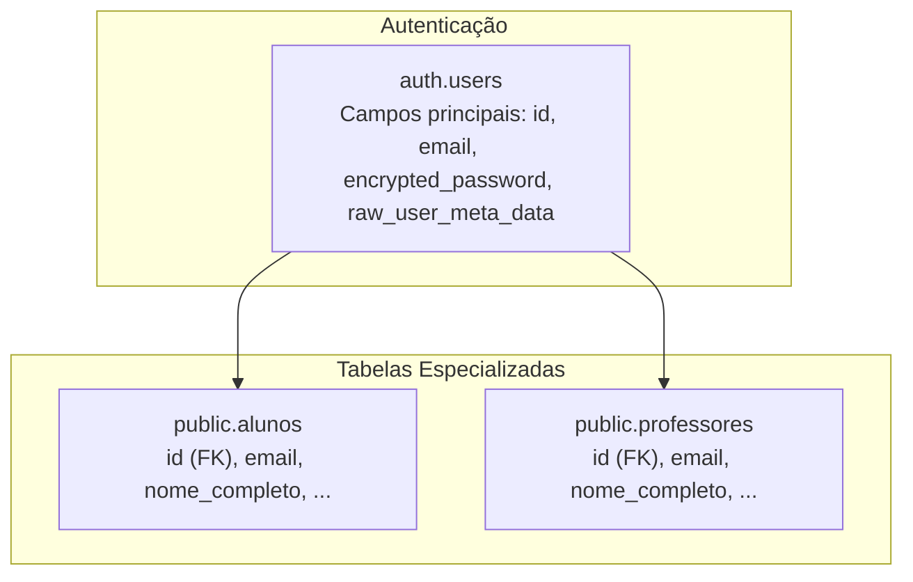
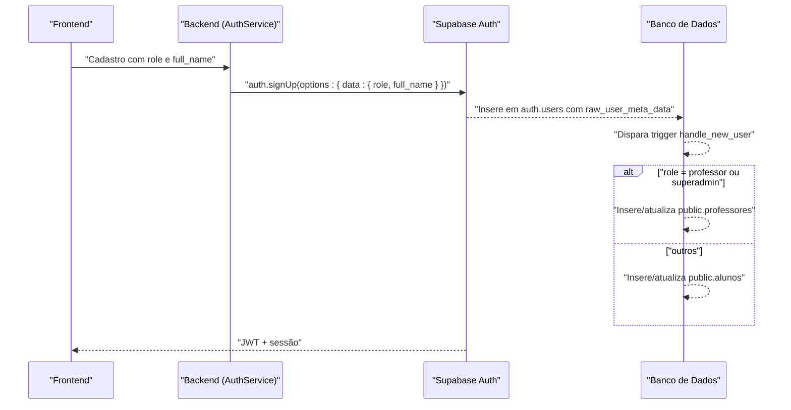
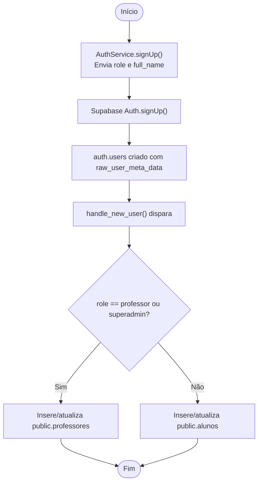
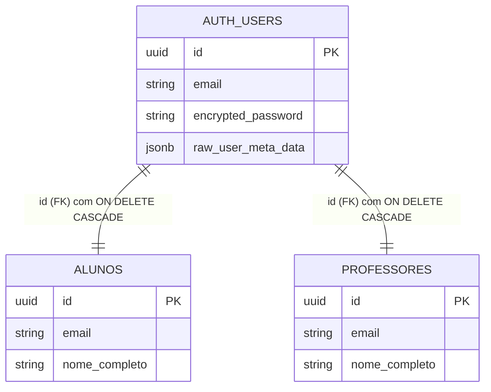

# Entidade User (auth.users)

<cite>
**Arquivos Referenciados neste Documento**
- [config.toml](file://supabase/config.toml)
- [authentication.md](file://docs/authentication.md)
- [auth.service.ts](file://backend/auth/auth.service.ts)
- [route.ts](file://app/api/auth/me/route.ts)
- [20250120_create_alunos.sql](file://supabase/migrations/20250120_create_alunos.sql)
- [20250128_ensure_professor_record_on_login.sql](file://supabase/migrations/20250128_ensure_professor_record_on_login.sql)
- [20250128_fix_professor_rls_insert_policy.sql](file://supabase/migrations/20250128_fix_professor_rls_insert_policy.sql)
- [20250129_add_alunos_cursos_rls_policies.sql](file://supabase/migrations/20250129_add_alunos_cursos_rls_policies.sql)
- [20250129_fix_alunos_rls_update_policy.sql](file://supabase/migrations/20250129_fix_alunos_rls_update_policy.sql)
- [20250122_create_chat_conversations.sql](file://supabase/migrations/20250122_create_chat_conversations.sql)
- [20250128_add_created_by_to_content_tables.sql](file://supabase/migrations/20250128_add_created_by_to_content_tables.sql)
- [20251210_allow_student_cancel_confirmed.sql](file://supabase/migrations/20251210_allow_student_cancel_confirmed.sql)
- [apply-rls-policies.js](file://scripts/apply-rls-policies.js)
- [schema.md](file://docs/schema/schema.md)
</cite>

## Sumário
Este documento apresenta a entidade central do sistema de autenticação do Supabase: a tabela `auth.users`. Ele explica que essa tabela é parte do esquema `auth`, não do `public`, e detalha os campos principais usados no projeto, incluindo `id` (UUID), `email`, `encrypted_password` e `raw_user_meta_data` (com os campos `role` e `full_name`). Também documenta como a trigger `handle_new_user` cria automaticamente registros nas tabelas especializadas (`alunos` ou `professores`) com base no papel definido no cadastro. O documento aborda a relação de herança entre `auth.users` e as tabelas especializadas, a política de deleção em cascata e o uso de `auth.uid()` nas políticas RLS. São incluídos exemplos de dados e orientações práticas para depuração de problemas de autenticação.

## Estrutura do Projeto
O sistema de autenticação se baseia em:
- Tabela `auth.users`: armazena credenciais e metadados do usuário.
- Tabelas especializadas: `public.alunos` e `public.professores`, com relacionamento de chave estrangeira em `auth.users(id)` e deleção em cascata.
- Trigger `handle_new_user`: cria automaticamente registros em `alunos` ou `professores` com base no campo `role` presente em `raw_user_meta_data`.

**Diagrama fonte**
- [20250120_create_alunos.sql](file://supabase/migrations/20250120_create_alunos.sql#L7-L21)
- [20250128_ensure_professor_record_on_login.sql](file://supabase/migrations/20250128_ensure_professor_record_on_login.sql#L111-L159)

**Seção fonte**
- [20250120_create_alunos.sql](file://supabase/migrations/20250120_create_alunos.sql#L7-L21)
- [20250128_ensure_professor_record_on_login.sql](file://supabase/migrations/20250128_ensure_professor_record_on_login.sql#L111-L159)

## Componentes Principais

### Tabela auth.users
- Localização: esquema `auth` (não `public`).
- Propósito: armazena credenciais e metadados do usuário.
- Campos relevantes:
  - `id`: UUID único, chave primária.
  - `email`: endereço de e-mail do usuário.
  - `encrypted_password`: senha criptografada.
  - `raw_user_meta_data`: JSON com metadados personalizados, incluindo `role` e `full_name`.

**Seção fonte**
- [20250120_create_alunos.sql](file://supabase/migrations/20250120_create_alunos.sql#L7-L21)
- [20250128_ensure_professor_record_on_login.sql](file://supabase/migrations/20250128_ensure_professor_record_on_login.sql#L111-L159)

### Trigger handle_new_user
- Responsabilidade: criar automaticamente registros em `alunos` ou `professores` após o cadastro de um novo usuário.
- Lógica:
  - Lê o campo `role` de `raw_user_meta_data`.
  - Se `role` for `professor` ou `superadmin`, cria/atualiza o registro em `public.professores`.
  - Caso contrário, cria/atualiza o registro em `public.alunos`.
  - Utiliza `auth.uid()` nas políticas RLS para limitar acesso a dados do próprio usuário.

**Seção fonte**
- [20250128_ensure_professor_record_on_login.sql](file://supabase/migrations/20250128_ensure_professor_record_on_login.sql#L111-L159)
- [20250128_fix_professor_rls_insert_policy.sql](file://supabase/migrations/20250128_fix_professor_rls_insert_policy.sql#L12-L18)

### Relação de Herança e Deleção em Cascata
- `public.alunos(id)` e `public.professores(id)` referenciam `auth.users(id)`.
- Ambas as tabelas têm `ON DELETE CASCADE`, garantindo que ao excluir um usuário em `auth.users`, os registros correspondentes em `alunos` e `professores` também sejam removidos automaticamente.

**Seção fonte**
- [20250120_create_alunos.sql](file://supabase/migrations/20250120_create_alunos.sql#L7-L21)
- [20250128_ensure_professor_record_on_login.sql](file://supabase/migrations/20250128_ensure_professor_record_on_login.sql#L111-L159)

### Políticas RLS com auth.uid()
- Em `public.alunos`: políticas permitem que cada usuário veja e edite apenas seus próprios dados, utilizando `auth.uid() = id`.
- Em `public.professores`: política permite que um professor crie seu próprio registro com `WITH CHECK (auth.uid() = id)`.
- Em `chat_conversations`: política restringe acesso às conversas do usuário com `auth.uid() = user_id`.

**Seção fonte**
- [20250120_create_alunos.sql](file://supabase/migrations/20250120_create_alunos.sql#L40-L54)
- [20250128_fix_professor_rls_insert_policy.sql](file://supabase/migrations/20250128_fix_professor_rls_insert_policy.sql#L12-L18)
- [20250122_create_chat_conversations.sql](file://supabase/migrations/20250122_create_chat_conversations.sql#L36-L61)

## Visão Geral da Arquitetura

**Diagrama fonte**
- [auth.service.ts](file://backend/auth/auth.service.ts#L1-L42)
- [20250128_ensure_professor_record_on_login.sql](file://supabase/migrations/20250128_ensure_professor_record_on_login.sql#L111-L159)

**Seção fonte**
- [auth.service.ts](file://backend/auth/auth.service.ts#L1-L42)
- [20250128_ensure_professor_record_on_login.sql](file://supabase/migrations/20250128_ensure_professor_record_on_login.sql#L111-L159)

## Análise Detalhada

### Fluxo de Criação de Usuário e Criação Automática de Perfil

**Diagrama fonte**
- [auth.service.ts](file://backend/auth/auth.service.ts#L1-L42)
- [20250128_ensure_professor_record_on_login.sql](file://supabase/migrations/20250128_ensure_professor_record_on_login.sql#L111-L159)

**Seção fonte**
- [auth.service.ts](file://backend/auth/auth.service.ts#L1-L42)
- [20250128_ensure_professor_record_on_login.sql](file://supabase/migrations/20250128_ensure_professor_record_on_login.sql#L111-L159)

### Exemplos de Dados

- Dados de exemplo em `auth.users`:
  - id: UUID único
  - email: endereço de e-mail
  - encrypted_password: senha criptografada
  - raw_user_meta_data: contém `role` e `full_name`

- Dados de exemplo em `public.alunos`:
  - id: UUID igual ao de `auth.users`
  - email: mesmo do usuário
  - nome_completo: preenchido a partir de `raw_user_meta_data.full_name` ou derivado

- Dados de exemplo em `public.professores`:
  - id: UUID igual ao de `auth.users`
  - email: mesmo do usuário
  - nome_completo: preenchido a partir de `raw_user_meta_data.full_name` ou derivado

**Seção fonte**
- [20250120_create_alunos.sql](file://supabase/migrations/20250120_create_alunos.sql#L7-L21)
- [20250128_ensure_professor_record_on_login.sql](file://supabase/migrations/20250128_ensure_professor_record_on_login.sql#L111-L159)

## Relacionamentos e Dependências

**Diagrama fonte**
- [20250120_create_alunos.sql](file://supabase/migrations/20250120_create_alunos.sql#L7-L21)
- [20250128_ensure_professor_record_on_login.sql](file://supabase/migrations/20250128_ensure_professor_record_on_login.sql#L111-L159)

**Seção fonte**
- [20250120_create_alunos.sql](file://supabase/migrations/20250120_create_alunos.sql#L7-L21)
- [20250128_ensure_professor_record_on_login.sql](file://supabase/migrations/20250128_ensure_professor_record_on_login.sql#L111-L159)

## Políticas RLS e Uso de auth.uid()

- Em `public.alunos`:
  - SELECT, UPDATE e INSERT com `auth.uid() = id`.
- Em `public.professores`:
  - INSERT com `WITH CHECK (auth.uid() = id)`.
- Em `chat_conversations`:
  - SELECT, INSERT, UPDATE e DELETE com `auth.uid() = user_id`.

**Seção fonte**
- [20250120_create_alunos.sql](file://supabase/migrations/20250120_create_alunos.sql#L40-L54)
- [20250128_fix_professor_rls_insert_policy.sql](file://supabase/migrations/20250128_fix_professor_rls_insert_policy.sql#L12-L18)
- [20250122_create_chat_conversations.sql](file://supabase/migrations/20250122_create_chat_conversations.sql#L36-L61)

## Depuração de Problemas de Autenticação

- Verificação de metadados do usuário:
  - Endpoint `/api/auth/me` recupera o usuário atual e, se um token JWT estiver presente, busca metadados do Supabase (`user_metadata`, `app_metadata`) para depuração.
  - Nota importante: se `user_metadata.role` não for `superadmin` nem `is_superadmin` for verdadeiro, o usuário não será considerado superadmin, mesmo que tenha permissões em outros lugares.

- Configuração do Supabase:
  - O arquivo de configuração desativa temporariamente o Storage, o que pode impactar fluxos de avatar e uploads. Verifique se isso está alinhado com a funcionalidade desejada.

**Seção fonte**
- [route.ts](file://app/api/auth/me/route.ts#L1-L39)
- [config.toml](file://supabase/config.toml#L1-L15)

## Considerações de Segurança

- Superadmin:
  - Definição via metadados (`role: 'superadmin'` ou `is_superadmin: true`).
  - Comportamento de bypass RLS quando autenticado com JWT.
- API Keys:
  - Armazenadas como hash SHA-256.
  - Podem ser usadas para bypass RLS completo quando o backend as valida.

**Seção fonte**
- [authentication.md](file://docs/authentication.md#L1-L137)

## Conclusão
A entidade `auth.users` é o ponto central do sistema de autenticação. Com a trigger `handle_new_user`, o sistema garante que novos usuários sejam automaticamente integrados às tabelas especializadas com base no papel definido. As políticas RLS com `auth.uid()` protegem os dados e limitam acesso somente aos próprios registros. A deleção em cascata mantém a integridade dos dados ao remover usuários e seus perfis associados. Para depuração, utilize o endpoint `/api/auth/me` e verifique os metadados do usuário no Supabase.