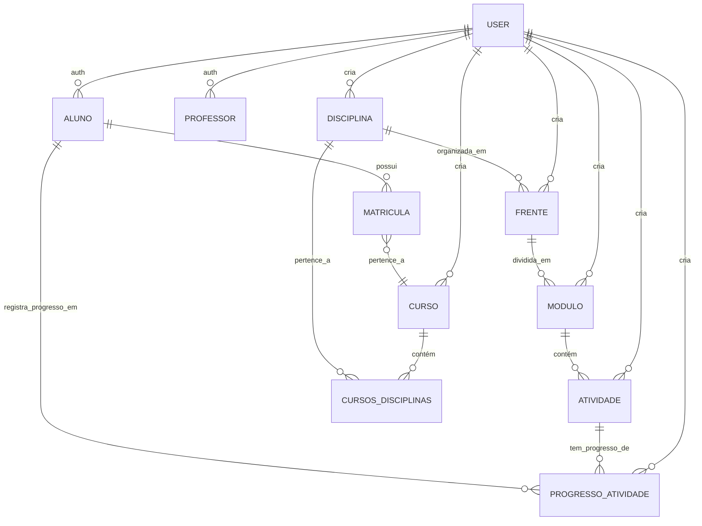

# Relacionamentos entre Entidades

<cite>
**Arquivos Referenciados neste Documento**  
- [schema.md](file://docs/schema/schema.md)
- [VINCULOS_CURSO_DISCIPLINA_FRENTE_MODULO.md](file://docs/VINCULOS_CURSO_DISCIPLINA_FRENTE_MODULO.md)
- [20250131_create_atividades_tables.sql](file://supabase/migrations/20250131_create_atividades_tables.sql)
- [20251125_add_course_binding_and_filters.sql](file://supabase/migrations/20251125_add_course_binding_and_filters.sql)
- [20250128_add_created_by_to_content_tables.sql](file://supabase/migrations/20250128_add_created_by_to_content_tables.sql)
- [atividade.service.ts](file://backend/services/atividade/atividade.service.ts)
- [progresso-atividade.service.ts](file://backend/services/progresso-atividade/progresso-atividade.service.ts)
- [enrollment.service.ts](file://backend/services/enrollment/enrollment.service.ts)
- [sala-estudos-client.tsx](file://app/(dashboard)/aluno/sala-de-estudos/sala-estudos-client.tsx)
- [atividade.repository-helper.ts](file://backend/services/atividade/atividade.repository-helper.ts)
- [types.ts](file://app/(dashboard)/aluno/sala-de-estudos/types.ts)
</cite>

## Sumário
1. [Introdução](#introdução)
2. [Hierarquia de Conteúdo](#hierarquia-de-conteúdo)
3. [Relacionamento Curso e Disciplina](#relacionamento-curso-e-disciplina)
4. [Relacionamento Aluno e Atividade](#relacionamento-aluno-e-atividade)
5. [Rastreamento de Autoria com created_by](#rastreamento-de-autoria-com-created_by)
6. [Políticas RLS Baseadas em Papéis](#políticas-rls-baseadas-em-papéis)
7. [Diagrama ER Completo](#diagrama-er-completo)
8. [Exemplos de Consultas SQL](#exemplos-de-consultas-sql)
9. [Conclusão](#conclusão)

## Introdução

Este documento detalha os relacionamentos entre as principais entidades do sistema educacional, com foco na estrutura hierárquica de conteúdo e nos mecanismos de acesso e controle de dados. O sistema organiza o conteúdo acadêmico em uma hierarquia clara: **Curso → Disciplina → Frente → Módulo → Atividade**, permitindo uma estruturação lógica e escalável do material didático. Além disso, define como um **Aluno** acessa as **Atividades** através de sua **Matrícula** ativa em um **Curso**, e como os relacionamentos entre entidades são gerenciados no banco de dados, incluindo o rastreamento de autoria e políticas de segurança baseadas em papéis.

**Seção fontes**
- [schema.md](file://docs/schema/schema.md)
- [VINCULOS_CURSO_DISCIPLINA_FRENTE_MODULO.md](file://docs/VINCULOS_CURSO_DISCIPLINA_FRENTE_MODULO.md)

## Hierarquia de Conteúdo

A estrutura de conteúdo do sistema é organizada em uma hierarquia de cinco níveis, que reflete a divisão lógica do conhecimento em um curso.

1.  **Curso**: Representa um programa de estudos completo, como "Superintensivo 2025" ou "Revisão ENEM". Um curso é composto por várias disciplinas.
2.  **Disciplina**: Representa uma área de conhecimento específica dentro de um curso, como "Matemática" ou "História". Um curso pode ter múltiplas disciplinas.
3.  **Frente**: Representa um tema ou bloco de conteúdo dentro de uma disciplina, como "Álgebra" ou "História do Brasil". Uma disciplina pode ter múltiplas frentes.
4.  **Módulo**: Representa uma unidade de ensino específica dentro de uma frente, geralmente correspondendo a uma aula ou tópico. Um módulo pertence a uma única frente.
5.  **Atividade**: Representa uma tarefa ou exercício que um aluno deve realizar, como um "Conceituário", uma "Lista Nível 1" ou um "Simulado". Uma atividade pertence a um único módulo.

Essa hierarquia permite uma organização granular do conteúdo, facilitando a navegação e o planejamento de estudos.

**Seção fontes**
- [schema.md](file://docs/schema/schema.md)
- [VINCULOS_CURSO_DISCIPLINA_FRENTE_MODULO.md](file://docs/VINCULOS_CURSO_DISCIPLINA_FRENTE_MODULO.md)

## Relacionamento Curso e Disciplina

O relacionamento entre `Curso` e `Disciplina` é do tipo **muitos-para-muitos (many-to-many)**. Isso significa que um curso pode conter várias disciplinas, e uma mesma disciplina pode ser parte de vários cursos diferentes (por exemplo, a disciplina "Física" pode estar presente em cursos de "Pré-vestibular" e "Concursos").

Esse relacionamento é implementado por uma **tabela de ligação implícita** chamada `cursos_disciplinas`. Esta tabela não é uma entidade de negócio principal, mas sim uma tabela de junção que armazena pares de chaves estrangeiras:

- `curso_id`: Chave estrangeira referenciando a tabela `cursos`.
- `disciplina_id`: Chave estrangeira referenciando a tabela `disciplinas`.

A chave primária da tabela é composta por ambos os campos (`PRIMARY KEY (aluno_id, curso_id)`), garantindo que um curso não possa ter a mesma disciplina associada mais de uma vez.

**Seção fontes**
- [schema.md](file://docs/schema/schema.md)
- [VINCULOS_CURSO_DISCIPLINA_FRENTE_MODULO.md](file://docs/VINCULOS_CURSO_DISCIPLINA_FRENTE_MODULO.md)

## Relacionamento Aluno e Atividade

O acesso de um aluno às atividades é mediado pela sua **matrícula** em um curso. O relacionamento direto entre `Aluno` e `Atividade` é estabelecido através da entidade `ProgressoAtividade`.

1.  **Matrícula Ativa**: Um aluno só pode acessar as atividades de um curso se tiver uma matrícula ativa (`ativo = true`) nesse curso. A tabela `matriculas` armazena essa relação, com campos como `aluno_id`, `curso_id`, `data_inicio_acesso` e `data_fim_acesso`.
2.  **ProgressoAtividade**: Esta tabela representa o relacionamento entre um aluno e uma atividade específica. Ela armazena o estado do progresso do aluno (Pendente, Iniciado, Concluído), datas de início e conclusão, e métricas de desempenho (acertos, dificuldade percebida). A existência de um registro nesta tabela para um par `(aluno_id, atividade_id)` indica que o aluno tem permissão para ver e interagir com aquela atividade, pois a atividade pertence a um curso em que ele está matriculado.

O fluxo é: **Aluno → (Matrícula ativa em) → Curso → (Contém) → Disciplina → Frente → Módulo → Atividade → (Progresso registrado em) → ProgressoAtividade**.

**Seção fontes**
- [20250131_create_atividades_tables.sql](file://supabase/migrations/20250131_create_atividades_tables.sql)
- [atividade.service.ts](file://backend/services/atividade/atividade.service.ts)
- [progresso-atividade.service.ts](file://backend/services/progresso-atividade/progresso-atividade.service.ts)
- [sala-estudos-client.tsx](file://app/(dashboard)/aluno/sala-de-estudos/sala-estudos-client.tsx)

## Rastreamento de Autoria com created_by

Para rastrear a autoria de todo o conteúdo criado no sistema, a maioria das tabelas principais (como `frentes`, `modulos`, `atividades`, `cursos`, `disciplinas`) possui uma coluna `created_by`. Esta coluna é do tipo `UUID` e referencia o `id` na tabela `auth.users` do Supabase.

- **Propósito**: Identificar qual professor (ou usuário com papel de professor) criou um determinado item de conteúdo.
- **Implementação Automática**: A coluna é preenchida automaticamente por uma trigger no banco de dados chamada `handle_created_by()`. Quando um novo registro é inserido, se o campo `created_by` não for fornecido explicitamente, a trigger o define com o ID do usuário autenticado (`auth.uid()`).
- **Comportamento em Exclusão**: A restrição `ON DELETE SET NULL` garante que se um professor for excluído do sistema, os conteúdos que ele criou não sejam apagados, mas o campo `created_by` será definido como `NULL`, preservando a integridade dos dados.

**Seção fontes**
- [20250128_add_created_by_to_content_tables.sql](file://supabase/migrations/20250128_add_created_by_to_content_tables.sql)
- [schema.md](file://docs/schema/schema.md)

## Políticas RLS Baseadas em Papéis

O sistema utiliza **Row Level Security (RLS)** do Supabase para controlar rigorosamente o acesso aos dados com base no papel (role) do usuário autenticado.

- **Alunos**: Podem ver apenas seus próprios dados (perfil, matrículas) e o progresso nas atividades. Eles só podem acessar materiais e atividades de cursos em que estão matriculados.
- **Professores**: Têm permissões diferenciadas:
  - **Leitura**: Podem ver o perfil de todos os professores.
  - **Escrita**: Podem criar, editar e excluir conteúdos (cursos, disciplinas, frentes, módulos, atividades) apenas se forem o autor (`created_by`) do conteúdo ou se forem o autor do curso ao qual o conteúdo pertence. Isso é verificado por políticas RLS que usam subconsultas para verificar a existência de um registro na tabela `professores` e a correspondência do `created_by`.
- **Autenticação**: A função `auth.uid()` é usada nas políticas RLS para obter o ID do usuário autenticado, e a função `auth.role()` pode ser usada para verificar o papel do usuário.

Essas políticas garantem que os dados sejam acessados apenas pelos usuários autorizados, mantendo a privacidade dos alunos e a integridade do conteúdo criado pelos professores.

**Seção fontes**
- [20250128_add_created_by_to_content_tables.sql](file://supabase/migrations/20250128_add_created_by_to_content_tables.sql)
- [schema.md](file://docs/schema/schema.md)

## Diagrama ER Completo



**Fontes do diagrama**
- [schema.md](file://docs/schema/schema.md)
- [20250131_create_atividades_tables.sql](file://supabase/migrations/20250131_create_atividades_tables.sql)
- [20251125_add_course_binding_and_filters.sql](file://supabase/migrations/20251125_add_course_binding_and_filters.sql)

## Exemplos de Consultas SQL

Abaixo estão exemplos de consultas SQL que demonstram como buscar atividades de um aluno por curso, disciplina e frente.

### 1. Buscar todas as atividades de um aluno em um curso específico

```sql
SELECT 
    a.id,
    a.titulo,
    a.tipo,
    pa.status,
    pa.data_conclusao,
    m.nome as modulo_nome,
    f.nome as frente_nome,
    d.nome as disciplina_nome,
    c.nome as curso_nome
FROM 
    alunos al
    JOIN matriculas mat ON al.id = mat.aluno_id
    JOIN cursos c ON mat.curso_id = c.id
    JOIN cursos_disciplinas cd ON c.id = cd.curso_id
    JOIN disciplinas d ON cd.disciplina_id = d.id
    JOIN frentes f ON d.id = f.disciplina_id AND f.curso_id = c.id
    JOIN modulos m ON f.id = m.frente_id
    JOIN atividades a ON m.id = a.modulo_id
    LEFT JOIN progresso_atividades pa ON al.id = pa.aluno_id AND a.id = pa.atividade_id
WHERE 
    al.id = 'ID_DO_ALUNO_AQUI' 
    AND mat.ativo = true
    AND c.id = 'ID_DO_CURSO_AQUI'
ORDER BY 
    d.nome, f.nome, m.numero_modulo, a.ordem_exibicao;
```

### 2. Buscar atividades de um aluno por disciplina e frente

```sql
SELECT 
    a.id,
    a.titulo,
    a.tipo,
    pa.status,
    m.nome as modulo_nome,
    m.numero_modulo
FROM 
    alunos al
    JOIN matriculas mat ON al.id = mat.aluno_id
    JOIN cursos c ON mat.curso_id = c.id
    JOIN frentes f ON f.curso_id = c.id
    JOIN modulos m ON f.id = m.frente_id
    JOIN atividades a ON m.id = a.modulo_id
    LEFT JOIN progresso_atividades pa ON al.id = pa.aluno_id AND a.id = pa.atividade_id
WHERE 
    al.id = 'ID_DO_ALUNO_AQUI'
    AND mat.ativo = true
    AND f.disciplina_id = 'ID_DA_DISCIPLINA_AQUI'
    AND f.id = 'ID_DA_FRENTE_AQUI'
ORDER BY 
    m.numero_modulo, a.ordem_exibicao;
```

### 3. Buscar apenas atividades concluídas de um aluno em uma disciplina

```sql
SELECT 
    a.titulo,
    a.tipo,
    pa.data_conclusao,
    pa.questoes_acertos,
    pa.questoes_totais
FROM 
    progresso_atividades pa
    JOIN atividades a ON pa.atividade_id = a.id
    JOIN modulos m ON a.modulo_id = m.id
    JOIN frentes f ON m.frente_id = f.id
    JOIN matriculas mat ON mat.aluno_id = pa.aluno_id
WHERE 
    pa.aluno_id = 'ID_DO_ALUNO_AQUI'
    AND pa.status = 'Concluido'
    AND f.disciplina_id = 'ID_DA_DISCIPLINA_AQUI'
    AND mat.ativo = true;
```

**Seção fontes**
- [atividade.repository-helper.ts](file://backend/services/atividade/atividade.repository-helper.ts)
- [sala-estudos-client.tsx](file://app/(dashboard)/aluno/sala-de-estudos/sala-estudos-client.tsx)

## Conclusão

Os relacionamentos entre as entidades do sistema são fundamentais para a funcionalidade e segurança da plataforma. A hierarquia **Curso → Disciplina → Frente → Módulo → Atividade** fornece uma estrutura clara e escalável para o conteúdo. O relacionamento many-to-many entre `Curso` e `Disciplina` permite flexibilidade na composição dos programas. O acesso do aluno às atividades é controlado pela sua matrícula ativa, com o progresso sendo rastreado pela entidade `ProgressoAtividade`. O campo `created_by` e as políticas RLS baseadas em papéis garantem a autoria e a segurança dos dados, assegurando que apenas os usuários autorizados possam criar, visualizar ou modificar o conteúdo. Essa arquitetura robusta suporta um ambiente de aprendizado organizado, seguro e personalizado.