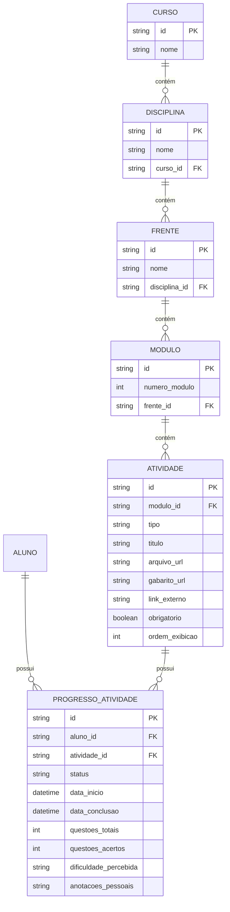
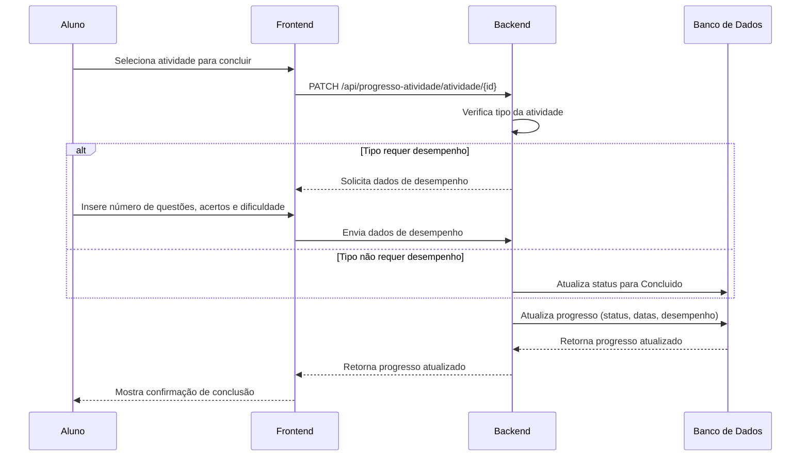

# Atividades e Progresso

<cite>
**Arquivos Referenciados neste Documento**   
- [atividade/route.ts](file://app/api/atividade/route.ts)
- [atividade/[id]/route.ts](file://app/api/atividade/[id]/route.ts)
- [atividade/aluno/[alunoId]/route.ts](file://app/api/atividade/aluno/[alunoId]/route.ts)
- [progresso-atividade/route.ts](file://app/api/progresso-atividade/route.ts)
- [progresso-atividade/[id]/route.ts](file://app/api/progresso-atividade/[id]/route.ts)
- [progresso-atividade/atividade/[atividadeId]/route.ts](file://app/api/progresso-atividade/atividade/[atividadeId]/route.ts)
- [atividade.types.ts](file://backend/services/atividade/atividade.types.ts)
- [progresso-atividade.types.ts](file://backend/services/progresso-atividade/progresso-atividade.types.ts)
- [atividade.service.ts](file://backend/services/atividade/atividade.service.ts)
- [progresso-atividade.service.ts](file://backend/services/progresso-atividade/progresso-atividade.service.ts)
</cite>

## Sumário
1. [Introdução](#introdução)
2. [Estrutura de Atividades](#estrutura-de-atividades)
3. [Endpoints de Atividades](#endpoints-de-atividades)
4. [Endpoints de Progresso de Atividade](#endpoints-de-progresso-de-atividade)
5. [Relacionamento entre Atividades e Progresso](#relacionamento-entre-atividades-e-progresso)
6. [Regras de Negócio](#regras-de-negócio)
7. [Tratamento de Erros](#tratamento-de-erros)
8. [Exemplos de Uso](#exemplos-de-uso)

## Introdução
Este documento detalha os endpoints relacionados ao gerenciamento de atividades e progresso no sistema Área do Aluno. Os endpoints permitem a criação, leitura, atualização e exclusão de atividades, além de acompanhar o progresso dos alunos em cada atividade. O sistema segue uma hierarquia clara de organização de conteúdo (curso > disciplina > frente > módulo > atividade) e garante que a visibilidade das atividades seja baseada nas matrículas dos alunos.

**Section sources**
- [atividade.types.ts](file://backend/services/atividade/atividade.types.ts#L1-L76)
- [progresso-atividade.types.ts](file://backend/services/progresso-atividade/progresso-atividade.types.ts#L1-L49)

## Estrutura de Atividades
As atividades são a unidade fundamental de conteúdo no sistema, organizadas hierarquicamente dentro de módulos, que por sua vez pertencem a frentes, disciplinas e cursos. Cada atividade possui campos essenciais como título, tipo, descrição (implícita no título e tipo), importância (refletida no tipo) e prioridade (definida pela ordem de exibição).

O tipo de atividade determina o comportamento esperado e os dados de desempenho necessários ao concluir a atividade. Tipos como "Simulado Global" ou "Lista Mista" exigem um check qualificado (registro de desempenho), enquanto "Revisão" e "Conceituário" utilizam um check simples.



**Diagram sources**
- [atividade.types.ts](file://backend/services/atividade/atividade.types.ts#L14-L27)
- [progresso-atividade.types.ts](file://backend/services/progresso-atividade/progresso-atividade.types.ts#L10-L23)

## Endpoints de Atividades
Os endpoints de atividades permitem o gerenciamento completo do ciclo de vida das atividades. Apenas usuários com perfil de professor ou superadmin podem criar, atualizar ou deletar atividades.

### Listagem de Atividades
Permite listar atividades filtrando por módulo (`modulo_id`) ou frente (`frente_id`).

- **Endpoint**: `GET /api/atividade`
- **Parâmetros de Query**:
  - `modulo_id` (string): ID do módulo para filtrar atividades.
  - `frente_id` (string): ID da frente para filtrar atividades.
- **Resposta de Sucesso (200)**:
  ```json
  {
    "data": [
      {
        "id": "string",
        "moduloId": "string",
        "tipo": "string",
        "titulo": "string",
        "arquivoUrl": "string | null",
        "gabaritoUrl": "string | null",
        "linkExterno": "string | null",
        "obrigatorio": "boolean",
        "ordemExibicao": "number",
        "createdAt": "string (ISO 8601)",
        "updatedAt": "string (ISO 8601)"
      }
    ]
  }
  ```

**Section sources**
- [atividade/route.ts](file://app/api/atividade/route.ts#L33-L57)

### Listagem de Atividades por Aluno
Retorna todas as atividades nas quais um aluno está matriculado, incluindo informações hierárquicas (nome do módulo, frente, disciplina, curso) e o progresso atual do aluno.

- **Endpoint**: `GET /api/atividade/aluno/{alunoId}`
- **Parâmetros de Rota**:
  - `alunoId` (string): ID do aluno.
- **Resposta de Sucesso (200)**:
  ```json
  {
    "data": [
      {
        "id": "string",
        "moduloId": "string",
        "tipo": "string",
        "titulo": "string",
        "arquivoUrl": "string | null",
        "gabaritoUrl": "string | null",
        "linkExterno": "string | null",
        "obrigatorio": "boolean",
        "ordemExibicao": "number",
        "createdAt": "string (ISO 8601)",
        "updatedAt": "string (ISO 8601)",
        "moduloNome": "string",
        "moduloNumero": "number | null",
        "frenteNome": "string",
        "frenteId": "string",
        "disciplinaNome": "string",
        "disciplinaId": "string",
        "cursoNome": "string",
        "cursoId": "string",
        "progressoStatus": "Pendente | Iniciado | Concluido | null",
        "progressoDataInicio": "string (ISO 8601) | null",
        "progressoDataConclusao": "string (ISO 8601) | null"
      }
    ]
  }
  ```

**Section sources**
- [atividade/aluno/[alunoId]/route.ts](file://app/api/atividade/aluno/[alunoId]/route.ts#L58-L82)

### Criação de Atividade
Cria uma nova atividade dentro de um módulo específico.

- **Endpoint**: `POST /api/atividade`
- **Corpo da Requisição**:
  ```json
  {
    "modulo_id": "string",
    "tipo": "string",
    "titulo": "string",
    "arquivo_url": "string | null",
    "gabarito_url": "string | null",
    "link_externo": "string | null",
    "obrigatorio": "boolean",
    "ordem_exibicao": "number"
  }
  ```
- **Resposta de Sucesso (201)**:
  ```json
  {
    "data": { /* Estrutura de atividade conforme listagem */ }
  }
  ```

**Section sources**
- [atividade/route.ts](file://app/api/atividade/route.ts#L59-L83)

### Atualização de Atividade
Atualiza os campos de uma atividade existente.

- **Endpoint**: `PUT /api/atividade/{id}`
- **Parâmetros de Rota**:
  - `id` (string): ID da atividade.
- **Corpo da Requisição**:
  ```json
  {
    "arquivoUrl": "string | null",
    "gabaritoUrl": "string | null",
    "linkExterno": "string | null",
    "titulo": "string",
    "obrigatorio": "boolean",
    "ordemExibicao": "number"
  }
  ```
- **Resposta de Sucesso (200)**:
  ```json
  {
    "data": { /* Estrutura de atividade atualizada */ }
  }
  ```

**Section sources**
- [atividade/[id]/route.ts](file://app/api/atividade/[id]/route.ts#L53-L79)

### Deleção de Atividade
Remove uma atividade do sistema.

- **Endpoint**: `DELETE /api/atividade/{id}`
- **Parâmetros de Rota**:
  - `id` (string): ID da atividade.
- **Resposta de Sucesso (200)**:
  ```json
  {
    "message": "Atividade removida com sucesso"
  }
  ```

**Section sources**
- [atividade/[id]/route.ts](file://app/api/atividade/[id]/route.ts#L82-L98)

## Endpoints de Progresso de Atividade
Os endpoints de progresso permitem acompanhar o estado de uma atividade para um aluno específico, incluindo o registro de desempenho quando necessário.

### Listagem de Progresso
Lista o progresso de todas as atividades de um aluno.

- **Endpoint**: `GET /api/progresso-atividade`
- **Parâmetros de Query**:
  - `alunoId` (string): ID do aluno.
- **Resposta de Sucesso (200)**:
  ```json
  {
    "data": [
      {
        "id": "string",
        "alunoId": "string",
        "atividadeId": "string",
        "status": "Pendente | Iniciado | Concluido",
        "dataInicio": "string (ISO 8601) | null",
        "dataConclusao": "string (ISO 8601) | null",
        "questoesTotais": "number",
        "questoesAcertos": "number",
        "dificuldadePercebida": "Muito Facil | Facil | Medio | Dificil | Muito Dificil | null",
        "anotacoesPessoais": "string | null",
        "createdAt": "string (ISO 8601)",
        "updatedAt": "string (ISO 8601)"
      }
    ]
  }
  ```

**Section sources**
- [progresso-atividade/route.ts](file://app/api/progresso-atividade/route.ts#L45-L67)

### Obtenção de Progresso por ID
Obtém o progresso de uma atividade específica por seu ID.

- **Endpoint**: `GET /api/progresso-atividade/{id}`
- **Parâmetros de Rota**:
  - `id` (string): ID do progresso.
- **Resposta de Sucesso (200)**:
  ```json
  {
    "data": { /* Estrutura de progresso conforme listagem */ }
  }
  ```

**Section sources**
- [progresso-atividade/[id]/route.ts](file://app/api/progresso-atividade/[id]/route.ts#L49-L58)

### Atualização de Progresso
Atualiza o status e os dados de desempenho de uma atividade para um aluno. Este endpoint é o principal para marcar atividades como iniciadas ou concluídas.

- **Endpoint**: `PATCH /api/progresso-atividade/atividade/{atividadeId}`
- **Parâmetros de Rota**:
  - `atividadeId` (string): ID da atividade.
- **Corpo da Requisição**:
  ```json
  {
    "status": "Pendente | Iniciado | Concluido",
    "desempenho": {
      "questoesTotais": "number",
      "questoesAcertos": "number",
      "dificuldadePercebida": "Muito Facil | Facil | Medio | Dificil | Muito Dificil",
      "anotacoesPessoais": "string"
    }
  }
  ```
- **Resposta de Sucesso (200)**:
  ```json
  {
    "data": { /* Estrutura de progresso atualizado */ }
  }
  ```

**Section sources**
- [progresso-atividade/atividade/[atividadeId]/route.ts](file://app/api/progresso-atividade/atividade/[atividadeId]/route.ts#L51-L125)

## Relacionamento entre Atividades e Progresso
O progresso de uma atividade é representado pela entidade `ProgressoAtividade`, que faz a ligação entre um aluno (`alunoId`) e uma atividade (`atividadeId`). O status do progresso pode ser `Pendente`, `Iniciado` ou `Concluido`. Ao concluir uma atividade, o sistema exige um check qualificado (com desempenho) para tipos de atividade que não sejam "Revisão" ou "Conceituário", garantindo a coleta de dados valiosos sobre o desempenho do aluno.



**Diagram sources**
- [atividade.types.ts](file://backend/services/atividade/atividade.types.ts#L69-L74)
- [progresso-atividade.service.ts](file://backend/services/progresso-atividade/progresso-atividade.service.ts#L84-L129)

## Regras de Negócio
O sistema implementa várias regras de negócio para garantir a integridade e a lógica do fluxo de atividades.

### Hierarquia de Conteúdo
O conteúdo é organizado em uma hierarquia rígida: Curso > Disciplina > Frente > Módulo > Atividade. Essa estrutura é fundamental para a organização do cronograma de estudos e para a geração de atividades personalizadas.

### Visibilidade Baseada em Matrículas
A visibilidade das atividades é estritamente controlada pelas matrículas dos alunos. Um aluno só pode ver e interagir com atividades de cursos nos quais está matriculado. Isso é garantido por políticas de segurança no nível do banco de dados (RLS - Row Level Security).

### Geração de Atividades Personalizadas
O sistema pode gerar automaticamente atividades para um curso com base em regras definidas (por exemplo, um simulado a cada 3 módulos). Isso é feito pelo serviço `gerarAtividadesPersonalizadas`.

### Cache de Atividades
Para otimizar o desempenho, o sistema utiliza um cache para armazenar as atividades de um módulo. O cache é invalidado sempre que uma atividade é criada, atualizada ou deletada.

**Section sources**
- [atividade.service.ts](file://backend/services/atividade/atividade.service.ts#L127-L263)
- [atividade.repository.ts](file://backend/services/atividade/atividade.repository.ts#L60-L73)

## Tratamento de Erros
O sistema possui um tratamento robusto de erros, retornando mensagens claras e códigos de status HTTP apropriados.

### Erros Comuns
- **Atividade não encontrada (404)**: Retornado quando uma atividade com o ID especificado não existe.
- **Aluno não matriculado (403)**: Retornado quando um aluno tenta acessar atividades de um curso no qual não está matriculado.
- **Requisição inválida (400)**: Retornado quando campos obrigatórios estão faltando ou dados estão em formato incorreto.
- **Proibido (403)**: Retornado quando um usuário sem permissão (não professor/superadmin) tenta criar, atualizar ou deletar uma atividade.

**Section sources**
- [atividade.service.ts](file://backend/services/atividade/atividade.service.ts#L265-L272)
- [progresso-atividade.service.ts](file://backend/services/progresso-atividade/progresso-atividade.service.ts#L152-L163)

## Exemplos de Uso
### Exemplo com cURL
**Listar atividades de um módulo:**
```bash
curl -X GET "https://api.areadoaluno.com/api/atividade?modulo_id=mod123" \
  -H "Authorization: Bearer <token>"
```

**Marcar uma atividade como concluída com desempenho:**
```bash
curl -X PATCH "https://api.areadoaluno.com/api/progresso-atividade/atividade/ativ456" \
  -H "Authorization: Bearer <token>" \
  -H "Content-Type: application/json" \
  -d '{
    "status": "Concluido",
    "desempenho": {
      "questoesTotais": 50,
      "questoesAcertos": 42,
      "dificuldadePercebida": "Medio",
      "anotacoesPessoais": "Preciso revisar a parte de direito constitucional."
    }
  }'
```

### Exemplo de Código Frontend (TypeScript)
```typescript
// Função para concluir uma atividade
async function concluirAtividade(
  atividadeId: string,
  desempenho: {
    questoesTotais: number;
    questoesAcertos: number;
    dificuldadePercebida: 'Muito Facil' | 'Facil' | 'Medio' | 'Dificil' | 'Muito Dificil';
    anotacoesPessoais?: string;
  }
) {
  const response = await fetch(`/api/progresso-atividade/atividade/${atividadeId}`, {
    method: 'PATCH',
    headers: {
      'Content-Type': 'application/json',
      'Authorization': `Bearer ${getToken()}`
    },
    body: JSON.stringify({
      status: 'Concluido',
      desempenho
    })
  });

  if (!response.ok) {
    const error = await response.json();
    throw new Error(error.error);
  }

  const data = await response.json();
  return data.data;
}
```

**Section sources**
- [progresso-atividade/atividade/[atividadeId]/route.ts](file://app/api/progresso-atividade/atividade/[atividadeId]/route.ts#L51-L125)
- [atividade.types.ts](file://backend/services/atividade/atividade.types.ts#L69-L74)