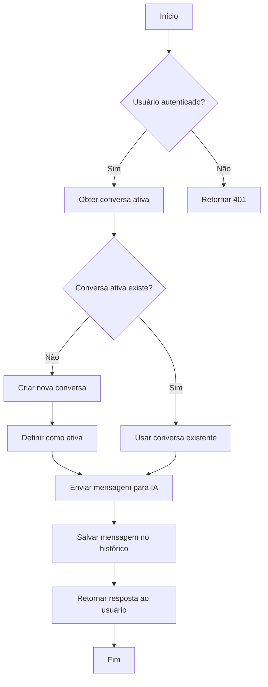
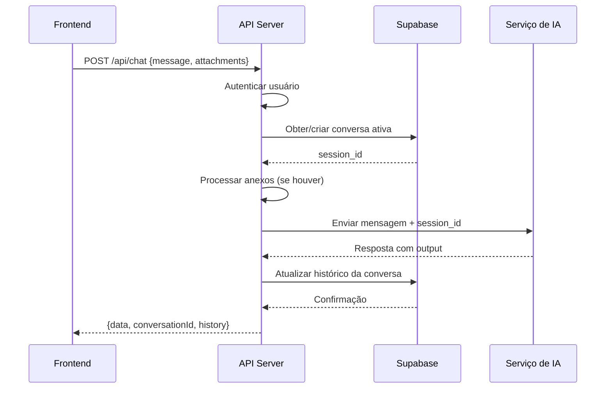

# Chat com IA e Conversas

<cite>
**Arquivos Referenciados neste Documento**   
- [app\api\chat\route.ts](file://app/api/chat/route.ts)
- [app\api\conversations\route.ts](file://app/api/conversations/route.ts)
- [app\api\conversations\[id]\route.ts](file://app/api/conversations/[id]/route.ts)
- [app\api\chat\attachments\[id]\[filename]\route.ts](file://app/api/chat/attachments/[id]/[filename]/route.ts)
- [backend\services\chat\chat.service.ts](file://backend/services/chat/chat.service.ts)
- [backend\services\conversation\conversation.service.ts](file://backend/services/conversation/conversation.service.ts)
- [backend\services\chat\attachments.service.ts](file://backend/services/chat/attachments.service.ts)
- [backend\services\chat\chat.types.ts](file://backend/services/chat/chat.types.ts)
- [backend\services\conversation\conversation.types.ts](file://backend/services/conversation/conversation.types.ts)
- [supabase\migrations\20250122_create_chat_conversations.sql](file://supabase/migrations/20250122_create_chat_conversations.sql)
</cite>

## Sumário
1. [Introdução](#introdução)
2. [Fluxo de Conversa e Sessões](#fluxo-de-conversa-e-sessões)
3. [Endpoints de Conversas](#endpoints-de-conversas)
   - [Listar Conversas (GET /api/conversations)](#listar-conversas-get-apiconversations)
   - [Criar Nova Conversa (POST /api/conversations)](#criar-nova-conversa-post-apiconversations)
   - [Obter Conversa Específica (GET /api/conversations/{id})](#obter-conversa-específica-get-apiconversationsid)
   - [Atualizar Conversa (PUT /api/conversations/{id})](#atualizar-conversa-put-apiconversationsid)
4. [Envio de Mensagens com IA (POST /api/chat)](#envio-de-mensagens-com-ia-post-apichat)
   - [Envio com Texto Simples](#envio-com-texto-simples)
   - [Envio com Anexos (multipart/form-data)](#envio-com-anexos-multipartform-data)
   - [Criação de Nova Conversa](#criação-de-nova-conversa)
5. [Tratamento de Anexos](#tratamento-de-anexos)
   - [Upload e Armazenamento](#upload-e-armazenamento)
   - [Download de Anexos (GET /api/chat/attachments/{id}/{filename})](#download-de-anexos-get-apichatattachmentsidfilename)
   - [Limitações de Arquivo](#limitações-de-arquivo)
6. [Estrutura de Histórico e Mensagens](#estrutura-de-histórico-e-mensagens)
7. [Exemplos de Uso](#exemplos-de-uso)
   - [cURL - Envio de Mensagem Simples](#curl---envio-de-mensagem-simples)
   - [cURL - Envio com Anexo](#curl---envio-com-anexo)
   - [cURL - Criação de Nova Conversa](#curl---criação-de-nova-conversa)
   - [cURL - Listar Conversas Ativas](#curl---listar-conversas-ativas)
   - [Frontend - Envio de Mensagem com Anexo](#frontend---envio-de-mensagem-com-anexo)
8. [Tratamento de Erros](#tratamento-de-erros)
   - [Erros Comuns](#erros-comuns)
   - [Códigos de Status HTTP](#códigos-de-status-http)
9. [Considerações de Segurança](#considerações-de-segurança)
10. [Diagrama de Fluxo de Mensagem](#diagrama-de-fluxo-de-mensagem)

## Introdução

Este documento detalha a API de chat com IA e gerenciamento de conversas do sistema Área do Aluno. O sistema permite interações com uma IA através de mensagens de texto, suporte a anexos (imagens, PDFs), histórico de conversas persistente e gerenciamento completo de sessões. Os endpoints cobrem desde o envio de mensagens até o gerenciamento de conversas e tratamento de anexos, com foco em segurança, desempenho e usabilidade.

A arquitetura utiliza um webhook externo para processamento das mensagens, enquanto o histórico é armazenado localmente no banco de dados Supabase. O sistema implementa autenticação JWT, RLS (Row Level Security) para isolamento de dados entre usuários, e armazenamento temporário de anexos com tokens de acesso seguros.

**Fontes da seção**
- [app\api\chat\route.ts](file://app/api/chat/route.ts#L1-L252)
- [app\api\conversations\route.ts](file://app/api/conversations/route.ts#L1-L87)
- [backend\services\conversation\conversation.service.ts](file://backend/services/conversation/conversation.service.ts#L1-L274)

## Fluxo de Conversa e Sessões

O sistema de chat opera com um modelo de conversas ativas, onde cada usuário possui uma conversa ativa por padrão. Quando um usuário envia uma mensagem sem especificar uma conversa existente, o sistema utiliza ou cria uma conversa ativa. O identificador `session_id` é crucial para manter o contexto da conversa junto ao serviço de IA externo.

O fluxo típico começa com o frontend listando as conversas existentes. Se não houver conversa ativa, uma nova é criada automaticamente. Cada mensagem enviada é armazenada no histórico da conversa, que é sincronizado com o serviço de IA. O histórico completo é mantido no banco de dados, permitindo recuperação de conversas em sessões futuras.

A transição entre conversas é feita atualizando o campo `is_active` na tabela `chat_conversations`. Um trigger no banco de dados garante que apenas uma conversa esteja ativa por usuário, desativando automaticamente as demais ao ativar uma nova.



**Fontes do diagrama**
- [app\api\chat\route.ts](file://app/api/chat/route.ts#L84-L252)
- [backend\services\conversation\conversation.service.ts](file://backend/services/conversation/conversation.service.ts#L212-L223)
- [supabase\migrations\20250122_create_chat_conversations.sql](file://supabase/migrations/20250122_create_chat_conversations.sql#L78-L99)

**Fontes da seção**
- [app\api\chat\route.ts](file://app/api/chat/route.ts#L84-L252)
- [backend\services\conversation\conversation.service.ts](file://backend/services/conversation/conversation.service.ts#L212-L223)
- [supabase\migrations\20250122_create_chat_conversations.sql](file://supabase/migrations/20250122_create_chat_conversations.sql#L78-L99)

## Endpoints de Conversas

### Listar Conversas (GET /api/conversations)

Retorna a lista de todas as conversas do usuário autenticado. Por padrão, retorna todas as conversas ordenadas por data de atualização (mais recentes primeiro). Pode ser filtrado para retornar apenas a conversa ativa.

**Parâmetros de Query:**
- `active=true` - Retorna apenas a conversa ativa do usuário

**Resposta de Sucesso (200):**
```json
{
  "conversations": [
    {
      "id": "uuid",
      "user_id": "uuid",
      "session_id": "string",
      "title": "string",
      "created_at": "string",
      "updated_at": "string",
      "is_active": "boolean",
      "history": [
        {
          "id": "string",
          "role": "user|assistant",
          "content": "string",
          "timestamp": "number"
        }
      ]
    }
  ]
}
```

**Fontes da seção**
- [app\api\conversations\route.ts](file://app/api/conversations/route.ts#L11-L49)

### Criar Nova Conversa (POST /api/conversations)

Cria uma nova conversa para o usuário autenticado. A nova conversa é automaticamente definida como ativa, desativando qualquer outra conversa anterior.

**Corpo da Requisição:**
```json
{
  "title": "string (opcional)"
}
```

**Resposta de Sucesso (201):**
```json
{
  "conversation": {
    "id": "uuid",
    "user_id": "uuid",
    "session_id": "string",
    "title": "string",
    "created_at": "string",
    "updated_at": "string",
    "is_active": true
  }
}
```

**Fontes da seção**
- [app\api\conversations\route.ts](file://app/api/conversations/route.ts#L58-L86)

### Obter Conversa Específica (GET /api/conversations/{id})

Retorna os detalhes de uma conversa específica, incluindo seu histórico completo de mensagens. O usuário deve ser o proprietário da conversa.

**Parâmetros de Caminho:**
- `id` - ID da conversa

**Resposta de Sucesso (200):**
```json
{
  "data": {
    "id": "uuid",
    "user_id": "uuid",
    "session_id": "string",
    "title": "string",
    "created_at": "string",
    "updated_at": "string",
    "is_active": "boolean",
    "history": [
      {
        "id": "string",
        "role": "user|assistant",
        "content": "string",
        "timestamp": "number"
      }
    ]
  }
}
```

**Fontes da seção**
- [app\api\conversations\[id]\route.ts](file://app/api/conversations/[id]/route.ts#L14-L40)

### Atualizar Conversa (PUT /api/conversations/{id})

Atualiza os campos de uma conversa existente. Pode atualizar o título e/ou o status ativo da conversa.

**Parâmetros de Caminho:**
- `id` - ID da conversa

**Corpo da Requisição:**
```json
{
  "title": "string (opcional)",
  "is_active": "boolean (opcional)"
}
```

**Resposta de Sucesso (200):**
```json
{
  "data": {
    "id": "uuid",
    "user_id": "uuid",
    "session_id": "string",
    "title": "string",
    "created_at": "string",
    "updated_at": "string",
    "is_active": "boolean",
    "history": [
      {
        "id": "string",
        "role": "user|assistant",
        "content": "string",
        "timestamp": "number"
      }
    ]
  }
}
```

**Fontes da seção**
- [app\api\conversations\[id]\route.ts](file://app/api/conversations/[id]/route.ts#L48-L97)

## Envio de Mensagens com IA (POST /api/chat)

Endpoint principal para enviar mensagens ao serviço de IA. Suporta envio de texto simples e com anexos via multipart/form-data. Gerencia automaticamente a criação e recuperação de conversas.

### Envio com Texto Simples

**Corpo da Requisição (JSON):**
```json
{
  "message": "string",
  "userId": "string (opcional)",
  "newConversation": "boolean (opcional)"
}
```

### Envio com Anexos (multipart/form-data)

**Campos do Formulário:**
- `message` - Texto da mensagem
- `userId` - ID do usuário (opcional)
- `newConversation` - Indica se deve criar nova conversa (opcional)
- `attachments` ou `files` - Arquivo(s) a serem enviados

### Criação de Nova Conversa

Quando `newConversation=true`, uma nova conversa é criada mesmo que o usuário já tenha uma conversa ativa. Isso é útil para separar contextos de discussão.

**Resposta de Sucesso (200):**
```json
{
  "data": {
    "output": "string"
  },
  "conversationId": "string",
  "history": [
    {
      "id": "string",
      "role": "user|assistant",
      "content": "string",
      "timestamp": "number"
    }
  ]
}
```

**Fontes da seção**
- [app\api\chat\route.ts](file://app/api/chat/route.ts#L84-L252)

## Tratamento de Anexos

### Upload e Armazenamento

Os anexos são armazenados temporariamente no sistema de arquivos do servidor. Em ambientes serverless (Vercel), utiliza-se o diretório `/tmp`. Em outros ambientes, usa-se `/tmp/chat-uploads` ou um diretório local no Windows.

Cada anexo recebe:
- Um ID único (UUID)
- Um token de acesso único (UUID)
- Um tempo de expiração de 10 minutos
- Metadados armazenados em arquivo JSON

O sistema valida o tipo de arquivo (apenas imagens e PDFs) e o tamanho (máximo de 5MB por arquivo, 15MB total).

### Download de Anexos (GET /api/chat/attachments/{id}/{filename})

Permite o download de anexos previamente enviados. Requer um token de acesso válido na URL.

**Parâmetros de Caminho:**
- `id` - ID do anexo
- `filename` - Nome do arquivo (usado para definir Content-Type)

**Parâmetro de Query:**
- `token` - Token de acesso gerado no upload

**Cabeçalhos da Resposta:**
- `Content-Type` - Baseado na extensão do filename e tipo MIME
- `Content-Length` - Tamanho do arquivo
- `Access-Control-Allow-Origin: *` - Permite acesso CORS

Após o download, o arquivo é automaticamente removido do sistema.

**Fontes da seção**
- [app\api\chat\attachments\[id]\[filename]\route.ts](file://app/api/chat/attachments/[id]/[filename]/route.ts#L23-L125)
- [backend\services\chat\attachments.service.ts](file://backend/services/chat/attachments.service.ts#L1-L238)

### Limitações de Arquivo

- **Tipos permitidos:** PNG, JPEG, JPG, WEBP, GIF, PDF
- **Tamanho máximo por arquivo:** 5MB
- **Tamanho total máximo:** 15MB (apenas um arquivo permitido por mensagem)
- **Tempo de vida:** 10 minutos após o upload
- **Quantidade:** Apenas um arquivo por mensagem é permitido

**Fontes da seção**
- [backend\services\chat\attachments.service.ts](file://backend/services/chat/attachments.service.ts#L30-L40)

## Estrutura de Histórico e Mensagens

O histórico de conversas é armazenado como JSONB no banco de dados, permitindo consultas eficientes. Cada mensagem contém:

**Estrutura ChatMessage:**
- `id` - Identificador único da mensagem
- `role` - Papel na conversa ('user' ou 'assistant')
- `content` - Conteúdo da mensagem
- `timestamp` - Timestamp em milissegundos

O histórico é sincronizado entre o serviço de IA e o banco de dados. Quando uma nova mensagem é enviada, o histórico existente é recuperado, a nova interação é adicionada, e o histórico completo é salvo novamente.

A tabela `chat_conversation_history` armazena o histórico separadamente da tabela principal de conversas, permitindo atualizações independentes e melhor desempenho.

**Fontes da seção**
- [backend\services\conversation\conversation.types.ts](file://backend/services/conversation/conversation.types.ts#L1-L6)
- [backend\services\conversation\conversation.service.ts](file://backend/services/conversation/conversation.service.ts#L228-L270)

## Exemplos de Uso

### cURL - Envio de Mensagem Simples

```bash
curl -X POST https://api.areadoaluno.com.br/api/chat \
  -H "Authorization: Bearer <token>" \
  -H "Content-Type: application/json" \
  -d '{
    "message": "Olá, como posso ajudar?",
    "userId": "user-123"
  }'
```

### cURL - Envio com Anexo

```bash
curl -X POST https://api.areadoaluno.com.br/api/chat \
  -H "Authorization: Bearer <token>" \
  -F "message=Por favor, analise este documento" \
  -F "attachments=@/caminho/do/arquivo.pdf" \
  -F "userId=user-123"
```

### cURL - Criação de Nova Conversa

```bash
curl -X POST https://api.areadoaluno.com.br/api/chat \
  -H "Authorization: Bearer <token>" \
  -H "Content-Type: application/json" \
  -d '{
    "message": "Nova consulta sobre matemática",
    "userId": "user-123",
    "newConversation": true
  }'
```

### cURL - Listar Conversas Ativas

```bash
curl -X GET "https://api.areadoaluno.com.br/api/conversations?active=true" \
  -H "Authorization: Bearer <token>"
```

### Frontend - Envio de Mensagem com Anexo

```javascript
async function enviarMensagemComAnexo(mensagem, arquivo, userId) {
  const formData = new FormData();
  formData.append('message', mensagem);
  formData.append('userId', userId);
  formData.append('attachments', arquivo);
  
  const response = await fetch('/api/chat', {
    method: 'POST',
    body: formData,
    headers: {
      'Authorization': `Bearer ${getToken()}`
    }
  });
  
  if (!response.ok) {
    throw new Error('Falha ao enviar mensagem');
  }
  
  return response.json();
}
```

**Fontes da seção**
- [app\api\chat\route.ts](file://app/api/chat/route.ts#L84-L252)
- [app\api\conversations\route.ts](file://app/api/conversations/route.ts#L11-L49)

## Tratamento de Erros

### Erros Comuns

- **Conversa não encontrada (404):** Ao tentar acessar uma conversa que não existe ou não pertence ao usuário
- **Anexo não autorizado (403):** Token inválido ou expirado para download de anexo
- **Arquivo expirado (410):** Anexo já foi removido após o tempo de vida
- **Tamanho de arquivo excedido (400):** Arquivo maior que 5MB ou total maior que 15MB
- **Tipo de arquivo não suportado (400):** Envio de formato diferente de imagem ou PDF

### Códigos de Status HTTP

- **200 OK:** Operação realizada com sucesso
- **201 Created:** Recurso criado com sucesso
- **400 Bad Request:** Dados inválidos na requisição
- **401 Unauthorized:** Token de autenticação ausente ou inválido
- **403 Forbidden:** Acesso negado ao recurso
- **404 Not Found:** Recurso não encontrado
- **410 Gone:** Recurso expirado/removido
- **500 Internal Server Error:** Erro interno do servidor

**Fontes da seção**
- [app\api\chat\route.ts](file://app/api/chat/route.ts#L37-L65)
- [app\api\conversations\[id]\route.ts](file://app/api/conversations/[id]/route.ts#L26-L28)
- [app\api\chat\attachments\[id]\[filename]\route.ts](file://app/api/chat/attachments/[id]/[filename]/route.ts#L38-L72)

## Considerações de Segurança

O sistema implementa múltiplas camadas de segurança:

1. **Autenticação JWT:** Todos os endpoints requerem token válido
2. **RLS (Row Level Security):** No banco de dados, garante que usuários acessem apenas suas próprias conversas
3. **Tokens de Acesso:** Anexos requerem tokens únicos e de curta duração
4. **Validação de Entrada:** Todos os dados são validados antes do processamento
5. **Isolamento de Arquivos:** Anexos são armazenados separadamente e removidos após uso
6. **CORS:** Configurado para permitir acesso apenas de origens autorizadas

Os anexos são armazenados com tokens de acesso que expiram em 10 minutos, minimizando o risco de acesso não autorizado. Após o download, os arquivos são imediatamente removidos do sistema.

**Fontes da seção**
- [backend\auth\middleware.ts](file://backend/auth/middleware.ts#L115-L193)
- [supabase\migrations\20250122_create_chat_conversations.sql](file://supabase/migrations/20250122_create_chat_conversations.sql#L36-L60)
- [app\api\chat\attachments\[id]\[filename]\route.ts](file://app/api/chat/attachments/[id]/[filename]/route.ts#L23-L125)

## Diagrama de Fluxo de Mensagem



**Fontes do diagrama**
- [app\api\chat\route.ts](file://app/api/chat/route.ts#L84-L252)
- [backend\services\chat\chat.service.ts](file://backend/services/chat/chat.service.ts#L8-L363)
- [backend\services\conversation\conversation.service.ts](file://backend/services/conversation/conversation.service.ts#L16-L40)