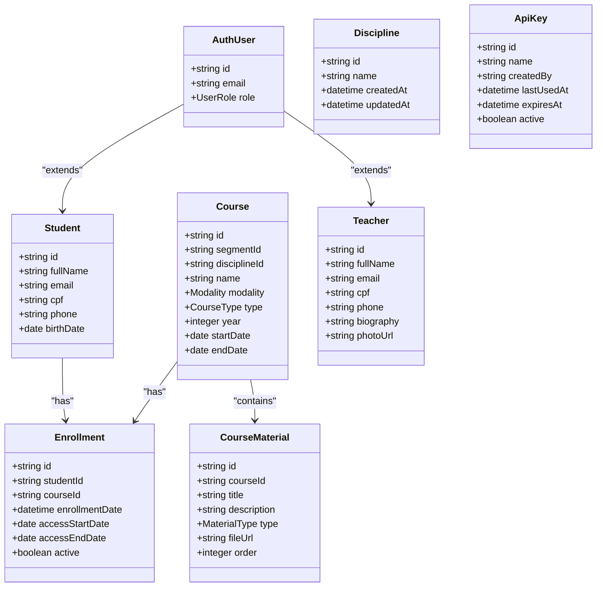
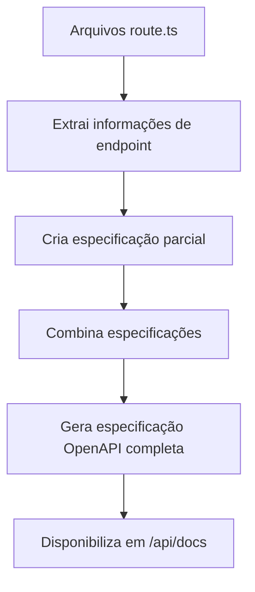
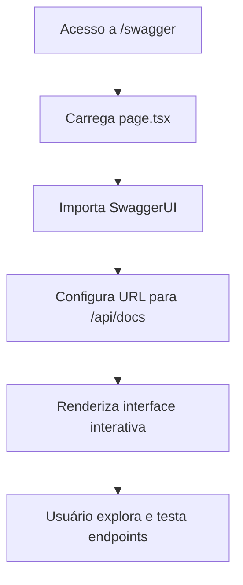
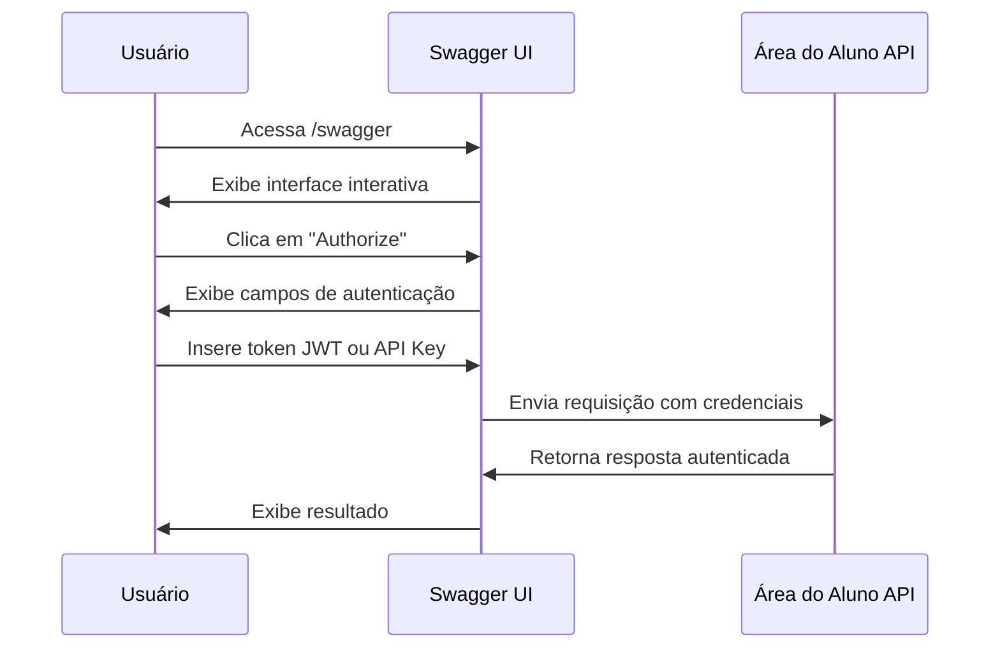
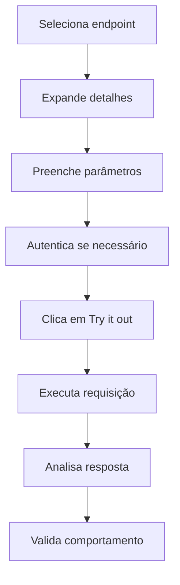
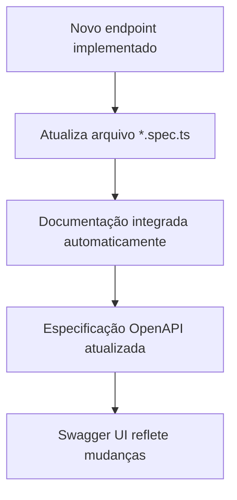

# Especificação OpenAPI e Swagger UI

<cite>
**Arquivos Referenciados neste Documento**   
- [route.ts](file://app/api/docs/route.ts)
- [page.tsx](file://app/swagger/page.tsx)
- [index.ts](file://backend/swagger/index.ts)
- [auth.spec.ts](file://backend/swagger/auth.spec.ts)
- [discipline.spec.ts](file://backend/swagger/discipline.spec.ts)
- [course.spec.ts](file://backend/swagger/course.spec.ts)
- [student.spec.ts](file://backend/swagger/student.spec.ts)
- [teacher.spec.ts](file://backend/swagger/teacher.spec.ts)
- [enrollment.spec.ts](file://backend/swagger/enrollment.spec.ts)
- [course-material.spec.ts](file://backend/swagger/course-material.spec.ts)
- [api-key.spec.ts](file://backend/swagger/api-key.spec.ts)
- [chat.spec.ts](file://backend/swagger/chat.spec.ts)
</cite>

## Sumário
1. [Introdução](#introdução)
2. [Geração Dinâmica da Especificação OpenAPI](#geração-dinâmica-da-especificação-openapi)
3. [Estrutura da Especificação OpenAPI](#estrutura-da-especificação-openapi)
4. [Documentação Automática de Endpoints](#documentação-automática-de-endpoints)
5. [Interface Swagger UI](#interface-swagger-ui)
6. [Autenticação na Swagger UI](#autenticação-na-swagger-ui)
7. [Teste de Endpoints via Swagger UI](#teste-de-endpoints-via-swagger-ui)
8. [Geração de SDKs a partir da Especificação](#geração-de-sdks-a-partir-da-especificação)
9. [Atualização Automática da Documentação](#atualização-automática-da-documentação)
10. [Limitações Conhecidas](#limitações-conhecidas)
11. [Contribuição para a Melhoria da Documentação](#contribuição-para-a-melhoria-da-documentação)
12. [Conclusão](#conclusão)

## Introdução

O sistema Área do Aluno implementa uma documentação de API completa utilizando a especificação OpenAPI (anteriormente conhecida como Swagger) e a interface Swagger UI. Esta documentação fornece uma visão abrangente dos endpoints da API, permitindo que desenvolvedores, testadores e integradores explorem, testem e integrem com o sistema de forma eficiente. A especificação OpenAPI é gerada dinamicamente e disponibilizada em dois formatos: JSON em `/api/docs` e interface interativa em `/swagger`.

A documentação é mantida automaticamente com base nos arquivos de rota do sistema, garantindo que sempre reflita o estado atual da API. O sistema suporta dois métodos de autenticação: JWT (através de tokens de acesso) e API Key (chaves de API), ambos documentados na especificação.

**Section sources**
- [index.ts](file://backend/swagger/index.ts#L1-L86)
- [auth.spec.ts](file://backend/swagger/auth.spec.ts#L1-L260)

## Geração Dinâmica da Especificação OpenAPI

A especificação OpenAPI é gerada dinamicamente pelo sistema Área do Aluno através de um endpoint especializado localizado em `app/api/docs/route.ts`. Este endpoint utiliza a função `getOpenApiSpec()` importada do módulo `@/backend/swagger` para construir a especificação completa da API em tempo real.

O processo de geração ocorre da seguinte forma:
1. O endpoint `/api/docs` recebe uma requisição HTTP GET
2. A função `getOpenApiSpec()` é chamada para construir a especificação
3. A especificação é retornada como uma resposta JSON

A especificação é construída a partir de múltiplos arquivos de especificação localizados no diretório `backend/swagger/`, cada um responsável por um domínio específico da aplicação (autenticação, disciplinas, cursos, alunos, professores, matrículas, materiais de curso, chaves de API e chat). Esses arquivos são combinados em uma especificação unificada que representa todos os endpoints disponíveis no sistema.

```mermaid
flowchart TD
A[Requisição GET para /api/docs] --> B[Chama getOpenApiSpec()]
B --> C[Combina especificações parciais]
C --> D[Constrói especificação OpenAPI completa]
D --> E[Retorna JSON]
```

**Diagram sources**
- [route.ts](file://app/api/docs/route.ts#L1-L7)
- [index.ts](file://backend/swagger/index.ts#L45-L83)

**Section sources**
- [route.ts](file://app/api/docs/route.ts#L1-L7)
- [index.ts](file://backend/swagger/index.ts#L45-L83)

## Estrutura da Especificação OpenAPI

A especificação OpenAPI do sistema Área do Aluno segue a versão 3.0.3 e possui uma estrutura bem definida que inclui metadados, servidores, componentes e paths. A estrutura base é definida no arquivo `backend/swagger/index.ts` e posteriormente expandida com os endpoints específicos de cada domínio.

### Metadados da API

Os metadados da API incluem informações essenciais sobre o sistema:
- **Título**: "Área do Aluno API"
- **Versão**: "1.0.0"
- **Descrição**: "Documentação para os serviços da Área do Aluno"

### Servidores

A especificação define os servidores onde a API está disponível. Atualmente, o servidor padrão é configurado para `http://localhost:3000`, mas pode ser ajustado conforme o ambiente de implantação.

### Components

A seção de componentes define esquemas de dados reutilizáveis e esquemas de segurança utilizados por toda a API.

#### securitySchemes

O sistema implementa dois esquemas de segurança:

1. **bearerAuth**: Autenticação baseada em JWT
   - Tipo: HTTP
   - Esquema: Bearer
   - Formato: JWT
   - Descrição: Token JWT obtido através do processo de autenticação

2. **apiKeyAuth**: Autenticação baseada em chave de API
   - Tipo: apiKey
   - Localização: header
   - Nome: X-API-Key
   - Descrição: Chave de API para acesso direto à API (alternativa ao JWT)

Esses esquemas de segurança são aplicados aos endpoints que requerem autenticação, permitindo que os usuários se autentiquem usando o método mais apropriado para seu caso de uso.

#### schemas

A especificação define diversos esquemas de dados para os principais recursos do sistema, incluindo:
- Usuário de autenticação (AuthUser)
- Disciplina (Discipline)
- Curso (Course)
- Aluno (Student)
- Professor (Teacher)
- Matrícula (Enrollment)
- Material de curso (CourseMaterial)
- Chave de API (ApiKey)
- Requisição de chat (ChatRequest)

Esses esquemas definem a estrutura dos dados esperados nas requisições e respostas, incluindo tipos de dados, formatos, validações e exemplos.



**Diagram sources**
- [index.ts](file://backend/swagger/index.ts#L25-L40)
- [auth.spec.ts](file://backend/swagger/auth.spec.ts#L1-L78)
- [discipline.spec.ts](file://backend/swagger/discipline.spec.ts#L1-L40)
- [course.spec.ts](file://backend/swagger/course.spec.ts#L1-L111)
- [student.spec.ts](file://backend/swagger/student.spec.ts#L1-L147)
- [teacher.spec.ts](file://backend/swagger/teacher.spec.ts#L1-L111)
- [enrollment.spec.ts](file://backend/swagger/enrollment.spec.ts#L1-L70)
- [course-material.spec.ts](file://backend/swagger/course-material.spec.ts#L1-L96)
- [api-key.spec.ts](file://backend/swagger/api-key.spec.ts#L1-L73)

**Section sources**
- [index.ts](file://backend/swagger/index.ts#L13-L43)
- [auth.spec.ts](file://backend/swagger/auth.spec.ts#L1-L78)
- [discipline.spec.ts](file://backend/swagger/discipline.spec.ts#L1-L40)
- [course.spec.ts](file://backend/swagger/course.spec.ts#L1-L111)
- [student.spec.ts](file://backend/swagger/student.spec.ts#L1-L147)
- [teacher.spec.ts](file://backend/swagger/teacher.spec.ts#L1-L111)
- [enrollment.spec.ts](file://backend/swagger/enrollment.spec.ts#L1-L70)
- [course-material.spec.ts](file://backend/swagger/course-material.spec.ts#L1-L96)
- [api-key.spec.ts](file://backend/swagger/api-key.spec.ts#L1-L73)

## Documentação Automática de Endpoints

Os endpoints da API são automaticamente documentados com base nos arquivos de rota localizados no diretório `app/api/`. Cada arquivo `route.ts` dentro deste diretório representa um endpoint da API e é automaticamente refletido na especificação OpenAPI.

A documentação é organizada por domínios, com cada domínio tendo seu próprio arquivo de especificação no diretório `backend/swagger/`. Por exemplo:
- `auth.spec.ts` documenta endpoints de autenticação
- `discipline.spec.ts` documenta endpoints de disciplinas
- `course.spec.ts` documenta endpoints de cursos
- `student.spec.ts` documenta endpoints de alunos
- `teacher.spec.ts` documenta endpoints de professores
- `enrollment.spec.ts` documenta endpoints de matrículas
- `course-material.spec.ts` documenta endpoints de materiais de curso
- `api-key.spec.ts` documenta endpoints de chaves de API
- `chat.spec.ts` documenta endpoints de chat

Cada endpoint documentado inclui:
- Método HTTP (GET, POST, PUT, DELETE)
- Caminho do endpoint
- Tags para categorização
- Resumo da funcionalidade
- Parâmetros (path, query, header)
- Corpo da requisição (quando aplicável)
- Respostas possíveis com códigos de status e esquemas
- Requisitos de segurança

Por exemplo, o endpoint de login (`/api/auth/signin`) é documentado com:
- Método: POST
- Tag: Auth
- Resumo: "Sign in a user"
- Corpo da requisição: schema SignInInput
- Respostas: 200 (sucesso), 401 (credenciais inválidas)

Esta abordagem de documentação automática garante que a documentação esteja sempre sincronizada com a implementação da API, reduzindo erros e melhorando a confiabilidade da documentação.



**Diagram sources**
- [index.ts](file://backend/swagger/index.ts#L45-L83)
- [auth.spec.ts](file://backend/swagger/auth.spec.ts#L80-L258)
- [discipline.spec.ts](file://backend/swagger/discipline.spec.ts#L42-L226)
- [course.spec.ts](file://backend/swagger/course.spec.ts#L113-L297)
- [student.spec.ts](file://backend/swagger/student.spec.ts#L149-L333)
- [teacher.spec.ts](file://backend/swagger/teacher.spec.ts#L113-L297)
- [enrollment.spec.ts](file://backend/swagger/enrollment.spec.ts#L72-L262)
- [course-material.spec.ts](file://backend/swagger/course-material.spec.ts#L98-L274)
- [api-key.spec.ts](file://backend/swagger/api-key.spec.ts#L75-L328)
- [chat.spec.ts](file://backend/swagger/chat.spec.ts#L75-L199)

**Section sources**
- [index.ts](file://backend/swagger/index.ts#L45-L83)
- [auth.spec.ts](file://backend/swagger/auth.spec.ts#L80-L258)
- [discipline.spec.ts](file://backend/swagger/discipline.spec.ts#L42-L226)
- [course.spec.ts](file://backend/swagger/course.spec.ts#L113-L297)
- [student.spec.ts](file://backend/swagger/student.spec.ts#L149-L333)
- [teacher.spec.ts](file://backend/swagger/teacher.spec.ts#L113-L297)
- [enrollment.spec.ts](file://backend/swagger/enrollment.spec.ts#L72-L262)
- [course-material.spec.ts](file://backend/swagger/course-material.spec.ts#L98-L274)
- [api-key.spec.ts](file://backend/swagger/api-key.spec.ts#L75-L328)
- [chat.spec.ts](file://backend/swagger/chat.spec.ts#L75-L199)

## Interface Swagger UI

A interface Swagger UI é disponibilizada no caminho `/swagger` do sistema Área do Aluno, fornecendo uma interface web interativa para explorar e testar os endpoints da API. A interface é implementada no arquivo `app/swagger/page.tsx` e utiliza o componente `SwaggerUI` da biblioteca `swagger-ui-react`.

A página Swagger UI é uma aplicação cliente que carrega a especificação OpenAPI do endpoint `/api/docs` e renderiza uma interface amigável para interação com a API. A interface inclui recursos como:
- Visualização hierárquica dos endpoints organizados por tags
- Expansão e contração de seções para melhor navegação
- Ocultação automática dos modelos de resposta para reduzir a complexidade inicial
- Suporte a múltiplos métodos HTTP
- Formulários para entrada de parâmetros e corpos de requisição
- Visualização de exemplos de requisição e resposta
- Histórico de requisições realizadas

A configuração da interface Swagger UI é minimalista, com apenas as opções essenciais:
- URL da especificação: `/api/docs`
- Expansão inicial dos endpoints: "none" (nenhum)
- Profundidade de expansão dos modelos: 0 (ocultos por padrão)

Esta configuração garante que a interface seja carregada rapidamente e que os usuários possam expandir apenas as seções que estão interessados em explorar, melhorando a experiência do usuário ao lidar com uma API extensa.



**Diagram sources**
- [page.tsx](file://app/swagger/page.tsx#L1-L12)

**Section sources**
- [page.tsx](file://app/swagger/page.tsx#L1-L12)

## Autenticação na Swagger UI

A Swagger UI permite que os usuários se autentiquem na API usando os dois métodos suportados pelo sistema: JWT e API Key. A autenticação é essencial para testar endpoints protegidos que requerem autorização.

### Autenticação com JWT

Para autenticar com JWT, os usuários devem:
1. Realizar login no sistema através do endpoint `/api/auth/signin`
2. Obter o token de acesso JWT da resposta
3. Clicar no botão "Authorize" na interface Swagger UI
4. Inserir o token JWT no campo correspondente ao esquema `bearerAuth`
5. Confirmar a autorização

Após a autenticação bem-sucedida, o token JWT será incluído automaticamente no cabeçalho `Authorization` de todas as requisições subsequentes aos endpoints protegidos.

### Autenticação com API Key

Para autenticar com API Key, os usuários devem:
1. Criar uma chave de API através do endpoint `/api/api-key` (requer autenticação prévia com JWT)
2. Obter a chave de API da resposta (exibida apenas uma vez)
3. Clicar no botão "Authorize" na interface Swagger UI
4. Inserir a chave de API no campo correspondente ao esquema `apiKeyAuth`
5. Confirmar a autorização

Após a autenticação bem-sucedida, a chave de API será incluída automaticamente no cabeçalho `X-API-Key` de todas as requisições subsequentes aos endpoints protegidos.

A interface Swagger UI gerencia os estados de autenticação, permitindo que os usuários facilmente autorizem, desautorizem e alternem entre diferentes métodos de autenticação conforme necessário para testar diferentes cenários.



**Diagram sources**
- [auth.spec.ts](file://backend/swagger/auth.spec.ts#L159-L183)
- [api-key.spec.ts](file://backend/swagger/api-key.spec.ts#L80-L120)
- [chat.spec.ts](file://backend/swagger/chat.spec.ts#L81-L82)

**Section sources**
- [auth.spec.ts](file://backend/swagger/auth.spec.ts#L159-L183)
- [api-key.spec.ts](file://backend/swagger/api-key.spec.ts#L80-L120)
- [chat.spec.ts](file://backend/swagger/chat.spec.ts#L81-L82)

## Teste de Endpoints via Swagger UI

A Swagger UI permite que os usuários testem diretamente os endpoints da API sem necessidade de ferramentas externas. O processo de teste envolve vários passos que garantem uma validação completa da funcionalidade dos endpoints.

### Processo de Teste

1. **Seleção do Endpoint**: Navegue pela lista de endpoints organizados por tags (Auth, Discipline, Course, Student, Teacher, Enrollment, CourseMaterial, "API Key", Chat) e selecione o endpoint desejado.

2. **Expansão do Endpoint**: Clique no endpoint para expandir sua documentação, revelando detalhes como método HTTP, resumo, parâmetros, corpo da requisição e respostas possíveis.

3. **Configuração da Requisição**: Preencha os parâmetros necessários:
   - Parâmetros de caminho (path parameters)
   - Parâmetros de consulta (query parameters)
   - Corpo da requisição (request body) quando aplicável

4. **Autenticação**: Se o endpoint requer autenticação, certifique-se de estar autorizado com JWT ou API Key conforme descrito na seção anterior.

5. **Execução da Requisição**: Clique no botão "Try it out" seguido de "Execute" para enviar a requisição à API.

6. **Análise da Resposta**: Examine a resposta da API, incluindo:
   - Código de status HTTP
   - Cabeçalhos de resposta
   - Corpo da resposta em formato JSON
   - Tempo de resposta
   - URL da requisição

### Exemplos de Teste

#### Teste de Autenticação

Para testar o endpoint de login:
1. Selecione o endpoint `POST /api/auth/signin`
2. Clique em "Try it out"
3. Preencha o corpo da requisição com credenciais válidas:
```json
{
  "email": "usuario@exemplo.com",
  "password": "senha123"
}
```
4. Execute a requisição
5. Verifique se a resposta contém um token JWT válido

#### Teste de Listagem de Disciplinas

Para testar o endpoint de listagem de disciplinas:
1. Autentique-se com JWT ou API Key
2. Selecione o endpoint `GET /api/discipline`
3. Execute a requisição
4. Verifique se a resposta contém uma lista de disciplinas no formato esperado

Esta funcionalidade de teste integrada permite que desenvolvedores, testadores e integradores validem rapidamente o comportamento da API, identifiquem problemas e depurem integrações diretamente no navegador.



**Section sources**
- [auth.spec.ts](file://backend/swagger/auth.spec.ts#L118-L154)
- [discipline.spec.ts](file://backend/swagger/discipline.spec.ts#L43-L65)
- [page.tsx](file://app/swagger/page.tsx#L1-L12)

## Geração de SDKs a partir da Especificação

A especificação OpenAPI disponibilizada em `/api/docs` pode ser utilizada para gerar SDKs (Software Development Kits) automaticamente para diversas linguagens de programação. Esta funcionalidade permite que desenvolvedores integrem rapidamente com a API do Área do Aluno sem precisar implementar manualmente os clientes HTTP.

### Ferramentas de Geração

Existem várias ferramentas que podem consumir a especificação OpenAPI e gerar SDKs:

1. **OpenAPI Generator**: Ferramenta de código aberto que suporta mais de 50 linguagens e frameworks
2. **Swagger Codegen**: Antecessor do OpenAPI Generator, ainda amplamente utilizado
3. **Postman**: Permite exportar clientes para diversas linguagens
4. **Apicurio Studio**: Ferramenta de design de API com recursos de geração de código

### Processo de Geração

Para gerar um SDK a partir da especificação OpenAPI:

1. **Obtenha a especificação**: Acesse `https://seusite.com/api/docs` e salve o JSON resultante

2. **Escolha a ferramenta e linguagem**: Selecione a ferramenta de geração e a linguagem de programação desejada (JavaScript, TypeScript, Python, Java, C#, etc.)

3. **Execute a geração**: Utilize a ferramenta escolhida para gerar o SDK a partir da especificação

4. **Integre o SDK**: Adicione o SDK gerado ao seu projeto e comece a utilizar os métodos fornecidos

### Exemplo com OpenAPI Generator

Para gerar um cliente TypeScript:
```bash
npx @openapitools/openapi-generator-cli generate \
  -i https://seusite.com/api/docs \
  -g typescript-axios \
  -o ./client-area-do-aluno
```

Este comando gerará um cliente TypeScript completo com:
- Clientes HTTP para todos os endpoints
- Modelos de dados tipados para requisições e respostas
- Tratamento automático de erros
- Suporte a autenticação JWT e API Key
- Documentação inline

A geração de SDKs automatizada reduz significativamente o tempo de integração, elimina erros de digitação e garante que o cliente esteja sempre em sincronia com a API.

**Section sources**
- [route.ts](file://app/api/docs/route.ts#L1-L7)
- [index.ts](file://backend/swagger/index.ts#L45-L83)

## Atualização Automática da Documentação

A documentação da API é automaticamente atualizada sempre que novos endpoints são adicionados ou modificados no sistema. Este processo de atualização automática é fundamental para garantir que a documentação reflita com precisão o estado atual da API.

### Mecanismo de Atualização

O sistema utiliza uma abordagem modular para a documentação, onde cada domínio da aplicação tem seu próprio arquivo de especificação no diretório `backend/swagger/`. Quando um novo endpoint é adicionado ou um existente é modificado, o desenvolvedor deve atualizar o arquivo de especificação correspondente.

O processo de atualização envolve:

1. **Identificação do domínio**: Determine qual domínio o novo endpoint pertence (autenticação, disciplinas, cursos, etc.)

2. **Atualização do arquivo de especificação**: Modifique o arquivo `*.spec.ts` correspondente para incluir a documentação do novo endpoint

3. **Teste local**: Verifique se a especificação é válida e se a interface Swagger UI exibe corretamente o novo endpoint

4. **Deploy**: Ao implantar as alterações, a especificação OpenAPI será automaticamente atualizada

### Benefícios da Atualização Automática

- **Sincronização em tempo real**: A documentação está sempre atualizada com a implementação
- **Redução de erros**: Elimina a necessidade de manutenção manual da documentação
- **Consistência**: Todos os endpoints seguem o mesmo padrão de documentação
- **Facilidade de manutenção**: Desenvolvedores atualizam a documentação junto com o código
- **Transparência**: Mudanças na API são imediatamente visíveis na documentação

Esta abordagem garante que a documentação seja uma representação fiel da API, aumentando a confiança dos integradores e reduzindo o tempo necessário para entender e utilizar os endpoints disponíveis.



**Section sources**
- [index.ts](file://backend/swagger/index.ts#L45-L83)
- [auth.spec.ts](file://backend/swagger/auth.spec.ts#L80-L258)
- [discipline.spec.ts](file://backend/swagger/discipline.spec.ts#L42-L226)

## Limitações Conhecidas

Embora a implementação da especificação OpenAPI e Swagger UI no sistema Área do Aluno seja robusta, existem algumas limitações conhecidas que devem ser consideradas pelos usuários:

### Limitações de Funcionalidade

1. **Suporte parcial a streaming**: O endpoint de chat (`/api/chat`) suporta streaming via Server-Sent Events (SSE) quando o parâmetro `stream=true` é fornecido, mas a interface Swagger UI pode não exibir corretamente fluxos de dados contínuos.

2. **Validação de entrada limitada**: Embora os esquemas definam restrições como `minLength`, `maxLength` e `pattern`, a interface Swagger UI não valida rigorosamente os dados de entrada antes do envio, podendo resultar em erros 400 que poderiam ser evitados com validação prévia mais rigorosa.

3. **Suporte limitado a múltiplas autenticações**: Alguns endpoints podem aceitar múltiplos métodos de autenticação (JWT e API Key), mas a interface pode não permitir fácil alternância entre eles durante testes consecutivos.

### Limitações de Desempenho

1. **Tempo de carregamento**: Para APIs extensas com muitos endpoints, o carregamento inicial da interface Swagger UI pode ser lento, especialmente em conexões de internet mais lentas.

2. **Uso de memória**: A interface Swagger UI pode consumir uma quantidade significativa de memória do navegador quando muitos endpoints são expandidos simultaneamente.

### Limitações de Segurança

1. **Exposição de estrutura interna**: A documentação completa expõe a estrutura interna da API, o que pode ser explorado por atacantes maliciosos para identificar endpoints potencialmente vulneráveis.

2. **Informações sensíveis em exemplos**: Embora os exemplos sejam genéricos, existe o risco de informações sensíveis serem acidentalmente incluídas em exemplos de requisição ou resposta.

### Limitações de Usabilidade

1. **Complexidade para usuários iniciantes**: A interface pode ser avassaladora para usuários não familiarizados com APIs REST e especificações OpenAPI.

2. **Suporte limitado a uploads de arquivos**: Endpoints que envolvem upload de arquivos podem não ser facilmente testáveis através da interface Swagger UI padrão.

Essas limitações estão sendo monitoradas e podem ser abordadas em futuras atualizações do sistema.

**Section sources**
- [chat.spec.ts](file://backend/swagger/chat.spec.ts#L100-L111)
- [auth.spec.ts](file://backend/swagger/auth.spec.ts#L1-L260)
- [page.tsx](file://app/swagger/page.tsx#L1-L12)

## Contribuição para a Melhoria da Documentação

A documentação da API é um ativo importante para o ecossistema do Área do Aluno, e contribuições para sua melhoria são bem-vindas. Existem várias maneiras de contribuir para tornar a documentação mais completa, clara e útil.

### Formas de Contribuição

1. **Melhoria de descrições**: Adicione descrições mais detalhadas para endpoints, parâmetros e modelos de dados para tornar a documentação mais compreensível.

2. **Adição de exemplos**: Inclua exemplos práticos de requisições e respostas para ilustrar o uso típico dos endpoints.

3. **Correção de erros**: Identifique e corrija quaisquer discrepâncias entre a documentação e o comportamento real da API.

4. **Tradução**: Contribua com traduções da documentação para outros idiomas, ampliando o acesso a desenvolvedores internacionais.

5. **Melhoria de validações**: Refine as validações nos esquemas para fornecer mensagens de erro mais úteis e prevenir erros comuns.

### Processo de Contribuição

Para contribuir com melhorias na documentação:

1. **Foque nos arquivos de especificação**: As contribuições devem ser feitas principalmente nos arquivos `*.spec.ts` no diretório `backend/swagger/`.

2. **Siga o padrão existente**: Mantenha consistência com o estilo e formato da documentação existente.

3. **Teste suas alterações**: Verifique se a interface Swagger UI exibe corretamente as alterações feitas.

4. **Documente mudanças significativas**: Para alterações que afetam o comportamento da API, atualize também a documentação geral no diretório `docs/`.

5. **Submeta suas contribuições**: Siga o processo de pull request do repositório para submeter suas alterações.

A colaboração contínua na documentação ajuda a manter a API acessível, compreensível e fácil de usar para todos os integradores.

**Section sources**
- [index.ts](file://backend/swagger/index.ts#L1-L86)
- [auth.spec.ts](file://backend/swagger/auth.spec.ts#L1-L260)
- [discipline.spec.ts](file://backend/swagger/discipline.spec.ts#L1-L229)

## Conclusão

A implementação da especificação OpenAPI e Swagger UI no sistema Área do Aluno fornece uma solução robusta e eficiente para documentação e exploração da API. A geração dinâmica da especificação em `/api/docs` e sua disponibilização interativa em `/swagger` permite que desenvolvedores, testadores e integradores compreendam, testem e utilizem os endpoints da API de forma eficiente.

A arquitetura modular da documentação, com arquivos de especificação separados para cada domínio da aplicação, facilita a manutenção e atualização automática da documentação conforme novos endpoints são adicionados. Os esquemas de segurança bem definidos para JWT e API Key garantem que a autenticação seja claramente documentada e facilmente testável.

A interface Swagger UI oferece uma experiência de usuário intuitiva para explorar e testar endpoints diretamente no navegador, enquanto a especificação OpenAPI permite a geração automatizada de SDKs para diversas linguagens de programação, acelerando significativamente o processo de integração.

Embora existam algumas limitações conhecidas, o sistema de documentação é uma ferramenta valiosa que promove a transparência, a consistência e a acessibilidade da API. A possibilidade de contribuição para a melhoria contínua da documentação garante que ela evolua para atender melhor às necessidades da comunidade de desenvolvedores.

Com esta documentação abrangente, o sistema Área do Aluno demonstra um compromisso com boas práticas de desenvolvimento de APIs, facilitando a adoção, a integração e a manutenção da plataforma por todos os stakeholders envolvidos.