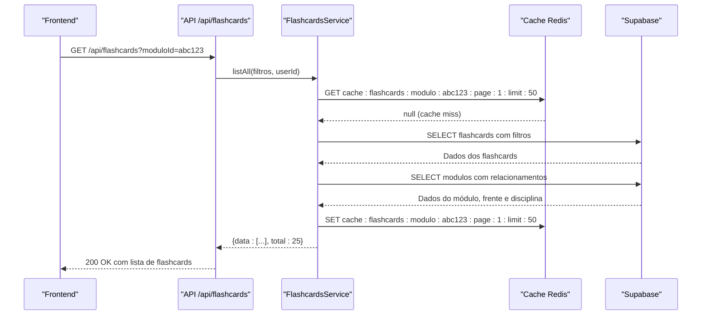
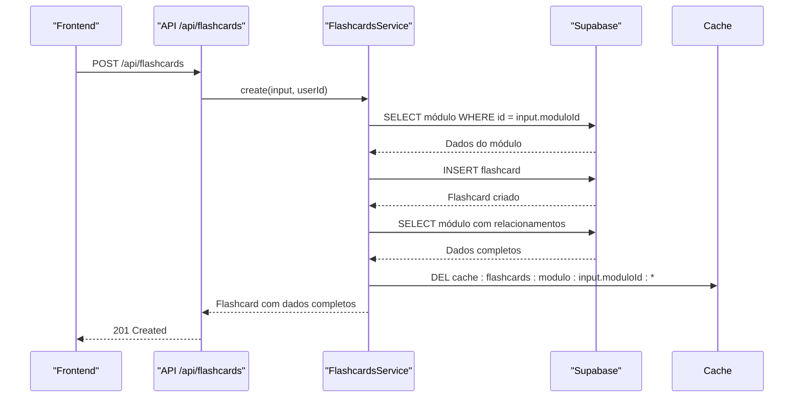
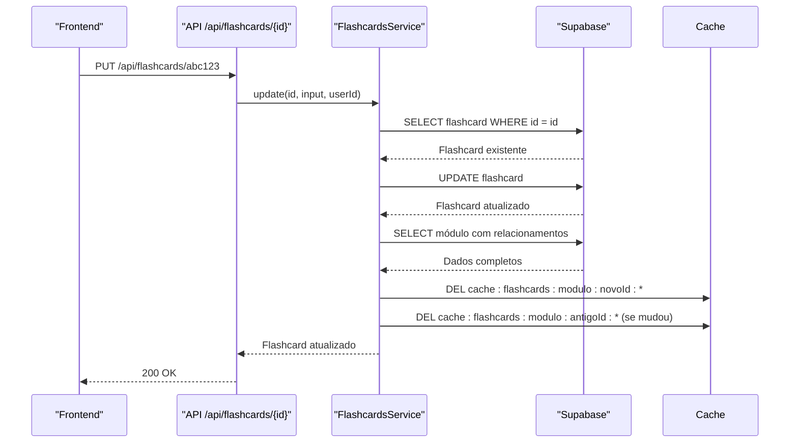
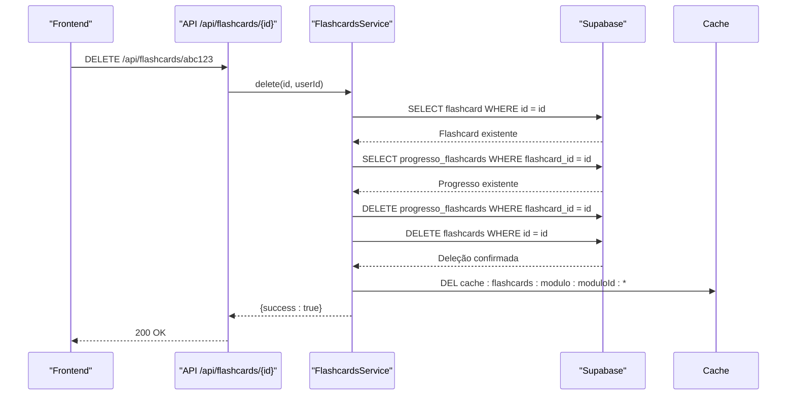
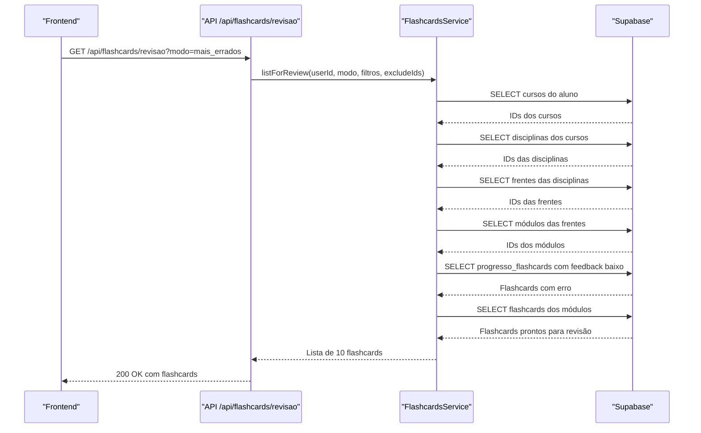
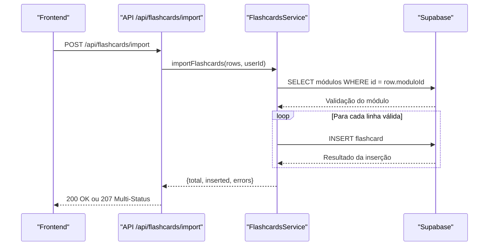
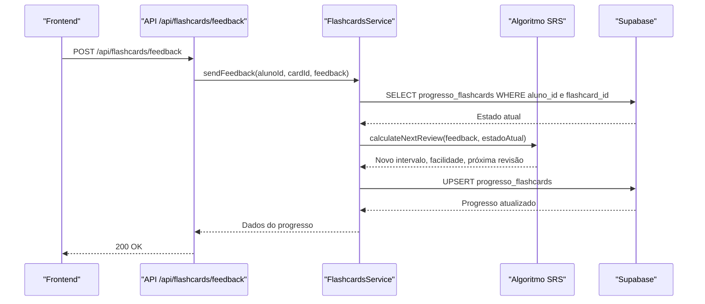
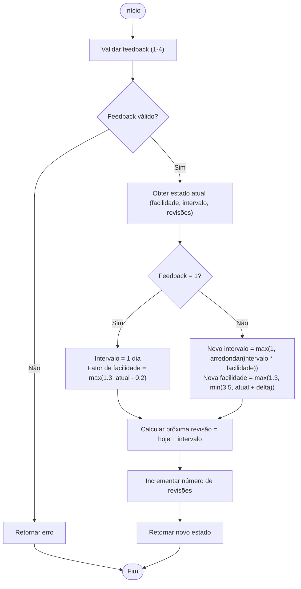

# Flashcards e Revisão

<cite>
**Arquivos Referenciados neste Documento**   
- [route.ts](file://app/api/flashcards/route.ts)
- [\[id\]/route.ts](file://app/api/flashcards/[id]/route.ts)
- [revisao/route.ts](file://app/api/flashcards/revisao/route.ts)
- [import/route.ts](file://app/api/flashcards/import/route.ts)
- [feedback/route.ts](file://app/api/flashcards/feedback/route.ts)
- [flashcards.service.ts](file://backend/services/flashcards/flashcards.service.ts)
- [srs-algorithm.ts](file://backend/services/flashcards/srs-algorithm.ts)
- [srs-algorithm.types.ts](file://backend/services/flashcards/srs-algorithm.types.ts)
</cite>

## Sumário
1. [Introdução](#introdução)
2. [Endpoints de Flashcards](#endpoints-de-flashcards)
3. [Algoritmo SRS (Repetição Espaçada)](#algoritmo-srs-repetição-espaçada)
4. [Esquemas de Requisição e Resposta](#esquemas-de-requisição-e-resposta)
5. [Importação de Flashcards](#importação-de-flashcards)
6. [Regras de Negócio e Acesso](#regras-de-negócio-e-acesso)
7. [Tratamento de Erros](#tratamento-de-erros)
8. [Exemplos de Uso](#exemplos-de-uso)
9. [Considerações Finais](#considerações-finais)

## Introdução

O sistema de flashcards do Área do Aluno é uma funcionalidade central para o aprendizado ativo e memorização de conteúdo. Este documento detalha os endpoints da API responsáveis pela gestão de flashcards, incluindo operações CRUD, revisão inteligente com algoritmo de Repetição Espaçada (SRS), importação em massa e coleta de feedback. O sistema é projetado para professores criarem e gerenciarem flashcards, enquanto alunos os revisam de forma otimizada com base em seu desempenho.

**Seção fontes**
- [route.ts](file://app/api/flashcards/route.ts#L1-L162)
- [flashcards.service.ts](file://backend/services/flashcards/flashcards.service.ts#L1-L1580)

## Endpoints de Flashcards

### Listagem (GET /api/flashcards)

O endpoint `GET /api/flashcards` permite listar todos os flashcards criados por um professor. A listagem pode ser filtrada por disciplina, frente, módulo ou termo de busca, além de suportar paginação e ordenação.

**Parâmetros de Query:**
- `disciplinaId`: Filtra por ID da disciplina
- `frenteId`: Filtra por ID da frente
- `moduloId`: Filtra por ID do módulo
- `search`: Busca textual em pergunta e resposta
- `page`: Número da página (padrão: 1)
- `limit`: Itens por página (padrão: 50)
- `orderBy`: Campo para ordenação (`created_at` ou `pergunta`)
- `orderDirection`: Direção da ordenação (`asc` ou `desc`)

A resposta inclui dados completos do flashcard, incluindo o módulo, frente e disciplina associados. O resultado é cacheado por 15 minutos para melhorar o desempenho, exceto quando há busca textual.



**Fontes do diagrama**
- [route.ts](file://app/api/flashcards/route.ts#L5-L31)
- [flashcards.service.ts](file://backend/services/flashcards/flashcards.service.ts#L968-L1265)

**Fontes da seção**
- [route.ts](file://app/api/flashcards/route.ts#L5-L31)
- [flashcards.service.ts](file://backend/services/flashcards/flashcards.service.ts#L968-L1265)

### Criação (POST /api/flashcards)

O endpoint `POST /api/flashcards` permite a criação de um novo flashcard. Apenas professores podem executar esta ação.

**Corpo da Requisição:**
```json
{
  "moduloId": "string",
  "pergunta": "string",
  "resposta": "string"
}
```

O sistema valida se o módulo existe e se os campos obrigatórios estão preenchidos. Após a criação, o cache de flashcards relacionados ao módulo é invalidado para garantir consistência.



**Fontes do diagrama**
- [route.ts](file://app/api/flashcards/route.ts#L132-L158)
- [flashcards.service.ts](file://backend/services/flashcards/flashcards.service.ts#L1332-L1417)

**Fontes da seção**
- [route.ts](file://app/api/flashcards/route.ts#L132-L158)
- [flashcards.service.ts](file://backend/services/flashcards/flashcards.service.ts#L1332-L1417)

### Atualização (PUT /api/flashcards/{id})

O endpoint `PUT /api/flashcards/{id}` permite atualizar um flashcard existente. Apenas professores podem executar esta ação.

**Corpo da Requisição:**
```json
{
  "moduloId": "string",
  "pergunta": "string",
  "resposta": "string"
}
```

O sistema valida se o flashcard existe e se o usuário tem permissão. Após a atualização, o cache é invalidado tanto para o módulo antigo quanto para o novo (se houver mudança).



**Fontes do diagrama**
- [\[id\]/route.ts](file://app/api/flashcards/[id]/route.ts#L34-L61)
- [flashcards.service.ts](file://backend/services/flashcards/flashcards.service.ts#L1420-L1528)

**Fontes da seção**
- [\[id\]/route.ts](file://app/api/flashcards/[id]/route.ts#L34-L61)
- [flashcards.service.ts](file://backend/services/flashcards/flashcards.service.ts#L1420-L1528)

### Deleção (DELETE /api/flashcards/{id})

O endpoint `DELETE /api/flashcards/{id}` permite deletar um flashcard existente. Apenas professores podem executar esta ação.

O sistema valida se o flashcard existe e se o usuário tem permissão. Se houver progresso associado (do aluno), ele também é deletado em cascata. Após a deleção, o cache é invalidado.



**Fontes do diagrama**
- [\[id\]/route.ts](file://app/api/flashcards/[id]/route.ts#L63-L75)
- [flashcards.service.ts](file://backend/services/flashcards/flashcards.service.ts#L1532-L1576)

**Fontes da seção**
- [\[id\]/route.ts](file://app/api/flashcards/[id]/route.ts#L63-L75)
- [flashcards.service.ts](file://backend/services/flashcards/flashcards.service.ts#L1532-L1576)

### Revisão (GET /api/flashcards/revisao)

O endpoint `GET /api/flashcards/revisao` retorna flashcards prontos para revisão com base no algoritmo SRS. O modo de revisão pode ser personalizado.

**Parâmetros de Query:**
- `modo`: Modo de revisão (`revisao_geral`, `mais_cobrados`, `mais_errados`, `personalizado`)
- `cursoId`: ID do curso (para modos automáticos)
- `frenteId`: ID da frente (para modos automáticos)
- `moduloId`: ID do módulo (obrigatório para `personalizado`)
- `excludeIds`: IDs de flashcards para excluir (para sessões contínuas)

O sistema considera o acesso baseado em matrículas, garantindo que alunos só vejam flashcards de cursos em que estão matriculados.



**Fontes do diagrama**
- [revisao/route.ts](file://app/api/flashcards/revisao/route.ts#L5-L35)
- [flashcards.service.ts](file://backend/services/flashcards/flashcards.service.ts#L361-L901)

**Fontes da seção**
- [revisao/route.ts](file://app/api/flashcards/revisao/route.ts#L5-L35)
- [flashcards.service.ts](file://backend/services/flashcards/flashcards.service.ts#L361-L901)

### Importação (POST /api/flashcards/import)

O endpoint `POST /api/flashcards/import` permite a importação em massa de flashcards via CSV ou JSON.

**Corpo da Requisição:**
```json
{
  "rows": [
    {
      "moduloId": "string",
      "pergunta": "string",
      "resposta": "string"
    }
  ]
}
```

O sistema suporta dois formatos: novo (com `moduloId`) e antigo (com `disciplina`, `frente`, `moduloNumero`). Para o formato antigo, o sistema resolve os IDs com base nos nomes. A resposta usa status 207 (Multi-Status) se houver erros parciais.



**Fontes do diagrama**
- [import/route.ts](file://app/api/flashcards/import/route.ts#L5-L34)
- [flashcards.service.ts](file://backend/services/flashcards/flashcards.service.ts#L158-L336)

**Fontes da seção**
- [import/route.ts](file://app/api/flashcards/import/route.ts#L5-L34)
- [flashcards.service.ts](file://backend/services/flashcards/flashcards.service.ts#L158-L336)

### Feedback (POST /api/flashcards/feedback)

O endpoint `POST /api/flashcards/feedback` registra o feedback do aluno sobre um flashcard e atualiza o intervalo de repetição com base no algoritmo SRS.

**Corpo da Requisição:**
```json
{
  "cardId": "string",
  "feedback": 1|2|3|4
}
```

O feedback é usado para calcular a próxima revisão e ajustar o fator de facilidade do flashcard.



**Fontes do diagrama**
- [feedback/route.ts](file://app/api/flashcards/feedback/route.ts#L5-L28)
- [flashcards.service.ts](file://backend/services/flashcards/flashcards.service.ts#L918-L965)
- [srs-algorithm.ts](file://backend/services/flashcards/srs-algorithm.ts#L37-L96)

**Fontes da seção**
- [feedback/route.ts](file://app/api/flashcards/feedback/route.ts#L5-L28)
- [flashcards.service.ts](file://backend/services/flashcards/flashcards.service.ts#L918-L965)
- [srs-algorithm.ts](file://backend/services/flashcards/srs-algorithm.ts#L37-L96)

## Algoritmo SRS (Repetição Espaçada)

O sistema implementa um algoritmo de Repetição Espaçada (SRS) baseado no SM-2 (SuperMemo 2), que ajusta dinamicamente os intervalos de revisão com base no desempenho do aluno.

### Feedback e Significado

| Valor | Significado | Ação no Algoritmo |
|-------|-------------|-------------------|
| 1 | Errei o item | Resetar intervalo para 1 dia, reduzir facilidade |
| 2 | Acertei parcialmente | Aumentar intervalo com fator reduzido, ligeira redução na facilidade |
| 3 | Acertei com dificuldade | Aumentar intervalo com fator normal, pequeno aumento na facilidade |
| 4 | Acertei com facilidade | Aumentar intervalo com fator aumentado, maior aumento na facilidade |

### Cálculo do Intervalo

O intervalo de repetição é calculado com base no estado atual do flashcard e no feedback do aluno:

- **Novos flashcards**: Começam com fator de facilidade inicial de 2.5
- **Intervalo base**: Para feedbacks 2, 3 ou 4, o novo intervalo é `intervalo_atual * fator_de_facilidade`
- **Limites**: O fator de facilidade varia entre 1.3 (mínimo) e 3.5 (máximo)



**Fontes do diagrama**
- [srs-algorithm.ts](file://backend/services/flashcards/srs-algorithm.ts#L37-L96)
- [srs-algorithm.types.ts](file://backend/services/flashcards/srs-algorithm.types.ts#L6-L44)

**Fontes da seção**
- [srs-algorithm.ts](file://backend/services/flashcards/srs-algorithm.ts#L37-L96)
- [srs-algorithm.types.ts](file://backend/services/flashcards/srs-algorithm.types.ts#L6-L44)

## Esquemas de Requisição e Resposta

### Flashcard (FlashcardAdmin)

O esquema principal para flashcards inclui todos os dados relacionados:

```typescript
type FlashcardAdmin = {
  id: string;
  modulo_id: string;
  pergunta: string;
  resposta: string;
  created_at: string;
  modulo: {
    id: string;
    nome: string;
    numero_modulo: number | null;
    frente: {
      id: string;
      nome: string;
      disciplina: {
        id: string;
        nome: string;
      };
    };
  };
};
```

### Flashcard para Revisão (FlashcardReviewItem)

O esquema simplificado usado na revisão inclui apenas campos essenciais:

```typescript
type FlashcardReviewItem = {
  id: string;
  moduloId: string | null;
  pergunta: string;
  resposta: string;
  importancia?: string | null;
  dataProximaRevisao?: string | null;
};
```

### Progresso do Flashcard (SRSState)

O estado do algoritmo SRS armazenado no banco de dados:

```typescript
interface SRSState {
  easeFactor: number;        // Fator de facilidade atual
  interval: number;          // Intervalo em dias até a próxima revisão
  repetitions: number;       // Número total de revisões realizadas
  lastFeedback: number | null; // Último feedback dado (1-4)
}
```

**Fontes da seção**
- [flashcards.service.ts](file://backend/services/flashcards/flashcards.service.ts#L70-L88)
- [flashcards.service.ts](file://backend/services/flashcards/flashcards.service.ts#L61-L68)
- [srs-algorithm.types.ts](file://backend/services/flashcards/srs-algorithm.types.ts#L24-L33)

## Importação de Flashcards

O sistema suporta dois formatos de importação: novo (recomendado) e antigo (para compatibilidade).

### Formato Novo (Recomendado)

O formato novo usa `moduloId` diretamente, sendo mais eficiente e preciso:

```json
{
  "rows": [
    {
      "moduloId": "abc123",
      "pergunta": "Qual é a capital da França?",
      "resposta": "Paris"
    }
  ]
}
```

### Formato Antigo (Compatibilidade)

O formato antigo resolve os IDs com base em nomes, o que pode causar erros se houver ambiguidade:

```json
{
  "rows": [
    {
      "disciplina": "História",
      "frente": "Geografia",
      "moduloNumero": 1,
      "pergunta": "Qual é a capital da França?",
      "resposta": "Paris"
    }
  ]
}
```

### Validação e Erros

Cada linha é validada individualmente. Erros comuns incluem:
- Módulo não encontrado
- Campos obrigatórios ausentes
- Erros de banco de dados

A resposta inclui detalhes de erros por linha, permitindo correção parcial.

**Fontes da seção**
- [flashcards.service.ts](file://backend/services/flashcards/flashcards.service.ts#L42-L53)
- [flashcards.service.ts](file://backend/services/flashcards/flashcards.service.ts#L158-L336)

## Regras de Negócio e Acesso

### Acesso Baseado em Matrículas

O sistema garante que alunos só tenham acesso a flashcards de cursos em que estão matriculados. Professores têm acesso a todos os cursos, mas apenas podem gerenciar flashcards de cursos que criaram.

### Geração de Flashcards a partir de Materiais

Embora não implementado nos endpoints analisados, a documentação sugere que flashcards podem ser gerados automaticamente a partir de materiais didáticos. Esta funcionalidade seria implementada em outro serviço.

### Hierarquia de Acesso

A hierarquia de acesso é: Curso → Disciplina → Frente → Módulo → Flashcard. O sistema valida o acesso em cada nível para garantir segurança.

**Fontes da seção**
- [flashcards.service.ts](file://backend/services/flashcards/flashcards.service.ts#L375-L442)
- [flashcards.service.ts](file://backend/services/flashcards/flashcards.service.ts#L494-L537)

## Tratamento de Erros

O sistema implementa tratamento robusto de erros com mensagens claras e status HTTP apropriados.

### Erros Comuns

| Erro | Status HTTP | Mensagem |
|------|-------------|---------|
| Flashcard não encontrado | 404 | "Flashcard não encontrado." |
| Formato de importação inválido | 400 | "Nenhuma linha recebida para importação." |
| Permissão negada | 400 | "Apenas professores podem realizar esta ação." |
| Campo obrigatório ausente | 400 | "Módulo, pergunta e resposta são obrigatórios." |
| Módulo não encontrado | 400 | "Módulo não encontrado." |

### Estratégia de Logging

O sistema inclui logging detalhado para depuração, especialmente em operações complexas como listagem e importação. Em produção, detalhes de erro são ocultados para segurança.

**Fontes da seção**
- [route.ts](file://app/api/flashcards/route.ts#L31-L127)
- [\[id\]/route.ts](file://app/api/flashcards/[id]/route.ts#L27-L30)
- [flashcards.service.ts](file://backend/services/flashcards/flashcards.service.ts#L18-L39)

## Exemplos de Uso

### curl

**Listar flashcards de um módulo:**
```bash
curl -X GET "https://api.areadoaluno.com/api/flashcards?moduloId=abc123" \
  -H "Authorization: Bearer seu_token"
```

**Criar um novo flashcard:**
```bash
curl -X POST "https://api.areadoaluno.com/api/flashcards" \
  -H "Authorization: Bearer seu_token" \
  -H "Content-Type: application/json" \
  -d '{
    "moduloId": "abc123",
    "pergunta": "Qual é a capital da França?",
    "resposta": "Paris"
  }'
```

**Enviar feedback de revisão:**
```bash
curl -X POST "https://api.areadoaluno.com/api/flashcards/feedback" \
  -H "Authorization: Bearer seu_token" \
  -H "Content-Type: application/json" \
  -d '{
    "cardId": "xyz789",
    "feedback": 4
  }'
```

### Código Frontend (TypeScript)

```typescript
// Listar flashcards para revisão
async function getFlashcardsForReview() {
  const response = await fetch('/api/flashcards/revisao?modo=mais_errados');
  const data = await response.json();
  return data.data;
}

// Enviar feedback
async function sendFlashcardFeedback(cardId: string, feedback: 1|2|3|4) {
  const response = await fetch('/api/flashcards/feedback', {
    method: 'POST',
    headers: { 'Content-Type': 'application/json' },
    body: JSON.stringify({ cardId, feedback })
  });
  return await response.json();
}

// Importar flashcards
async function importFlashcards(rows: FlashcardImportRow[]) {
  const response = await fetch('/api/flashcards/import', {
    method: 'POST',
    headers: { 'Content-Type': 'application/json' },
    body: JSON.stringify({ rows })
  });
  const result = await response.json();
  
  if (response.status === 207) {
    console.warn('Importação parcial com erros:', result.data.errors);
  }
  
  return result.data;
}
```

**Fontes da seção**
- [route.ts](file://app/api/flashcards/route.ts#L157-L158)
- [revisao/route.ts](file://app/api/flashcards/revisao/route.ts#L33-L34)
- [feedback/route.ts](file://app/api/flashcards/feedback/route.ts#L28-L29)
- [import/route.ts](file://app/api/flashcards/import/route.ts#L34-L34)

## Considerações Finais

O sistema de flashcards do Área do Aluno oferece uma solução completa para aprendizado ativo, combinando uma API robusta com um algoritmo de repetição espaçada eficaz. A arquitetura bem definida, com separação clara entre endpoints, serviço e algoritmo, permite fácil manutenção e extensão. A implementação de cache melhora significativamente o desempenho, enquanto o tratamento rigoroso de erros garante uma experiência de usuário confiável.

[Sem fontes, pois esta seção é um resumo]