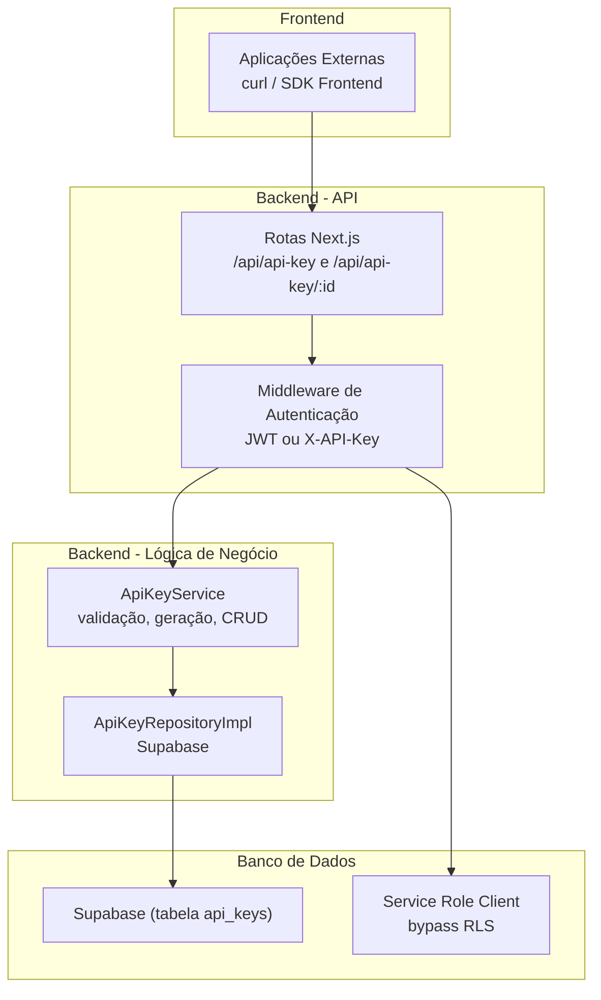
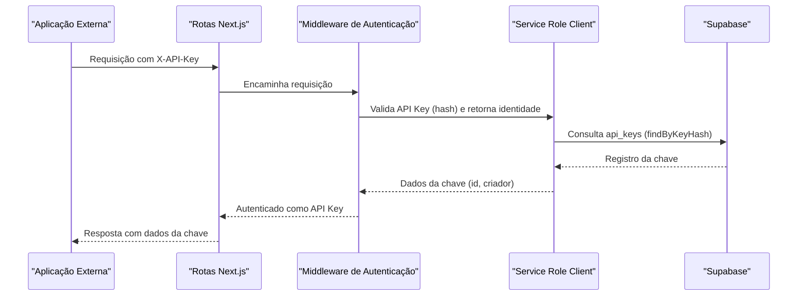
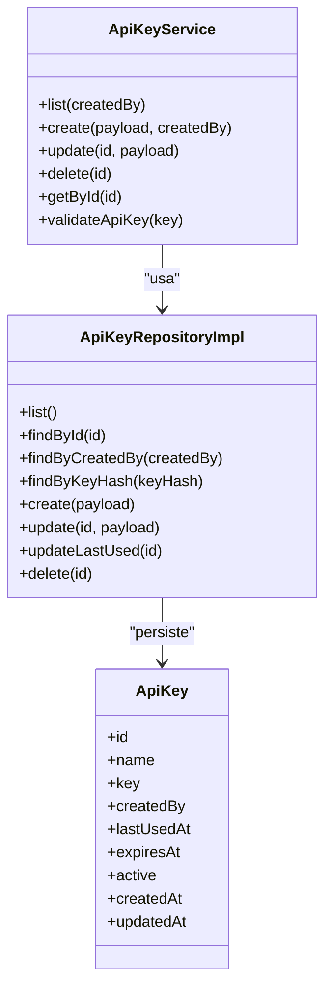
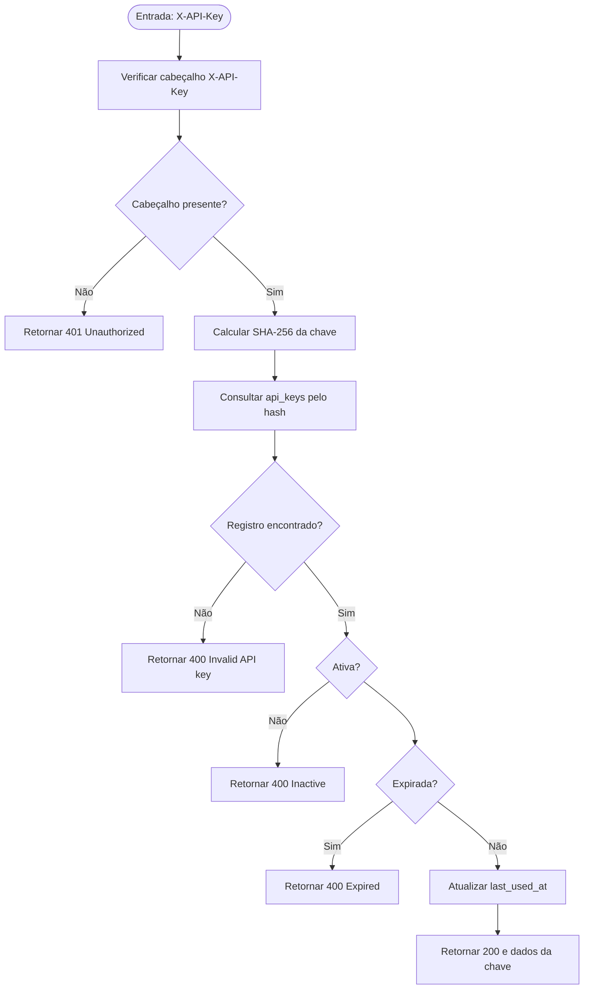
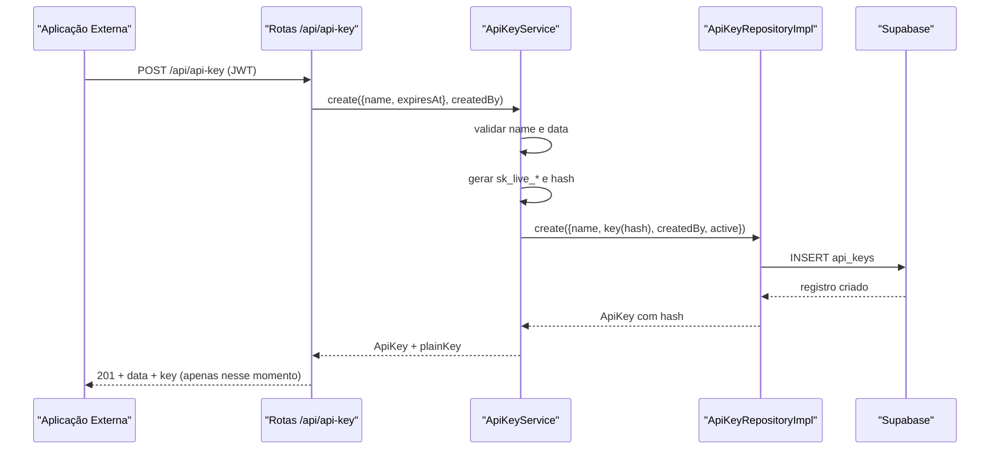

# Gerenciamento de API Keys

<cite>
**Arquivos Referenciados Neste Documento**
- [app/api/api-key/route.ts](file://app/api/api-key/route.ts)
- [app/api/api-key/[id]/route.ts](file://app/api/api-key/[id]/route.ts)
- [backend/services/api-key/index.ts](file://backend/services/api-key/index.ts)
- [backend/services/api-key/api-key.service.ts](file://backend/services/api-key/api-key.service.ts)
- [backend/services/api-key/api-key.repository.ts](file://backend/services/api-key/api-key.repository.ts)
- [backend/services/api-key/api-key.types.ts](file://backend/services/api-key/api-key.types.ts)
- [backend/services/api-key/errors.ts](file://backend/services/api-key/errors.ts)
- [backend/auth/middleware.ts](file://backend/auth/middleware.ts)
- [backend/clients/database-auth.ts](file://backend/clients/database-auth.ts)
- [backend/clients/database.ts](file://backend/clients/database.ts)
- [docs/API.md](file://docs/API.md)
- [lib/api-client.ts](file://lib/api-client.ts)
</cite>

## Sumário
1. [Introdução](#introdução)
2. [Estrutura do Projeto](#estrutura-do-projeto)
3. [Componentes-Chave](#componentes-chave)
4. [Visão Geral da Arquitetura](#visão-geral-da-arquitetura)
5. [Análise Detalhada dos Componentes](#análise-detalhada-dos-componentes)
6. [Análise de Dependências](#análise-de-dependências)
7. [Considerações de Desempenho](#considerações-de-desempenho)
8. [Guia de Resolução de Problemas](#guia-de-resolução-de-problemas)
9. [Conclusão](#conclusão)
10. [Apêndices](#apêndices)

## Introdução
Este documento apresenta a documentação técnica e prática do gerenciamento de API Keys no sistema Área do Aluno. Ele descreve os endpoints REST para listagem, criação, atualização e exclusão de API Keys, bem como o uso da API Key para autenticação de aplicações externas via cabeçalho X-API-Key. Também aborda os requisitos de autorização, campos de requisição/resposta, tratamento de erros, e práticas recomendadas de segurança (armazenamento seguro, rotação, expiração e revogação). Além disso, explica o uso interno da Service Role Key do Supabase e o bypass de RLS em operações administrativas.

## Estrutura do Projeto
O gerenciamento de API Keys é composto por:
- Rotas Next.js (app/api) que expõem os endpoints REST.
- Middleware de autenticação que aceita tanto JWT quanto API Key.
- Serviço de negócio que valida, gera, armazena e consulta as chaves.
- Repositório de dados que interage com o Supabase.
- Clientes Supabase que permitem o uso da Service Role Key para bypass de RLS quando necessário.

**Diagrama fonte**
- [app/api/api-key/route.ts](file://app/api/api-key/route.ts#L1-L79)
- [app/api/api-key/[id]/route.ts](file://app/api/api-key/[id]/route.ts#L1-L115)
- [backend/auth/middleware.ts](file://backend/auth/middleware.ts#L1-L193)
- [backend/services/api-key/api-key.service.ts](file://backend/services/api-key/api-key.service.ts#L1-L158)
- [backend/services/api-key/api-key.repository.ts](file://backend/services/api-key/api-key.repository.ts#L1-L168)
- [backend/clients/database-auth.ts](file://backend/clients/database-auth.ts#L1-L68)

**Seção fonte**
- [app/api/api-key/route.ts](file://app/api/api-key/route.ts#L1-L79)
- [app/api/api-key/[id]/route.ts](file://app/api/api-key/[id]/route.ts#L1-L115)
- [backend/auth/middleware.ts](file://backend/auth/middleware.ts#L1-L193)
- [backend/services/api-key/api-key.service.ts](file://backend/services/api-key/api-key.service.ts#L1-L158)
- [backend/services/api-key/api-key.repository.ts](file://backend/services/api-key/api-key.repository.ts#L1-L168)
- [backend/clients/database-auth.ts](file://backend/clients/database-auth.ts#L1-L68)

## Componentes-Chave
- Rotas REST:
  - GET /api/api-key (listagem de chaves do usuário logado)
  - POST /api/api-key (criação de nova chave)
  - GET /api/api-key/{id} (detalhe de uma chave específica)
  - PUT /api/api-key/{id} (atualização de uma chave)
  - DELETE /api/api-key/{id} (exclusão de uma chave)
- Middleware de autenticação:
  - Aceita Authorization: Bearer <JWT> ou X-API-Key: <chave>.
  - Para API Key, o cliente Supabase usado é o Service Role Client (bypass RLS).
- Serviço de API Key:
  - Validação de nome e data de expiração.
  - Geração de chave única (formato sk_live_*).
  - Hash SHA-256 armazenado.
  - Atualização automática do campo last_used_at ao validar.
- Repositório:
  - Operações CRUD na tabela api_keys.
  - Consultas por ID, criador e hash da chave.
- Clientes Supabase:
  - Clientes normais e Service Role Key para operações administrativas.

**Seção fonte**
- [app/api/api-key/route.ts](file://app/api/api-key/route.ts#L1-L79)
- [app/api/api-key/[id]/route.ts](file://app/api/api-key/[id]/route.ts#L1-L115)
- [backend/auth/middleware.ts](file://backend/auth/middleware.ts#L1-L193)
- [backend/services/api-key/api-key.service.ts](file://backend/services/api-key/api-key.service.ts#L1-L158)
- [backend/services/api-key/api-key.repository.ts](file://backend/services/api-key/api-key.repository.ts#L1-L168)
- [backend/clients/database-auth.ts](file://backend/clients/database-auth.ts#L1-L68)

## Visão Geral da Arquitetura
O fluxo de autenticação segue:
- Primeiro, tenta-se autenticar com JWT (Authorization: Bearer).
- Se falhar, tenta-se com API Key (X-API-Key).
- Ao usar API Key, o sistema utiliza o Service Role Client, o que permite bypass de RLS em operações administrativas.

**Diagrama fonte**
- [backend/auth/middleware.ts](file://backend/auth/middleware.ts#L53-L80)
- [backend/services/api-key/api-key.service.ts](file://backend/services/api-key/api-key.service.ts#L81-L100)
- [backend/services/api-key/api-key.repository.ts](file://backend/services/api-key/api-key.repository.ts#L83-L95)
- [backend/clients/database-auth.ts](file://backend/clients/database-auth.ts#L58-L66)

## Análise Detalhada dos Componentes

### Endpoints REST

- GET /api/api-key
  - Propósito: Listar todas as API Keys criadas pelo usuário logado.
  - Autorização: JWT obrigatório (requireUserAuth).
  - Restrição: Apenas professores e superadmins podem criar chaves (ver seção de autorização).
  - Resposta: Array de objetos contendo id, name, createdBy, lastUsedAt, expiresAt, active, createdAt, updatedAt.

- POST /api/api-key
  - Propósito: Criar uma nova API Key.
  - Autorização: JWT obrigatório (requireUserAuth).
  - Requisição:
    - name: string (obrigatório, mínimo 3 e máximo 100 caracteres).
    - expiresAt: string (opcional, formato ISO 8601).
  - Resposta: Objeto contendo id, name, createdBy, lastUsedAt, expiresAt, active, createdAt, updatedAt e key (apenas no momento da criação).
  - Observação: A chave em texto plano (plainKey) é retornado somente uma vez, após a criação.

- GET /api/api-key/{id}
  - Propósito: Obter detalhes de uma chave específica.
  - Autorização: JWT obrigatório (requireUserAuth).
  - Restrição: Somente o criador ou superadmin podem acessar.

- PUT /api/api-key/{id}
  - Propósito: Atualizar uma chave existente.
  - Autorização: JWT obrigatório (requireUserAuth).
  - Restrição: Somente o criador ou superadmin podem atualizar.
  - Requisição:
    - name: string (opcional).
    - active: boolean (opcional).
    - expiresAt: string | null (opcional).
  - Resposta: Objeto com os mesmos campos do GET.

- DELETE /api/api-key/{id}
  - Propósito: Excluir uma chave.
  - Autorização: JWT obrigatório (requireUserAuth).
  - Restrição: Somente o criador ou superadmin podem excluir.

**Seção fonte**
- [app/api/api-key/route.ts](file://app/api/api-key/route.ts#L1-L79)
- [app/api/api-key/[id]/route.ts](file://app/api/api-key/[id]/route.ts#L1-L115)

### Autenticação com X-API-Key

- Cabeçalho esperado: X-API-Key: <chave>.
- O middleware tenta primeiro JWT (Authorization: Bearer), e caso falhe, tenta API Key.
- Ao validar com API Key, o cliente Supabase usado é o Service Role Client, o que permite bypass de RLS em operações administrativas.

**Seção fonte**
- [backend/auth/middleware.ts](file://backend/auth/middleware.ts#L53-L80)
- [backend/clients/database-auth.ts](file://backend/clients/database-auth.ts#L58-L66)

### Validação e Geração de Chaves

- Validação:
  - name: obrigatório, entre 3 e 100 caracteres.
  - expiresAt: opcional, deve ser uma data válida (ISO 8601).
- Geração:
  - Formato: sk_live_ + 32 caracteres hexadecimais.
  - Hash SHA-256 armazenado.
- Persistência:
  - Tabela api_keys com campos: id, name, key (hash), created_by, last_used_at, expires_at, active, created_at, updated_at.
- Último uso:
  - Após validação bem-sucedida, last_used_at é atualizado.

**Seção fonte**
- [backend/services/api-key/api-key.service.ts](file://backend/services/api-key/api-key.service.ts#L30-L100)
- [backend/services/api-key/api-key.repository.ts](file://backend/services/api-key/api-key.repository.ts#L1-L168)

### Tratamento de Erros

- Erros de validação:
  - ApiKeyValidationError: respostas 400 com mensagem específica.
- Erros de existência:
  - ApiKeyNotFoundError: respostas 404.
- Erros de estado:
  - ApiKeyExpiredError: respostas 400 (chave expirada).
  - ApiKeyInactiveError: respostas 400 (chave inativa).
- Erros gerais:
  - 500 Internal Server Error com mensagem genérica.

**Seção fonte**
- [backend/services/api-key/errors.ts](file://backend/services/api-key/errors.ts#L1-L29)
- [app/api/api-key/route.ts](file://app/api/api-key/route.ts#L19-L26)
- [app/api/api-key/[id]/route.ts](file://app/api/api-key/[id]/route.ts#L20-L31)

### Exemplos de Uso

- Listar API Keys (com JWT):
  - curl -X GET http://localhost:3000/api/api-key -H "Authorization: Bearer <jwt>"
- Criar API Key (com JWT):
  - curl -X POST http://localhost:3000/api/api-key -H "Authorization: Bearer <jwt>" -H "Content-Type: application/json" -d '{"name":"Chave Produção","expiresAt":"2026-12-31T23:59:59Z"}'
- Atualizar API Key (com JWT):
  - curl -X PUT http://localhost:3000/api/api-key/<id> -H "Authorization: Bearer <jwt>" -H "Content-Type: application/json" -d '{"active":false,"expiresAt":"2026-12-31T23:59:59Z"}'
- Deletar API Key (com JWT):
  - curl -X DELETE http://localhost:3000/api/api-key/<id> -H "Authorization: Bearer <jwt>"
- Usar API Key em aplicações externas:
  - curl -X POST http://localhost:3000/api/discipline -H "X-API-Key: sk_live_abc123..." -H "Content-Type: application/json" -d '{"name":"Física"}'

**Seção fonte**
- [docs/API.md](file://docs/API.md#L111-L160)

### Boas Práticas de Segurança

- Armazenamento seguro:
  - A chave em texto plano é retornada somente durante a criação. Armazene-a em um local seguro (vault, variáveis de ambiente protegidas, storage criptografado).
- Rotação de chaves:
  - Crie novas chaves e substitua gradualmente, mantendo ambas temporariamente até migração completa.
- Expiração:
  - Defina expiresAt com datas próximas ao uso planejado. Use chaves com data de expiração curta para ambientes sensíveis.
- Revogação:
  - Inative a chave (active=false) ou exclua-a imediatamente se houver suspeita de comprometimento.
- Minimização de privilégios:
  - Crie chaves com escopos mínimos necessários. Prefira superadmin somente quando absolutamente necessário.

[Sem seção fonte, pois esta seção apresenta orientações gerais]

### Uso Interno da Service Role Key e Bypass de RLS

- O middleware detecta quando a autenticação é via API Key e usa o Service Role Client.
- Isso permite operações administrativas (como listagens completas de registros) com bypass de RLS.
- Para operações usuais (RLS respeitado), o cliente normal é usado.

**Seção fonte**
- [backend/clients/database-auth.ts](file://backend/clients/database-auth.ts#L58-L66)
- [docs/API.md](file://docs/API.md#L31-L41)

## Análise de Dependências

**Diagrama fonte**
- [backend/services/api-key/api-key.service.ts](file://backend/services/api-key/api-key.service.ts#L1-L158)
- [backend/services/api-key/api-key.repository.ts](file://backend/services/api-key/api-key.repository.ts#L1-L168)
- [backend/services/api-key/api-key.types.ts](file://backend/services/api-key/api-key.types.ts#L1-L24)

**Seção fonte**
- [backend/services/api-key/index.ts](file://backend/services/api-key/index.ts#L1-L26)
- [backend/services/api-key/api-key.service.ts](file://backend/services/api-key/api-key.service.ts#L1-L158)
- [backend/services/api-key/api-key.repository.ts](file://backend/services/api-key/api-key.repository.ts#L1-L168)

## Considerações de Desempenho
- Validações de entrada são leves (strings e datas).
- Hash SHA-256 e consultas ao Supabase são as principais operações custosas.
- Recomendações:
  - Evite chamadas massivas em curto espaço de tempo.
  - Utilize cache local em aplicações externas para evitar recriar chaves desnecessariamente.
  - Mantenha índices adequados no Supabase (caso necessário) para consultas por created_by e key.

[Sem seção fonte, pois esta seção fornece orientações gerais]

## Guia de Resolução de Problemas

- Erro 401 Unauthorized:
  - JWT ausente ou inválido. Certifique-se de incluir Authorization: Bearer <jwt>.
- Erro 403 Forbidden:
  - Apenas professores e superadmins podem criar chaves. Além disso, ao acessar/chamar chaves de outros usuários, somente superadmin pode fazer isso.
- Erro 400 Bad Request:
  - Validação de name (tamanho) ou data de expiração inválida.
- Erro 404 Not Found:
  - Chave não encontrada.
- Erro 400 com mensagens específicas:
  - API key inválida, expirada ou inativa.

**Seção fonte**
- [app/api/api-key/route.ts](file://app/api/api-key/route.ts#L19-L26)
- [app/api/api-key/[id]/route.ts](file://app/api/api-key/[id]/route.ts#L20-L31)
- [backend/services/api-key/errors.ts](file://backend/services/api-key/errors.ts#L1-L29)

## Conclusão
O gerenciamento de API Keys no Área do Aluno oferece um fluxo robusto de criação, validação e uso de chaves para aplicações externas, com suporte a expiração, inativação e revogação. O middleware permite autenticação via JWT ou API Key, e o uso da Service Role Key possibilita operações administrativas com bypass de RLS. Recomenda-se seguir rigorosamente as boas práticas de segurança e monitorar o uso das chaves.

[Sem seção fonte, pois esta seção resume sem análise específica de arquivos]

## Apêndices

### Fluxo de Validação de API Key

**Diagrama fonte**
- [backend/auth/middleware.ts](file://backend/auth/middleware.ts#L53-L80)
- [backend/services/api-key/api-key.service.ts](file://backend/services/api-key/api-key.service.ts#L81-L100)
- [backend/services/api-key/api-key.repository.ts](file://backend/services/api-key/api-key.repository.ts#L148-L157)

### Exemplo de Sequência de Criação de API Key

**Diagrama fonte**
- [app/api/api-key/route.ts](file://app/api/api-key/route.ts#L47-L71)
- [backend/services/api-key/api-key.service.ts](file://backend/services/api-key/api-key.service.ts#L30-L50)
- [backend/services/api-key/api-key.repository.ts](file://backend/services/api-key/api-key.repository.ts#L97-L117)