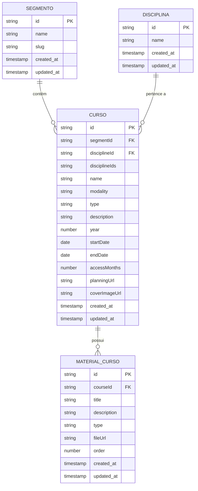
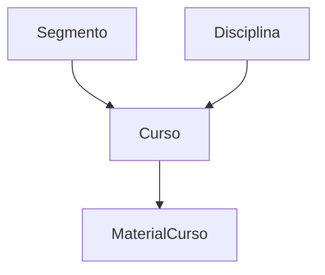

# Gestão de Conteúdo

<cite>
**Arquivos Referenciados neste Documento**  
- [course/route.ts](file://app/api/course/route.ts)
- [course/[id]/route.ts](file://app/api/course/[id]/route.ts)
- [discipline/route.ts](file://app/api/discipline/route.ts)
- [discipline/[id]/route.ts](file://app/api/discipline/[id]/route.ts)
- [segment/route.ts](file://app/api/segment/route.ts)
- [segment/[id]/route.ts](file://app/api/segment/[id]/route.ts)
- [course-material/route.ts](file://app/api/course-material/route.ts)
- [course-material/[id]/route.ts](file://app/api/course-material/[id]/route.ts)
- [course.service.ts](file://backend/services/course/course.service.ts)
- [course.types.ts](file://backend/services/course/course.types.ts)
- [discipline.service.ts](file://backend/services/discipline/discipline.service.ts)
- [discipline.types.ts](file://backend/services/discipline/discipline.types.ts)
- [segment.service.ts](file://backend/services/segment/segment.service.ts)
- [segment.types.ts](file://backend/services/segment/segment.types.ts)
- [course-material.service.ts](file://backend/services/course-material/course-material.service.ts)
- [course-material.types.ts](file://backend/services/course-material/course-material.types.ts)
</cite>

## Sumário
1. [Introdução](#introdução)
2. [Estrutura de Entidades](#estrutura-de-entidades)
3. [Endpoints de Disciplinas](#endpoints-de-disciplinas)
4. [Endpoints de Segmentos](#endpoints-de-segmentos)
5. [Endpoints de Cursos](#endpoints-de-cursos)
6. [Endpoints de Materiais de Curso](#endpoints-de-materiais-de-curso)
7. [Relações entre Entidades](#relações-entre-entidades)
8. [Regras de Negócio e Autenticação](#regras-de-negócio-e-autenticação)
9. [Tratamento de Erros](#tratamento-de-erros)
10. [Exemplos de Uso](#exemplos-de-uso)

## Introdução

Este documento detalha os endpoints de gestão de conteúdo educacional no sistema Área do Aluno, cobrindo operações para disciplinas, segmentos, cursos e materiais de curso. Os endpoints permitem a criação, leitura, atualização e exclusão (CRUD) desses recursos, com regras específicas de acesso, validação e relacionamento entre entidades. A documentação inclui detalhes sobre métodos HTTP, padrões de URL, esquemas de requisição e resposta, além de exemplos práticos de uso.

**Seção fontes**
- [course/route.ts](file://app/api/course/route.ts)
- [discipline/route.ts](file://app/api/discipline/route.ts)
- [segment/route.ts](file://app/api/segment/route.ts)
- [course-material/route.ts](file://app/api/course-material/route.ts)

## Estrutura de Entidades

As entidades principais do sistema são disciplinas, segmentos, cursos e materiais de curso. Cada entidade possui atributos específicos e relações hierárquicas. Disciplinas representam áreas de conhecimento, segmentos são categorias ou níveis educacionais, cursos pertencem a um segmento e uma ou mais disciplinas, e materiais de curso são recursos associados a um curso específico.



**Fontes do diagrama**
- [course.types.ts](file://backend/services/course/course.types.ts)
- [discipline.types.ts](file://backend/services/discipline/discipline.types.ts)
- [segment.types.ts](file://backend/services/segment/segment.types.ts)
- [course-material.types.ts](file://backend/services/course-material/course-material.types.ts)

## Endpoints de Disciplinas

Os endpoints de disciplinas permitem listar, criar, atualizar e deletar disciplinas. A listagem é pública, enquanto operações de escrita exigem autenticação de professores ou superadministradores.

### Listar Disciplinas

- **Método**: `GET`
- **URL**: `/api/discipline`
- **Acesso**: Público
- **Resposta**:
  ```json
  {
    "data": [
      {
        "id": "string",
        "name": "string",
        "createdAt": "string",
        "updatedAt": "string"
      }
    ]
  }
  ```

**Seção fontes**
- [discipline/route.ts](file://app/api/discipline/route.ts)
- [discipline.service.ts](file://backend/services/discipline/discipline.service.ts)

### Criar Disciplina

- **Método**: `POST`
- **URL**: `/api/discipline`
- **Acesso**: Autenticado (professor ou superadmin)
- **Corpo da Requisição**:
  ```json
  {
    "name": "string"
  }
  ```
- **Validação**: `name` obrigatório, mínimo 3 caracteres, máximo 120.
- **Resposta**:
  ```json
  {
    "data": {
      "id": "string",
      "name": "string",
      "createdAt": "string",
      "updatedAt": "string"
    }
  }
  ```

**Seção fontes**
- [discipline/route.ts](file://app/api/discipline/route.ts)
- [discipline.service.ts](file://backend/services/discipline/discipline.service.ts)

### Atualizar Disciplina

- **Método**: `PUT`
- **URL**: `/api/discipline/[id]`
- **Acesso**: Autenticado (criador ou superadmin)
- **Corpo da Requisição**:
  ```json
  {
    "name": "string"
  }
  ```
- **Resposta**:
  ```json
  {
    "data": {
      "id": "string",
      "name": "string",
      "createdAt": "string",
      "updatedAt": "string"
    }
  }
  ```

**Seção fontes**
- [discipline/[id]/route.ts](file://app/api/discipline/[id]/route.ts)
- [discipline.service.ts](file://backend/services/discipline/discipline.service.ts)

### Deletar Disciplina

- **Método**: `DELETE`
- **URL**: `/api/discipline/[id]`
- **Acesso**: Autenticado (criador ou superadmin)
- **Resposta**:
  ```json
  {
    "success": true
  }
  ```

**Seção fontes**
- [discipline/[id]/route.ts](file://app/api/discipline/[id]/route.ts)
- [discipline.service.ts](file://backend/services/discipline/discipline.service.ts)

## Endpoints de Segmentos

Os endpoints de segmentos permitem operações CRUD completas, com acesso público para listagem e autenticação para escrita.

### Listar Segmentos

- **Método**: `GET`
- **URL**: `/api/segment`
- **Acesso**: Público
- **Resposta**:
  ```json
  {
    "data": [
      {
        "id": "string",
        "name": "string",
        "slug": "string",
        "createdAt": "string",
        "updatedAt": "string"
      }
    ]
  }
  ```

**Seção fontes**
- [segment/route.ts](file://app/api/segment/route.ts)
- [segment.service.ts](file://backend/services/segment/segment.service.ts)

### Criar Segmento

- **Método**: `POST`
- **URL**: `/api/segment`
- **Acesso**: Autenticado (professor ou superadmin)
- **Corpo da Requisição**:
  ```json
  {
    "name": "string",
    "slug": "string"
  }
  ```
- **Validação**: `name` e `slug` obrigatórios.
- **Resposta**:
  ```json
  {
    "data": {
      "id": "string",
      "name": "string",
      "slug": "string",
      "createdAt": "string",
      "updatedAt": "string"
    }
  }
  ```

**Seção fontes**
- [segment/route.ts](file://app/api/segment/route.ts)
- [segment.service.ts](file://backend/services/segment/segment.service.ts)

### Atualizar Segmento

- **Método**: `PUT`
- **URL**: `/api/segment/[id]`
- **Acesso**: Autenticado (criador ou superadmin)
- **Corpo da Requisição**:
  ```json
  {
    "name": "string",
    "slug": "string"
  }
  ```
- **Resposta**:
  ```json
  {
    "data": {
      "id": "string",
      "name": "string",
      "slug": "string",
      "createdAt": "string",
      "updatedAt": "string"
    }
  }
  ```

**Seção fontes**
- [segment/[id]/route.ts](file://app/api/segment/[id]/route.ts)
- [segment.service.ts](file://backend/services/segment/segment.service.ts)

### Deletar Segmento

- **Método**: `DELETE`
- **URL**: `/api/segment/[id]`
- **Acesso**: Autenticado (criador ou superadmin)
- **Resposta**:
  ```json
  {
    "success": true
  }
  ```

**Seção fontes**
- [segment/[id]/route.ts](file://app/api/segment/[id]/route.ts)
- [segment.service.ts](file://backend/services/segment/segment.service.ts)

## Endpoints de Cursos

Os endpoints de cursos permitem listar e criar cursos, com restrições de acesso e validação de campos específicos.

### Listar Cursos

- **Método**: `GET`
- **URL**: `/api/course`
- **Acesso**: Público
- **Resposta**:
  ```json
  {
    "data": [
      {
        "id": "string",
        "segmentId": "string",
        "disciplineId": "string",
        "disciplineIds": ["string"],
        "name": "string",
        "modality": "EAD|LIVE",
        "type": "Superextensivo|Extensivo|Intensivo|Superintensivo|Revisão",
        "description": "string",
        "year": "number",
        "startDate": "date",
        "endDate": "date",
        "accessMonths": "number",
        "planningUrl": "string",
        "coverImageUrl": "string",
        "createdAt": "string",
        "updatedAt": "string"
      }
    ]
  }
  ```

**Seção fontes**
- [course/route.ts](file://app/api/course/route.ts)
- [course.service.ts](file://backend/services/course/course.service.ts)

### Criar Curso

- **Método**: `POST`
- **URL**: `/api/course`
- **Acesso**: Autenticado (professor ou superadmin)
- **Corpo da Requisição**:
  ```json
  {
    "segmentId": "string",
    "disciplineId": "string",
    "disciplineIds": ["string"],
    "name": "string",
    "modality": "EAD|LIVE",
    "type": "Superextensivo|Extensivo|Intensivo|Superintensivo|Revisão",
    "description": "string",
    "year": "number",
    "startDate": "string",
    "endDate": "string",
    "accessMonths": "number",
    "planningUrl": "string",
    "coverImageUrl": "string"
  }
  ```
- **Campos Específicos**:
  - `modality`: Valores permitidos: `EAD`, `LIVE`.
  - `type`: Valores permitidos: `Superextensivo`, `Extensivo`, `Intensivo`, `Superintensivo`, `Revisão`.
- **Validação**: Todos os campos obrigatórios, exceto `description` e `planningUrl`.
- **Resposta**:
  ```json
  {
    "data": { /* estrutura do curso */ }
  }
  ```

**Seção fontes**
- [course/route.ts](file://app/api/course/route.ts)
- [course.types.ts](file://backend/services/course/course.types.ts)
- [course.service.ts](file://backend/services/course/course.service.ts)

## Endpoints de Materiais de Curso

Os endpoints de materiais de curso permitem listar e criar materiais, com controle de acesso baseado em matrícula.

### Listar Materiais de Curso

- **Método**: `GET`
- **URL**: `/api/course-material?courseId=[id]`
- **Acesso**: Autenticado (alunos matriculados veem apenas materiais do curso)
- **Resposta**:
  ```json
  {
    "data": [
      {
        "id": "string",
        "courseId": "string",
        "title": "string",
        "description": "string",
        "type": "string",
        "fileUrl": "string",
        "order": "number",
        "createdAt": "string",
        "updatedAt": "string"
      }
    ]
  }
  ```

**Seção fontes**
- [course-material/route.ts](file://app/api/course-material/route.ts)
- [course-material.service.ts](file://backend/services/course-material/course-material.service.ts)

### Criar Material de Curso

- **Método**: `POST`
- **URL**: `/api/course-material`
- **Acesso**: Autenticado (professor ou superadmin)
- **Corpo da Requisição**:
  ```json
  {
    "courseId": "string",
    "title": "string",
    "description": "string",
    "type": "string",
    "fileUrl": "string",
    "order": "number"
  }
  ```
- **Campos Específicos**:
  - `type`: Tipo do material (ex: PDF, Vídeo, Link).
- **Resposta**:
  ```json
  {
    "data": { /* estrutura do material */ }
  }
  ```

**Seção fontes**
- [course-material/route.ts](file://app/api/course-material/route.ts)
- [course-material.types.ts](file://backend/services/course-material/course-material.types.ts)
- [course-material.service.ts](file://backend/services/course-material/course-material.service.ts)

## Relações entre Entidades

Cursos estão diretamente relacionados a segmentos e disciplinas. Um curso pertence a um único segmento, mas pode estar associado a múltiplas disciplinas através do campo `disciplineIds`. Materiais de curso são vinculados a um curso específico, permitindo organização hierárquica do conteúdo educacional.



**Fontes do diagrama**
- [course.types.ts](file://backend/services/course/course.types.ts)
- [segment.types.ts](file://backend/services/segment/segment.types.ts)
- [discipline.types.ts](file://backend/services/discipline/discipline.types.ts)

## Regras de Negócio e Autenticação

- **Acesso Público**: Listagem de disciplinas, segmentos e cursos.
- **Acesso Autenticado**: Todas as operações de criação, atualização e exclusão.
- **Permissões**:
  - Apenas professores e superadministradores podem criar, atualizar ou deletar conteúdo.
  - Alunos podem visualizar materiais apenas dos cursos em que estão matriculados.
- **Validações**:
  - Nomes de disciplinas e segmentos devem ser únicos.
  - Campos obrigatórios são validados em todas as operações de escrita.

**Seção fontes**
- [auth/middleware.ts](file://backend/auth/middleware.ts)
- [course/route.ts](file://app/api/course/route.ts)
- [discipline/route.ts](file://app/api/discipline/route.ts)
- [segment/route.ts](file://app/api/segment/route.ts)
- [course-material/route.ts](file://app/api/course-material/route.ts)

## Tratamento de Erros

O sistema retorna códigos de status HTTP apropriados para diferentes cenários de erro:

- **400 Bad Request**: Dados inválidos ou ausentes.
- **403 Forbidden**: Acesso negado (permissões insuficientes).
- **404 Not Found**: Recurso não encontrado.
- **409 Conflict**: Conflito (ex: nome duplicado).
- **500 Internal Server Error**: Erro interno do servidor.

Exemplo de resposta de erro:
```json
{
  "error": "Mensagem descritiva do erro"
}
```

**Seção fontes**
- [course/route.ts](file://app/api/course/route.ts)
- [discipline/route.ts](file://app/api/discipline/route.ts)
- [segment/route.ts](file://app/api/segment/route.ts)
- [course-material/route.ts](file://app/api/course-material/route.ts)

## Exemplos de Uso

### Exemplo com curl

**Criar Disciplina**
```bash
curl -X POST https://api.areadoaluno.com/api/discipline \
  -H "Authorization: Bearer <token>" \
  -H "Content-Type: application/json" \
  -d '{"name": "Matemática"}'
```

**Listar Cursos**
```bash
curl https://api.areadoaluno.com/api/course
```

### Exemplo Frontend (JavaScript)

```javascript
// Listar disciplinas
async function fetchDisciplines() {
  const response = await fetch('/api/discipline');
  const data = await response.json();
  return data.data;
}

// Criar curso
async function createCourse(courseData) {
  const response = await fetch('/api/course', {
    method: 'POST',
    headers: {
      'Authorization': `Bearer ${localStorage.getItem('token')}`,
      'Content-Type': 'application/json',
    },
    body: JSON.stringify(courseData),
  });
  return response.json();
}
```

**Seção fontes**
- [course/route.ts](file://app/api/course/route.ts)
- [discipline/route.ts](file://app/api/discipline/route.ts)
- [segment/route.ts](file://app/api/segment/route.ts)
- [course-material/route.ts](file://app/api/course-material/route.ts)