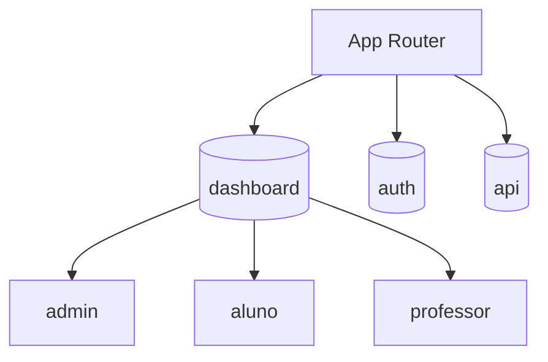
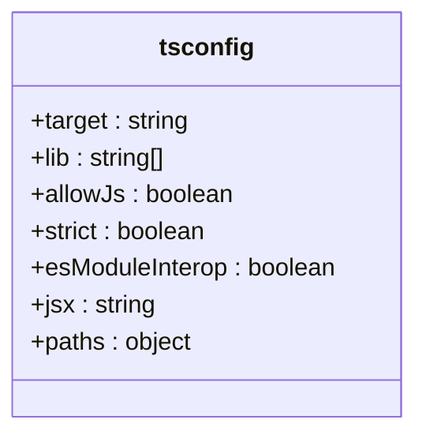
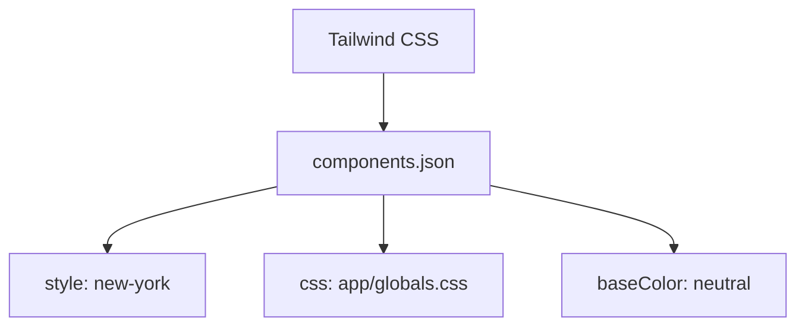
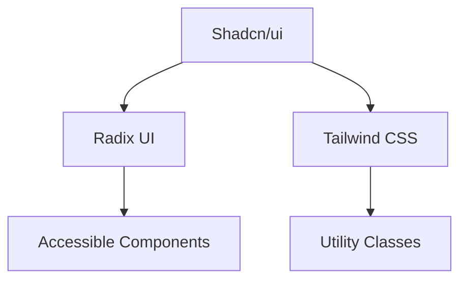
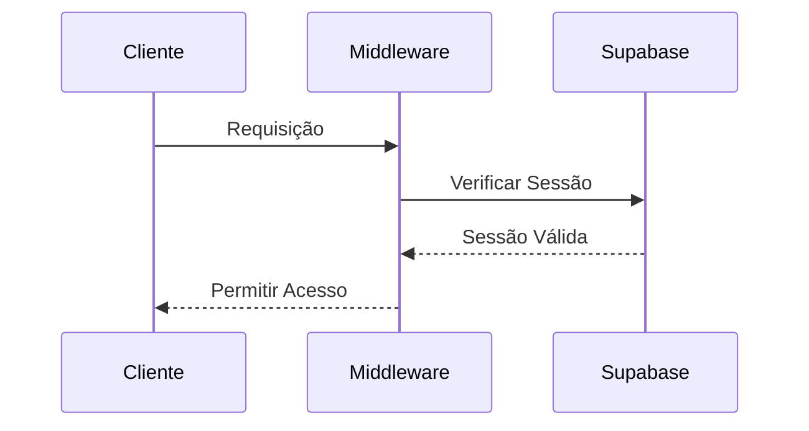
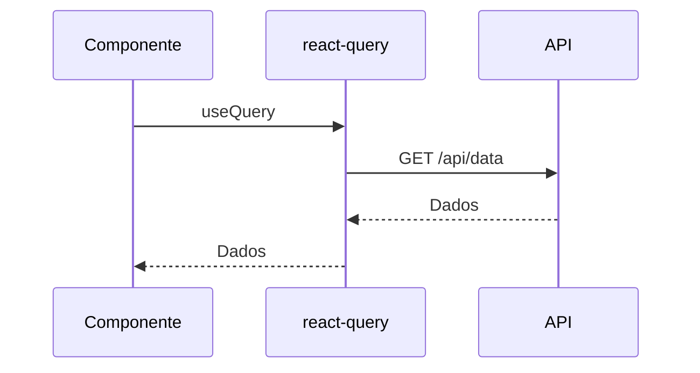
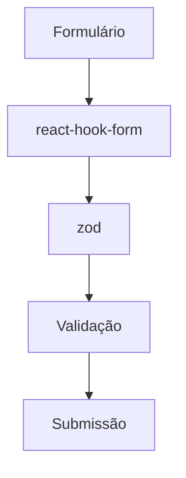

# Tecnologias e Dependências

<cite>
**Arquivos Referenciados neste Documento**  
- [package.json](file://package.json)
- [next.config.ts](file://next.config.ts)
- [tsconfig.json](file://tsconfig.json)
- [components.json](file://components.json)
- [supabase/config.toml](file://supabase/config.toml)
- [lib/api-client.ts](file://lib/api-client.ts)
- [lib/client.ts](file://lib/client.ts)
- [lib/services/dashboardService.ts](file://lib/services/dashboardService.ts)
- [lib/auth.ts](file://lib/auth.ts)
- [lib/middleware.ts](file://lib/middleware.ts)
- [lib/utils.ts](file://lib/utils.ts)
- [lib/agendamento-validations.ts](file://lib/agendamento-validations.ts)
- [components/login-form.tsx](file://components/login-form.tsx)
- [components/sign-up-form.tsx](file://components/sign-up-form.tsx)
- [components/update-password-form.tsx](file://components/update-password-form.tsx)
- [components/forgot-password-form.tsx](file://components/forgot-password-form.tsx)
- [components/agendamento/form-panel.tsx](file://components/agendamento/form-panel.tsx)
- [app/actions/agendamentos.ts](file://app/actions/agendamentos.ts)
</cite>

## Sumário
1. [Introdução](#introdução)
2. [Tecnologias Principais](#tecnologias-principais)
   - [Next.js 16 com App Router](#nextjs-16-com-app-router)
   - [React 19](#react-19)
   - [TypeScript 5](#typescript-5)
   - [Tailwind CSS 4](#tailwind-css-4)
   - [Shadcn/ui](#shadcnui)
   - [Supabase (PostgreSQL + Auth)](#supabase-postgresql--auth)
   - [Upstash Redis](#upstash-redis)
   - [N8N](#n8n)
   - [@tanstack/react-query](#tanstackreact-query)
   - [react-hook-form + zod](#react-hook-form--zod)
   - [date-fns](#date-fns)
   - [papaparse/xlsx](#papaparsexlsx)
3. [Dependências do package.json](#dependências-do-packagejson)
4. [Decisões Arquiteturais](#decisões-arquiteturais)
5. [Desempenho, Segurança e Boas Práticas](#desempenho-segurança-e-boas-práticas)
6. [Conclusão](#conclusão)

## Introdução

O projeto Área do Aluno é uma aplicação moderna e robusta que combina tecnologias de ponta para oferecer uma experiência de aprendizado completa e personalizada. Este documento detalha as tecnologias e dependências utilizadas no projeto, explicando o papel de cada uma, sua integração com outros componentes e as decisões arquiteturais que sustentam o sistema. A análise abrange desde o framework principal até bibliotecas específicas, fornecendo uma visão abrangente da pilha tecnológica.

**Seção fontes**
- [package.json](file://package.json)
- [next.config.ts](file://next.config.ts)

## Tecnologias Principais

### Next.js 16 com App Router

O Next.js 16 é o framework principal utilizado no projeto, fornecendo uma estrutura robusta para a construção de aplicações web modernas. A versão 16 introduz melhorias significativas em desempenho, otimização e suporte a novos recursos. O App Router, introduzido no Next.js 13, permite uma organização mais intuitiva e escalável do código, facilitando a criação de rotas aninhadas e layouts complexos.

O App Router é utilizado para definir as rotas da aplicação, com pastas como `(dashboard)`, `admin`, `aluno`, `professor`, entre outras, organizando o código de forma clara e modular. A configuração do Next.js é feita no arquivo `next.config.ts`, onde são definidas opções como `reactStrictMode` e `output`.

**Fontes do diagrama**
- [next.config.ts](file://next.config.ts)
- [app/page.tsx](file://app/page.tsx)

**Seção fontes**
- [next.config.ts](file://next.config.ts)
- [app/page.tsx](file://app/page.tsx)

### React 19

O React 19 é a biblioteca de interface do usuário utilizada no projeto, fornecendo uma base sólida para a criação de componentes reutilizáveis e dinâmicos. A versão 19 traz melhorias em desempenho, suporte a novos hooks e otimizações que tornam a aplicação mais responsiva e eficiente.

Os componentes do projeto são escritos em TypeScript e utilizam o padrão de componentes funcionais com hooks, como `useState`, `useEffect`, `useRouter`, entre outros. A integração com o Next.js é feita de forma nativa, permitindo a renderização no lado do servidor (SSR) e a geração de sites estáticos (SSG).

**Seção fontes**
- [components/login-form.tsx](file://components/login-form.tsx)
- [components/sign-up-form.tsx](file://components/sign-up-form.tsx)

### TypeScript 5

O TypeScript 5 é utilizado para adicionar tipagem estática ao código JavaScript, melhorando a qualidade, manutenibilidade e segurança do código. A versão 5 traz novos recursos como decorators, melhorias em inferência de tipos e suporte a novos padrões de design.

O arquivo `tsconfig.json` define as configurações do TypeScript, incluindo opções como `strict`, `esModuleInterop`, `jsx` e `paths`. O uso de aliases como `@/*` facilita a importação de módulos, tornando o código mais limpo e organizado.

**Fontes do diagrama**
- [tsconfig.json](file://tsconfig.json)

**Seção fontes**
- [tsconfig.json](file://tsconfig.json)

### Tailwind CSS 4

O Tailwind CSS 4 é o framework de estilização utilizado no projeto, fornecendo classes utilitárias para estilizar componentes de forma rápida e consistente. A versão 4 traz melhorias em desempenho, suporte a novas propriedades CSS e integração aprimorada com ferramentas de desenvolvimento.

O Tailwind é configurado no arquivo `components.json`, onde são definidos estilos como `style`, `rsc`, `tsx`, `css` e `baseColor`. A integração com o Shadcn/ui permite a criação de componentes estilizados de forma consistente e acessível.

**Fontes do diagrama**
- [components.json](file://components.json)

**Seção fontes**
- [components.json](file://components.json)

### Shadcn/ui

O Shadcn/ui é uma biblioteca de componentes UI que fornece uma coleção de componentes acessíveis, estilizados e reutilizáveis. A biblioteca é baseada no Radix UI e Tailwind CSS, oferecendo uma experiência de desenvolvimento consistente e eficiente.

Os componentes do Shadcn/ui são utilizados em todo o projeto, desde formulários e botões até modais e tabelas. A integração com o Tailwind CSS permite a personalização de estilos de forma simples e eficaz.

**Fontes do diagrama**
- [components/ui](file://components/ui)

**Seção fontes**
- [components/ui](file://components/ui)

### Supabase (PostgreSQL + Auth)

O Supabase é utilizado como backend do projeto, fornecendo um banco de dados PostgreSQL, autenticação, armazenamento e funções serverless. O Supabase Auth é integrado ao Next.js para gerenciar a autenticação de usuários, com suporte a login por email/senha, recuperação de senha e redirecionamento baseado em papéis.

O cliente Supabase é criado no arquivo `lib/client.ts`, utilizando as variáveis de ambiente `NEXT_PUBLIC_SUPABASE_URL` e `NEXT_PUBLIC_SUPABASE_PUBLISHABLE_OR_ANON_KEY`. O middleware de autenticação é implementado no arquivo `lib/middleware.ts`, garantindo que apenas usuários autenticados possam acessar rotas protegidas.

**Fontes do diagrama**
- [lib/client.ts](file://lib/client.ts)
- [lib/middleware.ts](file://lib/middleware.ts)

**Seção fontes**
- [lib/client.ts](file://lib/client.ts)
- [lib/middleware.ts](file://lib/middleware.ts)

### Upstash Redis

O Upstash Redis é utilizado como cache de dados, melhorando o desempenho da aplicação ao armazenar dados frequentemente acessados em memória. O Redis é integrado ao Supabase para armazenar sessões, tokens e outros dados temporários.

A integração com o Upstash Redis é feita através da biblioteca `@upstash/redis`, que fornece uma interface simples e eficiente para interagir com o banco de dados Redis. O uso de cache reduz a carga no banco de dados principal e melhora a latência das requisições.

**Seção fontes**
- [package.json](file://package.json)

### N8N

O N8N é uma plataforma de automação de workflows que permite conectar diferentes serviços e automatizar tarefas. No projeto Área do Aluno, o N8N é utilizado para automatizar processos como envio de notificações, processamento de lembretes e integração com serviços externos.

Os workflows do N8N são configurados para serem acionados por eventos no Supabase, como a criação de um novo agendamento ou a atualização de um cronograma. A integração com o N8N permite a execução de ações complexas de forma automatizada e confiável.

**Seção fontes**
- [docs/N8N_SETUP.md](file://docs/N8N_SETUP.md)

### @tanstack/react-query

O @tanstack/react-query é uma biblioteca para gerenciamento de estado de dados no React, fornecendo uma maneira simples e eficiente de buscar, armazenar em cache e sincronizar dados com o servidor. A biblioteca é utilizada para gerenciar requisições à API, com suporte a caching, refetching e tratamento de erros.

O serviço `apiClient` no arquivo `lib/api-client.ts` utiliza o `fetch` para realizar requisições HTTP, com tratamento de erros e autenticação. O `react-query` é utilizado para gerenciar o estado dos dados, garantindo que a interface do usuário esteja sempre atualizada.

**Fontes do diagrama**
- [lib/api-client.ts](file://lib/api-client.ts)

**Seção fontes**
- [lib/api-client.ts](file://lib/api-client.ts)

### react-hook-form + zod

O react-hook-form é uma biblioteca para gerenciamento de formulários no React, fornecendo uma maneira eficiente de lidar com entradas de usuário, validação e submissão. O zod é uma biblioteca de validação de esquemas que permite definir esquemas de dados com tipagem estática.

A integração entre react-hook-form e zod é feita através do `@hookform/resolvers`, permitindo a validação de formulários com esquemas zod. Os formulários de login, cadastro e atualização de senha utilizam essa combinação para garantir a validação de dados e a experiência do usuário.

**Fontes do diagrama**
- [components/login-form.tsx](file://components/login-form.tsx)
- [components/sign-up-form.tsx](file://components/sign-up-form.tsx)

**Seção fontes**
- [components/login-form.tsx](file://components/login-form.tsx)
- [components/sign-up-form.tsx](file://components/sign-up-form.tsx)

### date-fns

O date-fns é uma biblioteca para manipulação de datas no JavaScript, fornecendo funções para formatar, comparar e calcular datas. A biblioteca é utilizada em todo o projeto para lidar com datas de agendamentos, cronogramas e outras funcionalidades relacionadas a tempo.

O arquivo `lib/agendamento-validations.ts` utiliza funções do date-fns para validar horários de agendamento, verificar disponibilidade e calcular durações. A integração com o date-fns torna o código mais legível e confiável.

**Seção fontes**
- [lib/agendamento-validations.ts](file://lib/agendamento-validations.ts)

### papaparse/xlsx

O papaparse e o xlsx são bibliotecas para manipulação de arquivos CSV e Excel, respectivamente. O papaparse é utilizado para analisar arquivos CSV, enquanto o xlsx é utilizado para criar e ler arquivos Excel.

Essas bibliotecas são utilizadas no projeto para importar e exportar dados, como listas de alunos, cursos e materiais didáticos. A integração com o Supabase permite o armazenamento e recuperação desses arquivos de forma eficiente.

**Seção fontes**
- [package.json](file://package.json)

## Dependências do package.json

As dependências do projeto são organizadas no arquivo `package.json`, separadas em categorias como `dependencies`, `devDependencies` e `overrides`. As dependências principais incluem frameworks, bibliotecas de UI, ferramentas de desenvolvimento e bibliotecas de utilidades.

### Dependências Principais

- **Frameworks**: Next.js, React, React DOM
- **UI**: Shadcn/ui, Radix UI, Lucide React
- **Autenticação**: Supabase Auth, @supabase/supabase-js
- **Gerenciamento de Estado**: @tanstack/react-query
- **Formulários**: react-hook-form, zod
- **Datas**: date-fns, date-fns-tz
- **Planilhas**: papaparse, exceljs
- **Utilidades**: clsx, tailwind-merge, sonner

### Dependências de Desenvolvimento

- **Tipagem**: TypeScript, @types
- **Estilização**: Tailwind CSS, PostCSS
- **Linting**: ESLint
- **Testes**: Jest, Testing Library

### Overrides

O campo `overrides` no `package.json` é utilizado para substituir dependências específicas, como o `js-yaml` no `swagger-ui-react`. Isso permite garantir a compatibilidade entre diferentes versões de bibliotecas.

**Seção fontes**
- [package.json](file://package.json)

## Decisões Arquiteturais

### API-First

A arquitetura API-First é utilizada no projeto, com a definição de endpoints de API antes da implementação da interface do usuário. Isso permite uma separação clara entre frontend e backend, facilitando o desenvolvimento paralelo e a integração com diferentes clientes.

Os endpoints da API são definidos na pasta `app/api`, com rotas para autenticação, agendamentos, cronogramas, entre outros. A documentação da API é gerada com Swagger, fornecendo uma interface interativa para testar e explorar os endpoints.

**Seção fontes**
- [app/api](file://app/api)
- [docs/API.md](file://docs/API.md)

### Modularização de Serviços

Os serviços do backend são organizados de forma modular na pasta `backend/services`, com diretórios separados para cada funcionalidade, como `atividade`, `cronograma`, `flashcards`, entre outros. Cada serviço possui um repositório, um serviço e tipos definidos, promovendo a reutilização de código e a manutenibilidade.

A modularização permite que cada serviço seja desenvolvido, testado e mantido de forma independente, reduzindo o acoplamento entre componentes e facilitando a escalabilidade.

**Seção fontes**
- [backend/services](file://backend/services)

### RLS no Supabase

O Row Level Security (RLS) é utilizado no Supabase para controlar o acesso a dados com base em políticas definidas. As políticas RLS são definidas nas tabelas do banco de dados, garantindo que usuários só possam acessar dados que pertencem a eles ou que têm permissão para acessar.

Por exemplo, a tabela `alunos` possui políticas RLS que garantem que apenas o aluno ou um professor com permissão possa acessar seus dados. Isso aumenta a segurança da aplicação e protege os dados dos usuários.

**Seção fontes**
- [supabase/migrations](file://supabase/migrations)

## Desempenho, Segurança e Boas Práticas

### Desempenho

O desempenho da aplicação é otimizado através do uso de caching com Upstash Redis, SSR com Next.js e lazy loading de componentes. O uso de `react-query` para gerenciamento de estado de dados reduz a quantidade de requisições ao servidor, melhorando a latência e a responsividade.

### Segurança

A segurança é garantida através do uso de autenticação com Supabase Auth, RLS no Supabase, validação de dados com zod e proteção contra ataques comuns como XSS e CSRF. O middleware de autenticação garante que apenas usuários autenticados possam acessar rotas protegidas.

### Boas Práticas

As boas práticas incluem o uso de TypeScript para tipagem estática, componentes funcionais com hooks, organização modular do código e documentação clara. O uso de ferramentas como ESLint e Prettier garante a consistência do código e a qualidade do desenvolvimento.

**Seção fontes**
- [lib/utils.ts](file://lib/utils.ts)
- [lib/middleware.ts](file://lib/middleware.ts)

## Conclusão

O projeto Área do Aluno utiliza uma pilha tecnológica moderna e robusta, combinando frameworks, bibliotecas e ferramentas de ponta para oferecer uma experiência de aprendizado completa e personalizada. A integração entre as tecnologias é feita de forma eficiente, com decisões arquiteturais que promovem a escalabilidade, manutenibilidade e segurança. O uso de boas práticas e ferramentas de desenvolvimento garante a qualidade e a eficiência do código, tornando o projeto uma solução confiável e inovadora.