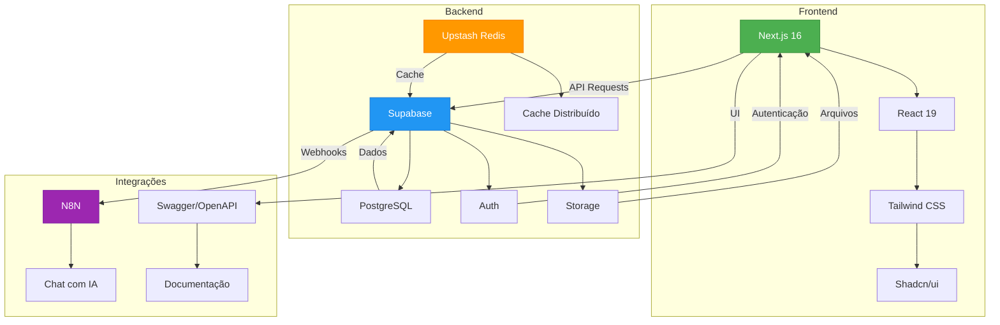

# Visão Geral do Sistema

<cite>
**Arquivos Referenciados neste Documento**   
- [README.md](file://README.md)
- [package.json](file://package.json)
- [API.md](file://docs/API.md)
- [authentication.md](file://docs/authentication.md)
- [VINCULOS_CURSO_DISCIPLINA_FRENTE_MODULO.md](file://docs/VINCULOS_CURSO_DISCIPLINA_FRENTE_MODULO.md)
- [FLUXO_GERACAO_CRONOGRAMA.md](file://docs/FLUXO_GERACAO_CRONOGRAMA.md)
- [FLUXO_CALENDARIO.md](file://docs/FLUXO_CALENDARIO.md)
- [first-professor-superadmin.md](file://docs/first-professor-superadmin.md)
- [ENV_VARIABLES.md](file://docs/ENV_VARIABLES.md)
- [auth.ts](file://lib/auth.ts)
- [middleware.ts](file://lib/middleware.ts)
- [backend/auth/middleware.ts](file://backend/auth/middleware.ts)
- [backend/auth/types.ts](file://backend/auth/types.ts)
- [roles.ts](file://lib/roles.ts)
- [supabase/config.toml](file://supabase/config.toml)
</cite>

## Sumário
1. [Introdução](#introdução)
2. [Arquitetura do Sistema](#arquitetura-do-sistema)
3. [Perfis de Usuário e Permissões](#perfis-de-usuário-e-permissões)
4. [Hierarquia de Conteúdos](#hierarquia-de-conteúdos)
5. [Principais Casos de Uso](#principais-casos-de-uso)
6. [Fluxos de Uso](#fluxos-de-uso)
7. [Segurança e Escalabilidade](#segurança-e-escalabilidade)
8. [Diagrama de Contexto do Sistema](#diagrama-de-contexto-do-sistema)

## Introdução

O sistema Área do Aluno é uma plataforma educacional full-stack modular projetada com arquitetura API-First, baseada nos princípios SOLID, KISS e YAGNI. O sistema oferece uma solução completa para gestão educacional, com interfaces dedicadas para alunos, professores e administradores. A arquitetura modular permite escalabilidade e manutenção eficiente, enquanto a abordagem API-First garante independência entre frontend e backend, facilitando integrações futuras.

**Seções fonte**
- [README.md](file://README.md#L3-L318)

## Arquitetura do Sistema

O sistema Área do Aluno é construído com uma arquitetura moderna e escalável, utilizando tecnologias de ponta para garantir desempenho, segurança e manutenibilidade. A arquitetura segue o padrão API-First, onde o backend é desenvolvido de forma independente do frontend, permitindo que diferentes clientes consumam a mesma API.

### Frontend

O frontend é implementado com Next.js 16 e React 19, aproveitando os recursos do App Router para roteamento eficiente e carregamento otimizado. A estilização é feita com Tailwind CSS em conjunto com Shadcn/ui, proporcionando uma interface moderna e responsiva. O uso de componentes reutilizáveis e hooks customizados garante consistência e produtividade no desenvolvimento.

### Backend

O backend é construído sobre Supabase, que fornece um banco de dados PostgreSQL completo com autenticação integrada, armazenamento de arquivos e funções edge. A segurança em nível de linha (RLS - Row Level Security) é implementada para garantir que usuários acessem apenas dados para os quais têm permissão. O cache distribuído é gerenciado pelo Upstash Redis, melhorando significativamente o desempenho em ambientes serverless.

### Integrações

O sistema integra-se com N8N para automação de fluxos, especialmente para o chat com IA, permitindo processamento avançado de mensagens e interações inteligentes. A documentação da API é fornecida via Swagger/OpenAPI, com interface interativa disponível em `/swagger` para facilitar o desenvolvimento e testes.

**Seções fonte**
- [README.md](file://README.md#L62-L85)
- [package.json](file://package.json#L10-L89)
- [ENV_VARIABLES.md](file://docs/ENV_VARIABLES.md#L1-L138)

## Perfis de Usuário e Permissões

O sistema Área do Aluno define três perfis principais de usuário, cada um com permissões específicas que garantem segurança e controle adequado sobre os recursos.

### Aluno

O perfil de aluno tem acesso limitado aos seus próprios dados. Pode visualizar e editar seu perfil, acessar materiais dos cursos em que está matriculado e interagir com funcionalidades como cronograma, flashcards e chat com IA. O acesso é restrito por RLS, garantindo que cada aluno veja apenas suas informações.

### Professor

O perfil de professor possui permissões para criar e gerenciar recursos educacionais, incluindo cursos, disciplinas, segmentos e materiais. Pode criar API Keys para integrações externas e gerenciar sua disponibilidade para agendamentos. Professores podem visualizar e editar apenas os recursos que criaram, a menos que tenham permissões adicionais.

### Superadmin

O perfil de superadmin possui acesso total ao sistema, podendo gerenciar todos os recursos independentemente de quem os criou. Este perfil é atribuído automaticamente ao primeiro professor cadastrado no sistema, garantindo que haja sempre um administrador com permissões completas. O superadmin pode contornar políticas RLS quando necessário, mas ainda está sujeito a autenticação rigorosa.

**Seções fonte**
- [README.md](file://README.md#L168-L173)
- [API.md](file://docs/API.md#L43-L59)
- [authentication.md](file://docs/authentication.md#L14-L31)
- [first-professor-superadmin.md](file://docs/first-professor-superadmin.md#L1-L107)

## Hierarquia de Conteúdos

A organização dos conteúdos educacionais no sistema segue uma hierarquia clara e lógica, facilitando a navegação e o gerenciamento de materiais. A estrutura é definida como: Curso > Disciplina > Frente > Módulo > Atividade.

### Curso

O curso representa o nível mais alto da hierarquia, englobando um programa de estudos completo. Cada curso está associado a um segmento (como pré-vestibular) e pode conter múltiplas disciplinas. Os cursos definem o escopo geral do programa, incluindo datas de início e fim, modalidade (EAD ou LIVE) e tipo (Extensivo, Intensivo, etc.).

### Disciplina

As disciplinas são áreas de conhecimento específicas dentro de um curso, como Matemática ou Física. Cada disciplina pode ter múltiplas frentes, que representam grandes blocos temáticos. A relação entre cursos e disciplinas é muitos-para-muitos, permitindo flexibilidade na organização dos conteúdos.

### Frente

As frentes dividem as disciplinas em grandes blocos temáticos, como "Álgebra" ou "Geometria" em Matemática. Cada frente está vinculada a um curso e disciplina específicos, garantindo que o conteúdo seja contextualizado corretamente. As frentes ajudam a organizar o material de forma lógica e progressiva.

### Módulo

Os módulos subdividem as frentes em unidades menores de aprendizado. Cada módulo contém um conjunto específico de aulas ou atividades, geralmente organizadas por nível de dificuldade ou progressão temática. Os módulos podem ter prioridade definida, influenciando sua inclusão em cronogramas de estudo.

### Atividade

As atividades representam o nível mais granular da hierarquia, correspondendo a tarefas específicas como aulas, exercícios ou avaliações. Cada atividade está vinculada a um módulo e pode ter metadados como duração estimada, prioridade e status de conclusão. As atividades são o ponto de interação direta do aluno com o conteúdo.

**Seções fonte**
- [VINCULOS_CURSO_DISCIPLINA_FRENTE_MODULO.md](file://docs/VINCULOS_CURSO_DISCIPLINA_FRENTE_MODULO.md#L1-L218)

## Principais Casos de Uso

O sistema Área do Aluno oferece uma variedade de funcionalidades que atendem às necessidades de alunos, professores e administradores. Os principais casos de uso incluem Sala de Estudos, Cronograma, Flashcards, Chat com IA e Agendamentos.

### Sala de Estudos

A Sala de Estudos permite que alunos organizem seu tempo de estudo de forma estruturada. Os alunos podem criar sessões de estudo com duração definida, monitorar seu progresso e registrar o tempo dedicado a cada atividade. A funcionalidade integra-se com o cronograma para sugerir atividades com base no plano de estudos.

### Cronograma

O Cronograma é uma funcionalidade central que permite aos alunos planejar seu estudo ao longo do tempo. Os alunos podem selecionar disciplinas e módulos, definir metas de estudo e gerar um plano personalizado. O sistema distribui automaticamente as atividades ao longo das semanas, considerando dias disponíveis e prioridades.

### Flashcards

O sistema de Flashcards implementa o algoritmo SRS (Spaced Repetition System) para otimizar a memorização. Os alunos podem criar flashcards personalizados ou importar de materiais existentes. O sistema agenda revisões com base no desempenho do aluno, reforçando conceitos com base na curva de esquecimento.

### Chat com IA

O Chat com IA permite que alunos façam perguntas sobre conteúdos e recebam respostas inteligentes. A integração com N8N processa as mensagens e retorna respostas contextualizadas, podendo analisar anexos como PDFs. O histórico das conversas é armazenado para continuidade do aprendizado.

### Agendamentos

A funcionalidade de Agendamentos permite que alunos marquem sessões com professores. Os professores definem sua disponibilidade, e os alunos podem escolher horários disponíveis. Os agendamentos sincronizam com calendários externos via iCal, facilitando a organização.

**Seções fonte**
- [README.md](file://README.md#L174-L200)
- [API.md](file://docs/API.md#L416-L514)
- [FLUXO_GERACAO_CRONOGRAMA.md](file://docs/FLUXO_GERACAO_CRONOGRAMA.md#L1-L317)

## Fluxos de Uso

Os fluxos de uso no sistema Área do Aluno são projetados para serem intuitivos e eficientes, guiando os usuários através de suas tarefas principais com mínima fricção.

### Geração de Cronograma

O fluxo de geração de cronograma começa com o aluno selecionando um curso e disciplinas de interesse. O sistema carrega automaticamente todas as frentes e módulos relacionados, selecionando-os por padrão. O aluno pode ajustar as seleções, definir metas de estudo e gerar o cronograma. O backend processa as seleções, distribui as atividades ao longo do tempo e persiste o plano no banco de dados.

### Atualização de Distribuição de Dias

Os alunos podem personalizar quais dias da semana deseja estudar. Ao alterar a distribuição de dias, o sistema recalcula as datas previstas para cada atividade usando um algoritmo round-robin. O frontend aguarda o processamento e recarrega os dados atualizados, mostrando o calendário com as novas datas.

### Interatividade no Calendário

O calendário mostra visualmente as atividades programadas, com marcações para dias com aulas e dias concluídos. Os alunos podem filtrar por dias da semana, ver detalhes das atividades e marcar conclusão. A integração com o estado de progresso permite acompanhamento contínuo do desempenho.

**Seções fonte**
- [FLUXO_GERACAO_CRONOGRAMA.md](file://docs/FLUXO_GERACAO_CRONOGRAMA.md#L1-L317)
- [FLUXO_CALENDARIO.md](file://docs/FLUXO_CALENDARIO.md#L1-L404)

## Segurança e Escalabilidade

O sistema Área do Aluno implementa múltiplas camadas de segurança e estratégias de escalabilidade para garantir confiabilidade e desempenho em diferentes cenários.

### Segurança

A segurança é implementada em múltiplos níveis, começando com autenticação JWT para usuários e API Keys para integrações externas. O RLS no Supabase garante que cada usuário acesse apenas dados permitidos, enquanto o uso de Service Role Key permite operações administrativas quando necessário. As API Keys são armazenadas como hash SHA-256, com opções de expiração e rastreamento de uso.

### Cache Distribuído

O cache distribuído com Upstash Redis melhora significativamente o desempenho, especialmente em ambientes serverless. O sistema armazena respostas de API e estados de sessão no Redis, reduzindo a carga no banco de dados e melhorando tempos de resposta. O fallback em memória é fornecido para desenvolvimento, mas não é recomendado para produção.

### Escalabilidade

A arquitetura modular e o uso de tecnologias serverless permitem escalabilidade horizontal eficiente. O Next.js e Supabase são otimizados para escalar automaticamente com a demanda, enquanto o Redis distribuído garante consistência de dados em múltiplas instâncias. A separação clara entre frontend e backend facilita o dimensionamento independente de cada camada.

**Seções fonte**
- [authentication.md](file://docs/authentication.md#L1-L137)
- [ENV_VARIABLES.md](file://docs/ENV_VARIABLES.md#L34-L47)
- [supabase/config.toml](file://supabase/config.toml#L1-L15)

## Diagrama de Contexto do Sistema

**Fontes do diagrama**
- [README.md](file://README.md#L62-L85)
- [package.json](file://package.json#L10-L89)
- [ENV_VARIABLES.md](file://docs/ENV_VARIABLES.md#L1-L138)